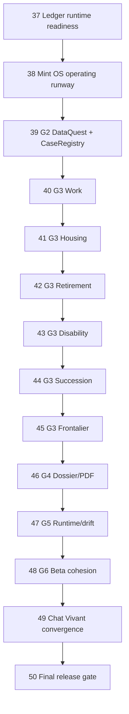

# Roadmap: MINT

## Milestones

- 🔵 **v3.0 Product Reality — Six Boucles, Un Dossier** — Phases 37-50

## v3.0 Product Reality — Overview

## Milestone goal

Deliver one coherent Swiss financial lucidity product from canonical ledger
facts through DataQuest, six decision loops, dossier/PDF, runtime proof, beta
cohesion, and Chat Vivant convergence. No phase is complete below 9.0/10; final
release requires 9.5/10 and zero open P0/P1.

## Historical boundary

- v2.8 is archived as **incomplete**, not completed.
- G1 Ledger Reality Baseline closed at `5f8de38ec`, but its 23 readiness tickets
  remain the hard floor before G2.
- Phase numbering continues at 37.
- The old `v2.9 Chat Vivant` seed is preserved as Phase 49 after G6.

## Dependency graph

### Phase Details

### Phase 37: Ledger Runtime Readiness

**Goal:** Implement and prove all 31 G1 blocking tickets so the data spine is actually ready for G2.

**Depends on**: G1 baseline at `5f8de38ec`

**Requirements:** RDY-SOURCE-01, RDY-LDG-02, RDY-LDG-03, RDY-LDG-04, RDY-LDG-05, RDY-LDG-06, RDY-LDG-07, RDY-PROV-01, RDY-PROV-02, RDY-PROV-03, RDY-SCN-01, RDY-BND-01, RDY-BND-02, RDY-BND-03, RDY-BND-04, RDY-BND-05, RDY-BND-06, RDY-FRONT-01, RDY-RET-REF-01, RDY-SUCCESSION-01, RDY-FRESH-01, RDY-RETURN-01, RDY-RUNTIME-01, RDY-GATE-01

**Execution waves:**

1. SOURCE-01; LDG-02/04/05/06/07; BND-04.
2. PROV-01 -> PROV-02 -> PROV-03 -> LDG-03.
3. BND-02/03 -> BND-05 -> BND-06 -> BND-01.
4. FRONT-01, RET-REF-01, SUCCESSION-01.
5. SCN-01 -> FRESH-01 and RETURN-01.
6. RUNTIME-01, audits, scorecard, explicit G2 decision.

**Success Criteria** (what must be TRUE):

1. All 23 named ticket tests exist with captured RED and GREEN evidence.
2. Targeted and affected full suites pass; Maestro and Patrol prove restart/recompute.
3. Claude code, architecture, and product-domain audits have no P0/P1 and score is >=9.0.

**Status:** in progress — 2/8 plans complete; SOURCE-01 green,
G1-RUNTIME-01 red_proven, G2 blocked.

### Phase 38: Mint OS Operating Runway

**Goal:** Finish the v2.8 mechanisms required to execute product work without tool, flag, guardrail, or old-P0 drift.

**Depends on**: Phase 37

**Requirements:** MIG-01, MIG-02, MIG-03, MIG-04, MIG-05, OS-01, OS-02, OS-03, OS-04, OS-05, OS-06, OS-07, OS-08

**Plans:** deterministic SOT tools; route/backend kill switches; mechanical
guardrails; FIX-01..04/09 revalidation/fix; Phase 32 AMBER closure plan; daily
dogfood skeleton.

**Success Criteria** (what must be TRUE):

1. The full Mint OS hard floor passes with no unversioned substitution.
2. Every new path is default-off with OFF->ON->OFF proof and old P0s have regression tests.
3. No stale debt count or open P0/P1 remains; score is >=9.0.

### Phase 39: G2 DataQuest Core + CaseRegistry MVP

**Goal:** Ask exactly the missing/stale delta for a decision while rendering partial value immediately.

**Depends on**: Phase 38

**Requirements:** DQ-01, DQ-02, DQ-03, DQ-04, DQ-05, DQ-06, DQ-07, DQ-08, DQ-09, DQ-10

**Success Criteria** (what must be TRUE):

1. Fresh facts produce zero asks; missing facts produce the exact delta; stale facts reconfirm.
2. Guards precede high-stakes results, partial state renders, and scenario levers stay isolated.
3. Return-to-origin passes in Maestro, real input passes in Patrol, and score is >=9.0.

### Phase 40: G3 Work / First Salary

**Goal:** Complete the work/first salary/tax/AVS/LPP/first-3a loop.

**Depends on**: Phase 39

**Requirements:** LOOP-P0-01, LOOP-P0-02, LOOP-P0-03, LOOP-P0-04, LOOP-P0-05, LOOP-P0-06, LOOP-P0-07, LOOP-P0-08, WORK-01

**Success Criteria** (what must be TRUE):

1. Entry -> delta collection -> recompute -> explanation -> dossier summary works.
2. All five route states and Mermaid/registry/tests/Maestro/Patrol pass.
3. Swiss and external audits pass with score >=9.0.

### Phase 41: G3 Housing / Mortgage

**Goal:** Complete affordability, own funds, mortgage burden, EPL, and bank
questions with canonical household/property/debt facts.

**Depends on**: Phase 40

**Requirements:** HOUSING-01

**Success Criteria** (what must be TRUE):

1. The Phase 40 shared loop contract passes for housing.
2. Post-retirement affordability guards pass and no local durable-fact controls remain.
3. Runtime and external audits pass with score >=9.0.

### Phase 42: G3 Retirement / Rente vs Capital

**Goal:** Complete the high-value age 50-60 retirement case without turning MINT
into an advice or retirement-only product.

**Depends on**: Phase 41

**Requirements:** RETIRE-01

**Success Criteria** (what must be TRUE):

1. AVS/LPP/3a/budget/liquidity/mortgage/tax/survivor tradeoffs render without advice.
2. Regulatory references and scenario levers remain sourced and isolated.
3. Dossier, same-slice runtime, and three audit lenses pass with score >=9.0.

### Phase 43: G3 Disability / Income Protection

**Goal:** Complete the illness/accident/disability income-gap loop.

**Depends on**: Phase 42

**Requirements:** DISABILITY-01

**Success Criteria** (what must be TRUE):

1. AI/LPP/IJM/LAA/private coverage and cash runway are explicit.
2. Unknown coverage fails closed in all route states.
3. Runtime and audits pass with score >=9.0.

### Phase 44: G3 Succession / Transmission

**Goal:** Complete property transmission/donation lucidity with retirement and
liquidity guard quests.

**Depends on**: Phase 43

**Requirements:** SUCCESSION-01

**Success Criteria** (what must be TRUE):

1. No matrimonial regime or estate instrument is inferred.
2. Heirs/property/mortgage/beneficiary facts and specialist questions are clear.
3. Guards, dossier, runtime, and audits pass with score >=9.0.

### Phase 45: G3 Frontalier

**Goal:** Complete the cross-border worker case after dedicated Swiss/domain and
jurisdiction ledger contracts.

**Depends on**: Phase 44

**Requirements:** FRONTIER-01

**Success Criteria** (what must be TRUE):

1. Jurisdiction, permit, insurance, tax, telework, family, and pension facts change the flow correctly.
2. Incomplete jurisdiction fails closed with recovery.
3. Runtime and audits pass with score >=9.0.

### Phase 46: G4 Lucidity Dossier/PDF

**Goal:** Produce a usable specialist handoff for all six loops.

**Depends on**: Phase 45

**Requirements:** DOS-01, DOS-02, DOS-03, DOS-04, DOS-05, DOS-06

**Success Criteria** (what must be TRUE):

1. The same ledger facts feed screens and export with provenance/freshness/confidence.
2. Assumptions are visible and no estimate masquerades as fact.
3. PDF visual, privacy, banned-term, and product-domain audits pass with score >=9.0.

### Phase 47: G5 Runtime Proof and Drift Gates

**Goal:** Make runtime and route health a continuously enforced fact.

**Depends on**: Phase 46

**Requirements:** PROOF-01, PROOF-02, PROOF-03, PROOF-04, PROOF-05, PROOF-06, PROOF-07, PROOF-08

**Success Criteria** (what must be TRUE):

1. Daily loop and Sentry report/threshold/retention work deterministically.
2. All P0 Maestro+Patrol flows and every live-or-safely-killed route pass.
3. Mint OS, full tests/audits, and carried v2.8 risks close with score >=9.0.

### Phase 48: G6 Product Polish and Beta Cohesion

**Goal:** Make Aujourd'hui, Coach, Explorer, and Dossier feel like one product.

**Depends on**: Phase 47

**Requirements:** BETA-01, BETA-02, BETA-03, BETA-04, BETA-05, BETA-06, BETA-07, BETA-08

**Success Criteria** (what must be TRUE):

1. First value is under three minutes and fresh facts are reused.
2. Complex users see partial truth; shared patterns/accessibility/i18n/privacy pass.
3. A 20-minute creator walkthrough hits no wall and score is >=9.0.

### Phase 49: Chat Vivant Convergence

**Goal:** Complete the planted Chat Vivant plan on top of the proven product
spine, never as a parallel calculator/state system.

**Depends on**: Phase 48

**Requirements:** CHAT-01, CHAT-02, CHAT-03, CHAT-04

**Success Criteria** (what must be TRUE):

1. Streamed Coach messages and three artifact levels share ledger/Case/scenario truth.
2. Six-language copy, privacy, kill switch, and automated tests pass.
3. Creator-device Maestro/Patrol and audits pass with score >=9.0.

### Phase 50: Full Program Release Gate

**Goal:** Prove the entire roadmap on one clean release SHA.

**Depends on**: Phase 49

**Requirements:** REL-01, REL-02, REL-03, REL-04, REL-05, REL-06, REL-07, REL-08

**Success Criteria** (what must be TRUE):

1. Full suites, route inventory, six loops, and Chat Vivant pass on one release SHA.
2. Mint OS is drift-free with no open P0/P1 and Opus architecture/code/product-domain PASS.
3. Every phase is >=9.0, final score is >=9.5, and the clean branch/evidence is pushed.

## Progress

| phase | status | score | next hard floor |
|---|---|---:|---|
| 37 Ledger readiness | in progress (2/8) | — | 37-02 ledger foundations; G2 remains NO |
| 38 Operating runway | blocked by 37 | — | 31/31 G1 GREEN |
| 39 G2 DataQuest | blocked by 37-38 | — | G2 allowed YES |
| 40-45 six G3 loops | blocked by 39 | — | G2 accepted |
| 46 G4 Dossier/PDF | blocked by 45 | — | six loops accepted |
| 47 G5 runtime/drift | blocked by 46 | — | dossier accepted |
| 48 G6 beta | blocked by 47 | — | runtime program green |
| 49 Chat Vivant | blocked by 48 | — | G6 accepted |
| 50 Release | blocked by 49 | — | all prior phases accepted |

---
*Created: 2026-07-12*
