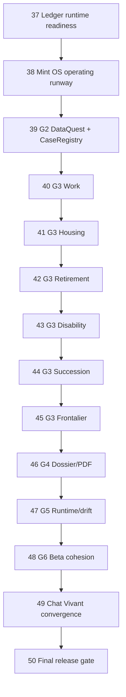

# Roadmap: MINT v3.0 Product Reality — Six Boucles, Un Dossier

## Milestone goal

Deliver one coherent Swiss financial lucidity product from canonical ledger
facts through DataQuest, six decision loops, dossier/PDF, runtime proof, beta
cohesion, and Chat Vivant convergence. No phase is complete below 9.0/10; final
release requires 9.5/10 and zero open P0/P1.

## Historical boundary

- v2.8 is archived as **incomplete**, not completed.
- G1 Ledger Reality Baseline closed at `5f8de38ec`, but its 23 readiness tickets
  remain the hard floor before G2.
- Phase numbering continues at 37.
- The old `v2.9 Chat Vivant` seed is preserved as Phase 49 after G6.

## Dependency graph

## Phase 37 — Ledger Runtime Readiness

**Goal:** Implement and prove all 23 G1 blocking tickets so the data spine is
actually ready for G2.

**Requirements:** RDY-*

**Execution waves:**

1. SOURCE-01; LDG-02/04/05/06/07; BND-04.
2. PROV-01 -> PROV-02 -> PROV-03 -> LDG-03.
3. BND-02/03 -> BND-05 -> BND-06 -> BND-01.
4. FRONT-01, RET-REF-01, SUCCESSION-01.
5. SCN-01 -> FRESH-01 and RETURN-01.
6. RUNTIME-01, audits, scorecard, explicit G2 decision.

**Success criteria:** 23/23 ticket tests exist with captured RED and GREEN;
targeted/full affected suites pass; Maestro and Patrol prove restart/recompute;
Claude code, architecture, and product-domain audits have no P0/P1; score >=9.0.

**Status:** not started; G2 blocked.

## Phase 38 — Mint OS Operating Runway

**Goal:** Finish the v2.8 mechanisms required to execute product work without
tool, flag, guardrail, or old-P0 drift.

**Requirements:** MIG-*, OS-*

**Plans:** deterministic SOT tools; route/backend kill switches; mechanical
guardrails; FIX-01..04/09 revalidation/fix; Phase 32 AMBER closure plan; daily
dogfood skeleton.

**Success criteria:** Mint OS hard floor passes; every new path is default-off
and OFF->ON->OFF is proved; old P0s have regression tests; no stale debt count is
used; no open P0/P1; score >=9.0.

## Phase 39 — G2 DataQuest Core + CaseRegistry MVP

**Goal:** Ask exactly the missing/stale delta for a decision while rendering
partial value immediately.

**Requirements:** DQ-*

**Success criteria:** fresh=zero asks, missing=exact asks, stale=reconfirm,
guards precede high-stakes results, partial state renders, levers are isolated,
return-to-origin passes in Maestro, real input passes in Patrol, score >=9.0.

## Phase 40 — G3 Work / First Salary

**Goal:** Complete the work/first salary/tax/AVS/LPP/first-3a loop.

**Requirements:** LOOP-P0-*, WORK-01

**Success criteria:** entry -> delta collection -> recompute -> explanation ->
dossier summary, all five route states, Mermaid/registry/tests/Maestro/Patrol,
Swiss and external audits, score >=9.0.

## Phase 41 — G3 Housing / Mortgage

**Goal:** Complete affordability, own funds, mortgage burden, EPL, and bank
questions with canonical household/property/debt facts.

**Requirements:** LOOP-P0-*, HOUSING-01

**Success criteria:** same hard floor as Phase 40 plus post-retirement
affordability guardrails and no local durable-fact controls; score >=9.0.

## Phase 42 — G3 Retirement / Rente vs Capital

**Goal:** Complete the high-value age 50-60 retirement case without turning MINT
into an advice or retirement-only product.

**Requirements:** LOOP-P0-*, RETIRE-01

**Success criteria:** AVS/LPP/3a/budget/liquidity/mortgage/tax/survivor tradeoffs,
sourced regulatory references, isolated levers, dossier output, same-slice
runtime and three audit lenses, score >=9.0.

## Phase 43 — G3 Disability / Income Protection

**Goal:** Complete the illness/accident/disability income-gap loop.

**Requirements:** LOOP-P0-*, DISABILITY-01

**Success criteria:** AI/LPP/IJM/LAA/private coverage and cash runway are explicit,
unknown coverage fails closed, all states/runtime/audits pass, score >=9.0.

## Phase 44 — G3 Succession / Transmission

**Goal:** Complete property transmission/donation lucidity with retirement and
liquidity guard quests.

**Requirements:** LOOP-P0-*, SUCCESSION-01

**Success criteria:** no inferred regime/instrument; heirs/property/mortgage/
beneficiary facts and specialist questions are clear; guards, dossier, runtime,
and audits pass; score >=9.0.

## Phase 45 — G3 Frontalier

**Goal:** Complete the cross-border worker case after dedicated Swiss/domain and
jurisdiction ledger contracts.

**Requirements:** LOOP-P0-*, FRONTIER-01

**Success criteria:** residence/work country, work canton, permit, insurance
option, source tax, telework, family, and pension affiliation change the flow
correctly; incomplete jurisdiction fails closed; runtime/audits pass; score >=9.0.

## Phase 46 — G4 Lucidity Dossier/PDF

**Goal:** Produce a usable specialist handoff for all six loops.

**Requirements:** DOS-*

**Success criteria:** same facts feed screens and export; provenance/freshness/
confidence and assumptions are visible; no estimate masquerades as fact; PDF
visual, privacy, banned-term, and product-domain audits pass; score >=9.0.

## Phase 47 — G5 Runtime Proof and Drift Gates

**Goal:** Make runtime and route health a continuously enforced fact.

**Requirements:** PROOF-*

**Success criteria:** daily loop, Sentry report/threshold/retention, all P0
Maestro+Patrol, every live route passing or safely killed, all Mint OS and full
test/audit gates green, carried v2.8 risks closed, score >=9.0.

## Phase 48 — G6 Product Polish and Beta Cohesion

**Goal:** Make Aujourd'hui, Coach, Explorer, and Dossier feel like one product.

**Requirements:** BETA-*

**Success criteria:** value <3 minutes, fresh facts reused, complex users see
partial truth, shared patterns/accessibility/i18n/privacy pass, 20-minute creator
walkthrough hits no wall, score >=9.0.

## Phase 49 — Chat Vivant Convergence

**Goal:** Complete the planted Chat Vivant plan on top of the proven product
spine, never as a parallel calculator/state system.

**Requirements:** CHAT-*

**Success criteria:** streamed Coach messages and three artifact levels share
ledger/Case/scenario truth; six-language copy, privacy, kill switch, tests,
creator-device Maestro/Patrol, and audits pass; score >=9.0.

## Phase 50 — Full Program Release Gate

**Goal:** Prove the entire roadmap on one clean release SHA.

**Requirements:** REL-*

**Success criteria:** full suites and route-wide inventory green; six loops and
Chat Vivant work on current SHA; Mint OS zero-drift; no open P0/P1; Opus
architecture/code/product-domain PASS; every phase >=9.0 and final >=9.5; clean
branch, atomic commits, pushed evidence.

## Progress

| phase | status | score | next hard floor |
|---|---|---:|---|
| 37 Ledger readiness | not started | — | SOURCE-01 RED -> GREEN |
| 38 Operating runway | blocked by 37 | — | 23/23 G1 GREEN |
| 39 G2 DataQuest | blocked by 37-38 | — | G2 allowed YES |
| 40-45 six G3 loops | blocked by 39 | — | G2 accepted |
| 46 G4 Dossier/PDF | blocked by 45 | — | six loops accepted |
| 47 G5 runtime/drift | blocked by 46 | — | dossier accepted |
| 48 G6 beta | blocked by 47 | — | runtime program green |
| 49 Chat Vivant | blocked by 48 | — | G6 accepted |
| 50 Release | blocked by 49 | — | all prior phases accepted |

---
*Created: 2026-07-12*
