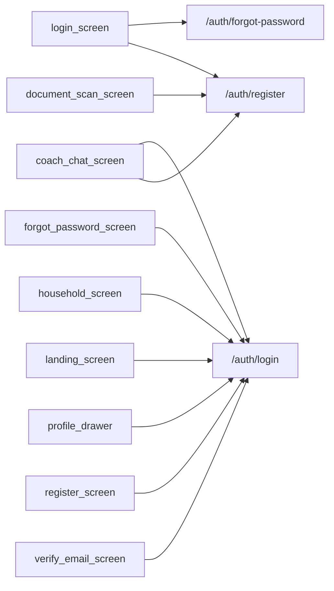

# Thème « auth » — carte de navigation

> Généré mécaniquement par `tools/checks/generate_theme_maps.py` depuis `app.dart` : routes, liens littéraux `context.go/push`, liens des hubs thématiques (`ExploreHubScreen`/`_HubCard`, cliquables mais via variable), et `ScreenRegistry`. Aucune donnée saisie à la main.

## TLDR

| | Routes | Signification |
|---|---:|---|
| 🟢 câblée | 3 | un lien cliquable y mène depuis un écran |
| 🟡 séquence | 0 | atteignable seulement via le registre / le coach |
| 🔴 île | 0 | aucun chemin détecté |
| **Total** | **3** | **verdict : PARCOURABLE** (3/3 = 100 % cliquables) |

## Hors périmètre produit

Ces routes ne doivent PAS être cliquables — les compter comme des îles créerait un faux problème.

| Route | Écran | Nature |
|---|---|---|
| `/auth/verify` | ? | deeplink |
| `/auth/verify-email` | VerifyEmailScreen | deeplink |

## Inventaire (routes produit)

| Route | Écran | Classe | Entrées (écrans qui y mènent) | Registre |
|---|---|---|---|---|
| `/auth/forgot-password` | ForgotPasswordScreen | 🟢 câblée | `login_screen` | oui |
| `/auth/login` | LoginScreen | 🟢 câblée | `coach_chat_screen`, `forgot_password_screen`, `household_screen`, `landing_screen`, `profile_drawer`, `register_screen`, `verify_email_screen` | oui |
| `/auth/register` | RegisterScreen | 🟢 câblée | `coach_chat_screen`, `document_scan_screen`, `login_screen` | oui |

## Graphe des entrées

