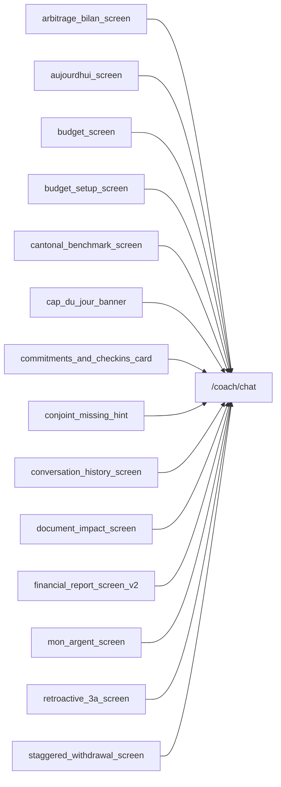

# Thème « coach » — carte de navigation

> Généré mécaniquement par `tools/checks/generate_theme_maps.py` depuis `app.dart`, un grep littéral des `context.go/push`, et le `ScreenRegistry`. Aucune donnée saisie à la main.

## TLDR

| | Routes | Signification |
|---|---:|---|
| 🟢 câblée | 1 | un lien cliquable y mène depuis un écran |
| 🟡 séquence | 14 | atteignable seulement via le registre / le coach |
| 🔴 île | 2 | aucun chemin détecté |
| **Total** | **17** | **verdict : PORTE UNIQUE** (1/17 = 6 % cliquables) |

## ⚠️ Portes manquantes

Ces routes n'ont **aucun lien cliquable**. Un utilisateur qui explore l'app ne peut pas les atteindre : elles dépendent d'une décision du coach ou d'une séquence.

- `/anonymous/chat` — ?
- `/debug/chat-as-verb` — ChatAsVerbDemoScreen

## Inventaire

| Route | Écran | Classe | Entrées (écrans qui y mènent) | Registre |
|---|---|---|---|---|
| `/advisor` | ? | 🟡 séquence | — | oui |
| `/advisor/plan-30-days` | ? | 🟡 séquence | — | oui |
| `/advisor/wizard` | ? | 🟡 séquence | — | oui |
| `/anonymous/chat` | ? | 🔴 île | — | non |
| `/arbitrage/rachat-vs-marche` | ? | 🟡 séquence | — | oui |
| `/coach/agir` | ? | 🟡 séquence | — | oui |
| `/coach/chat` | ? | 🟢 câblée | `arbitrage_bilan_screen`, `aujourdhui_screen`, `budget_screen`, `budget_setup_screen`, `cantonal_benchmark_screen`, `cap_du_jour_banner`, `commitments_and_checkins_card`, `conjoint_missing_hint`, `conversation_history_screen`, `document_impact_screen`, `financial_report_screen_v2`, `mon_argent_screen`, `retroactive_3a_screen`, `staggered_withdrawal_screen` | oui |
| `/coach/checkin` | ? | 🟡 séquence | — | oui |
| `/coach/cockpit` | ? | 🟡 séquence | — | oui |
| `/coach/dashboard` | ? | 🟡 séquence | — | oui |
| `/coach/decaissement` | ? | 🟡 séquence | — | oui |
| `/coach/history` | ConversationHistoryScreen | 🟡 séquence | — | oui |
| `/coach/refresh` | ? | 🟡 séquence | — | oui |
| `/coach/succession` | ? | 🟡 séquence | — | oui |
| `/debug/chat-as-verb` | ChatAsVerbDemoScreen | 🔴 île | — | non |
| `/lpp-deep/rachat` | ? | 🟡 séquence | — | oui |
| `/rachat-lpp` | RachatEchelonneScreen | 🟡 séquence | — | oui |

## Graphe des entrées

