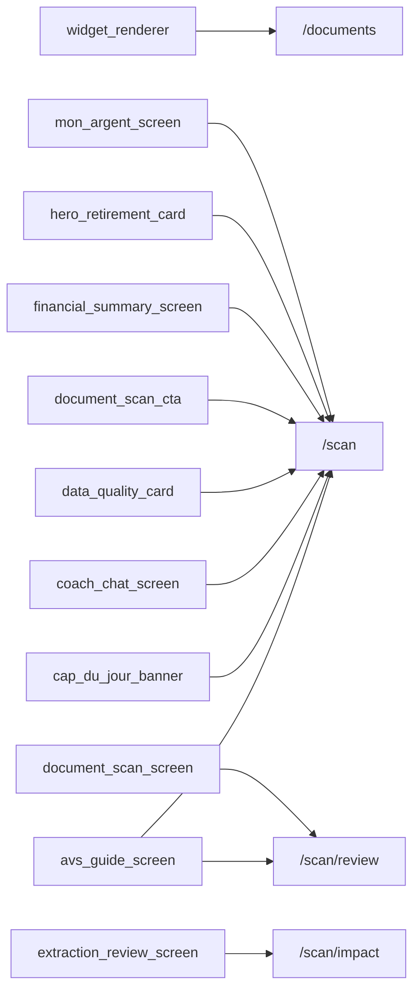

# Thème « documents » — carte de navigation

> Généré mécaniquement par `tools/checks/generate_theme_maps.py` depuis `app.dart` : routes, liens littéraux `context.go/push`, liens des hubs thématiques (`ExploreHubScreen`/`_HubCard`, cliquables mais via variable), et `ScreenRegistry`. Aucune donnée saisie à la main.

## TLDR

| | Routes | Signification |
|---|---:|---|
| 🟢 câblée | 4 | un lien cliquable y mène depuis un écran |
| 🟡 séquence | 4 | atteignable seulement via le registre / le coach |
| 🔴 île | 0 | aucun chemin détecté |
| **Total** | **8** | **verdict : PARCOURABLE** (4/8 = 50 % cliquables) |

## Inventaire (routes produit)

| Route | Écran | Classe | Entrées (écrans qui y mènent) | Registre |
|---|---|---|---|---|
| `/document-scan` | ? | 🟡 séquence | — | oui |
| `/document-scan/avs-guide` | ? | 🟡 séquence | — | oui |
| `/documents` | DocumentsScreen | 🟢 câblée | `widget_renderer` | oui |
| `/documents/:id` | ? | 🟡 séquence | — | oui |
| `/scan` | ? | 🟢 câblée | `avs_guide_screen`, `cap_du_jour_banner`, `coach_chat_screen`, `data_quality_card`, `document_scan_cta`, `financial_summary_screen`, `hero_retirement_card`, `mon_argent_screen` | oui |
| `/scan/avs-guide` | AvsGuideScreen | 🟡 séquence | — | oui |
| `/scan/impact` | ? | 🟢 câblée | `extraction_review_screen` | oui |
| `/scan/review` | ? | 🟢 câblée | `avs_guide_screen`, `document_scan_screen` | oui |

## Graphe des entrées

