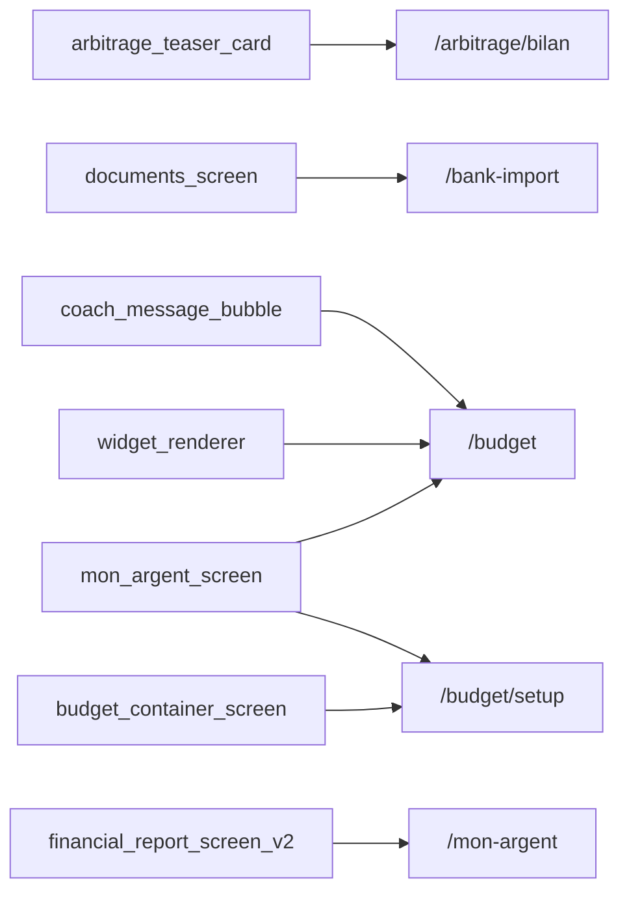

# Thème « home » — carte de navigation

> Généré mécaniquement par `tools/checks/generate_theme_maps.py` depuis `app.dart`, un grep littéral des `context.go/push`, et le `ScreenRegistry`. Aucune donnée saisie à la main.

## TLDR

| | Routes | Signification |
|---|---:|---|
| 🟢 câblée | 5 | un lien cliquable y mène depuis un écran |
| 🟡 séquence | 5 | atteignable seulement via le registre / le coach |
| 🔴 île | 0 | aucun chemin détecté |
| **Total** | **10** | **verdict : PARCOURABLE** (5/10 = 50 % cliquables) |

## Inventaire

| Route | Écran | Classe | Entrées (écrans qui y mènent) | Registre |
|---|---|---|---|---|
| `/arbitrage/bilan` | ArbitrageBilanScreen | 🟢 câblée | `arbitrage_teaser_card` | oui |
| `/bank-import` | BankImportScreen | 🟢 câblée | `documents_screen` | oui |
| `/budget` | ? | 🟢 câblée | `coach_message_bubble`, `mon_argent_screen`, `widget_renderer` | oui |
| `/budget/setup` | BudgetSetupScreen | 🟢 câblée | `budget_container_screen`, `mon_argent_screen` | oui |
| `/home` | ? | 🟡 séquence | — | oui |
| `/mon-argent` | ? | 🟢 câblée | `financial_report_screen_v2` | oui |
| `/open-banking` | OpenBankingHubScreen | 🟡 séquence | — | oui |
| `/open-banking/consents` | ConsentScreen | 🟡 séquence | — | oui |
| `/open-banking/transactions` | TransactionListScreen | 🟡 séquence | — | oui |
| `/portfolio` | ? | 🟡 séquence | — | oui |

## Graphe des entrées

