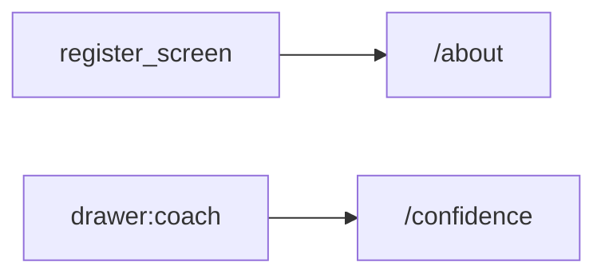

# Thème « insights » — carte de navigation

> Généré mécaniquement par `tools/checks/generate_theme_maps.py` depuis `app.dart` : routes, liens littéraux `context.go/push`, liens des hubs thématiques (`ExploreHubScreen`/`_HubCard`, cliquables mais via variable), et `ScreenRegistry`. Aucune donnée saisie à la main.

## TLDR

| | Routes | Signification |
|---|---:|---|
| 🟢 câblée | 2 | un lien cliquable y mène depuis un écran |
| 🟡 séquence | 2 | atteignable seulement via le registre / le coach |
| 🔴 île | 0 | aucun chemin détecté |
| **Total** | **4** | **verdict : PARCOURABLE** (2/4 = 50 % cliquables) |

## Hors périmètre produit

Ces routes ne doivent PAS être cliquables — les compter comme des îles créerait un faux problème.

| Route | Écran | Nature |
|---|---|---|
| `/achievements` | ? | redirect |
| `/report` | ? | redirect |
| `/report/v2` | ? | redirect |

## Inventaire (routes produit)

| Route | Écran | Classe | Entrées (écrans qui y mènent) | Registre |
|---|---|---|---|---|
| `/about` | AboutScreen | 🟢 câblée | `register_screen` | non |
| `/confidence` | ? | 🟢 câblée | `drawer:coach` | oui |
| `/data-block/:type` | ? | 🟡 séquence | — | oui |
| `/rapport` | ? | 🟡 séquence | — | oui |

## Graphe des entrées

