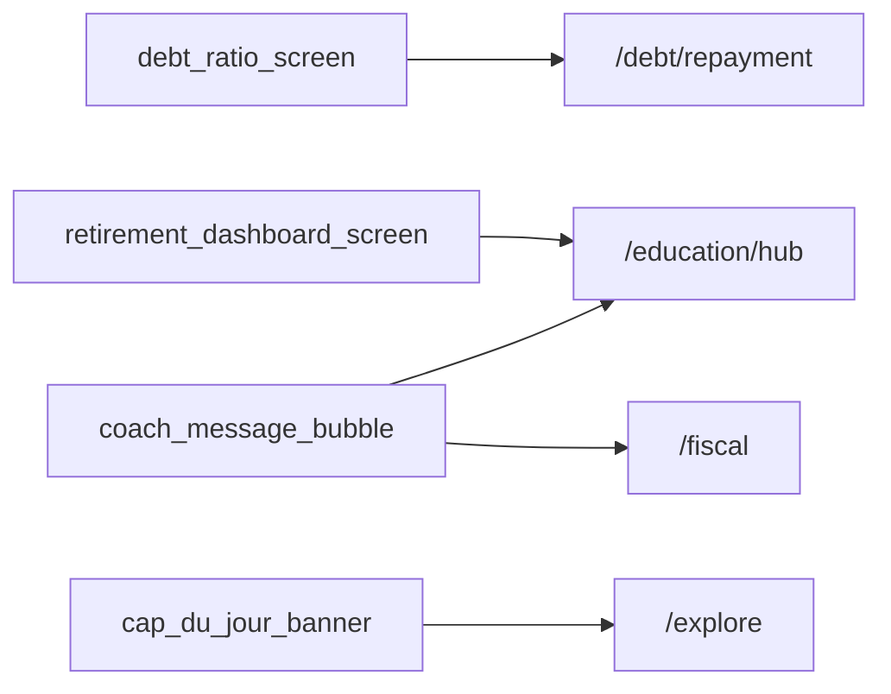

# Thème « lifeevents » — carte de navigation

> Généré mécaniquement par `tools/checks/generate_theme_maps.py` depuis `app.dart`, un grep littéral des `context.go/push`, et le `ScreenRegistry`. Aucune donnée saisie à la main.

## TLDR

| | Routes | Signification |
|---|---:|---|
| 🟢 câblée | 4 | un lien cliquable y mène depuis un écran |
| 🟡 séquence | 29 | atteignable seulement via le registre / le coach |
| 🔴 île | 0 | aucun chemin détecté |
| **Total** | **33** | **verdict : PARTIELLE** (4/33 = 12 % cliquables) |

## Inventaire

| Route | Écran | Classe | Entrées (écrans qui y mènent) | Registre |
|---|---|---|---|---|
| `/cantonal-benchmark` | CantonalBenchmarkScreen | 🟡 séquence | — | oui |
| `/check/debt` | DebtRiskCheckScreen | 🟡 séquence | — | oui |
| `/concubinage` | ConcubinageScreen | 🟡 séquence | — | oui |
| `/debt/help` | HelpResourcesScreen | 🟡 séquence | — | oui |
| `/debt/ratio` | DebtRatioScreen | 🟡 séquence | — | oui |
| `/debt/repayment` | RepaymentScreen | 🟢 câblée | `debt_ratio_screen` | oui |
| `/disability/gap` | ? | 🟡 séquence | — | oui |
| `/disability/insurance` | DisabilityInsuranceScreen | 🟡 séquence | — | oui |
| `/disability/self-employed` | DisabilitySelfEmployedScreen | 🟡 séquence | — | oui |
| `/divorce` | DivorceSimulatorScreen | 🟡 séquence | — | oui |
| `/education/hub` | ComprendreHubScreen | 🟢 câblée | `coach_message_bubble`, `retirement_dashboard_screen` | oui |
| `/education/theme/:id` | ? | 🟡 séquence | — | oui |
| `/expatriation` | ExpatScreen | 🟡 séquence | — | oui |
| `/explore` | ExplorerScreen | 🟢 câblée | `cap_du_jour_banner` | oui |
| `/explore/famille` | ExploreHubScreen | 🟡 séquence | — | oui |
| `/explore/fiscalite` | ExploreHubScreen | 🟡 séquence | — | oui |
| `/explore/logement` | ExploreHubScreen | 🟡 séquence | — | oui |
| `/explore/patrimoine` | ExploreHubScreen | 🟡 séquence | — | oui |
| `/explore/retraite` | ExploreHubScreen | 🟡 séquence | — | oui |
| `/explore/sante` | ExploreHubScreen | 🟡 séquence | — | oui |
| `/explore/travail` | ExploreHubScreen | 🟡 séquence | — | oui |
| `/first-job` | FirstJobScreen | 🟡 séquence | — | oui |
| `/fiscal` | FiscalComparatorScreen | 🟢 câblée | `coach_message_bubble` | oui |
| `/life-event/deces-proche` | DecesProcheScreen | 🟡 séquence | — | oui |
| `/life-event/demenagement-cantonal` | DemenagementCantonalScreen | 🟡 séquence | — | oui |
| `/life-event/divorce` | ? | 🟡 séquence | — | oui |
| `/life-event/donation` | DonationScreen | 🟡 séquence | — | oui |
| `/life-event/succession` | ? | 🟡 séquence | — | oui |
| `/mariage` | MariageScreen | 🟡 séquence | — | oui |
| `/naissance` | NaissanceScreen | 🟡 séquence | — | oui |
| `/segments/frontalier` | FrontalierScreen | 🟡 séquence | — | oui |
| `/segments/gender-gap` | GenderGapScreen | 🟡 séquence | — | oui |
| `/succession` | SuccessionPatrimoineScreen | 🟡 séquence | — | oui |

## Graphe des entrées

