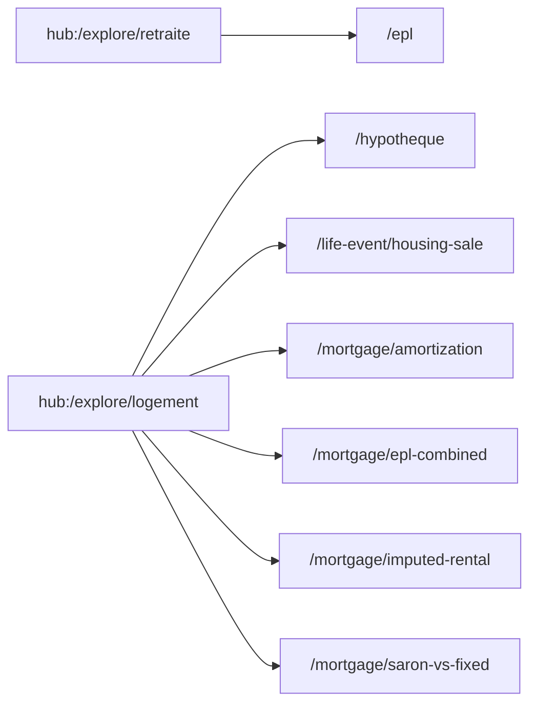

# Thème « logement » — carte de navigation

> Généré mécaniquement par `tools/checks/generate_theme_maps.py` depuis `app.dart` : routes, liens littéraux `context.go/push`, liens des hubs thématiques (`ExploreHubScreen`/`_HubCard`, cliquables mais via variable), et `ScreenRegistry`. Aucune donnée saisie à la main.

## TLDR

| | Routes | Signification |
|---|---:|---|
| 🟢 câblée | 7 | un lien cliquable y mène depuis un écran |
| 🟡 séquence | 1 | atteignable seulement via le registre / le coach |
| 🔴 île | 0 | aucun chemin détecté |
| **Total** | **8** | **verdict : PARCOURABLE** (7/8 = 88 % cliquables) |

## Inventaire (routes produit)

| Route | Écran | Classe | Entrées (écrans qui y mènent) | Registre |
|---|---|---|---|---|
| `/epl` | EplScreen | 🟢 câblée | `hub:/explore/retraite` | oui |
| `/hypotheque` | AffordabilityScreen | 🟢 câblée | `hub:/explore/logement` | oui |
| `/life-event/housing-sale` | HousingSaleScreen | 🟢 câblée | `hub:/explore/logement` | oui |
| `/mortgage/affordability` | ? | 🟡 séquence | — | oui |
| `/mortgage/amortization` | AmortizationScreen | 🟢 câblée | `hub:/explore/logement` | oui |
| `/mortgage/epl-combined` | EplCombinedScreen | 🟢 câblée | `hub:/explore/logement` | oui |
| `/mortgage/imputed-rental` | ImputedRentalScreen | 🟢 câblée | `hub:/explore/logement` | oui |
| `/mortgage/saron-vs-fixed` | SaronVsFixedScreen | 🟢 câblée | `hub:/explore/logement` | oui |

## Graphe des entrées

