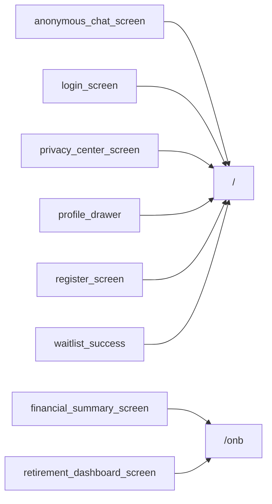

# Thème « onboarding » — carte de navigation

> Généré mécaniquement par `tools/checks/generate_theme_maps.py` depuis `app.dart` : routes, liens littéraux `context.go/push`, liens des hubs thématiques (`ExploreHubScreen`/`_HubCard`, cliquables mais via variable), et `ScreenRegistry`. Aucune donnée saisie à la main.

## TLDR

| | Routes | Signification |
|---|---:|---|
| 🟢 câblée | 2 | un lien cliquable y mène depuis un écran |
| 🟡 séquence | 0 | atteignable seulement via le registre / le coach |
| 🔴 île | 0 | aucun chemin détecté |
| **Total** | **2** | **verdict : PARCOURABLE** (2/2 = 100 % cliquables) |

## Hors périmètre produit

Ces routes ne doivent PAS être cliquables — les compter comme des îles créerait un faux problème.

| Route | Écran | Nature |
|---|---|---|
| `/ask-mint` | ? | redirect |
| `/onboarding/enrichment` | ? | redirect |
| `/onboarding/intent` | ? | redirect |
| `/onboarding/minimal` | ? | redirect |
| `/onboarding/plan` | ? | redirect |
| `/onboarding/premier-eclairage` | ? | redirect |
| `/onboarding/promise` | ? | redirect |
| `/onboarding/quick` | ? | redirect |
| `/onboarding/quick-start` | ? | redirect |
| `/onboarding/smart` | ? | redirect |
| `/score-reveal` | ? | redirect |
| `/start` | ? | redirect |
| `/waitlist` | ? | deeplink |

## Inventaire (routes produit)

| Route | Écran | Classe | Entrées (écrans qui y mènent) | Registre |
|---|---|---|---|---|
| `/` | LandingScreen | 🟢 câblée | `anonymous_chat_screen`, `login_screen`, `privacy_center_screen`, `profile_drawer`, `register_screen`, `waitlist_success` | non |
| `/onb` | OnboardingShellScreen | 🟢 câblée | `financial_summary_screen`, `retirement_dashboard_screen` | oui |

## Graphe des entrées

