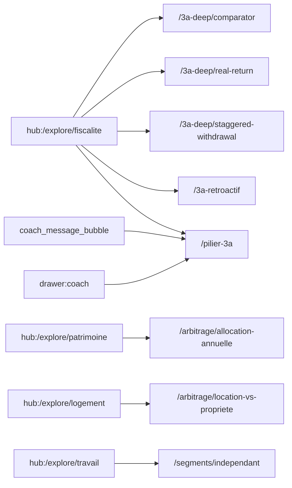

# Thème « pilier3a » — carte de navigation

> Généré mécaniquement par `tools/checks/generate_theme_maps.py` depuis `app.dart` : routes, liens littéraux `context.go/push`, liens des hubs thématiques (`ExploreHubScreen`/`_HubCard`, cliquables mais via variable), et `ScreenRegistry`. Aucune donnée saisie à la main.

## TLDR

| | Routes | Signification |
|---|---:|---|
| 🟢 câblée | 8 | un lien cliquable y mène depuis un écran |
| 🟡 séquence | 4 | atteignable seulement via le registre / le coach |
| 🔴 île | 0 | aucun chemin détecté |
| **Total** | **12** | **verdict : PARCOURABLE** (8/12 = 67 % cliquables) |

## Hors périmètre produit

Ces routes ne doivent PAS être cliquables — les compter comme des îles créerait un faux problème.

| Route | Écran | Nature |
|---|---|---|
| `/arbitrage/calendrier-retraits` | ? | redirect |

## Inventaire (routes produit)

| Route | Écran | Classe | Entrées (écrans qui y mènent) | Registre |
|---|---|---|---|---|
| `/3a-deep/comparator` | ProviderComparatorScreen | 🟢 câblée | `hub:/explore/fiscalite` | oui |
| `/3a-deep/real-return` | RealReturnScreen | 🟢 câblée | `hub:/explore/fiscalite` | oui |
| `/3a-deep/staggered-withdrawal` | StaggeredWithdrawalScreen | 🟢 câblée | `hub:/explore/fiscalite` | oui |
| `/3a-retroactif` | Retroactive3aScreen | 🟢 câblée | `hub:/explore/fiscalite` | oui |
| `/arbitrage/allocation-annuelle` | AllocationAnnuelleScreen | 🟢 câblée | `hub:/explore/patrimoine` | oui |
| `/arbitrage/location-vs-propriete` | LocationVsProprieteScreen | 🟢 câblée | `hub:/explore/logement` | oui |
| `/independants/3a` | Pillar3aIndepScreen | 🟡 séquence | — | oui |
| `/independants/avs` | AvsCotisationsScreen | 🟡 séquence | — | oui |
| `/independants/dividende-salaire` | DividendeVsSalaireScreen | 🟡 séquence | — | oui |
| `/independants/ijm` | IjmScreen | 🟡 séquence | — | oui |
| `/pilier-3a` | Simulator3aScreen | 🟢 câblée | `coach_message_bubble`, `drawer:coach`, `hub:/explore/fiscalite` | oui |
| `/segments/independant` | IndependantScreen | 🟢 câblée | `hub:/explore/travail` | oui |

## Graphe des entrées

