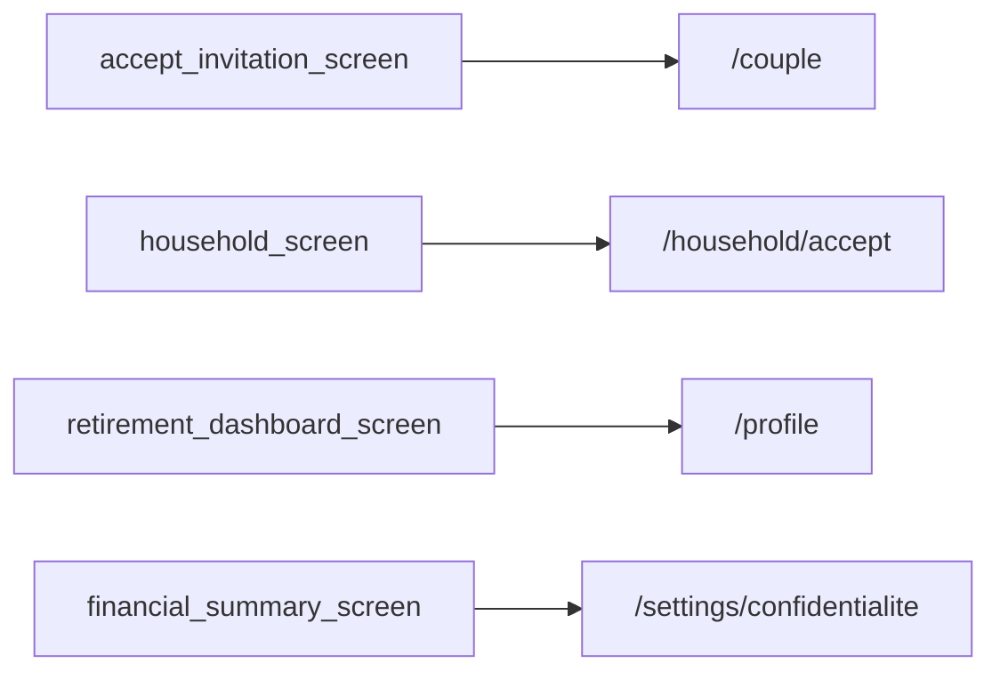

# Thème « profil » — carte de navigation

> Généré mécaniquement par `tools/checks/generate_theme_maps.py` depuis `app.dart`, un grep littéral des `context.go/push`, et le `ScreenRegistry`. Aucune donnée saisie à la main.

## TLDR

| | Routes | Signification |
|---|---:|---|
| 🟢 câblée | 4 | un lien cliquable y mène depuis un écran |
| 🟡 séquence | 4 | atteignable seulement via le registre / le coach |
| 🔴 île | 0 | aucun chemin détecté |
| **Total** | **8** | **verdict : PARCOURABLE** (4/8 = 50 % cliquables) |

## Inventaire

| Route | Écran | Classe | Entrées (écrans qui y mènent) | Registre |
|---|---|---|---|---|
| `/couple` | HouseholdScreen | 🟢 câblée | `accept_invitation_screen` | oui |
| `/couple/accept` | ? | 🟡 séquence | — | oui |
| `/household` | ? | 🟡 séquence | — | oui |
| `/household/accept` | ? | 🟢 câblée | `household_screen` | oui |
| `/profile` | ? | 🟢 câblée | `retirement_dashboard_screen` | oui |
| `/profile/admin-observability` | AdminObservabilityScreen | 🟡 séquence | — | oui |
| `/settings/confidentialite` | ConfidentialiteSettingsScreen | 🟢 câblée | `financial_summary_screen` | oui |
| `/settings/langue` | LangueSettingsScreen | 🟡 séquence | — | oui |

## Graphe des entrées

