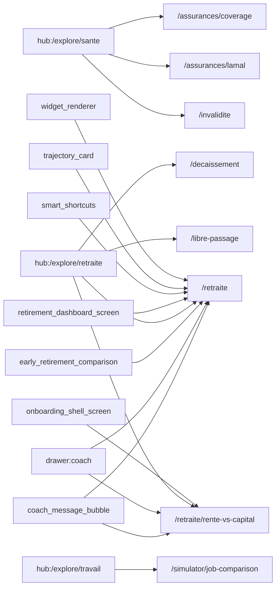

# Thème « retraite » — carte de navigation

> Généré mécaniquement par `tools/checks/generate_theme_maps.py` depuis `app.dart` : routes, liens littéraux `context.go/push`, liens des hubs thématiques (`ExploreHubScreen`/`_HubCard`, cliquables mais via variable), et `ScreenRegistry`. Aucune donnée saisie à la main.

## TLDR

| | Routes | Signification |
|---|---:|---|
| 🟢 câblée | 8 | un lien cliquable y mène depuis un écran |
| 🟡 séquence | 11 | atteignable seulement via le registre / le coach |
| 🔴 île | 2 | aucun chemin détecté |
| **Total** | **21** | **verdict : PARTIELLE** (8/21 = 38 % cliquables) |

## ⚠️ Portes manquantes

Ces routes n'ont **aucun lien cliquable**. Un utilisateur qui explore l'app ne peut pas les atteindre : elles dépendent d'une décision du coach ou d'une séquence.

- `/rente-vs-capital` — ?
- `/simulator/rente-capital` — ?

## Hors périmètre produit

Ces routes ne doivent PAS être cliquables — les compter comme des îles créerait un faux problème.

| Route | Écran | Nature |
|---|---|---|
| `/__e2e/row23-independent-no-lpp-profile` | ? | e2e |

## Inventaire (routes produit)

| Route | Écran | Classe | Entrées (écrans qui y mènent) | Registre |
|---|---|---|---|---|
| `/arbitrage/rente-vs-capital` | ? | 🟡 séquence | — | oui |
| `/assurances/coverage` | CoverageCheckScreen | 🟢 câblée | `hub:/explore/sante` | oui |
| `/assurances/lamal` | LamalFranchiseScreen | 🟢 câblée | `hub:/explore/sante` | oui |
| `/decaissement` | OptimisationDecaissementScreen | 🟢 câblée | `hub:/explore/retraite` | oui |
| `/independants/lpp-volontaire` | LppVolontaireScreen | 🟡 séquence | — | oui |
| `/invalidite` | DisabilityGapScreen | 🟢 câblée | `hub:/explore/sante` | oui |
| `/libre-passage` | LibrePassageScreen | 🟢 câblée | `hub:/explore/retraite` | oui |
| `/lpp-deep/epl` | ? | 🟡 séquence | — | oui |
| `/lpp-deep/libre-passage` | ? | 🟡 séquence | — | oui |
| `/rente-vs-capital` | ? | 🔴 île | — | non |
| `/retirement` | ? | 🟡 séquence | — | oui |
| `/retirement/projection` | ? | 🟡 séquence | — | oui |
| `/retraite` | RetirementDashboardScreen | 🟢 câblée | `coach_message_bubble`, `drawer:coach`, `early_retirement_comparison`, `hub:/explore/retraite`, `retirement_dashboard_screen`, `smart_shortcuts`, `trajectory_card`, `widget_renderer` | oui |
| `/retraite/rente-vs-capital` | RenteVsCapitalScreen | 🟢 câblée | `coach_message_bubble`, `drawer:coach`, `hub:/explore/retraite`, `onboarding_shell_screen` | oui |
| `/simulator/3a` | ? | 🟡 séquence | — | oui |
| `/simulator/compound` | SimulatorCompoundScreen | 🟡 séquence | — | oui |
| `/simulator/credit` | ConsumerCreditSimulatorScreen | 🟡 séquence | — | oui |
| `/simulator/disability-gap` | ? | 🟡 séquence | — | oui |
| `/simulator/job-comparison` | JobComparisonScreen | 🟢 câblée | `hub:/explore/travail` | oui |
| `/simulator/leasing` | SimulatorLeasingScreen | 🟡 séquence | — | oui |
| `/simulator/rente-capital` | ? | 🔴 île | — | non |

## Graphe des entrées

