# ROUTE-MAP — Cartographie navigation MINT (2026-07-23)

**TL;DR — le constat est sévère et chiffré : la navigation visible ne couvre que 21 % des routes.**

| Classe | Routes | % | Signification |
|---|---|---|---|
| 🟢 Câblée | 33 | 21 % | Un `context.go/push` littéral y mène depuis un écran ou widget |
| 🟡 Séquence-seulement | 108 | 68 % | Atteignable UNIQUEMENT via ScreenRegistry / SequenceCoordinator / coach `route_to_screen` — aucun bouton ni lien visible |
| 🔴 Île | 17 | 11 % | Aucun chemin détecté (ni littéral, ni registre) |

Autres signaux mécaniques : 61 arêtes de navigation littérales au total pour 158 routes ; flux Logement : 8 routes / **0 arête** ; Life events : 33 routes / 5 arêtes.

## Méthodologie (déterministe, zéro mémoire)
- Routes : parsing à pile d'imbrication de `apps/mobile/lib/app.dart` (158 GoRoute, chemins complets résolus parent+enfant).
- Arêtes : grep exhaustif `context.go/push/replace('...')` littéraux dans `lib/screens/**` + `lib/widgets/**`.
- Navigation dynamique : croisement avec les 142 entrées `ScreenRegistry` (`lib/services/navigation/screen_registry.dart`).
- Boutons/champs/nav par écran : extraction exhaustive des 126 fichiers par 4 agents — détail dans `routemap-parts/screens-{A,B,C,D}.md`.
- Limite honnête : 66 appels `context.go/push` NON-littéraux (variables) ne sont pas résolus arête-par-arête ; ils passent majoritairement par le registre (comptés en 🟡).

## Façades et orphelins détectés (extraction écran par écran)

| Écran | Défaut | Source |
|---|---|---|
| `AnonymousChatScreen` | Orphelin : route `/anonymous/chat` retirée, classe ne vit plus que dans les tests | screens-A |
| `DocumentStreamResultScreen` | Orphelin complet : 0 référence, helper `pushDocumentStreamResult` jamais appelé | screens-B |
| `ConfidenceDashboardScreen` | 3 cartes d'enrichissement `onTap: () {}` mort + TODO (`:349-351`) | screens-B |
| `OpenBankingHubScreen` | Bouton banque mort + données mock | screens-D |
| `ConsentScreen` (onboarding) | Mock sans persistance | screens-D |
| `TransactionListScreen` | Filtre période sans effet | screens-D |
| `Retroactive3aScreen` | 3 action cards sans `onTap` | screens-D |
| Strings FR hardcodées | `onboarding_shell_screen`, `libre_passage_screen`, `rachat_echelonne_screen` | screens-C |

## Les 17 îles (aucun chemin détecté)

- `/__e2e/budget-direct-inputs` → DebugBudgetBootstrapScreen
- `/__e2e/row23-independent-no-lpp-profile` → DebugMint2AccountClaimScreen
- `/admin/debug-spine` → AdminShell
- `/admin/routes` → AdminShell
- `/anonymous/chat` → ?
- `/auth/verify` → ?
- `/debug/chat-as-verb` → ChatAsVerbDemoScreen
- `/onboarding/enrichment` → ?
- `/onboarding/intent` → ?
- `/onboarding/minimal` → ?
- `/onboarding/plan` → ?
- `/onboarding/promise` → ?
- `/onboarding/quick` → ?
- `/onboarding/quick-start` → ?
- `/onboarding/smart` → ?
- `/rente-vs-capital` → ?
- `/simulator/rente-capital` → ?

Note : certaines îles sont voulues (admin/debug/e2e, deeplinks). Les candidates
sérieuses à trancher : les variantes d'onboarding non câblées et
`/simulator/rente-capital` vs `/retraite/rente-vs-capital` (doublon).

## Diagrammes par flux

Convention : nœud vert = présent dans ScreenRegistry (navigable dynamiquement) ;
nœud orange pointillé = source/cible hors table des routes (widget ou chemin
dynamique) ; flèches = navigation littérale UNIQUEMENT. Un flux pauvre en
flèches avec beaucoup de nœuds = écrans découvrables uniquement par séquence.

### Onboarding & entrée — 15 routes, 14 arêtes littérales

| Route | Écran | Classe |
|---|---|---|
| `/` | LandingScreen | 🟢 câblée |
| `/ask-mint` | ? | 🟢 câblée |
| `/onb` | OnboardingShellScreen | 🟢 câblée |
| `/onboarding/enrichment` | ? | 🔴 île |
| `/onboarding/intent` | ? | 🔴 île |
| `/onboarding/minimal` | ? | 🔴 île |
| `/onboarding/plan` | ? | 🔴 île |
| `/onboarding/premier-eclairage` | ? | 🟡 séquence-seulement |
| `/onboarding/promise` | ? | 🔴 île |
| `/onboarding/quick` | ? | 🔴 île |
| `/onboarding/quick-start` | ? | 🔴 île |
| `/onboarding/smart` | ? | 🔴 île |
| `/score-reveal` | ? | 🟡 séquence-seulement |
| `/start` | ? | 🟢 câblée |
| `/waitlist` | WaitlistProvider | 🟢 câblée |

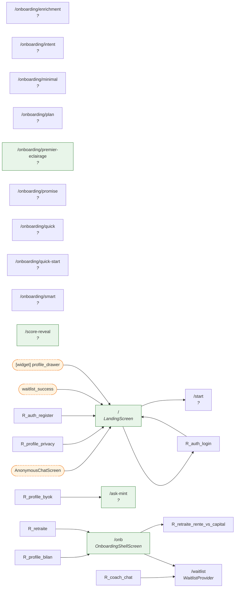

### Auth & compte — 5 routes, 15 arêtes littérales

| Route | Écran | Classe |
|---|---|---|
| `/auth/forgot-password` | ForgotPasswordScreen | 🟢 câblée |
| `/auth/login` | LoginScreen | 🟢 câblée |
| `/auth/register` | RegisterScreen | 🟢 câblée |
| `/auth/verify` | ? | 🔴 île |
| `/auth/verify-email` | VerifyEmailScreen | 🟢 câblée |

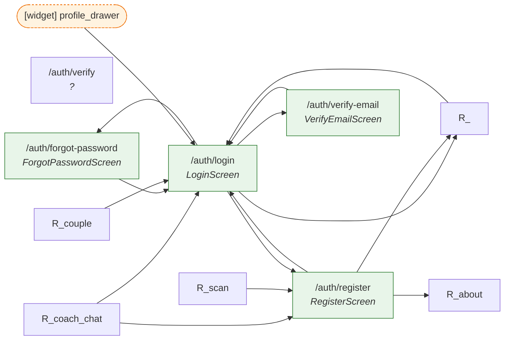

### Coach & chat — 17 routes, 16 arêtes littérales

| Route | Écran | Classe |
|---|---|---|
| `/advisor` | ? | 🟡 séquence-seulement |
| `/advisor/plan-30-days` | ? | 🟡 séquence-seulement |
| `/advisor/wizard` | ? | 🟡 séquence-seulement |
| `/anonymous/chat` | ? | 🔴 île |
| `/arbitrage/rachat-vs-marche` | ? | 🟡 séquence-seulement |
| `/coach/agir` | ? | 🟡 séquence-seulement |
| `/coach/chat` | CoachChatScreen | 🟢 câblée |
| `/coach/checkin` | ? | 🟡 séquence-seulement |
| `/coach/cockpit` | ? | 🟡 séquence-seulement |
| `/coach/dashboard` | ? | 🟡 séquence-seulement |
| `/coach/decaissement` | ? | 🟡 séquence-seulement |
| `/coach/history` | ConversationHistoryScreen | 🟡 séquence-seulement |
| `/coach/refresh` | ? | 🟡 séquence-seulement |
| `/coach/succession` | ? | 🟡 séquence-seulement |
| `/debug/chat-as-verb` | ChatAsVerbDemoScreen | 🔴 île |
| `/lpp-deep/rachat` | ? | 🟡 séquence-seulement |
| `/rachat-lpp` | RachatEchelonneScreen | 🟡 séquence-seulement |

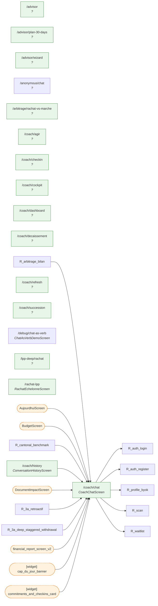

### Aujourd'hui, budget, argent & transactions — 11 routes, 19 arêtes littérales

| Route | Écran | Classe |
|---|---|---|
| `/arbitrage/bilan` | ArbitrageBilanScreen | 🟢 câblée |
| `/bank-import` | BankImportScreen | 🟢 câblée |
| `/budget` | BudgetContainerScreen | 🟢 câblée |
| `/budget/setup` | BudgetSetupScreen | 🟢 câblée |
| `/home` | Scaffold | 🟡 séquence-seulement |
| `/mon-argent` | MonArgentScreen | 🟢 câblée |
| `/open-banking` | OpenBankingHubScreen | 🟡 séquence-seulement |
| `/open-banking/consents` | ConsentScreen | 🟡 séquence-seulement |
| `/open-banking/transactions` | TransactionListScreen | 🟡 séquence-seulement |
| `/portfolio` | ? | 🟡 séquence-seulement |
| `/profile/bilan` | FinancialSummaryScreen | 🟢 câblée |

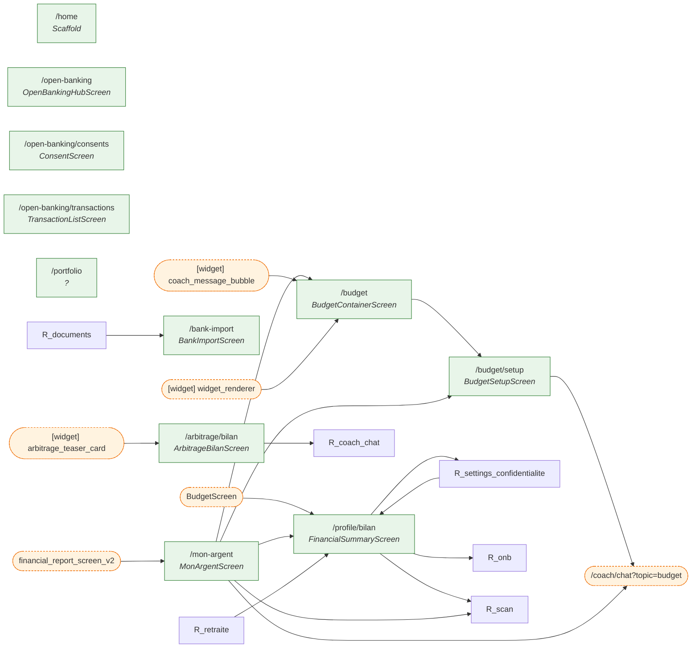

### Retraite, prévoyance & Rente-vs-Capital — 22 routes, 12 arêtes littérales

| Route | Écran | Classe |
|---|---|---|
| `/__e2e/row23-independent-no-lpp-profile` | DebugMint2AccountClaimScreen | 🔴 île |
| `/arbitrage/rente-vs-capital` | ? | 🟡 séquence-seulement |
| `/assurances/coverage` | CoverageCheckScreen | 🟡 séquence-seulement |
| `/assurances/lamal` | LamalFranchiseScreen | 🟡 séquence-seulement |
| `/decaissement` | OptimisationDecaissementScreen | 🟡 séquence-seulement |
| `/independants/lpp-volontaire` | LppVolontaireScreen | 🟡 séquence-seulement |
| `/invalidite` | DisabilityGapScreen | 🟡 séquence-seulement |
| `/libre-passage` | LibrePassageScreen | 🟡 séquence-seulement |
| `/lpp-deep/epl` | ? | 🟡 séquence-seulement |
| `/lpp-deep/libre-passage` | ? | 🟡 séquence-seulement |
| `/rente-vs-capital` | ? | 🔴 île |
| `/retirement` | ? | 🟡 séquence-seulement |
| `/retirement/projection` | ? | 🟡 séquence-seulement |
| `/retraite` | RetirementDashboardScreen | 🟢 câblée |
| `/retraite/rente-vs-capital` | RenteVsCapitalScreen | 🟢 câblée |
| `/simulator/3a` | ? | 🟡 séquence-seulement |
| `/simulator/compound` | SimulatorCompoundScreen | 🟡 séquence-seulement |
| `/simulator/credit` | ConsumerCreditSimulatorScreen | 🟡 séquence-seulement |
| `/simulator/disability-gap` | ? | 🟡 séquence-seulement |
| `/simulator/job-comparison` | JobComparisonScreen | 🟡 séquence-seulement |
| `/simulator/leasing` | SimulatorLeasingScreen | 🟡 séquence-seulement |
| `/simulator/rente-capital` | ? | 🔴 île |

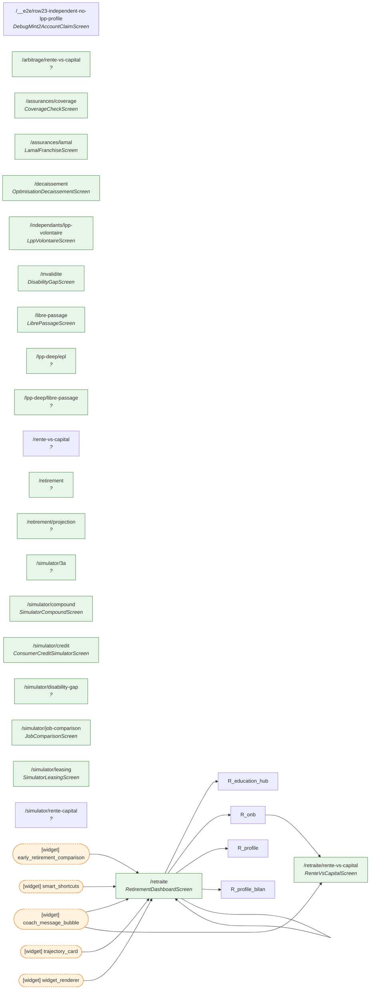

### 3e pilier & arbitrages — 13 routes, 4 arêtes littérales

| Route | Écran | Classe |
|---|---|---|
| `/3a-deep/comparator` | ProviderComparatorScreen | 🟡 séquence-seulement |
| `/3a-deep/real-return` | RealReturnScreen | 🟡 séquence-seulement |
| `/3a-deep/staggered-withdrawal` | StaggeredWithdrawalScreen | 🟡 séquence-seulement |
| `/3a-retroactif` | Retroactive3aScreen | 🟡 séquence-seulement |
| `/arbitrage/allocation-annuelle` | AllocationAnnuelleScreen | 🟡 séquence-seulement |
| `/arbitrage/calendrier-retraits` | ? | 🟡 séquence-seulement |
| `/arbitrage/location-vs-propriete` | LocationVsProprieteScreen | 🟡 séquence-seulement |
| `/independants/3a` | Pillar3aIndepScreen | 🟡 séquence-seulement |
| `/independants/avs` | AvsCotisationsScreen | 🟡 séquence-seulement |
| `/independants/dividende-salaire` | DividendeVsSalaireScreen | 🟡 séquence-seulement |
| `/independants/ijm` | IjmScreen | 🟡 séquence-seulement |
| `/pilier-3a` | Simulator3aScreen | 🟢 câblée |
| `/segments/independant` | IndependantScreen | 🟡 séquence-seulement |

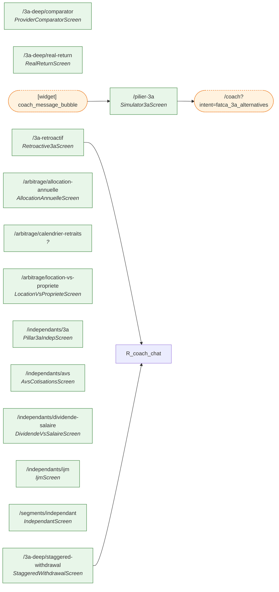

### Logement & hypothèque — 8 routes, 0 arêtes littérales

| Route | Écran | Classe |
|---|---|---|
| `/epl` | EplScreen | 🟡 séquence-seulement |
| `/hypotheque` | AffordabilityScreen | 🟡 séquence-seulement |
| `/life-event/housing-sale` | HousingSaleScreen | 🟡 séquence-seulement |
| `/mortgage/affordability` | ? | 🟡 séquence-seulement |
| `/mortgage/amortization` | AmortizationScreen | 🟡 séquence-seulement |
| `/mortgage/epl-combined` | EplCombinedScreen | 🟡 séquence-seulement |
| `/mortgage/imputed-rental` | ImputedRentalScreen | 🟡 séquence-seulement |
| `/mortgage/saron-vs-fixed` | SaronVsFixedScreen | 🟡 séquence-seulement |

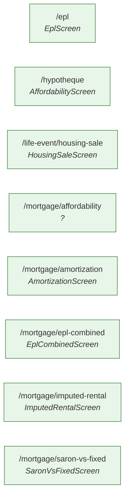

### Documents & scan — 8 routes, 14 arêtes littérales

| Route | Écran | Classe |
|---|---|---|
| `/document-scan` | ? | 🟡 séquence-seulement |
| `/document-scan/avs-guide` | ? | 🟡 séquence-seulement |
| `/documents` | DocumentsScreen | 🟢 câblée |
| `/documents/:id` | DocumentDetailScreen | 🟡 séquence-seulement |
| `/scan` | DocumentScanScreen | 🟢 câblée |
| `/scan/avs-guide` | AvsGuideScreen | 🟡 séquence-seulement |
| `/scan/impact` | Scaffold | 🟢 câblée |
| `/scan/review` | Scaffold | 🟢 câblée |

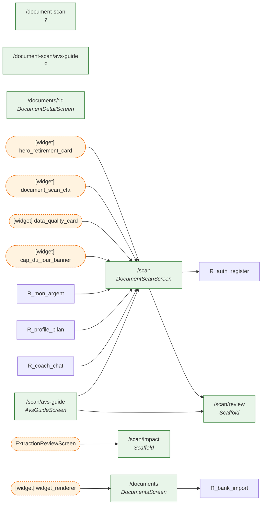

### Profil, privacy, couple & consentements — 13 routes, 10 arêtes littérales

| Route | Écran | Classe |
|---|---|---|
| `/couple` | HouseholdScreen | 🟢 câblée |
| `/couple/accept` | AcceptInvitationScreen | 🟡 séquence-seulement |
| `/household` | ? | 🟡 séquence-seulement |
| `/household/accept` | ? | 🟢 câblée |
| `/profile` | <redirect → /profile/bilan> | 🟢 câblée |
| `/profile/admin-analytics` | AdminAnalyticsScreen | 🟡 séquence-seulement |
| `/profile/admin-observability` | AdminObservabilityScreen | 🟡 séquence-seulement |
| `/profile/byok` | ByokSettingsScreen | 🟢 câblée |
| `/profile/privacy` | PrivacyCenterScreen | 🟢 câblée |
| `/profile/privacy-control` | PrivacyControlScreen | 🟡 séquence-seulement |
| `/profile/slm` | SlmSettingsScreen | 🟡 séquence-seulement |
| `/settings/confidentialite` | ConfidentialiteSettingsScreen | 🟢 câblée |
| `/settings/langue` | LangueSettingsScreen | 🟡 séquence-seulement |

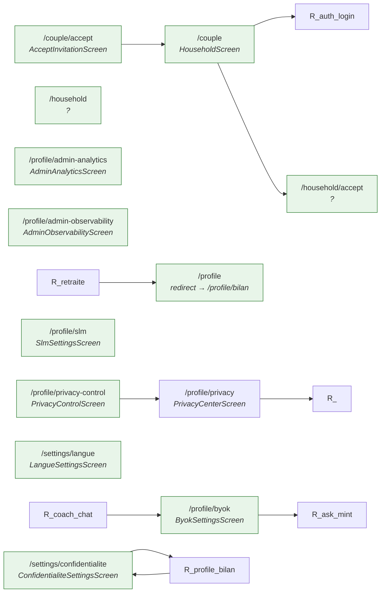

### Rapports & insights — 7 routes, 1 arêtes littérales

| Route | Écran | Classe |
|---|---|---|
| `/about` | AboutScreen | 🟢 câblée |
| `/achievements` | ? | 🟡 séquence-seulement |
| `/confidence` | ConfidenceDashboardScreen | 🟡 séquence-seulement |
| `/data-block/:type` | DataBlockEnrichmentScreen | 🟡 séquence-seulement |
| `/rapport` | FinancialReportScreenV2 | 🟡 séquence-seulement |
| `/report` | ? | 🟡 séquence-seulement |
| `/report/v2` | ? | 🟡 séquence-seulement |

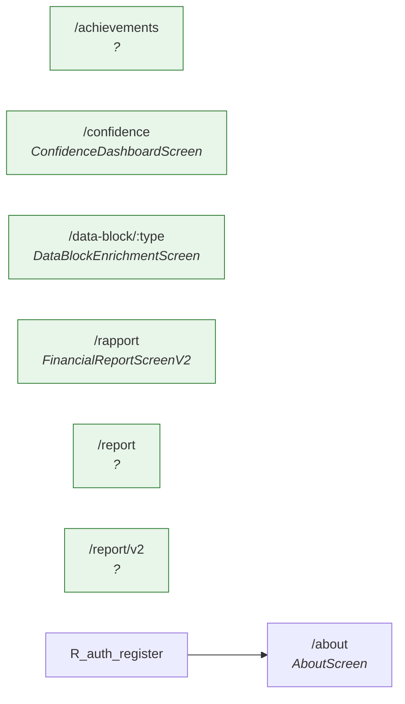

### Life events & fiscal — 33 routes, 5 arêtes littérales

| Route | Écran | Classe |
|---|---|---|
| `/cantonal-benchmark` | CantonalBenchmarkScreen | 🟡 séquence-seulement |
| `/check/debt` | DebtRiskCheckScreen | 🟡 séquence-seulement |
| `/concubinage` | ConcubinageScreen | 🟡 séquence-seulement |
| `/debt/help` | HelpResourcesScreen | 🟡 séquence-seulement |
| `/debt/ratio` | DebtRatioScreen | 🟡 séquence-seulement |
| `/debt/repayment` | RepaymentScreen | 🟢 câblée |
| `/disability/gap` | ? | 🟡 séquence-seulement |
| `/disability/insurance` | DisabilityInsuranceScreen | 🟡 séquence-seulement |
| `/disability/self-employed` | DisabilitySelfEmployedScreen | 🟡 séquence-seulement |
| `/divorce` | DivorceSimulatorScreen | 🟡 séquence-seulement |
| `/education/hub` | ComprendreHubScreen | 🟢 câblée |
| `/education/theme/:id` | ThemeDetailScreen | 🟡 séquence-seulement |
| `/expatriation` | ExpatScreen | 🟡 séquence-seulement |
| `/explore` | ExplorerScreen | 🟡 séquence-seulement |
| `/explore/famille` | ExploreHubScreen | 🟡 séquence-seulement |
| `/explore/fiscalite` | ExploreHubScreen | 🟡 séquence-seulement |
| `/explore/logement` | ExploreHubScreen | 🟡 séquence-seulement |
| `/explore/patrimoine` | ExploreHubScreen | 🟡 séquence-seulement |
| `/explore/retraite` | ExploreHubScreen | 🟡 séquence-seulement |
| `/explore/sante` | ExploreHubScreen | 🟡 séquence-seulement |
| `/explore/travail` | ExploreHubScreen | 🟡 séquence-seulement |
| `/first-job` | FirstJobScreen | 🟡 séquence-seulement |
| `/fiscal` | FiscalComparatorScreen | 🟢 câblée |
| `/life-event/deces-proche` | DecesProcheScreen | 🟡 séquence-seulement |
| `/life-event/demenagement-cantonal` | DemenagementCantonalScreen | 🟡 séquence-seulement |
| `/life-event/divorce` | ? | 🟡 séquence-seulement |
| `/life-event/donation` | DonationScreen | 🟡 séquence-seulement |
| `/life-event/succession` | ? | 🟡 séquence-seulement |
| `/mariage` | MariageScreen | 🟡 séquence-seulement |
| `/naissance` | NaissanceScreen | 🟡 séquence-seulement |
| `/segments/frontalier` | FrontalierScreen | 🟡 séquence-seulement |
| `/segments/gender-gap` | GenderGapScreen | 🟡 séquence-seulement |
| `/succession` | SuccessionPatrimoineScreen | 🟡 séquence-seulement |

```mermaid
flowchart LR
  R_cantonal_benchmark["/cantonal-benchmark<br/><i>CantonalBenchmarkScreen</i>"]:::reg
  R_check_debt["/check/debt<br/><i>DebtRiskCheckScreen</i>"]:::reg
  R_concubinage["/concubinage<br/><i>ConcubinageScreen</i>"]:::reg
  R_debt_help["/debt/help<br/><i>HelpResourcesScreen</i>"]:::reg
  R_debt_ratio["/debt/ratio<br/><i>DebtRatioScreen</i>"]:::reg
  R_debt_repayment["/debt/repayment<br/><i>RepaymentScreen</i>"]:::reg
  R_disability_gap["/disability/gap<br/><i>?</i>"]:::reg
  R_disability_insurance["/disability/insurance<br/><i>DisabilityInsuranceScreen</i>"]:::reg
  R_disability_self_employed["/disability/self-employed<br/><i>DisabilitySelfEmployedScreen</i>"]:::reg
  R_divorce["/divorce<br/><i>DivorceSimulatorScreen</i>"]:::reg
  R_education_hub["/education/hub<br/><i>ComprendreHubScreen</i>"]:::reg
  R_education_theme__id["/education/theme/:id<br/><i>ThemeDetailScreen</i>"]:::reg
  R_expatriation["/expatriation<br/><i>ExpatScreen</i>"]:::reg
  R_explore["/explore<br/><i>ExplorerScreen</i>"]:::reg
  R_explore_famille["/explore/famille<br/><i>ExploreHubScreen</i>"]:::reg
  R_explore_fiscalite["/explore/fiscalite<br/><i>ExploreHubScreen</i>"]:::reg
  R_explore_logement["/explore/logement<br/><i>ExploreHubScreen</i>"]:::reg
  R_explore_patrimoine["/explore/patrimoine<br/><i>ExploreHubScreen</i>"]:::reg
  R_explore_retraite["/explore/retraite<br/><i>ExploreHubScreen</i>"]:::reg
  R_explore_sante["/explore/sante<br/><i>ExploreHubScreen</i>"]:::reg
  R_explore_travail["/explore/travail<br/><i>ExploreHubScreen</i>"]:::reg
  R_first_job["/first-job<br/><i>FirstJobScreen</i>"]:::reg
  R_fiscal["/fiscal<br/><i>FiscalComparatorScreen</i>"]:::reg
  R_life_event_deces_proche["/life-event/deces-proche<br/><i>DecesProcheScreen</i>"]:::reg
  R_life_event_demenagement_cantonal["/life-event/demenagement-cantonal<br/><i>DemenagementCantonalScreen</i>"]:::reg
  R_life_event_divorce["/life-event/divorce<br/><i>?</i>"]:::reg
  R_life_event_donation["/life-event/donation<br/><i>DonationScreen</i>"]:::reg
  R_life_event_succession["/life-event/succession<br/><i>?</i>"]:::reg
  R_mariage["/mariage<br/><i>MariageScreen</i>"]:::reg
  R_naissance["/naissance<br/><i>NaissanceScreen</i>"]:::reg
  R_segments_frontalier["/segments/frontalier<br/><i>FrontalierScreen</i>"]:::reg
  R_segments_gender_gap["/segments/gender-gap<br/><i>GenderGapScreen</i>"]:::reg
  R_succession["/succession<br/><i>SuccessionPatrimoineScreen</i>"]:::reg
  R_cantonal_benchmark --> R_coach_chat
  R_debt_ratio --> R_debt_repayment
  R_retraite --> R_education_hub
  X_widget__coach_message_bubble(["[widget] coach_message_bubble"]):::ext
  X_widget__coach_message_bubble --> R_education_hub
  X_widget__coach_message_bubble --> R_fiscal
  classDef reg fill:#e8f5e9,stroke:#2e7d32;
  classDef ext fill:#fff3e0,stroke:#ef6c00,stroke-dasharray:3;
```

### Admin, debug & e2e — 3 routes, 0 arêtes littérales

| Route | Écran | Classe |
|---|---|---|
| `/__e2e/budget-direct-inputs` | DebugBudgetBootstrapScreen | 🔴 île |
| `/admin/debug-spine` | AdminShell | 🔴 île |
| `/admin/routes` | AdminShell | 🔴 île |

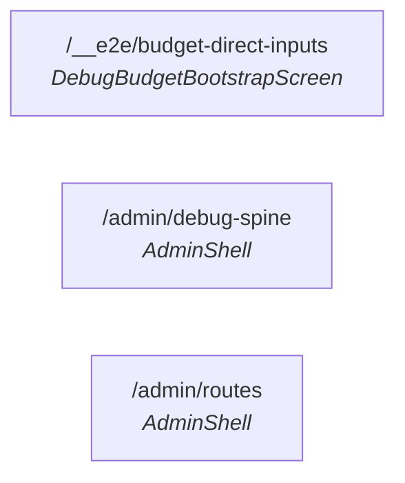

### Autres — 3 routes, 0 arêtes littérales

| Route | Écran | Classe |
|---|---|---|
| `/timeline` | TimelineScreen | 🟡 séquence-seulement |
| `/tools` | ? | 🟡 séquence-seulement |
| `/unemployment` | UnemploymentScreen | 🟡 séquence-seulement |

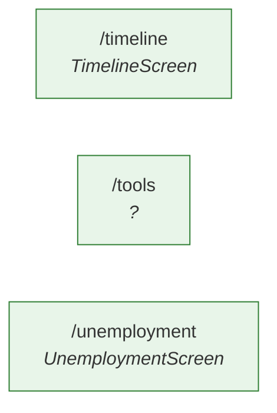

## Suite décisionnelle (proposition)

1. **Plan de taille (pruning)** : chaque route 🔴 et chaque façade ci-dessus
   reçoit un verdict garder-et-câbler / supprimer. Décision produit — à
   trancher avec Julien, pas unilatéralement.
2. Les routes 🟡 ne sont pas « mortes » (séquences, coach `route_to_screen`)
   mais leur découvrabilité utilisateur est nulle : le redesign (bead -e05)
   doit définir la navigation visible cible (bottom nav / hubs par flux).
3. Détail boutons/champs par écran : `routemap-parts/screens-A.md` … `screens-D.md`.

Contre-arguments et manques : la carte ne couvre pas les deeplinks externes ni
les notifications push (chemins d'entrée alternatifs) ; les 66 navigations
non-littérales mériteraient une résolution statique fine ; l'analyse est
statique (pas de télémétrie d'usage réel pour pondérer quoi supprimer).
