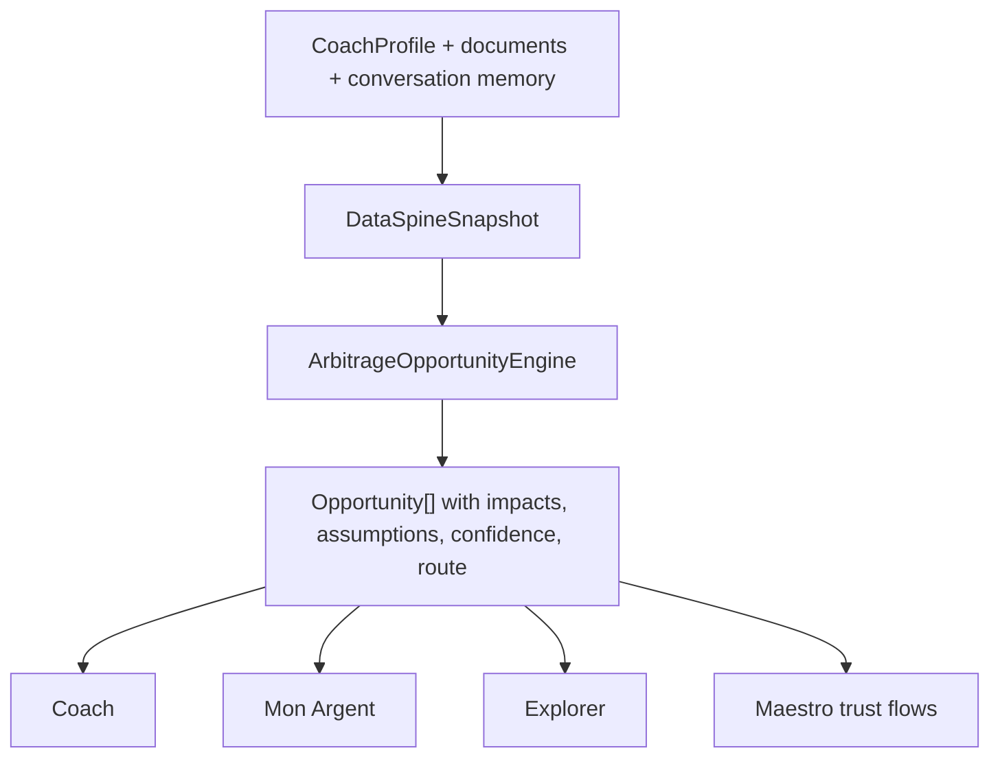

# Audit 16A - Mon Argent / Budget / Coach Data Spine

## Executive summary

Mint a déjà une partie importante de l'architecture cible: `BudgetSnapshot`,
`BudgetLivingEngine`, `MintStateEngine`, `DataSpineService`, l'injection coach,
des calculateurs d'arbitrage et des surfaces Mon Argent/Budget.

Le risque principal n'est donc pas l'absence de pieces, mais leur convergence:
plusieurs chemins calculent ou presentent des valeurs proches, certains chemins
coach ne recoivent pas encore le snapshot vivant, et les arbitrages existent
dans plusieurs services sans contrat produit unique.

Priorite immediate: stabiliser le contrat "une valeur affichee = une source =
une fraicheur = un niveau de confiance = un test". Sans cela, chaque nouvel ecran
ou conseil peut rendre Mint moins lisible.

## Source map

| Surface | Valeur visible | Source actuelle | Fraicheur / confiance | Risque |
|---|---:|---|---|---|
| Mon Argent - marge mensuelle | `BudgetSnapshot.present.monthlyFree` | `MintStateProvider` -> `MintStateEngine` -> `BudgetLivingEngine` | Recompute via `CoachProfileProvider`; bon si le provider est hydrate | Un fallback peut masquer un snapshot absent |
| Mon Argent - carte budget | Snapshot si disponible, sinon `BudgetPlan.available` | `BudgetSummaryCard` | Snapshot signe; fallback disponible clamped | Deux semantics visuelles possibles |
| Budget mensuel - hero | `PresentBudget.monthlyFree` | `BudgetContainerScreen` -> `BudgetProvider` -> `PresentBudgetBuilder` | Calcule depuis les inputs budget courants | Doit rester aligne avec `BudgetLivingEngine` |
| Budget mensuel - sliders | `BudgetPlan.available` | `BudgetService.computePlan` | Disponible clamped a 0 | Ne doit pas etre confondu avec deficit mensuel signe |
| Data Spine - trajectoire | Budget + patrimoine + prevoyance | `DataSpineService.fromProfile` | Snapshot derive du `CoachProfile` | Peut diverger si cree hors `MintState` partage |
| Coach - contexte enrichi | `BUDGET VIVANT` | `ContextInjectorService.buildContext(... mintState)` | Correct seulement si `mintState` est passe | Le chat principal appelle le service sans `mintState` aujourd'hui |
| Coach - openers/insights | Budget snapshot | `DataDrivenOpenerService`, `PrecomputedInsightsService` | Lit `MintUserState.budgetSnapshot` | Plus robuste que l'injection principale |
| Backend tool budget | `BudgetSnapshotResponse` + `inputs_hash` | `services/backend/app/api/v1/endpoints/coach_chat.py` | Cite et hash cote backend | Parite mobile/backend a contractualiser |
| Patrimoine / piliers | Patrimoine + 3 piliers | `DataSpineService._pillarsFromProfile` et agregateurs Mon Argent | Bon debut | Le statut connu/estime/manquant doit etre visible partout |
| Arbitrages | Opportunites et routes | `ArbitrageEngine`, `CrossPillarCalculator`, `CapEngine`, backend cross-pillar | Morcele mais riche | Risque de facade et de messages non coherents |

## Findings

### P0 - Le chat principal ne passe pas le `MintUserState`

`apps/mobile/lib/screens/coach/coach_chat_screen.dart` appelle:

```dart
ContextInjectorService.buildContext(
  profile: _profile,
  now: DateTime.now(),
)
```

Mais `ContextInjectorService` n'injecte `BUDGET VIVANT` que si
`mintState?.budgetSnapshot != null`. Resultat: le bloc qui donne a Claude la
marge libre, les charges fixes et l'ecart retraite peut etre absent du flux
chat principal, alors que le code existe.

Phase suivante recommandee: test widget/service qui prouve qu'un message coach
dispose du `BudgetSnapshot` quand `MintStateProvider.state` est present, puis
passage explicite de `context.read<MintStateProvider>().state`.

### P0 - Deux semantics budget doivent etre nommees et testees

Il faut garder les deux valeurs, mais ne jamais les melanger:

- `monthlyFree`: valeur signee, peut etre negative, utile pour lucider un
  deficit.
- `available`: valeur clamped a zero, utile pour des sliders/enveloppes qui ne
  peuvent pas depenser un montant negatif.

Un test doit proteger la regle: un utilisateur en deficit voit le deficit dans
les surfaces de diagnostic, mais les controles d'allocation ne proposent pas un
montant negatif.

### P0 - Drift documentaire autour de `RetirementBudgetService`

Les specs `docs/BUDGET_LIVING_ENGINE_IMPLEMENTATION_SPEC.md` et
`docs/BUDGET_VIVANT_ARCHITECTURE.md` demandent
`apps/mobile/lib/services/retirement_budget_service.dart`, mais le repo contient
aujourd'hui `apps/mobile/lib/services/budget_living_engine.dart` sans service
retirement dedie.

Deux options acceptables:

- créer le service manquant si la separation retraite/budget reste utile;
- mettre a jour la spec si le calcul retraite est volontairement dans
  `BudgetLivingEngine`.

Ce choix doit etre explicite, sinon les agents suivants recreeront une deuxieme
implementation.

### P1 - Arbitrage déjà riche, mais sans couche canonique

Les pieces existent:

- `apps/mobile/lib/services/financial_core/arbitrage_engine.dart`
- `apps/mobile/lib/services/financial_core/cross_pillar_calculator.dart`
- `apps/mobile/lib/services/arbitrage_summary_service.dart`
- `apps/mobile/lib/services/cap_engine.dart`
- `services/backend/app/services/arbitrage/cross_pillar_service.py`

Le besoin n'est pas d'ajouter un autre service de surface. Il faut definir un
contrat canonique d'opportunite d'arbitrage, puis brancher coach, Mon Argent et
Explorer dessus.

Point de vigilance architecture: selon `CLAUDE.md`, les calculs a forte portee
financiere doivent avoir une source canonique claire. Les services Dart peuvent
rester des clients/UI adapters ou des calculateurs locaux simples, mais les
arbitrages qui combinent fiscalite, prevoyance, sensibilites et eligibilite
multi-profils doivent etre explicitement classes L1 mobile ou L2 backend. Sans
cette decision, `16E` risque de construire la bonne idee au mauvais etage.

## Couche arbitrage cible

En Suisse, l'arbitrage est central parce que les decisions financieres se
croisent entre fiscalite, liquidite, prevoyance, logement, couple, horizon de
retraite et canton. L'utilisateur ne veut pas seulement "savoir combien"; il
veut comprendre quelle decision change quoi, maintenant et plus tard.

La couche cible doit se situer ici:



Le contrat minimum d'une opportunite:

```dart
class ArbitrageOpportunity {
  final String id;
  final String category;
  final String route;
  final bool eligible;
  final String? blockedReason;
  final List<String> requiredData;
  final ArbitrageImpact impact;
  final List<String> assumptions;
  final EnhancedConfidence confidence;
  final String sourcePacketHash;
}
```

`ArbitrageImpact` doit comparer au moins:

- cash maintenant;
- marge mensuelle;
- estimation fiscale;
- ecart retraite;
- liquidite bloquee;
- reversibilite;
- sensibilite aux hypotheses;
- points de vigilance compliance.

`EnhancedConfidence` doit etre multi-axes, pas un seul score opaque:

- completeness: les donnees necessaires sont-elles presentes ?
- accuracy: sont-elles saisies, scannees, estimees ou deduites ?
- freshness: de quand datent-elles ?
- understanding: l'utilisateur a-t-il confirme comprendre la consequence ?

`sourcePacketHash` doit etre defini avant implementation: algorithme, champs
inclus, version du contrat et parite mobile/backend. Sinon les citations ne
seront pas auditables.

Le ranking ne doit pas etre "plus gros gain fiscal". Il doit ponderer:

- objectif utilisateur;
- materialite en CHF;
- qualite des donnees;
- liquidite restante;
- horizon temporel;
- reversibilite;
- dependance cantonale/fiscale;
- risque de mauvaise interpretation.

## Exemples d'arbitrages suisses a rendre lisibles

| Arbitrage | Pourquoi il compte | Donnees necessaires | Sortie utile |
|---|---|---|---|
| 3a maintenant vs marge de sécurité | Une cotisation peut aider fiscalement mais fragiliser le cashflow | Revenu, impot estime, marge libre, dettes, plafond 3a | Montant prudent, impact fiscal estime, reste mensuel |
| Rachat LPP vs 3a vs investissement libre | Effets fiscaux, blocage, horizon et caisse LPP differents | Lacune LPP, taux marginal, horizon retrait, liquidite | Comparaison multi-annee avec hypotheses |
| Amortissement hypothese vs 3a/LPP | Fiscalite, interets, liquidite et solvabilite se croisent | Dette, taux, valeur logement, revenu, canton | Trajectoire dette + cash + retraite |
| Rente vs capital | Decision tres engageante et dependante du foyer | LPP, conjoint, depenses retraite, longevite, risque | Scenarios et break-even pedagogique |
| Retraits echelonnes 3a/LPP | Timing fiscal suisse important | Comptes 3a, age, canton, statut marital | Calendrier lisible des retraits |
| Couple sequencing | Les plafonds, revenus et objectifs se combinent | Deux profils, AVS/LPP/3a, revenus, enfants | Ordre d'action explique |

Les archetypes doivent etre inclus dans les tests d'eligibilite: salarie suisse,
independant sans LPP, couple, expat UE, expat US/FATCA, frontalier, proprietaire,
locataire, famille avec enfants, proche retraite. Exemple: un flux 3a/LPP ne
doit pas se comporter comme un flux standard quand le profil est `expat_us`.

## UX cible

Mon Argent doit rester la vue "ou j'en suis". Les arbitrages doivent apparaitre
comme une couche de decision progressive:

- un rail "Decisions a clarifier" avec 1 a 3 opportunites maximum;
- chaque opportunite montre "pourquoi je la vois", les donnees utilisees et les
  donnees manquantes;
- le coach peut ouvrir l'arbitrage, mais ne doit pas inventer une conclusion si
  les donnees sont faibles;
- Explorer peut contenir la vue complete avec scenarios, hypotheses modifiables
  et graphiques A -> B.
- le rail arbitrage doit etre derriere feature flag/kill switch jusqu'a preuve
  par tests et Maestro.
- toute nouvelle string visible passe par ARB parity et ComplianceGuard.

## Phases recommandees

1. `16B-coach-data-injection-contract`: cabler `MintUserState` dans le chat et
   tester que le bloc budget vivant est present.
2. `16C-budget-semantics-contract`: tests sur `monthlyFree` signe vs
   `available` clamped, plus labels UI.
3. `16D-retirement-budget-service-reconciliation`: créer ou supprimer
   explicitement le service attendu par la spec.
4. `16E-arbitrage-opportunity-contract`: definir `ArbitrageOpportunity`, mapper
   les services existants, sans créer de nouvelle facade non consommee.
5. `16F-maestro-trust-flows`: scenario deficit, scenario budget sain, scenario
   3a partiel, scenario rachat LPP bloque par donnees manquantes.
6. `16G-arbitrage-l1-l2-adr`: decider backend-canonical vs mobile-local par
   famille d'arbitrage avant toute extension UI.

## Claude CLI note

Commande verifiee le 2026-05-26:

```bash
claude -p "Reponds uniquement: OK" \
  --output-format json \
  --permission-mode acceptEdits \
  --max-turns 1
```

Resultat: success, modele `claude-opus-4-7`, reponse `OK`. Pour Codex, utiliser
ce mode non interactif par defaut; eviter le streaming long sans timeout.

## Self-review

Inputs utilises: docs budget/data-flow, grep codebase, chemins coach, services
budget, services arbitrage, specs existantes, contrainte GSD.

Score precision/effectiveness: 8.5/10. Ce n'est pas 10 parce que l'audit reste
read-only et n'a pas encore prouve par tests runtime tous les chemins coach.
Pour atteindre 10: executer 16B et 16C avec tests, puis un flow Maestro qui
montre les memes chiffres dans Mon Argent, Budget et Coach.

Claude Opus 4.7 review: 7.5/10 avant integration de ses remarques. Points
integres: boundary L1/L2 de l'arbitrage, confiance multi-axes, archetypes
d'eligibilite, definition du hash, feature flag/kill switch et ARB/compliance
pour les nouvelles strings.
