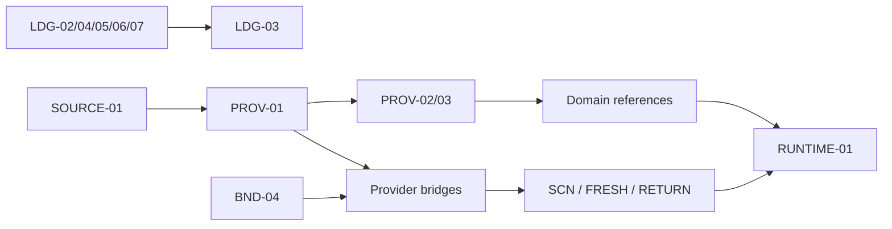

# v3.0 Product Reality — migration manifest

Date: 2026-07-12

Status: binding migration contract. It does not mark implementation complete.

## Authority and preservation

The active authority order is:

1. `AGENTS.md` and `CLAUDE.md` operating contracts.
2. `.planning/mint-product-usability-plan-2026-07-12.md` product program.
3. `.planning/goals/G1-blocking-gate-tickets.md` pre-G2 hard floor.
4. `.planning/REQUIREMENTS.md` and `.planning/ROADMAP.md` v3.0 execution map.
5. Historical v2.8 plans as evidence and unresolved-intent inputs only.

No v2.8 artifact is falsely marked complete. Its exact roadmap, requirements,
state, and GSD phase artifacts remain immutable at Git commit `5f8de38ec`. A
local excluded working archive keeps those files outside the active GSD scan;
other pre-v3.0 working folders are retained locally under
`.planning/phases-archive/pre-v3.0/`. This manifest is the checked-in index.

## v2.8 convergence registry

| legacy scope | current classification | v3 destination | closure rule |
|---|---|---|---|
| CTX-01..05 | historical implementation; current-SHA revalidation | Phase 38 Mint OS runway | Doctor, context gates, and relevant checks pass; no replay of completed work. |
| OBS-01..07 | historical implementation; privacy/runtime revalidation | Phase 38 and Phase 47 | Sentry/trace/redaction contracts pass on current SHA; live-token gaps remain explicit. |
| MAP-01..05 | historical implementation; route-count claims stale | Phase 38 and Phase 47 | Reconcile reports 149 literals, 148 registry keys, 141 comparable routes or an explained newer count. Phase 32 AMBER risks are closed or carried explicitly. |
| TOOL-01 | unresolved deterministic Swiss-constants access | Phase 38 | Prefer a repo-native, tested Mint OS wrapper over an ephemeral local MCP. Ship only with a real caller and SOT parity. |
| TOOL-02..04 | intent largely superseded by checked-in compliance/ARB/accent gates and compact docs | Phase 38 | Prove the checked-in equivalents; retire duplicate MCP proposals with evidence rather than create parallel tools. |
| FLAG-01..05 | unresolved and required before new paths | Phase 38 | Route kill switches, reactive refresh, backend convergence, admin control, and OFF->ON->OFF proof pass. |
| GUARD-01,03,04,05 | partially/mostly present | Phase 38 | Re-run checked-in hooks and CI contract tests; close only from live evidence. |
| GUARD-02,06,07,08 | unresolved or policy needs revalidation | Phase 38 | Add/repair non-vacuous mechanical gates; remeasure current debt rather than reuse old counts. |
| LOOP-01..05 | unresolved | Phase 38 skeleton, Phase 47 final | Start the daily loop before G3, then close full Sentry/report/retention behavior in G5. |
| FIX-01..04,09 | must be re-audited before G2 | Phase 38 | Each old P0 is proved green or fixed with a pre-fix RED regression test and kill switch. |
| FIX-05..07 | transversal cleanup/ratchets | Phase 38 and Phase 47 | Gate first, remeasure debt, prevent new violations, then close live product-path debt. |
| FIX-08 | deferred, not silently dropped | Phase 47 or later | Remove redirects only after 30-day zero-traffic evidence; otherwise retain instrumentation. |
| v2.9 Chat Vivant seed | preserved, not allowed to bypass G2-G6 | Phase 49 | Reconcile streaming/artifact UX with the six loops and one ledger; no duplicate calculators or state. |

The old requirements document states 48 requirements while separately naming
`MAP-02a` and `MAP-02b`; this manifest preserves the named IDs rather than
pretending the arithmetic is authoritative.

## Phase 37: 23-ticket dependency waves

All 23 ticket tests named in the G1 registry were absent at migration time.
Therefore every item requires a captured RED before implementation.



| wave | tickets | dependency/ownership boundary |
|---|---|---|
| 1 foundations | SOURCE-01; LDG-02,04,05,06,07; BND-04 | SOURCE can run independently. CoachProfile mutations are serialized. |
| 2 provenance | PROV-01 -> PROV-02 -> PROV-03 -> LDG-03 | Atomic write contract is frozen before restart and umbrella round-trip proof. |
| 3 provider islands | BND-02,03 -> BND-05 -> BND-06 -> BND-01 | Bridges require provenance/recompute contracts; `app.dart` work is serialized. |
| 4 domain fields | FRONT-01; RET-REF-01; SUCCESSION-01 | Swiss specs may run in parallel; Dart model implementation remains serialized. |
| 5 behavior | SCN-01 -> FRESH-01 and RETURN-01 | Scenario identity precedes case behavior; freshness and navigation are separable. |
| 6 closure | RUNTIME-01 | Full Doctor, Maestro, Patrol, audits, scorecard, and G2 decision. |

The smallest coherent first implementation slice is `G1-SOURCE-01` alone.

## Mint OS zero-drift gate

Every slice records tool versions, command output, SHA, and artifacts. Minimum
entry/exit contract:

```bash
git status --short --branch
python3 tools/checks/mint_os_doctor.py --repo-only
python3 tools/checks/patrol_tooling_guard.py
python3 tools/checks/mermaid_render_guard.py
./tools/mint-routes reconcile
lefthook run pre-commit
```

Runtime work additionally runs the full Doctor, the checked-in Maestro
environment/watchdog, and `$HOME/.pub-cache/bin/patrol`. External review uses
only `tools/checks/claude_external_audit.sh`. Beads is initialized only in a
dedicated PR. Raw Claude, `command -v patrol` as an availability verdict,
unversioned MCPs, and ad-hoc replacement scripts do not count as proof.

Any Mint OS contract drift is a STOP condition and a separate repair slice.

## Evidence and scoring

Each accepted phase stores RED and GREEN logs, exact commands, commit SHA,
runtime artifacts when applicable, audit outputs, unresolved findings, and a
scorecard under `.planning/runtime-evidence/<phase-or-slice>/`.

Fixed rubric: data 2.0; Swiss correctness 1.5; UX lucidity 1.5; runtime 1.5;
automated tests 1.0; external audit 1.0; integration/privacy 1.0; diff discipline
0.5. Missing scorecard is FAIL. Phase floor is 9.0/10; final program floor is
9.5/10. No unresolved P0/P1 may be accepted.

## No-go boundaries

- G2 allowed: **NO** until 31/31 tickets are GREEN and Phase 37 is accepted.
- G3 allowed: **NO** until G2 is accepted.
- A product path without a default-off kill switch is not accepted.
- A P0 UI slice without same-slice Maestro and Patrol evidence is not accepted.
- A financial slice without `code` and `product-domain` wrapper audits is not
  accepted; architecture audit is also required for core boundaries and final
  closures.
- Historical summaries and evidence from a different SHA are pointers, not
  automatic PASSes.
