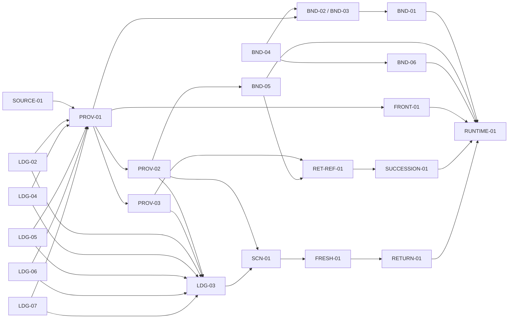

# Phase 37: Ledger Runtime Readiness — Research

**Researched:** 2026-07-12
**Role:** `mint-data-ledger-architect`
**Question:** Que faut-il savoir pour planifier fidèlement Phase 37 ?
**Scope:** les 23 tickets du registre G1, sans G2/G3 ni code produit.

## Executive conclusion

Phase 37 est planifiable, mais elle n'est pas une collection de 23 tests
indépendants. Elle est une migration de contrat en six vagues autour d'une
seule frontière d'écriture :

```text
source confirmée
  -> CoachProfileProvider
  -> wizard_answers_v2
  -> CoachProfile.fromWizardAnswers
  -> MintStateProvider.recompute
  -> consommateur
```

Le checkout confirme les quatre faits structurants suivants :

1. Les 23 fichiers de test/runtime nommés par le registre sont absents. Une
   commande qui échoue uniquement parce que le fichier n'existe pas n'est pas
   une preuve RED sémantique : le test doit d'abord être créé, puis échouer sur
   le prédicat métier avant toute modification produit.
2. Le modèle mobile n'a aujourd'hui que `dataSources` et `dataTimestamps`.
   `dataSourceDates`, `profile_owner_id` et `scenario_id` n'existent pas dans le
   contrat durable. `mergeAnswers()` reconstruit et persiste la valeur, mais ne
   stamp pas atomiquement la provenance par champ.
3. Le backend `ProfileModel` vivant est
   `services/backend/app/models/profile_model.py`, et le moteur de confiance
   vivant est `services/backend/app/services/confidence/enhanced_confidence_service.py`.
   Les chemins `models/profile.py` et `confidence/confidence_scorer.py` cités
   dans `37-CONTEXT.md` n'existent pas. Le plan doit corriger ses cibles avant
   exécution.
4. `tools/checks/tests/test_g1_p0_ledger_dead_keys.py` exige actuellement que
   chaque ticket reste `ticket_only`. Cela contredit D-04 de `37-CONTEXT.md`,
   qui impose une transition ligne par ligne après preuve GREEN. La première
   vague doit donc faire évoluer ce gate, TDD-first, vers des états progressifs
   vérifiés par artefact ; sinon le registre ne peut pas devenir honnêtement
   vert sans batch final.

`G2 allowed: NO` reste la seule décision valide tant que ces 23 prédicats, les
preuves runtime, les audits et le score de phase ne sont pas tous verts.

## Mint OS zero-drift contract

Le plan ne doit pas inventer un second système de preuve. Chaque slice utilise
les outils versionnés du repo et archive les sorties sous
`.planning/runtime-evidence/phase-37/<wave-or-ticket>/`.

### Entrée de chaque slice

```bash
git status --short --branch
python3 tools/checks/mint_os_doctor.py --repo-only
```

Le doctor repo est vert à la recherche. Pour une slice runtime, lancer d'abord
le doctor complet :

```bash
python3 tools/checks/mint_os_doctor.py
python3 tools/checks/patrol_tooling_guard.py
```

### Gates versionnés applicables

```bash
python3 tools/checks/mermaid_render_guard.py
./tools/mint-routes reconcile                 # seulement si routes/navigation touchées
python3 tools/checks/arb_parity.py             # seulement si ARB touchés
lefthook run pre-commit --file <touched-file>  # puis lefthook complet en fermeture
```

Pour les preuves iPhone, utiliser l'environnement/watchdog Maestro versionné
et le chemin Patrol canonique `$HOME/.pub-cache/bin/patrol`. Ne pas conclure
« Patrol absent » à partir de `command -v patrol`. Ne pas initialiser Beads
incidemment. Ne pas lancer la commande Claude brute directement : tous les audits passent
par `tools/checks/claude_external_audit.sh`.

La baseline appartient à chaque dispatch : toute tâche mint-mobile qui touche
le modèle/provider canonique relit les SOTs, exécute le grep live-key imposé,
puis `flutter analyze && flutter test` complet avant RED/code. Toute tâche
mint-backend exécute `ruff check . && pytest -q` complet avant RED/code. Une
baseline d'un autre agent ou d'une autre tâche n'est pas transférable.

Chaque log RED/GREEN doit contenir la commande exacte, l'heure, le SHA, le code
de sortie et la sortie non tronquée. Les screenshots, fixtures et logs runtime
utilisent des données synthétiques et ne contiennent ni nom, email, contenu de
document ni valeur financière réelle.

## Live-code symbol and file validation

| contrat | symbole vivant validé | réalité à planifier |
|---|---|---|
| source mobile | `ProfileDataSource` dans `apps/mobile/lib/models/coach_profile.dart:38` | exactement `estimated`, `userInput`, `crossValidated`, `certificate`, `openBanking` |
| source backend | `DataSource` et `DATA_SOURCE_ACCURACY` dans `services/backend/app/services/document_parser/document_models.py:39-66` | huit membres ; trois backend-only |
| crosswalk analogue | `CoachProfileConfidenceAdapter._confidenceDataSource()` dans `apps/mobile/lib/services/confidence/coach_profile_confidence_adapter.dart:172` | mapping exact déjà dupliqué côté Flutter ; à verrouiller contre le nouveau module backend |
| crosswalk demandé | `services/backend/app/services/confidence/source_crosswalk.py` | absent |
| test crosswalk | `services/backend/tests/test_source_crosswalk.py` | absent |
| modèle durable mobile | `CoachProfile.dataSources`, `dataTimestamps`, `fromWizardAnswers()`, `copyWith()` | pas de `dataSourceDates`, owner ou scenario ID |
| écriture mobile | `CoachProfileProvider.mergeAnswers()` à partir de la ligne 576 | read-merge-save, mais aucune enveloppe atomique source/date/owner |
| coach write | `applySaveFact()` et `_mapFactKeyToAnswers()` à partir des lignes 621/644 | 36 clés mappées ; signature ne reçoit que confidence, pas source/sourceDate/owner |
| persistance | `ReportPersistenceService.saveAnswers()` appelé par le provider | `wizard_answers_v2`; les timestamps utilisent `_coach_data_timestamps` |
| backend profil | `services/backend/app/models/profile_model.py:31` | seulement `data`, `created_at`, `updated_at`; pas de provenance par champ |
| backend save_fact | `_SAVE_FACT_ALLOWED_KEYS` et branche `save_fact` dans `coach_chat.py:924/1344` | écrit uniquement `ProfileModel.data`, puis `updated_at` global |
| confiance backend | `enhanced_confidence_service.py` | consomme les vrais `DataSource`; ne peut pas consommer les noms mobiles sans crosswalk |
| recompute | `MintStateProvider.recompute()` et proxy dans `app.dart:1570` | edge unique vivant ; dédup par identité `_lastProfile` |
| legacy | `ProfileProvider` enregistré dans `app.dart:1521` | cinq consommateurs de production confirmés par grep |
| budget | `BudgetProvider` | cache/overrides séparés ; pas de référence au ledger provider |
| ménage | `HouseholdProvider.loadHousehold()` | membres/maps backend ; aucun bridge partenaire vers `CoachProfile` |
| documents | `DocumentProvider` et `TimelineProvider` | références séparées ; timeline relit `_uploaded_documents` et ne résout pas une référence financière par ledger |
| plan financier | `FinancialPlanProvider.attachProfileProvider()` | méthode vivante, mais `app.dart` enregistre encore un provider simple sans attach |
| fraîcheur | `FreshnessDecayService.weight/needsRefresh` | prend un `BiographyFact`; aucun `weightForField` |
| biographie | `BiographyRepository.getLatestFactForField/recordFact` | pattern existant à réutiliser, sourceDate inclus |
| retour | route `/data-block/:type` dans `app.dart:1372` | ne transmet que `inputKey`; aucun `returnUri` |
| scénario | `ScreenReturn` | `runId/stepId/eventId`, mais pas de `scenario_id`; `updatedFields` peut encore transporter des valeurs vers le contexte coach |

Les preuves de grep imposées par le contrat provider donnent toujours cinq
lecteurs `ProfileProvider`, aucune occurrence durable de `profile_owner_id` ou
`scenario_id`, et aucun `dataSourceDates` dans le code produit.

## Existing patterns to reuse

1. **Crosswalk exhaustif par switch.** Le switch Flutter
   `_confidenceDataSource()` est l'analogue exact de SOURCE-01. Le backend doit
   exposer une table immutable `str -> DataSource` et une fonction fail-closed,
   pas un second enum ni des poids recopiés.
2. **Read-then-merge-then-save.** `mergeAnswers()` relit déjà le disque avant
   fusion pour éviter qu'un writer écrase une extraction concurrente. La
   provenance doit être ajoutée dans cette même transaction logique, jamais
   sauvegardée par un second appel.
3. **Timestamp stable.** `_stampTimestamps()` et `_persistTimestamps()` donnent
   le format de sérialisation existant. Ils doivent être généralisés à une
   enveloppe par champ plutôt que contournés.
4. **Fact immuable de biographie.** `BiographyRepository.recordFact()` et
   `getLatestFactForField()` sont les primitives de reconfirmation. Le ledger
   durable reste la source des valeurs ; Biography fournit l'historique et le
   fallback de fraîcheur.
5. **Recompute proxy.** `ChangeNotifierProxyProvider<CoachProfileProvider,
   MintStateProvider>` est la seule edge de recompute à préserver. Les bridges
   écrivent une fois dans le provider et ne notifient pas directement
   `MintStateProvider`.
6. **Référence, pas payload.** `DocumentProvider`/`TimelineProvider` restent des
   stores de références. Les routes portent un ID ; seule une confirmation
   écrit les faits extraits dans le ledger.
7. **Fail-closed backend.** `_coerce_fact_value()` et l'allowlist de
   `coach_chat.py` montrent le pattern de rejet explicite. SOURCE-01 doit lever
   une erreur sur tout token inconnu au lieu de retomber sur `.25`.

## Exact dependency graph for the 23 tickets



### Why this order is exact enough to execute

| wave | tickets | prerequisite frozen before work | reason |
|---|---|---|---|
| 1A | SOURCE-01 | backend `DataSource` enum | indépendant du gros modèle ; devient la traduction utilisée par PROV-01 |
| 1B, serialized | LDG-02, LDG-04, LDG-05, LDG-06, LDG-07 | one `CoachProfile.fromWizardAnswers` baseline | tous mutent la même reconstruction ; ne pas paralléliser les edits |
| 1C | BND-04 | current proxy semantics | fixe « exactement une recomputation » avant d'ajouter des writers |
| 2, serialized | PROV-01 -> PROV-02 -> PROV-03 -> LDG-03 | canonical paths/types from wave 1 | atomic contract first, restart second, tax specialization third, umbrella behavior last |
| 3 | BND-02 + BND-03 -> BND-05 -> BND-06 -> BND-01 | provenance + recompute | partner/budget need owner/provenance; document needs restart; plan needs stable profile hash; legacy removal last around `app.dart` |
| 4, model edits serialized | FRONT-01 -> RET-REF-01 -> SUCCESSION-01 | provenance and document-reference envelope | fields Swiss/source-sensitive share the same model and cannot infer unknown legal meaning |
| 5 | SCN-01 -> FRESH-01 -> RETURN-01 | complete behavioral ledger | scenario scope precedes stale asks; a reconfirm ask must know how to return safely |
| 6 | RUNTIME-01 | all prior GREEN | persistence/relaunch proves the integrated spine, pas un sous-ensemble |

Dependencies transversales supplémentaires :

- Chaque ticket dépend du gate progressif du registre, car le gate actuel
  refuse tout statut autre que `ticket_only`.
- Toute mutation `CoachProfile` doit être sérialisée même si ses specs Swiss
  peuvent être relues en parallèle.
- BND-02 requiert un `profile_owner_id` pseudonyme défini par PROV-01 ; un rôle
  `partner` dans `HouseholdProvider` n'est pas un consentement d'import.
- BND-05 et RET-REF-01 partagent le type de référence opaque et ne doivent pas
  inventer deux formats documentaires.
- LDG-03 est un test parapluie, pas une première implémentation : il doit être
  écrit après stabilisation des champs et provenance qu'il parcourt.

## TDD red-to-green command architecture

Pour chaque ticket : créer le test seul, exécuter la commande exacte et
archiver un échec sur le prédicat ; seulement ensuite modifier le produit et
réexécuter la même commande. Les commandes canoniques sont :

```bash
# SOURCE
cd services/backend && python3 -m pytest tests/test_source_crosswalk.py -q

# CoachProfile model contracts
cd apps/mobile && flutter test test/models/coach_profile_semantic_roundtrip_test.dart --reporter expanded
cd apps/mobile && flutter test test/models/default_is_not_known_test.dart --reporter expanded
cd apps/mobile && flutter test test/models/direct_field_semantics_test.dart --reporter expanded
cd apps/mobile && flutter test test/models/avs_gap_write_order_test.dart --reporter expanded
cd apps/mobile && flutter test test/models/mortgage_reconciliation_test.dart --reporter expanded
cd apps/mobile && flutter test test/models/frontier_canonical_fields_test.dart --reporter expanded
cd apps/mobile && flutter test test/models/specialist_reference_contract_test.dart --reporter expanded
cd apps/mobile && flutter test test/models/estate_reference_contract_test.dart --reporter expanded

# Provider/provenance contracts
cd apps/mobile && flutter test test/providers/provenance_on_write_test.dart --reporter expanded
cd apps/mobile && flutter test test/providers/provenance_restart_test.dart --reporter expanded
cd apps/mobile && flutter test test/providers/tax_provenance_profile_test.dart --reporter expanded
cd apps/mobile && flutter test test/providers/g1_p0_ledger_roundtrip_test.dart --reporter expanded
cd apps/mobile && flutter test test/providers/scenario_fact_isolation_test.dart --reporter expanded
cd apps/mobile && flutter test test/providers/legacy_provider_migration_test.dart --reporter expanded
cd apps/mobile && flutter test test/providers/household_bridge_recompute_test.dart --reporter expanded
cd apps/mobile && flutter test test/providers/provider_bridge_recompute_test.dart --reporter expanded
cd apps/mobile && flutter test test/providers/mint_state_proxy_recompute_test.dart --reporter expanded
cd apps/mobile && flutter test test/providers/document_reference_bridge_test.dart --reporter expanded
cd apps/mobile && flutter test test/providers/financial_plan_staleness_test.dart --reporter expanded

# Freshness/navigation
cd apps/mobile && flutter test test/services/biography/stale_reconfirmation_test.dart --reporter expanded
cd apps/mobile && flutter test test/navigation/data_block_return_uri_test.dart --reporter expanded

# Runtime integrated closure, after full Doctor and tooling guards.
# Maestro and both Patrol stages are pinned to the same $UDID.
bash tools/simulator/maestro_with_watchdog.sh test --device "$UDID" apps/mobile/.maestro/r4_persistence.yaml
bash tools/simulator/patrol_persistence_process_death.sh --device "$UDID" --bundle-id ch.mint.app --sha "$(git rev-parse HEAD)" --artifacts .planning/runtime-evidence/phase-37/runtime-01/patrol
```

Après le GREEN ciblé, exécuter au minimum les suites affectées :

```bash
python3 -m pytest tools/checks/tests/test_ledger_parity.py tools/checks/tests/test_g1_p0_ledger_dead_keys.py -q
python3 -m pytest tools/checks/tests/test_data_quest_goal_aware_ranking_contract.py -q
python3 -m pytest tools/checks/tests/test_screen_contracts_route_contract.py -q
cd services/backend && python3 -m pytest tests/test_enhanced_confidence.py tests/test_document_parser.py -q
cd apps/mobile && flutter test test/providers/ test/models/ --reporter expanded
```

Le plan détaillé doit ajouter les suites plus étroites par domaine, puis les
suites complètes en fermeture. Il ne doit pas transformer les quatre commandes
Mint OS absentes listées dans `mint-operating-gates` en faux PASS.

## Validation Architecture

La validation est en couches ; aucune couche supérieure ne remplace une couche
inférieure.

| niveau | preuve | gate |
|---|---|---|
| V0 contract | registre parseable, 23 IDs uniques, statut progressif lié à une preuve SHA | `test_g1_p0_ledger_dead_keys.py` évolué TDD-first |
| V1 source/static | enum/crosswalk/allowlist/ledger exacts, backend-only sans antécédent mobile | SOURCE-01 + `test_ledger_parity.py` |
| V2 model | types, unknown/default, aliases de migration, ordre d'écriture | LDG-02/04/05/06/07, FRONT/REF/SUCCESSION |
| V3 persistence | valeur + source + sourceDate + updatedAt + owner survivent au restart | PROV-01/02/03 et LDG-03 |
| V4 reactive boundaries | une écriture canonicale déclenche un recompute, sans loop ni source concurrente | BND-02..06 puis BND-01 |
| V5 behavioral | scenario isolation, stale reconfirm, return-to-origin | SCN/FRESH/RETURN |
| V6 runtime | saisie réelle, process death, lecture downstream, recompute | Maestro même UDID + deux processus Patrol `--no-uninstall`, avec `simctl terminate` archivé entre write/read |
| V7 adversarial | code, product-domain, architecture, privacy | wrapper Claude uniquement ; zéro P0/P1 |
| V8 phase | 23/23 GREEN, suites affectées/full, score >=9.0, SHA propre | scorecard + décision explicite `G2 allowed: YES` |

La preuve de fermeture doit aussi rendre `WIRING_GRAPH.mmd` et les journeys via
`mermaid_render_guard.py`. Un test widget vert sans runtime ne clôt pas
RUNTIME-01 ; un runtime vert sans assertions sémantiques ne clôt pas LDG-03.

## Smallest first slice: G1-SOURCE-01

SOURCE-01 est la seule première slice cohérente et sans UI.

### Test-first shape

`services/backend/tests/test_source_crosswalk.py` doit :

1. extraire les cinq membres réels de `ProfileDataSource` depuis le fichier
   Dart, pour que l'ajout d'un sixième membre fasse échouer le contrat ;
2. exiger exactement :
   - `estimated -> DataSource.system_estimate`,
   - `userInput -> DataSource.user_entry`,
   - `crossValidated -> DataSource.user_entry_cross_validated`,
   - `certificate -> DataSource.document_scan_verified`,
   - `openBanking -> DataSource.open_banking` ;
3. vérifier que chaque destination appartient à `DATA_SOURCE_ACCURACY` ;
4. vérifier que `document_scan`, `institutional_api` et `user_estimate` sont
   backend-only et n'ont aucune pré-image mobile ;
5. rejeter un token inconnu et un token backend présenté comme token mobile ;
6. verrouiller la correspondance avec le switch analogue
   `CoachProfileConfidenceAdapter._confidenceDataSource()` pour empêcher deux
   vérités divergentes.

Le premier RED doit provenir de l'absence du module/API attendue après création
du test, pas de l'absence du fichier de test.

### Minimal production shape

`services/backend/app/services/confidence/source_crosswalk.py` doit contenir :

- une table immutable de cinq entrées vers le `DataSource` existant ;
- un ensemble immutable des trois sources backend-only ;
- une fonction pure `mobile source token -> DataSource` qui lève une erreur
  explicite sur tout inconnu ;
- aucun poids recopié, aucun enum alternatif, aucune valeur financière, aucun
  logging.

Le module est une fondation immédiatement consommée par PROV-01. Il ne doit pas
être présenté comme une feature ou une phase complète, et PROV-01 doit devenir
son vrai caller avant la fermeture de Phase 37. Aucune route, UI, migration DB,
Maestro ou Patrol n'est requise pour SOURCE-01.

### SOURCE-01 verification set

```bash
python3 tools/checks/mint_os_doctor.py --repo-only
cd services/backend && python3 -m pytest tests/test_source_crosswalk.py -q
cd services/backend && python3 -m pytest tests/test_enhanced_confidence.py tests/test_document_parser.py -q
cd services/backend && ruff check app/services/confidence/source_crosswalk.py tests/test_source_crosswalk.py
python3 -m pytest tools/checks/tests/test_ledger_parity.py tools/checks/tests/test_g1_p0_ledger_dead_keys.py -q
lefthook run pre-commit --file services/backend/app/services/confidence/source_crosswalk.py
lefthook run pre-commit --file services/backend/tests/test_source_crosswalk.py
```

Avant de changer `G1-SOURCE-01` de `ticket_only` à GREEN, réparer le gate de
statut progressif avec un test RED/GREEN propre ; ne pas neutraliser
l'assertion et ne pas batch-marquer les 23 lignes.

## Threat and privacy model

| menace | impact | mitigation de plan |
|---|---|---|
| crash entre valeur et provenance | fait utilisable mais source/fraîcheur inconnue | une seule transaction logique du provider ; test restart |
| token source inconnu silencieusement ramené à `.25` | confiance faussement plausible | crosswalk fail-closed, aucun fallback |
| défaut de modèle marqué connu | calcul personnalisé sur une invention | marqueur explicite de connaissance ; null/unknown distinct de display estimate |
| partenaire réassigné à `self` | violation nLPD et calcul ménage erroné | `profile_owner_id` pseudonyme + consentement explicite ; household membership séparé |
| levier scénario écrase certificat | corruption de fait partagé | `scenario_id` obligatoire pour lever/output ; fact scenario_id null |
| document brut dans route/ledger | fuite au restart, deep-link ou logs | ID opaque en navigation ; raw store séparé ; seuls faits confirmés au ledger |
| `returnUri` externe ou forgé | open redirect / sortie de scope | routes internes enregistrées uniquement, canonicalisation, rejet query sensible |
| `ScreenReturn.updatedFields` injecté dans contexte coach | valeur financière réexposée au LLM/log | ne pas utiliser pour faits/scénarios ; IDs et résumé de statut seulement |
| logs/evidence avec données réelles | fuite locale/CI | fixtures synthétiques, redaction, artefacts inspectés avant commit |
| backend mirror non authentifié | corrélation inter-utilisateur | profils locaux restent locaux ; sync seulement propriétaire authentifié |
| timestamps/source refs sur-loggés | inférence de document/situation | logs = clé, classe, statut, erreur ; jamais valeur, contenu, owner stable |
| double notification bridge | recompute dupliqué ou boucle | bridge écrit une fois dans CoachProfileProvider ; test BND-04 exact-once |

Le changement backend de provenance nécessitera une migration/schema review
distincte : ajouter des colonnes ou un blob de metadata sans stratégie de
compatibilité casserait les profils existants. La recherche ne choisit pas ce
format ; le plan PROV-01 doit le faire après audit architecture/privacy.

## Risks and planning traps

1. **Docs aspirational vs code.** `DATA_LEDGER.md` décrit `dataSourceDates` et
   un `ProfileModel` étendu comme « ADD » ; ce n'est pas implémenté. Ne pas
   transformer ces paragraphes en preuve.
2. **Defaults currently fabricate known-looking values.** Canton `ZH`, revenu
   net `5000`, loyer `1500`, LAMal estimée, taux conversion LPP, AVS gaps et
   plusieurs objectifs ont des fallbacks. LDG-04 doit distinguer objet de
   calcul/display et connaissance utilisateur sans casser tous les écrans en
   une seule PR.
3. **Enum loss.** `_parseEmploymentStatus()` retombe sur `salarie` et ne traite
   pas explicitement `unemployed`; `_parseGoalA()` retombe sur retraite et ne
   représente pas `emergency/optimize_taxes/other` fidèlement. LDG-02 est donc
   une vraie migration sémantique, pas un test de sérialisation superficiel.
4. **AVS order dependence.** `arrived_late` sans année fabrique 5 ans,
   `lived_abroad` sans durée en fabrique 3, `unknown` en fabrique 2. LDG-06 doit
   séparer statut et quantité certifiée.
5. **Mortgage duplicate.** `PatrimoineProfile.mortgageBalance` lit
   `q_mortgage_balance`, tandis que `DetteProfile.hypotheque` préfère
   `_coach_dettes_hypotheque`; il n'existe pas encore de winner daté.
6. **Provenance inference is not provenance.** `_resolveDataSources()` infère
   `certificate/estimated` depuis la présence de champs. PROV-01 doit préserver
   les migrations mais ne pas prendre cette heuristique pour une écriture
   atomique.
7. **Backend/mobile source weights differ by design.** `userInput=.60` mobile
   devient `user_entry=.50` backend. Un test qui compare les poids plutôt que
   les identités serait faux.
8. **BND-04 may hide duplicate recomputes.** L'identité de `CoachProfile`
   inclut une version `updatedAt`; une mise à jour de provenance seule peut
   créer un nouvel objet et doit déclencher exactement le comportement choisi,
   pas être ignorée accidentellement.
9. **Facade without wiring.** Ne pas créer un deuxième ledger, un nouveau
   provider de scénario sans consommateur, ou un crosswalk jamais consommé par
   PROV-01. Les tests de contrat ne suffisent pas à câbler le produit.
10. **Runtime command drift.** Le registre donne la commande composite brute,
    mais le déroulé de preuve doit aussi passer par le doctor complet, le
    watchdog/env Maestro et le Patrol guard versionnés. Les deux exigences sont
    cumulatives.
11. **Un seul test Patrol ne prouve pas un process death.** RUNTIME-01 exige un
    orchestrateur Mint OS versionné et testé : processus write, `simctl
    terminate` exit 0, puis nouveau processus read, tous sur le même UDID,
    bundle et SHA avec `--no-uninstall`. Les métadonnées et la preuve de
    terminaison sont archivées.
12. **Audit manifest permissif.** Chaque vague doit déclarer exactement
    `required_modes: [code, product-domain]` et un run accepté unique par mode;
    le final ajoute architecture. Commande wrapper, modèle, base/head, exit 0,
    sortie non vide, findings et compteurs sont obligatoires et fail-closed.

## No-G2 fence and phase exit

La barrière est mécanique :

```text
G2 allowed = YES
iff 23/23 ticket rows are evidence-backed GREEN on the accepted SHA
and targeted + affected + full suites are GREEN
and Maestro + Patrol persistence artifacts are valid
and code + product-domain + architecture audits have zero open P0/P1
and the fixed scorecard is >= 9.0/10.
```

Jusque-là :

- pas de `DataQuestRequest`, `CaseRegistry`, nouvelle boucle G3, nouvelle route
  produit ou dossier/PDF ;
- pas de kill switch utilisé pour dissimuler un ticket non réparé ;
- pas de PASS emprunté à un autre SHA ;
- pas de statut `green` sans commande et artefact reproductibles ;
- pas de déclaration « Phase 37 complète » tant que le gate de registre reste
  incompatible avec les transitions ligne par ligne.

## Planning recommendation

Produire six plans exécutables, avec un premier plan SOURCE-01 très court,
puis des plans sérialisés par ownership de fichier. Chaque plan doit nommer :
prédicat RED, fichiers autorisés, dépendances déjà GREEN, commande GREEN,
suites affectées, preuve Mint OS, menace privacy, audit requis et mise à jour de
statut. Le plan final RUNTIME-01 ne commence qu'après les 22 autres tickets.

**Research readiness:** READY FOR PLANNING.
**Current release decision:** `G2 allowed: NO`.
