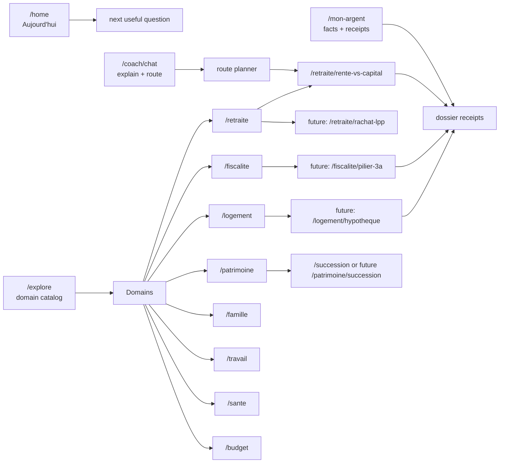
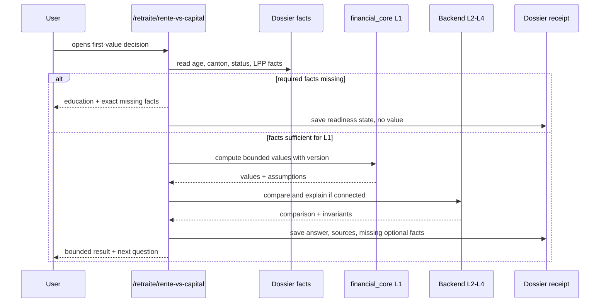

# Mint 2.0 VZ Route Architecture

Status: planning/product architecture only. No product code is changed by this
artifact.

Purpose: make Mint routes behave like a Swiss financial lucidity system, not a
screen catalog. The benchmark is VermögensZentrum (VZ): integrated retirement,
tax, pension, real estate, investments, succession, insurance, and banking
questions presented as one patrimonial system.

## Decision

Mint routes must be decision rooms.

A route is valid only if it has:

- a user question in Swiss financial language;
- required inputs and known missing inputs;
- a calculation boundary: L1 single-number, L2 comparison, L3 explanation, or
  L4 invariant;
- a dossier receipt outside chat;
- a compliance-safe state when data is insufficient;
- a runtime proof or a planned gate before the route is promoted.

This keeps the current route policy intact:

- canonical path grammar remains `/{domaine}/{sujet-ou-decision}`;
- legacy aliases stay compatibility-only;
- no new `/simulator/`, `/arbitrage/`, `/life-event/`, `/segments/`, or
  technical namespace;
- the current live first-value route remains `/retraite/rente-vs-capital`.

## VZ Benchmark

VZ's French public navigation groups the patrimonial problem into domains:
retirement, investments and wealth management, succession, real estate and
mortgages, taxes, pension provision, insurance, and banking. Their retirement
material frames the core questions around AVS, pension fund, rent-or-capital,
tax at retirement, mortgage reduction, early retirement, wealth decumulation,
and family protection. Their rent-or-capital article stresses that the decision
is irreversible, that many people choose a mixed solution, and that conversion
rates, survivor benefits, taxation, life expectancy, and investment behavior
all have to be compared before deciding.

Sources used:

- VZ home/domain navigation: https://www.vermoegenszentrum.ch/fr
- VZ retirement: https://www.vermoegenszentrum.ch/fr/retraite
- VZ rent-or-capital: https://www.vermoegenszentrum.ch/fr/competences/rente-ou-capital-ces-elements-sont-determinants
- VZ investments: https://www.vermoegenszentrum.ch/fr/investissements-et-gestion-de-fortune
- VZ real estate and mortgages: https://www.vermoegenszentrum.ch/fr/hypotheques-et-immobilier
- VZ taxes: https://www.vermoegenszentrum.ch/fr/impots
- VZ pension provision: https://www.vermoegenszentrum.ch/fr/prevoyance
- Internal Swiss constants registry `30.7.0`: OPP3, LPP, LAVS,
  FINMA/ASB mortgage ratios, and capital-withdrawal tax constants.

VZ logic translated to Mint:

| VZ domain | Mint domain | Route role | Mint output |
|---|---|---|---|
| Retraite | `/retraite/*` | retirement decisions and 2nd-pillar choices | readiness, scenarios, dossier receipt |
| Prévoyance | `/retraite/*`, `/sante/*` | LPP, 3a, vested benefits, death/disability | coverage gaps and missing documents |
| Impôts | `/fiscalite/*` | tax impact and withdrawal timing | range with assumptions, no tax promise |
| Immobilier | `/logement/*` | mortgage, affordability, amortization, EPL | affordability and risk bands |
| Investissements | `/patrimoine/*` | fee, risk, liquidity, decumulation | strategy checks and fee visibility |
| Succession | `/patrimoine/*`, `/famille/*` | spouse, heirs, concubinage, donation | protection map and next documents |
| Assurances | `/sante/*` | disability, death, household protection | coverage-readiness map |
| Banking | `/mon-argent`, `/budget` | cash, debt, payment, liquidity base | truth spine before decisions |

## Navigation Doctrine

Mint should not ask the user to choose from 147 routes. The shell must express
four roles:

| Surface | Job | What it must not become |
|---|---|---|
| `Aujourd'hui` `/home` | one current priority, next useful question, and alerts from the dossier | a dashboard of unrelated cards |
| `Mon argent` `/mon-argent` | canonical facts, balances, budget, documents, and receipts | a marketing home page |
| `Coach` `/coach/chat` | explain, ask, route, and summarize dossier state | the source of truth or a hidden calculator |
| `Explorer` `/explore` | stable catalog of domains and decision rooms | a list of legacy routes |

The route hierarchy should read like this:



## Decision Route Contract

Every decision route must have this contract before product code starts:

| Contract item | Required content |
|---|---|
| User question | The concrete Swiss question, e.g. `Rente ou capital pour mon 2e pilier ?` |
| Domain owner | One of the canonical owners in `route_metadata.dart` |
| Persona scope | age/life phase, employment status, canton, household assumptions |
| Required facts | facts without which a personalized value is blocked |
| Optional facts | facts that improve confidence but do not block education |
| Missing-data behavior | explanation plus the exact missing fields, no guessed value |
| L1 source | mobile `financial_core` calculator if a single value is produced |
| L2-L4 source | backend comparison/explanation/invariant if the route compares choices |
| Receipt | stored outside chat with assumptions, sources, confidence, version |
| Coach role | may route, explain, and summarize; must not create a shadow result |
| Runtime proof | widget/service tests plus Journey OS or route-specific replay gate |

This is the route-level answer to the current navigation problem: Mint should
not add more screens until each screen has a decision contract.

## First Vertical: Rente Vs Capital

Canonical route: `/retraite/rente-vs-capital`.

VZ-like decision frame:

- the choice between pension, lump sum, and a mixed withdrawal is durable;
- tax cannot be the only driver;
- the pension fund conversion rate and the mandatory/supplementary split matter;
- spouse or partner survivor benefits matter;
- a couple needs the two pension funds compared separately;
- capital needs an investment and withdrawal discipline;
- health, expected longevity, liquidity needs, debt, and mortgage plans can
  change the comparison.

Minimum input gate:

| Input | Blocks value? | Why |
|---|---:|---|
| birth date or age | yes | pension horizon and life-expectancy band |
| canton and civil status | yes | capital-withdrawal tax and household treatment |
| employment or retirement status | yes | LPP/AVS assumptions and eligibility |
| LPP balance or certificate range | yes | no default 2nd-pillar capital |
| pension fund conversion rate | yes for high confidence | fund-specific pension conversion |
| mandatory/supplementary split | yes for detailed result | different rates can apply |
| survivor pension terms | yes for couple decision | spouse/partner downside |
| expected AVS range | no for education, yes for full cashflow | retirement income gap |
| mortgage/debt/liquidity need | no for education, yes for action plan | capital may be needed elsewhere |
| investment risk capacity | no for education, yes for lump-sum scenario | capital path has market and behavior risk |

Mint output levels:

| Level | Rente/capital output |
|---|---|
| L1 chiffrer | annual pension from available LPP rate, capital-withdrawal tax estimate, cashflow gap, survivor-income estimate |
| L2 comparer | pension vs capital vs mixed, including spouse-by-spouse comparison when data exists |
| L3 éclairer | why tax, longevity, survivor benefit, investment discipline, and liquidity change the picture |
| L4 invariants | no default LPP amount, no tax-only decision, no high-confidence answer without fund terms |

Rente/capital sequence:



## VZ-Like Advice Coverage By Domain

### 1. Rente, Capital, Decumulation

What a VZ-like review would examine:

- pension fund capital, conversion rate, projected pension, and withdrawal
  options;
- separate analysis for each spouse or partner when relevant;
- survivor benefit if one person dies first;
- capital-withdrawal tax by canton and withdrawal year;
- whether a mixed solution keeps a stable income floor while preserving
  flexibility;
- mortgage retirement affordability if housing debt remains;
- liquidity needed for renovation, care, relocation, or family support.

Mint route implication:

- current route stays `/retraite/rente-vs-capital`;
- future decumulation route should become `/retraite/decaissement`, not a coach
  namespace;
- every output needs a receipt with assumptions and missing fields.

### 2. 3a, LPP Buy-In, And Taxes

Registry keys the route contract must consume, never copy into product code:

| Key | Used for |
|---|---|
| `pillar3a.historical_limits.<tax_year>` | 3a ceiling for an affiliated employee |
| `pillar3a.max_without_lpp` | maximum 3a room for a person without LPP affiliation |
| `pillar3a.income_rate_without_lpp` | income-rate rule for the no-LPP ceiling |
| `lpp.entry_threshold` | whether LPP affiliation is expected from salary |
| `lpp.coordination_deduction` | coordinated salary framing |
| `lpp.conversion_rate` | mandatory-part conversion-rate baseline |
| `lpp.epl_buyback_lock_years` | lock period before capital withdrawal after buy-in |

What a VZ-like review would examine:

- whether the person is affiliated to a pension fund;
- actual 3a contributions, number of 3a accounts, and expected withdrawal
  years;
- taxable income, canton, civil status, and marginal tax band;
- LPP buy-in potential from the pension certificate;
- liquidity reserve after a 3a contribution or LPP buy-in;
- planned home purchase, EPL withdrawal, or near-term capital withdrawal;
- staggered withdrawals across pension fund, vested benefits, and 3a accounts.

Mint route implication:

- future 3a route should be canonicalized under `/fiscalite/pilier-3a`;
- future LPP buy-in route should be canonicalized under `/retraite/rachat-lpp`;
- signalétique axes can explain and capture interest, but must not show tax
  amounts until the fiscal route has its own calculation gate.

### 3. Mortgage And Real Estate

Registry keys the route contract must consume, never copy into product code:

| Key | Used for |
|---|---|
| `mortgage.theoretical_rate` | stress affordability interest |
| `mortgage.maintenance_rate` | maintenance cost assumption |
| `mortgage.amortization_rate` | amortization burden |
| `mortgage.max_charge_ratio` | affordability ceiling |
| `mortgage.min_equity` | minimum equity framing |
| `mortgage.max_2nd_pillar` | maximum 2nd-pillar share in equity framing |

What a VZ-like review would examine:

- property value, mortgage size, equity sources, and 2nd/3rd-pillar use;
- stress affordability today and after retirement;
- fixed vs SARON exposure, refinancing dates, and rate shock;
- direct vs indirect amortization with tax and liquidity consequences;
- renovation reserve and energy renovation needs;
- whether reducing the mortgage before retirement improves resilience.

Mint route implication:

- future canonical route should be `/logement/hypotheque`;
- current `/hypotheque` can remain a destination, with `/mortgage/*` as legacy
  or progressive migration paths;
- no housing simulation should appear in the first-value phase until its gate is
  explicit.

### 4. Investments And Wealth

What a VZ-like review would examine:

- investment strategy before product choice;
- diversification, liquidity, cost, and benchmark;
- fees across custody, funds, mandate, and transaction layers;
- simple, transparent, liquid instruments before complex products;
- withdrawal bucket for people drawing capital in retirement;
- whether a user is trading too often or concentrating risk.

Mint route implication:

- future canonical routes belong under `/patrimoine/*`;
- Mint should show fee visibility, liquidity runway, and risk capacity before
  naming instruments;
- Coach may explain tradeoffs, but any numeric projection needs assumptions and
  a receipt.

### 5. Succession, Family, And Protection

What a VZ-like review would examine:

- spouse, registered partnership, concubinage, children, and heirs;
- pension fund survivor benefits and beneficiary forms;
- will, marriage contract, inheritance pact, donation, and tax canton;
- life/disability coverage if income or housing depends on one person;
- divorce or separation impact on LPP, housing, and child support.

Mint route implication:

- succession should migrate toward `/patrimoine/succession` while preserving
  existing `/succession`;
- family life events belong under `/famille/*`;
- protection gaps can live under `/sante/*` when disability/death coverage is
  the primary question.

### 6. Cash, Debt, And Budget Truth

What a VZ-like review would examine first:

- cash reserve, fixed costs, tax bills, debt costs, and insurance premiums;
- whether expensive debt or missing emergency cash makes tax or investment
  action premature;
- if the user's numbers are internally consistent before a route opens.

Mint route implication:

- `/budget`, `/mon-argent`, and `/rapport` are not secondary surfaces; they are
  the truth spine that prevents route advice from drifting;
- any route that uses income, costs, wealth, or debt should link back to the
  exact dossier facts it consumed.

## Route Debt Classified

Current acceptable debt:

- `/rente-vs-capital`, `/arbitrage/rente-vs-capital`, and
  `/simulator/rente-capital` redirect to `/retraite/rente-vs-capital`;
- `/mortgage/*`, `/3a-deep/*`, `/lpp-deep/*`, `/debt/*`, and `/education/*`
  are legacy or migration debt already documented in `docs/ROUTE_POLICY.md`;
- the route map is mechanically guarded by `route_metadata.dart`.

Product risk:

- some legacy paths still read like tools, not user decisions;
- Explorer can become a list instead of a guided decision catalog;
- Coach can create a second navigation layer if it points to aliases or invents
  a result outside the dossier.

Architectural answer:

- do not rename everything now;
- define the target route contract;
- only migrate one route when its runtime gate and receipt are ready.

## Gate/Test Plan For The Next PR

Proposed next branch:

`codex/jos009-vz-route-contract-gate-20260630`

Proposed worktree:

`<superpowers-worktrees>/MINT.nosync/jos009-vz-route-contract-gate-20260630`

Probable files:

- `tools/checks/mint2_vz_route_contract_guard.py`
- `tools/checks/tests/test_mint2_vz_route_contract_guard.py`
- `.planning/phases/mint-2-0-first-experience-rente-capital/route_contracts/*.json`
- `docs/ROUTE_POLICY.md` link to this architecture and contract gate

Minimum acceptance:

- every T0/T1 Journey OS route has a domain, user question, owner, route path,
  auth scope, data-readiness state, and proof pointer;
- `/retraite/rente-vs-capital` has a full contract with L1/L2-L4 boundaries;
- legacy aliases cannot be marked `primary`;
- signalétique routes cannot declare financial-number output;
- any route declaring a value must declare source, assumptions, confidence,
  missing fields, and version;
- no product code changes in the gate PR.

Current verification commands:

```bash
python3 tools/checks/active_context_guard.py
python3 tools/checks/phase_contract_guard.py
python3 tools/checks/mint_rules_guard.py
python3 tools/checks/journey_os_check.py
python3 tools/checks/workflow_contract_guard.py
python3 tools/checks/mint2_navigation_spine_guard.py
python3 tools/checks/mint2_vz_route_contract_guard.py
python3 -m pytest tools/checks/tests/test_mint2_vz_route_contract_guard.py -q
git diff --check -- docs .planning tools
```

The proposed gate files now exist. The route-contract guard is the mechanical
boundary for route coverage, primary ownership, alias discipline, proof
pointers, allowed compliance invariants, and value-receipt shape before adding
or promoting Mint 2.0 decision routes.

## Non-Goals

- No product route migration in this planning PR.
- No new financial calculation.
- No new app copy outside docs/planning.
- No replacement of Journey OS generated files by hand.
- No claim that physical-device Keychain/iCloud restore is closed.
