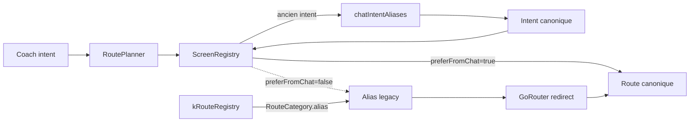

# ROUTE POLICY

> Dernière mise à jour : 2026-06-29
> Statut : **AUTORITATIF** — Toute nouvelle route doit respecter ce document.
> Non-négociable : aucune nouvelle route legacy sans validation explicite.

---

## 1. État actuel

L'inventaire chiffré vit dans le code, pas dans ce document. La source de
vérité est `apps/mobile/lib/routes/route_metadata.dart`, et le contrôle local
est :

```bash
./tools/mint-routes check
```

La doctrine produit associée aux routes Mint 2.0 vit dans
`.planning/phases/mint-2-0-first-experience-rente-capital/VZ_ROUTE_ARCHITECTURE.md`.
Ce document-ci décide comment nommer et gouverner les routes; l'architecture
VZ décide quel problème financier suisse chaque route doit porter avant qu'un
écran soit promu.

---

## 2. Règles pour les nouvelles routes

### Convention obligatoire

```
/{domaine}/{action-ou-sujet}
```

- **Langue** : français kebab-case (`/retraite/rachat`, pas `/retirement/buyback`)
- **Préfixe** : un des 7 domaines Explorer, ou un préfixe transversal autorisé
- **Pas de namespace technique** : pas de `/simulator/`, `/arbitrage/`, `/segments/`, `/life-event/`

### Préfixes autorisés

| Préfixe | Domaine | Exemples existants |
|---|---|---|
| `/retraite/` | Retraite & prévoyance | `/retraite`, `/retraite/rente-vs-capital` |
| `/famille/` | Famille & couple | `/divorce`, `/mariage`, `/naissance` |
| `/travail/` | Travail & statut | `/unemployment`, `/first-job` |
| `/logement/` | Logement & immobilier | `/hypotheque`, `/mortgage/*` |
| `/fiscalite/` | Fiscalité | `/fiscal` |
| `/patrimoine/` | Patrimoine & succession | `/succession` |
| `/sante/` | Santé & protection | `/invalidite`, `/assurances/*` |
| `/budget` | Budget (racine, accès fréquent) | `/budget` |
| `/dette/` | Prévention dette | `/debt/*` (legacy EN) |
| `/coach/` | Surfaces coach | `/coach/chat`, `/coach/history` |
| `/dossier/` | Profil & documents | `/profile/*` (legacy), `/documents` |
| `/onboarding/` | Parcours d'entrée | `/onboarding/smart`, `/onboarding/quick` |
| `/auth/` | Authentification | `/auth/login`, `/auth/register` |
| `/scan/` | Capture documentaire | `/scan`, `/scan/review` |
| `/outils/` | Simulateurs génériques | `/simulator/*` (legacy EN) |
| `/apprendre/` | Éducation | `/education/*` (legacy EN) |

### Ce qui est interdit

- Créer une route sous `/arbitrage/`, `/segments/`, `/3a-deep/`, `/lpp-deep/`, `/life-event/`, `/simulator/`
- Créer une route en anglais quand un équivalent FR existe
- Créer une route sans l'ajouter au `ScreenRegistry` si elle est routable par le coach
- Créer un redirect sans l'ajouter à `kRouteRegistry` avec `RouteCategory.alias`
- Rendre un alias routable depuis le Coach (`preferFromChat: true`)

---

## 3. Routes legacy (freeze)

Les routes legacy existent uniquement pour compatibilité deep link, anciens
CTA, anciennes notifications ou anciens intents. **Aucune nouvelle redirect ne
doit être ajoutée sans justification.**

L'inventaire complet ne doit pas être dupliqué ici : il vit dans
`apps/mobile/lib/routes/route_metadata.dart` avec `RouteCategory.alias`. Le
contrôle local est `./tools/mint-routes check`.

### Contrat Coach / RoutePlanner

Un alias peut rester connu de `ScreenRegistry` pour résoudre un ancien
`intentTag`, mais il ne doit jamais être une destination primaire ouverte par
le Coach.

Règle mécanique :

- `RouteCategory.alias` dans `route_metadata.dart`.
- `preferFromChat: false` dans `ScreenRegistry`.
- Un ancien `intentTag` encore émis par le backend doit être mappé vers un
  intent canonique via `MintScreenRegistry.chatIntentAliases`.
- Le contrat backend `GENERATED_ROUTE_TO_SCREEN_INTENT_TAGS` accepte les
  intents canoniques + ces aliases legacy ; Flutter reste responsable de
  résoudre l'alias vers la route canonique avant navigation.
- L'ancien chemin peut continuer à rediriger dans `app.dart`.
- Le Coach doit choisir une destination canonique ou rester en conversation.



Test verrou :

```bash
cd apps/mobile
flutter test test/services/navigation/screen_registry_test.dart --plain-name "chat-routable entries do not target legacy alias routes"
cd ../..
python3 tools/checks/screen_registry_three_way_parity.py
```

### Politique de suppression

Les redirects peuvent être supprimés en V2 (post-launch) si :
1. Aucun deep link externe ne les référence (notifications, emails, QR codes)
2. Le `ScreenRegistry` ne les utilise pas comme `intentTag` route, ou l'entrée
   est explicitement `preferFromChat: false`
3. Aucun widget CTA ne les hardcode

---

## 4. Incohérences connues (dette acceptée)

| Route actuelle | Problème | Route idéale | Priorité de migration |
|---|---|---|---|
| `/profile/*` | Le tab s'appelle "Dossier" mais les routes sont sous `/profile` | `/dossier/*` | Basse — refactor big-bang, pas maintenant |
| `/mortgage/*` | Anglais sous un hub FR (Logement) | `/logement/*` | Basse |
| `/disability/*` | Anglais sous un hub FR (Santé) | `/sante/*` | Basse |
| `/3a-deep/*` | Namespace technique visible | `/retraite/3a-*` | Basse |
| `/debt/*` | Anglais | `/dette/*` | Basse |
| `/education/*` | Anglais | `/apprendre/*` | Basse |

**Politique** : ces incohérences sont documentées et acceptées. Elles seront migrées progressivement via alias (nouvelle route + ancien redirect), jamais en big-bang.

---

## 5. Checklist nouvelle route

Avant de créer une route :

- [ ] Le préfixe est dans la liste §2
- [ ] Le nom est en français kebab-case
- [ ] La route est ajoutée dans `app.dart` (GoRouter)
- [ ] La route est ajoutée dans `ScreenRegistry` (si routable par le coach)
- [ ] Si la route est un alias, `RouteCategory.alias` est utilisé et
      `ScreenRegistry.preferFromChat` reste `false`
- [ ] Les intent tags sont en snake_case anglais (convention interne)
- [ ] Aucun namespace legacy n'est réutilisé (`/arbitrage/`, `/simulator/`, etc.)
- [ ] Ce document est mis à jour si un nouveau préfixe est créé
