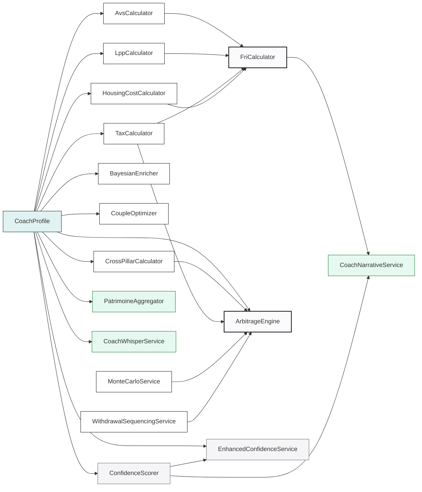

# Calculator graph — from CoachProfile to UI

**Why this file exists.** MINT has ~20 calculators. Most are pure
functions of `CoachProfile`. Some have subtle dependencies (e.g.
`FriComputationService` calls 4 other calculators internally). When
you change `CoachProfile`, or add a field, or swap a derived value, you
don't know which UI surface will notice — unless this map is fresh.

**Invariant (CLAUDE.md §4).** Every financial calculation **must** live
under `apps/mobile/lib/services/financial_core/`. The backend mirrors
via `services/backend/app/services/rules_engine/`. Never duplicate a
calculation in a feature directory — it drifts, Julien + Lauren golden
values stop matching, and two calculators with different rounding
arrive in prod.

Grep to enforce:
```
grep -rn "_calculate\|_compute" apps/mobile/lib/services/ | grep -v financial_core/
```
If you hit a match outside `financial_core/`, it's a regression.

---

## The graph at a glance



---

## Calculators in `financial_core/` (source of truth)

Each is a pure function of its inputs. No side-effects. Tested against
Julien + Lauren golden values.

| Calculator | File | Inputs | Returns | Primary consumers |
|---|---|---|---|---|
| **AvsCalculator** | `avs_calculator.dart` | RAMD, years, gaps | monthly rente | FriCalculator, RetirementDashboardScreen, coach_narrative |
| **LppCalculator** | `lpp_calculator.dart` | avoir, rate, years | projected capital + rente | FriCalculator, ProjectionRetraiteScreen, ArbitrageEngine |
| **TaxCalculator** | `tax_calculator.dart` | income, canton, marital, 3a | federal + cantonal + marginal | ArbitrageEngine, ProjectionFiscaleScreen |
| **HousingCostCalculator** | `housing_cost_calculator.dart` | loyer/hyp + canton | monthly housing effective cost | FriCalculator, budget calcs |
| **FriCalculator** (composite) | `fri_calculator.dart` | CoachProfile | FRI score 0-100 + breakdown | FriComputationService, CoachNarrativeService |
| **ConfidenceScorer** | `confidence_scorer.dart` | CoachProfile | score 0-100 + per-field confidence | ExtractionReviewScreen, RetirementDashboardScreen, `dataReliability` |
| **CrossPillarCalculator** | `cross_pillar_calculator.dart` | 3 pillars values | arbitrage opportunities | ArbitrageEngine |
| **CoupleOptimizer** | `couple_optimizer.dart` | 2 profiles | optimization suggestions | CoupleDashboardScreen |
| **ArbitrageEngine** (composite) | `arbitrage_engine.dart` | profile + constants | action list | ArbitrageBilanScreen, coach suggestions |
| **BayesianEnricher** | `bayesian_enricher.dart` | profile + priors | enriched profile w/ estimates | CoachReasoner |
| **MonteCarloService** | `monte_carlo_service.dart` | profile + scenarios | probability distributions | RetirementDashboard scenarios (Prudent/Base/Optimiste) |
| **WithdrawalSequencingService** | `withdrawal_sequencing_service.dart` | retirement params | sequencing plan | DecaissementScreen |
| **TornadoSensitivityService** | `tornado_sensitivity_service.dart` | FRI inputs | sensitivity chart data | FinancialSummaryScreen tornado chart |
| **CoachReasoner** | `coach_reasoner.dart` | CoachContext | reasoning chain | CoachNarrativeService advanced narratives |

---

## Aggregators & downstream services (above the pure core)

Not in `financial_core/` but still pure-ish — compose core calculators
for a specific UI surface. Found under `apps/mobile/lib/services/`.

| Service | File | Role | Reads | Consumers |
|---|---|---|---|---|
| **FriComputationService** | `fri_computation_service.dart` | Runs `FriCalculator` + archetype detection + breakdown | CoachProfile | CoachNarrativeService, MintStateEngine |
| **PatrimoineAggregator** | `mon_argent/patrimoine_aggregator.dart` | 5-state snapshot (empty/loading/partial/data/error) | CoachProfile | `mon_argent_screen.dart`, PatrimoineSummaryCard |
| **CoachWhisperService** | `mon_argent/coach_whisper_service.dart` | Silent whisper trigger (loyer > 33% net, etc.) | budget + patrimoine + profile | Mon argent screen |
| **CoachNarrativeService** | `coach_narrative_service.dart` | Daily narrative (greeting, scoreSummary, topTip, scenarios) | CoachProfile, FriComputation, CapMemoryStore | Aujourd'hui screen |
| **MintStateEngine** | `mint_state_engine.dart` | Session delta computation | SessionSnapshot + profile | App startup, Aujourd'hui |
| **StreakService** | `streak_service.dart` | Check-in streak | `profile.checkIns` | CoachNarrativeService |
| **EnhancedConfidenceService** | `confidence/enhanced_confidence_service.dart` | Per-field confidence + enrichment prompts | CoachProfile | Extraction review, Retirement dashboard |
| **SnapshotService** | `snapshot_service.dart` | Persists daily/scan/life-event snapshots | CoachProfile | `updateFromRefresh`, `createSnapshotFromProfile` |
| **SessionSnapshotService** | `session_snapshot_service.dart` | In-session delta | Snapshot + current profile | MintStateEngine |

---

## UI consumers of `CoachProfileProvider` (not exhaustive — grep for the latest)

Watch/read sites where a stale or null profile breaks the UI. Grep:

```
grep -rn "context\.watch<CoachProfileProvider>\|context\.read<CoachProfileProvider>\|Provider\.of<CoachProfileProvider>" apps/mobile/lib
```

Typical hotspots:
- `aujourdhui_screen.dart` → « Cap du jour » uses narrative
- `mon_argent_screen.dart` → Budget + Patrimoine cards
- `financial_summary_screen.dart` (`/profile/bilan`) → full dashboard
- `retirement_dashboard_screen.dart` → « Mes données » + scenarios
- `coach_chat_screen.dart` → context builder + narrative + `applySaveFact`
- Extraction review screen → confidence delta + insights

---

## Façade watchlist (from 2026-04-21 audit)

Services that EXIST but are under- or un-wired. Do not build new
features on top of these until the câblage is real. Full details:
[`.planning/triage-2026-04-20-service-audit.md`](../.planning/triage-2026-04-20-service-audit.md).

| Service | Status | What's broken |
|---|---|---|
| **CoachCacheService** | 🔴 Dead code | `invalidate()` is called; `get()` / `set()` are never called in prod. Greenfield. Either remove or wire a real consumer. |
| **MilestoneService** | 🔴 Does not exist | Only l10n strings + `PlanMilestone` model. Jalons trimestriels = UI decoration, not computed. |
| **AnnualRefresh trigger** | 🔴 Orphaned | `snapshot_service.dart:193` checks `trigger == 'annual_refresh'`. Zero caller. Screen deleted in deep-audit 2026-04-17, check left behind. |
| **LifeEventsService** | 🟡 Under-wired | 1 external caller (`divorce_simulator_screen.dart`). 17 other simulators read profile directly — fine in isolation, but no « your active life events » hub. |

---

## When you add a new calculator — the 5-step protocol

1. **Place it under `apps/mobile/lib/services/financial_core/`**. Not
   elsewhere. If backend needs it too, mirror in
   `services/backend/app/services/rules_engine/` and write a golden
   value test in both that asserts the same output for the same input.
2. **Pure function.** No DB, no network, no I/O, no state. Inputs from
   CoachProfile or explicit params. Output = immutable value.
3. **Test against Julien + Lauren golden values** at
   [`test/golden/`](../apps/mobile/test/golden/). Any non-trivial
   output must match a known-good fixture.
4. **Register it in this graph.** Add a row to the calculator table
   above. Draw the mermaid edge. Name the consumers.
5. **If the calculator exposes a named result (FRI score, fitness %,
   etc.)**, add it to the SOT.md data contract so mobile and backend
   agree on the wire shape.

---

## When you consume a calculator from a new UI surface

1. Never call the calculator from a widget directly — go through the
   aggregator service or the provider if one exists. Otherwise the same
   math gets redone 4 times.
2. If an aggregator doesn't exist, create one in
   `apps/mobile/lib/services/<feature>/` and add a row to the
   aggregators table.
3. Add the route / screen to the route_metadata (Phase 32) so Sentry
   can pick up per-route performance.

---

*Last updated: 2026-04-21 after façade audit in
`.planning/triage-2026-04-20-service-audit.md`. When you refactor any
service in `financial_core/` or add a new aggregator, update this file
in the same PR.*
