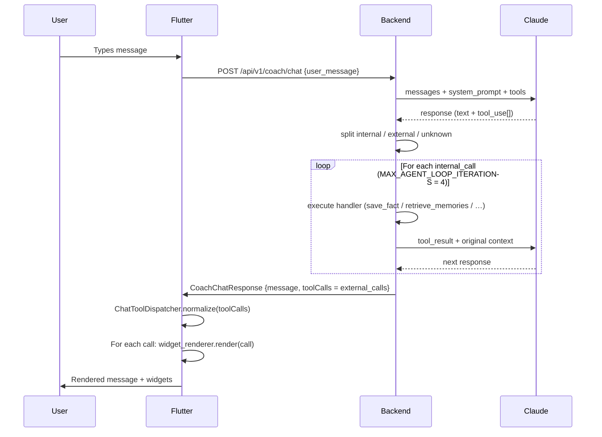

# Coach tool routing — where LLM tools go to live or die

**Why this file exists.** The coach chat is an agent loop: Claude
responds with text + tool_use blocks. Each tool goes to exactly one of
three destinations: executed server-side, forwarded to Flutter, or
rejected as unknown. Mistakes here silently drop features. This
happened with `save_fact` during the MVP walkthrough — the tool was
registered but anonymous users had no way to persist the fact, and the
tool was also stripped from the Flutter payload. Read once, avoid the
four weeks of debug that found it.

Authoritative code:
- Tools declaration: [`services/backend/app/services/coach/coach_tools.py`](../services/backend/app/services/coach/coach_tools.py)
- Agent loop split: [`services/backend/app/api/v1/endpoints/coach_chat.py:1890-1934`](../services/backend/app/api/v1/endpoints/coach_chat.py)
- Flutter dispatch: [`apps/mobile/lib/screens/coach/coach_chat_screen.dart:1025-1055`](../apps/mobile/lib/screens/coach/coach_chat_screen.dart)
- Widget renderer (Flutter tools): [`apps/mobile/lib/widgets/coach/widget_renderer.dart`](../apps/mobile/lib/widgets/coach/widget_renderer.dart)

---

## The 3 tool destinations

```mermaid
flowchart TB
    CLAUDE["Claude response (raw_tool_calls)"] --> SPLIT{name in INTERNAL_TOOL_NAMES?}
    SPLIT -- yes --> INT[internal_calls<br/>executed backend<br/>tool_result → Claude next turn]
    SPLIT -- no --> KNOWN{name in stripped_tools<br/>(Flutter-bound)?}
    KNOWN -- yes --> EXT[external_calls<br/>returned in response.toolCalls<br/>→ Flutter widget_renderer]
    KNOWN -- no --> UNK[unknown_calls<br/>counted, logged<br/>abort loop if > threshold]
    INT --> PIIREDACT[No PII redaction<br/>(stays server-side)]
    EXT --> PIIREDACT2[PII redaction for save_insight + route_to_screen]
    EXT --> FLUTTER[response.toolCalls → Flutter]
```

---

## `INTERNAL_TOOL_NAMES` (as of 2026-04-21)

Defined in [`coach_tools.py:85-102`](../services/backend/app/services/coach/coach_tools.py):

```python
INTERNAL_TOOL_NAMES: list[str] = [
    "retrieve_memories",
    "get_budget_status",
    "get_retirement_projection",
    "get_cross_pillar_analysis",
    "get_cap_status",
    "get_couple_optimization",
    "get_regulatory_constant",
    # Wave E-PRIME 2026-04-18: 3 ack-only tools kept internal
    # (goal_set, step_done, insight_saved) — persistence deferred.
    "save_fact",
    "suggest_actions",
]
```

**Consequence matrix** — what happens when Claude calls each tool:

| Tool | Authenticated user (`user_id` set) | Anonymous user (`user_id = None`) | Flutter receives it? |
|---|---|---|---|
| `retrieve_memories` | Backend searches memory_block, returns result to Claude | Same (no DB write) | No |
| `get_budget_status` | Backend queries BudgetProvider equivalent → tool_result | Empty snapshot | No |
| `get_retirement_projection` | FriComputation + LppCalculator → tool_result | Same (profile-only, no DB) | No |
| `get_cross_pillar_analysis` | Cross-pillar calculator → tool_result | Same | No |
| `get_cap_status` | Reads CapMemoryStore → tool_result | Defaults | No |
| `get_couple_optimization` | Couple calculator → tool_result | Defaults | No |
| `get_regulatory_constant` | RegulatoryConstantsService → tool_result | Same | No |
| `save_fact` | **Writes ProfileModel.data row** ← persistence | **Hits `# Hors-DB path`, returns "Fait noté (hors DB)" with no write** ⚠ | **No** ← this is the bug |
| `suggest_actions` | `_compute_suggested_actions` reads DB gaps | Empty suggestions | No |

**The `save_fact` anonymous trap.** Until the Dart regex fallback
(`fact_extraction_fallback.dart`, shipped 2026-04-21 P0-MVP-1), every
fact captured by Claude for an anonymous user was discarded. If you add a
new key to `_SAVE_FACT_ALLOWED_KEYS`, you **must also** update the
regex fallback or explicitly document why anon users cannot set it.

---

## Flutter-bound tools (`external_calls`)

Everything that's not internal and not unknown. Rendered by
[`widget_renderer.dart`](../apps/mobile/lib/widgets/coach/widget_renderer.dart).

Dispatched in the Flutter agent loop at
[`coach_chat_screen.dart:1025-1055`](../apps/mobile/lib/screens/coach/coach_chat_screen.dart):

1. `route_to_screen` → GoRouter navigation
2. `show_budget` → BudgetSummaryWidget in-bubble
3. `show_retirement` → RetirementProjectionWidget in-bubble
4. `generate_financial_plan` → PlanPreviewCard (Flutter WRITE — persists
   via `report_persistence_service`, not backend)
5. `generate_document` → DocumentCard (Flutter WRITE — persists locally)
6. `add_check_in` → dispatched through `widget_renderer.dart:502` to
   `provider.addCheckIn` — **the only path that populates
   `profile.checkIns`**. If the widget is never rendered, streak is
   never computed.
7. `save_insight` → client-side memory (Hive/SharedPrefs via
   `CoachMemoryService`) — text summary, NOT structured fields.

**Adding a new Flutter-bound tool:**
1. Declare schema in `coach_tools.py::build_tools()`.
2. **Do NOT** add name to `INTERNAL_TOOL_NAMES` (would strip from Flutter).
3. Add renderer case in `widget_renderer.dart`.
4. Verify: unit test that sends a fake tool_use and asserts the renderer
   fires.

---

## The agent loop — how tool_result loops back



**MAX_AGENT_LOOP_ITERATIONS = 4.** A cascade of internal tool calls
bounces up to 4 times. Going above this threshold = infinite loop guard
triggers, the response returns whatever Claude had at that point.

**Unknown tool threshold.** If Claude hallucinates a tool name, the
count increments; above `_MAX_UNKNOWN_TOOL_CALLS`, the loop aborts and
returns a generic error. Per-tool unknown names are logged via
`logger.warning`. Monitor those — they indicate prompt drift.

---

## Anonymous chat endpoint (`/api/v1/anonymous/chat`)

**Important difference.**
[`anonymous_chat.py:162`](../services/backend/app/api/v1/endpoints/anonymous_chat.py)
calls the LLM with `tools=None`. Zero tool_use blocks can be emitted —
the endpoint is **discovery-only**, intended for « what is the 2nd
pillar? »-style questions before registration.

Consequence: **anonymous users cannot emit `save_fact` or any Flutter
tool via the LLM path**. The Dart regex fallback is the only write
surface until they sign up. This is deliberate (simpler system prompt,
lower latency, no rate-limit gaming).

---

## Adding a new tool — checklist

1. Choose destination:
   - **Backend acknowledgement or read?** → `INTERNAL_TOOL_NAMES`.
   - **Flutter renders / navigates / writes locally?** → NOT in
     `INTERNAL_TOOL_NAMES`, add widget renderer case.
2. Declare schema in `coach_tools.py::build_tools()` (JSON schema
   follows Anthropic tool_use spec).
3. Update system prompt in
   [`claude_coach_service.py`](../services/backend/app/services/coach/claude_coach_service.py)
   with an example usage.
4. If the tool writes profile data, update
   [`docs/data-flow.md`](data-flow.md) with the new key(s).
5. Write a golden I/O pair test that sends a user message likely to
   trigger the tool, asserts the tool was called, and asserts the
   downstream effect.
6. Guard behind a FeatureFlag while ramping (`FeatureFlags.xxx = false`
   default).

---

## Current tool drift watchlist (2026-04-21)

- `save_insight` — PII redaction is applied to `summary` but not
  `topic`. Add topic scrubbing if topic becomes user-derived.
- `add_check_in` — only 1 caller site
  (`widget_renderer.dart:502`). No scheduled trigger = `profile.checkIns`
  stays empty unless user interacts with a specific widget. Phase 35
  Boucle Daily addresses this with a morning scheduler.
- `generate_financial_plan` + `generate_document` — Flutter WRITE
  tools. No backend persistence. If the user kill-installs the app,
  the plan is gone. Phase 33 kill-switch + backend sync on register
  should cover this.

---

*Last updated: 2026-04-21. Update this file whenever `INTERNAL_TOOL_NAMES`
or the widget_renderer case list changes — or the next agent will ship
another façade-sans-câblage like save_fact.*
