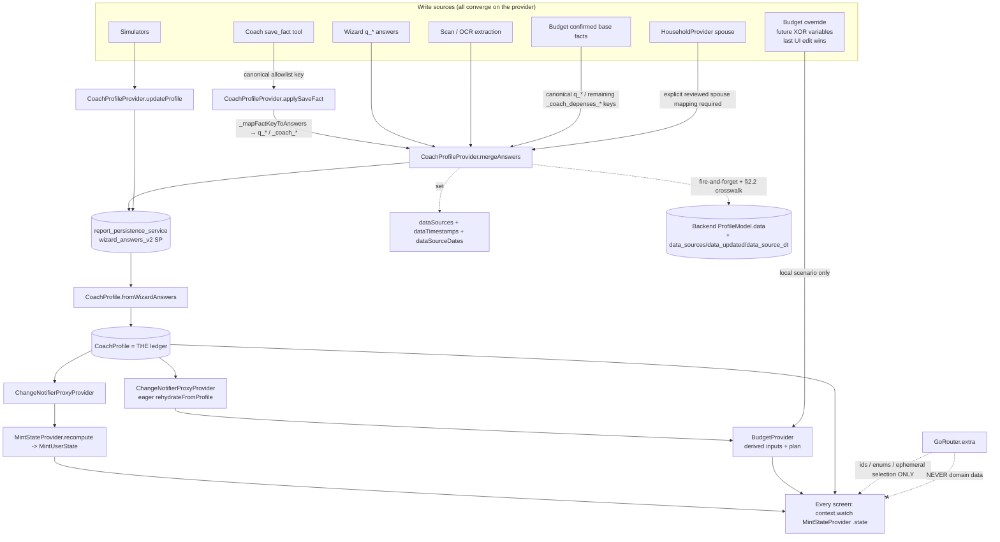

# DATA_LEDGER.md — MINT Canonical Data Ledger

> **G1 reality audit:** `file:line` references were re-checked against HEAD `095eeaa32` on 2026-07-07. Treat line refs as evidence snapshots, not evergreen truth. Rerun `tools/checks/tests/test_codex_spec_reality_contract.py` after changing this spec or the cited code.

> **Status:** target contract plus live gap ledger for the coding agent (Codex). Mechanical, testable, implementable.
> **Audited baseline:** commit `095eeaa32` (2026-07-07).
> **Focused BND-02/BND-02A reality baseline:** BND-02 and BND-02A are technical
> GREEN at exact SHA `1d022c508` (2026-07-16): identical commands, Patrol
> writer→terminate→cold-reader, normal-build restoration, Maestro flag-off/
> stale recovery and four Claude-wrapper confirmations are accepted. Every
> switch remains false; eight external production facts are still unproven, so
> activation and G1 remain NO-GO.
> **Focused BND-05 implementation snapshot:** semantic RED is `cec4f0245` and
> code-GREEN is `11e29c0cd` (2026-07-16). The strict LPP root now feeds an
> accepted receipt, a five-field raw-free reference store, and fail-closed
> Timeline/Detail projections. `G1-BND-05` deliberately remains `ticket_only`
> until exact-SHA runtime and both Claude-wrapper audit lenses are accepted;
> this snapshot does not close G1 or authorize G2/G3.
> **Focused BND-06 implementation snapshot:** semantic RED is `9e86539d2` and
> code-GREEN is `9b33758a5` (2026-07-16). `FinancialPlanProvider` is now an
> eager projection of the loaded `CoachProfile` ledger, and persisted plans
> carry a versioned, provenance-aware input fingerprint. Coach and Aujourd'hui
> consumers fail closed when that fingerprint is stale. `G1-BND-06` remains
> unpromoted until exact-SHA runtime plus both Claude-wrapper audit lenses are
> accepted; this implementation snapshot does not close G1 or authorize G2/G3.
> **Scope:** defines THE single typed registry of every user data field MINT knows. Every screen reads/writes from this ledger and nowhere else.
> **Conflict order:** `rules.md` (tier 1) > `CLAUDE.md` (tier 2) > this file (tier 3 operational). This file does not override compliance.
> **Focused AVS contract:** [AVS_OFFICIAL_PENSION_INGESTION.md](AVS_OFFICIAL_PENSION_INGESTION.md) defines the default-off, self-only acquisition path and its `avs_official_pension` document type.
> **Focused tax contract:** [TAX_ASSESSMENT_INGESTION.md](TAX_ASSESSMENT_INGESTION.md) defines the Swiss document, period, ICC/IFD, rate and tax-unit semantics; §4.0 below owns the implemented mobile storage/wiring contract, kept default-off by the composite `documentTaxAssessmentEnabled && typedTaxProfile` gate. Frozen-SHA runtime proof, external Claude audits, the final G1 scorecard and any activation decision remain pending.

---

## 0. What "the ledger" is (concretely, in existing code)

The ledger is **not new infrastructure**. It is the formalisation of the spine that already exists. Do not rebuild it.

| Layer | Existing artefact (path) | Role in the ledger |
|---|---|---|
| Canonical model | `apps/mobile/lib/models/coach_profile.dart` → `CoachProfile` (+ sub-models `PrevoyanceProfile`, `PatrimoineProfile`, `DetteProfile`, `DepensesProfile`, `ConjointProfile`, `GoalA/GoalB`) | The typed in-memory record. THE source of truth. |
| Single write path | `apps/mobile/lib/providers/coach_profile_provider.dart` → `mergeAnswers()` / `applySaveFact()` / `updateProfile()` | The ONLY mutators. No screen-local persistence. |
| Persistence | `report_persistence_service.dart` → SharedPreferences key `wizard_answers_v2`; reconstructed via `CoachProfile.fromWizardAnswers()` | Durable local store; survives restart. |
| Computed state | `apps/mobile/lib/providers/mint_state_provider.dart` → `MintUserState` (`models/mint_user_state.dart`) | Derived read-model (lifecyclePhase, archetype, budgetGap, caps, confidence, friScore). Recomputed on every profile change via `ChangeNotifierProxyProvider`. |
| Provenance (mobile) | `CoachProfile.dataSources : Map<String, ProfileDataSource>` + `CoachProfile.dataTimestamps : Map<String, DateTime>` | Per-field {source, updatedAt}. **Today partial — see §6.** |
| Backend store | `ProfileModel.data : JSON dict`, written by `save_fact` against the **36-key** allowlist `_SAVE_FACT_ALLOWED_KEYS` (`services/backend/app/api/v1/endpoints/coach_chat.py:924`) | Offline-first mirror; sync is fire-and-forget. |
| Decay | `apps/mobile/lib/services/biography/freshness_decay_service.dart` | Two-tier freshness, 0.60 refresh threshold. API is `weight(BiographyFact fact, DateTime now)` — see §5. |
| Confidence | `services/backend/app/services/confidence/enhanced_confidence_service.py` | 4-axis score; consumes source + freshness. |

**`models/profile.dart` + `ProfileProvider` are NOT part of the ledger** and are slated for deletion — but they are **not a zero-consumer dead module at `095eeaa32`**. `ProfileProvider` (`apps/mobile/lib/providers/profile_provider.dart:5`, registered in `app.dart:1425`) still has **5 live screen/widget consumers**: `simulator_3a_screen.dart:197` (`context.read<ProfileProvider>()`, legacy fallback path), `simulator_3a_screen.dart:301` (`context.watch<ProfileProvider>().profile?.hasDebt`), plus 3 widgets — `widgets/simulators/buyback_widget.dart:39`, `widgets/recommendation_card.dart:17`, `widgets/comparators/pillar3a_comparator_widget.dart:29`. Deletion is a REQUIRED but **not-yet-safe** task: these consumers MUST first be migrated to read from `CoachProfileProvider`/`MintStateProvider`, after which `ProfileProvider` + `models/profile.dart` become genuinely orphaned and can be removed. Do not extend them; do not delete them before the migration.

---

## 1. Ledger invariants (acceptance criteria — a violation is a release-blocking bug)

These restate §F of the wiring findings. CI must enforce I-1, I-3, I-6, I-7.

- **I-1 — SINGLE SOURCE.** Every screen reads the domain data it renders from the ledger (`context.watch<MintStateProvider>().state` or `CoachProfileProvider.profile`) ONLY. A screen MUST NOT read domain data from `GoRouter.extra`.
- **I-2 — extra carries only ephemera.** `GoRouter.extra` / query params may carry ids, enums, ephemeral UI selection. They MUST NOT carry the financial values a screen needs to render. (Fixes `/scan/review`, `/scan/impact`, `/rapport`, `/portfolio` dead roads — wiring findings §C; per-route contracts in §7A.)
- **I-3 — SINGLE WRITE PATH.** Every write goes through `CoachProfileProvider.mergeAnswers()` or `.applySaveFact()` (which itself calls `mergeAnswers`). No `SharedPreferences`/file/DB write of domain data from a screen or service that bypasses the provider. Simulators that write back MUST call `provider.updateProfile()` (already correct — keep it).
- **I-4 — NO ISLANDS.** Every provider that owns durable facts MUST bridge into the ledger/recompute so `MintUserState` is never stale. `BudgetProvider` is a one-way eager projection of `CoachProfile`. BND-05 now makes confirmed-document chronology/detail an eager, read-only projection of the strict ledger: the `DocumentProvider` confirmed-reference subpath owns only opaque raw-free metadata and `TimelineProvider` listens to it; neither subpath owns financial facts. The provider's pre-existing backend upload/list state remains a separate volatile surface. BND-06 makes `FinancialPlanProvider` an eager derived-artifact projection of the loaded ledger and invalidates its plan on input/provenance drift without writing plan outputs back into facts. `HouseholdProvider` and conversation-derived financial facts retain their §7 bridge debt. See §7.
- **I-5 — PROJECTIONS ARE RANGED.** Every consumer that renders a projected number MUST also render a range + `EnhancedConfidence` + "à confirmer". No bare numbers. No promissory terms (CLAUDE.md §5).
- **I-6 — DIFF NOT FORM.** Collection asks only the missing/stale delta. Freshness < 0.60 ⇒ **re-confirm**, never blank re-ask. Implement on top of `data_block_enrichment_screen.dart` (≈70% built).
- **I-7 — ALLOWLIST IS THE CONTRACT.** A field is writable via the coach/backend ONLY if its key is in `_SAVE_FACT_ALLOWED_KEYS` (36 keys). Adding a coach-writable field = adding to that set + the mobile `_mapFactKeyToAnswers` switch + a row in this ledger. The backend allowlist, coach tool enum, mobile mapper, and profile reads are now in sync for all 36 keys; §3.8 keeps the repair history and the parity gate.
- **AVS-OFFICIAL — CANDIDATE IS NOT FACT.** `avs_official_pension` is distinct from the CI `avs_extract`. Its only canonical fact is `avs_official_monthly_pension`, persisted after review as `{value, source, sourceDate, updatedAt, evidenceKind}` in one strict-secure envelope. `source=certificate` records provenance while `evidenceKind` preserves decision vs forecast vs statement; only a reviewed decision or current official statement may be known. An accepted result without an explicit decision/current-statement marker becomes `official_forecast` and stays to verify. Candidate extraction performs no pre-review profile write or backend mirror. Correction writes `userInput` with null source date and null evidence kind. Mobile and backend kill switches default to false; no mobile consumer/write-back, partner writer, or household calculation is authorized yet.
- **LPP-EVIDENCE — PERSON OWNERSHIP IS NOT HOUSEHOLD CONSENT.** Reviewed LPP certificate facts use the single strict-secure `_coach_lpp_evidence_v1` root defined in §4.0A. Every fact carries its own pseudonymous owner, actor, authorization and provenance. Self and independently declared manual-partner evidence are separate; household membership never authorizes import. BND-02A now has a real default-off represented-authorization caller; linked-account/grant shapes remain unconditionally rejected because that caller is neither account linking nor direct partner consent. Ambiguous pension/capital or annual/lump-sum meaning writes nothing.
- **DOCUMENT REFERENCES ARE NOT FACTS.** A confirmed document reference is a separate specialist-reference record with exactly `{referenceId, kind, snapshotId, ownerKind, confirmedAt}`. It contains no document payload or financial value and becomes readable only while the exact owner-scoped strict snapshot is current. Metadata retry may complete after authority expiry, but authority-gated readers must still return no reference or value.

---

## 2. Type system & column legend

Every ledger row uses these columns.

- **key** — canonical identifier. For coach/backend-writable fields this is the exact `_SAVE_FACT_ALLOWED_KEYS` key. For mobile-only fields it is the Dart field path on `CoachProfile` (e.g. `patrimoine.epargneLiquide`). The wizard-answer key (`q_*` or `_coach_*`) is given when it differs — it is the storage key in `wizard_answers_v2`, produced by `_mapFactKeyToAnswers` and read back by `fromWizardAnswers`. **These wizard keys are transcribed verbatim from the real switch (`coach_profile_provider.dart:567-710`); do not paraphrase them.**
- **type+unit** — Dart type and unit. `CHF` = Swiss francs; `CHF/mo` = monthly; `%` = percent (stored as written, e.g. `1.5` not `0.015`, except `tauxConversion*` which are decimals); `yr` = years; ISO dates are `YYYY-MM-DD` strings on disk, `DateTime` in model.
- **domain** — owning domain: `identity`, `income`, `expenses`, `prevoyance` (AVS/LPP/3a/LP), `patrimoine`, `dettes`, `goals`, `couple`, `meta`.
- **sources** — allowed `ProfileDataSource` values for this field. See the enum definition below. A field may declare a subset; writes claiming a source outside the subset are rejected.
- **fresh** — freshness tier: `annual` / `volatile` / `static`. Maps to the `freshnessCategory` string the decay service reads (§5). Decay + 0.60 refresh threshold per `FreshnessDecayService`.
- **wconf** — default accuracy weight used by the confidence engine when the field's current source is the lowest-weight source it declares. Actual weight at runtime = weight of the field's recorded source (§6).
- **write** — write path. ALWAYS `CoachProfileProvider`. `mergeAnswers` (wizard/inline/scan), `applySaveFact` (coach tool → maps to wizard key), `updateProfile` (simulator write-back). Never screen-local.
- **consumers** — the computations/screens that read this field.

### 2.1 `ProfileDataSource` — the ONLY mobile source enum (verified, `coach_profile.dart:36`)

The mobile enum has **exactly 5 members**. Use ONLY these names in every `sources:` cell. There is **no `scan` member**: OCR extraction writes are recorded as `estimated` at extraction time and promoted to `certificate` only after the user confirms the extracted figure (§7A `/scan/review`).

```
estimated       .25   // MINT default / unconfirmed OCR extraction
userInput       .60   // manual entry
crossValidated  .70   // manual entry + cross-check
certificate     .95   // confirmed from a scanned certificate
openBanking    1.00   // live bLink/SFTI feed
```

These weights are the accuracy-axis weights in `enhanced_confidence_service.py`. No other source token may appear in a `sources:` cell. If a row previously implied "scan(.85)", read it as: extraction → `estimated`, post-confirm → `certificate`.

### 2.2 Backend `DataSource` — the DIFFERENT backend enum, and the mandatory cross-walk

The backend uses a **separate 8-member enum** `DataSource` with **different names and weights** (`services/backend/app/services/document_parser/document_models.py:39`, weights in `DATA_SOURCE_ACCURACY:57`):

```
user_estimate              0.25
user_entry                 0.50
user_entry_cross_validated 0.70
document_scan              0.85
document_scan_verified     0.95
open_banking               1.00
institutional_api          0.95
system_estimate            0.25
```

Mobile ↔ backend are NOT the same enum and their weights differ (mobile `userInput`=.60 vs backend `user_entry`=.50). Any code that syncs mobile `dataSources` into backend `data_sources` (§6.2) MUST apply this exact cross-walk (a new module `services/backend/app/services/confidence/source_crosswalk.py`):

| mobile `ProfileDataSource` | backend `DataSource` | note |
|---|---|---|
| `estimated` | `system_estimate` | both .25 |
| `userInput` | `user_entry` | weight changes .60 → .50 by design; backend axis governs backend score |
| `crossValidated` | `user_entry_cross_validated` | both .70 |
| `certificate` | `document_scan_verified` | both .95 (a confirmed cert = verified scan) |
| `openBanking` | `open_banking` | both 1.00 |

Backend-only members `document_scan` (.85, unconfirmed OCR), `institutional_api` (.95), and `user_estimate` (.25) have **no mobile pre-image**: `document_scan`/`institutional_api` are produced only by backend document/API pipelines, and `user_estimate` (a second .25 member alongside `system_estimate`) is a backend-internal estimate tag; the mobile→backend sync maps mobile `estimated` to `system_estimate` (per the table above), never to `user_estimate`. None of the three is ever emitted by the mobile→backend sync. This table is the single source of truth for the cross-walk; §6 references it, does not restate it.

### 2.3 Phase 37 Wave 1 canonical model semantics

The following contracts are live in `CoachProfile` and are guarded by the
ticket-specific tests from Plan 37-02:

- Civil-status and employment aliases are accepted only on reconstruction.
  Serialization emits one canonical value; in particular `unemployed`,
  `chomage`, and `chômage` reconstruct as `chomage` and serialize as
  `unemployed` instead of falling back to an employee fact.
- Display fallbacks (`ZH`, housing-cost estimates, and an estimated LPP
  conversion rate) do not become known facts. Only an explicit storage key
  adds the matching `userProvidedFields` marker and `dataTimestamps` entry.
- `pillar3aAnnualContribution`, `monthlySavingsContribution`, and
  `hasPillar3a` are independent current facts. Their storage keys remain
  `q_3a_annual_contribution`, `q_savings_monthly`, and `q_has_3a`;
  `q_savings_allocation` cannot fabricate any of them. A current-fact consumer
  uses `typedFact ?? legacyValue`, never `typedFact + legacyValue`. The legacy
  value is migration fallback only when the typed fact is absent.
- `plannedContributions` remains a plan/scenario lever. It is not rewritten by
  `copyWith` changes to the three current facts, and scenario perturbations do
  not overwrite those durable facts. This separation prevents both double
  counting and a scenario result becoming profile truth.
- `avsGapStatus` is the user's declared status (`noGaps`, `arrivedLate`,
  `livedAbroad`, `unknown`). It is distinct from nullable certified numeric
  years in `prevoyance.lacunesAVS`. `q_avs_years_abroad`, a derived arrival
  interval, and `no_gaps` can inform the declared status but never hydrate
  certified years or receive `certificate` provenance. Only confirmed AVS
  extraction may write `_coach_avs_lacunes` with its document source. A stored
  `q_avs_lacunes_status` is `userInput` and receives its own `avsGapStatus`
  timestamp. Likewise, `q_avs_contribution_years` is `userInput` by default;
  it becomes `certificate` only when the same persisted write carries
  `_coach_avs_source=document_scan`, and it keeps its own freshness timestamp.
- The spouse keys `q_spouse_avs_lacunes_status`,
  `q_spouse_avs_arrival_year`, and `q_spouse_avs_years_abroad` are likewise
  declarations and chronology hints only. They never populate
  `conjoint.prevoyance.lacunesAVS`; that numeric field is CI/certificate-only.
  `q_spouse_avs_contribution_years` remains a distinct contribution-history
  fact and must not be converted into gap years.
- `_coach_dettes_hypotheque` is the canonical mortgage value. The legacy
  `q_mortgage_balance` is migration-read only: a sole dated value or the
  strictly newer dated value wins; divergent missing/equal timestamps are
  quarantined as unknown; equal values remain usable.

These contracts do not add provenance-on-write, provider-island bridges, or
scenario identity. Those remain later Phase 37 tickets and still block G2.
Source, timestamp, and meaning must nevertheless agree for every value already
consumed here: absent or stale evidence remains unknown; a status/year
contradiction fails closed to `partial+ask`; and neither a default nor a
declaration may be promoted to certificate confidence.

---

## 3. Ledger — coach/backend-writable fields (the 36-key allowlist)

These **36** keys are the exact contents of `_SAVE_FACT_ALLOWED_KEYS` (`coach_chat.py:924`). They are the ONLY keys the coach (`save_fact`) and backend may write. `wizard key` = the target produced by `CoachProfileProvider._mapFactKeyToAnswers`, verbatim from the real switch. §3.8 records the repair history that brought the mobile mapper and `CoachProfile.fromWizardAnswers()` back to parity.

### 3.1 Identity / location

| key | wizard key | type+unit | domain | sources | fresh | wconf | write | consumers |
|---|---|---|---|---|---|---|---|---|
| `birthYear` | `q_birth_year` | int (year) | identity | userInput, certificate | static | .60 | applySaveFact/mergeAnswers | `age`, `archetype`, AVS/LPP projection, CapEngine (`age>=45`), lifecyclePhase |
| `dateOfBirth` | `q_date_of_birth` | String ISO date | identity | userInput, certificate | static | .60 | applySaveFact/mergeAnswers | `ageOrNull` (precise), AVS21 reference age |
| `canton` | `q_canton` | String (2-letter enum) | identity | userInput, certificate | annual | .60 | applySaveFact/mergeAnswers | `TaxCalculator`, `NetIncomeBreakdown`, budget, all fiscal screens |
| `commune` | `q_commune` | String | identity | userInput | annual | .60 | applySaveFact/mergeAnswers | communal tax multiplier, fiscal precision |
| `householdType` | `q_civil_status` | enum {single, couple, concubine, family} | identity/couple | userInput | static* | .60 | applySaveFact/mergeAnswers | `isCouple`, couple AVS plafonnement, succession, lifecyclePhase |
| `employmentStatus` | `q_employment_status` | enum {salarie, independant, retraite, employee, self_employed, retired, mixed, unemployed, student} | identity | userInput | static* | .60 | applySaveFact/mergeAnswers | `archetype` (indep w/wo LPP), LPP eligibility, SafeMode E1/E4 |
| `goal` | `q_main_goal` | enum {house, retire, emergency, invest, optimize_taxes, other} | goals | userInput | static* | .60 | applySaveFact/mergeAnswers | `GoalA`, goal-aware prioritization, Pulse hero |
| `targetRetirementAge` | `q_target_retirement_age` | int (58–70) | identity | userInput | static* | .60 | applySaveFact/mergeAnswers | `effectiveRetirementAge`, `anneesAvantRetraite`, all retirement sims |
| `gender` | `q_gender` | enum {M, F} | identity | userInput, certificate | static | .60 | applySaveFact/mergeAnswers | AVS21 transitional reference age (women 1961–63), mortality cohort |

\* `static*` = changes are **life events**, not decay. Do not auto-stale; trigger the event flow (marriage, retirement) instead.

### 3.2 Income

| key | wizard key | type+unit | domain | sources | fresh | wconf | write | consumers |
|---|---|---|---|---|---|---|---|---|
| `incomeNetMonthly` | `q_net_income_period_chf` + `q_pay_frequency='monthly'` | double CHF/mo | income | userInput, certificate, openBanking | annual | .60 | applySaveFact/mergeAnswers | budget, `resteAVivreMensuel`, SafeMode, unemployment crash-test normal income |
| `incomeNetYearly` | `q_net_income_period_chf` + `q_pay_frequency='yearly'` | double CHF/yr | income | userInput, certificate | annual | .60 | applySaveFact/mergeAnswers | tax, affordability ~33% |
| `incomeGrossMonthly` | `q_gross_salary_annual` (= value × 12) | double CHF/mo | income | userInput, certificate, openBanking | annual | .60 | applySaveFact/mergeAnswers | `salaireBrutMensuel`, `revenuBrutAnnuel`, LPP coordination, AVS RAMD |
| `incomeGrossYearly` | `q_gross_salary_annual` | double CHF/yr | income | userInput, certificate | annual | .60 | applySaveFact/mergeAnswers | `revenuBrutAnnuel`, tax tiers, LPP insured salary inference |
| `employmentRate` | `q_employment_rate` | double % (0–100) | income | userInput | annual | .60 | applySaveFact/mergeAnswers | part-time coaching, coordination-deduction alert |
| `annualBonus` | `q_annual_bonus` | double CHF/yr | income | userInput, certificate | annual | .60 | applySaveFact/mergeAnswers | `bonusPourcentage`, `revenuBrutAnnuel` |
| `selfEmployedNetIncome` | `q_self_employed_income` + `q_net_income_period_chf` + `q_pay_frequency='yearly'` + `q_employment_status='independant'` | double CHF/yr | income | userInput, certificate | annual | .60 | applySaveFact/mergeAnswers | independant archetype, 3a max 36'288, AVS indep |
| `companyProfitAnnual` | `q_company_profit_annual_chf` | double CHF/yr | income | userInput, certificate | annual | .60 | applySaveFact/mergeAnswers | SA/Sarl dividend-vs-salary envelope; never a fallback for sole-proprietor income |

> Income keys map to a **pay-frequency-consistent pair** so `fromWizardAnswers` computes `salaireBrutMensuel` correctly (the `incomeNetMonthly/Yearly` cases set BOTH `q_net_income_period_chf` and `q_pay_frequency`; the gross cases normalise to `q_gross_salary_annual`). A write to a `Net*` key MUST NOT silently overwrite a `Gross*`-derived value of a different frequency.

#### Mobile-only career facts

These facts are collected through `mergeAnswers` and reconstructed by
`CoachProfile.fromWizardAnswers()`, but they are **not** part of the backend
`save_fact` allowlist counted in §3.8.

| key | wizard key | type+unit | domain | sources | fresh | wconf | write | consumers |
|---|---|---|---|---|---|---|---|---|
| `unemploymentContributionMonths` | `q_unemployment_contribution_months` | int months, clamped 0-24 | income / work | userInput, certificate | event-scoped / annual | .60 / .95 | mergeAnswers via `/data-block/revenu` | `/unemployment` LACI eligibility and benefit-duration explanation |

> Swiss-domain invariant: LACI contribution months are an eligibility fact for
> unemployment insurance. UI screens may use children/disability switches as
> scenario/current-situation levers, but they must not invent a default
> contribution history or collect it as a local slider. Budget crash-tests may
> derive a labelled estimated net LACI cash-flow from the gross benefit, but the
> derived estimate is calculation output, not a persisted ledger fact.

### 3.3 LPP (2nd pillar)

| key | wizard key | type+unit | domain | sources | fresh | wconf | write | consumers |
|---|---|---|---|---|---|---|---|---|
| `lppInsuredSalary` | `_coach_salaire_assure` | double CHF/yr | prevoyance | certificate, userInput | annual | .95 (cert) | applySaveFact/mergeAnswers | `salaireAssure`; flips `isLppFromCertificate`; LPP rente precision |
| `avoirLpp` | `_coach_avoir_lpp` | double CHF | prevoyance | certificate, userInput, estimated | annual | .95 / .25 | applySaveFact/mergeAnswers | `avoirLppTotal`; LPP capital@65; rente projection; `archetype` indep |
| `avoirLppObligatoire` | `_coach_avoir_lpp_oblig` | double CHF | prevoyance | certificate | annual | .95 | applySaveFact/mergeAnswers | split conversion rate (6.8% oblig), flips `isLppFromCertificate` |
| `avoirLppSurobligatoire` | `_coach_avoir_lpp_suroblig` | double CHF | prevoyance | certificate | annual | .95 | applySaveFact/mergeAnswers | surobligatoire conversion rate, rente split |
| `lppBuybackMax` | `_coach_rachat_maximum` | double CHF | prevoyance | certificate, userInput | annual | .95 | applySaveFact/mergeAnswers | `rachatMaximum`, `lacuneRachatRestante`, rachat sim, tax deduction |
| `has2ndPillar` | `q_has_pension_fund` (`true` → `yes`, `false` → `no`) | bool | prevoyance | userInput | static* | .60 | applySaveFact/mergeAnswers | LPP eligibility gate, archetype indep w/wo LPP |
| `hasVoluntaryLpp` | `q_has_voluntary_lpp` (`true` → `yes`, `false` → `no`; also sets `q_has_pension_fund` for independants/voluntary true) | bool | prevoyance | userInput | static* | .60 | applySaveFact/mergeAnswers | independant facultative caisse logic |

> **Source inference (existing, keep):** `CoachProfile._resolveDataSources` infers `certificate` for LPP fields when certificate-only signals exist (`_coach_avoir_lpp_oblig`, `_coach_salaire_assure`, `tauxConversionSuroblig`, `_coach_rachat_maximum`), else `estimated`. The ledger's per-field provenance (§6) must record the **actual** source at write time and override this inference.

### 3.4 Pillar 3a

| key | wizard key | type+unit | domain | sources | fresh | wconf | write | consumers |
|---|---|---|---|---|---|---|---|---|
| `pillar3aAnnual` | `q_3a_annual_contribution` | double CHF/yr (`CoachProfile.pillar3aAnnualContribution`) | prevoyance | userInput, certificate, openBanking | annual | .60 | applySaveFact/mergeAnswers | current 3a fitness criterion and `CoachingProfile.montant3a`; legacy planned amount is fallback, never additive |
| `pillar3aBalance` | `q_3a_total` | double CHF | prevoyance | certificate, openBanking, userInput | annual | .95 / 1.00 | applySaveFact/mergeAnswers | `totalEpargne3a`, retirement capital, `comptes3a` |

> 3a writes MUST respect `canContribute3a` (false for US/FATCA; conditional for frontalier permis G). A `pillar3a*` write for a US person should be accepted as data but flagged non-contributable, not silently zeroed.

#### Mobile-only 3a facts

These facts are collected through `mergeAnswers` and reconstructed by
`CoachProfile.fromWizardAnswers()`, but they are **not** part of the backend
`save_fact` allowlist counted in §3.8. They must not be counted as a 37th
coach-writable key.

| key | wizard key | type+unit | domain | sources | fresh | wconf | write | consumers |
|---|---|---|---|---|---|---|---|---|
| `has3a` | `q_has_3a` (`true` → `yes`, `false` → `no`) / `hasPillar3a` | bool | prevoyance | userInput, certificate, openBanking | annual | .60 / .95 | mergeAnswers only, not `save_fact` | `CoachingProfile.has3a`; explicit typed false wins over a stale legacy account count |

### 3.5 Savings / wealth / debt

| key | wizard key | type+unit | domain | sources | fresh | wconf | write | consumers |
|---|---|---|---|---|---|---|---|---|
| `savingsMonthly` | `q_savings_monthly` | double CHF/mo (`CoachProfile.monthlySavingsContribution`) | patrimoine | userInput, openBanking | annual | .60 | applySaveFact/mergeAnswers | current financial-fitness savings-rate criterion; legacy planned total is fallback, never additive |
| `totalSavings` | `q_cash_total` | double CHF | patrimoine | userInput, certificate, openBanking | annual | .60 | applySaveFact/mergeAnswers | `patrimoine.epargneLiquide`, emergency fund (SafeMode Signal C), liquidity axis |
| `wealthEstimate` | `q_wealth_estimate` | double CHF | patrimoine | userInput, estimated | annual | .60 | applySaveFact/mergeAnswers | `PatrimoineProfile.wealthEstimate`, `WealthFinancialFacts.reconcileAggregate`, `PatrimoineProfile.wealthReconciliation`, `totalPatrimoine` aggregate, wealth tax, net worth, absolute patrimoine previews |
| `hasDebt` | `q_has_consumer_debt` (`true` → `yes`, `false` → `no`; `false` zeroes `_coach_dettes_credit`, `_coach_dettes_leasing`, `_coach_dettes_autres`; `true` nulls them so the bool-only fallback can run) | bool | dettes | userInput | volatile | .60 | applySaveFact/mergeAnswers | SafeMode Signal A, `isInDebtCrisis` |
| `totalDebt` | `_coach_dettes_autres` + `q_has_consumer_debt` (`>0` → `yes`, `0` → `no`) | double CHF | dettes | userInput, certificate | volatile | .60 | applySaveFact/mergeAnswers | `dettes.*`, debt-to-income 0.33, net worth |

> **Status:** `totalSavings` maps to `q_cash_total`, the key actually read by `CoachProfile.fromWizardAnswers()` for `patrimoine.epargneLiquide`. `wealthEstimate` maps to `q_wealth_estimate`, read as `PatrimoineProfile.wealthEstimate` and reconciled by `PatrimoineProfile.wealthReconciliation` through `WealthFinancialFacts.reconcileAggregate`. `totalDebt` maps to the existing generic debt bucket `_coach_dettes_autres` and flips `q_has_consumer_debt` with the existing wizard `yes`/`no` format; `hasDebt=false` zeroes generic consumer debt buckets, `hasDebt=true` nulls them to re-enable the bool-only fallback, and neither path touches `_coach_dettes_hypotheque`. `totalPatrimoine` takes the reconciled higher of detailed asset sum and the broad estimate; it never adds them together. Do not reintroduce the old `q_epargne_liquide` collision.
>
> **Reconciliation contract:** `wealthReconciliation.status` is one of `noData`, `estimateOnly`, `detailedOnly`, `aligned`, `estimateExceedsKnownDetails`, `detailsExceedEstimate`. Critical Swiss life-event screens must not read `wealthEstimate` raw for decisions; they use `wealthReconciliation.resolvedTotal` or a domain-specific net reconciliation built from user-provided detail facts, then treat material gaps as facts to confirm or decompose.

### 3.6 Spouse (couple)

| key | wizard key | type+unit | domain | sources | fresh | wconf | write | consumers |
|---|---|---|---|---|---|---|---|---|
| `spouseBirthYear` | `q_partner_birth_year` | int (year) | couple | userInput | static | .60 | applySaveFact/mergeAnswers | `conjoint.birthYear`, couple AVS, survivor question |
| `spouseIncomeNetMonthly` | `q_partner_net_income_chf` (net → gross via existing conjoint logic) | double CHF/mo | couple | userInput | annual | .60 | applySaveFact/mergeAnswers | `revenuBrutAnnuelCouple`, couple budget and household forecasts |
| `spouseAvsContributionYears` | `q_spouse_avs_contribution_years` (clamped 0–44; couple-only) | int (yr) | couple | userInput, certificate | annual | .60 | applySaveFact/mergeAnswers | couple AVS contribution history; distinct from certified gap years |

> Spouse keys feed `CoachProfile.conjoint`. Mobile `applySaveFact` accepts `spouseBirthYear` and `spouseIncomeNetMonthly` only when the current profile is `marie` or `concubinage`, to prevent creating a ghost spouse for a single user; backend allowlist membership alone is therefore not sufficient for these two mobile writes. Any `mergeAnswers` delta that sets `q_civil_status` to a non-couple status clears `q_partner_*`/`q_spouse_*` answers plus partner-income secure values before profile reconstruction. **Gap (§7):** `HouseholdProvider` is backend-only and is NOT synced down into `conjoint` — offline simulators miss the spouse. The bridge in §7 is mandatory.
>
> **Spouse AVS boundary:** declared gap status, arrival, and time abroad may
> establish chronology or the next question, but they do not establish a
> numeric AVS gap. `conjoint.prevoyance.lacunesAVS` stays null until confirmed
> by the spouse's CI/certificate. Couple fitness scoring evaluates each person's
> confirmed years separately, keeps the worse per-person score, never sums gap
> years, and fails closed when either person's numeric value is missing.

### 3.7 AVS (1st pillar)

| key | wizard key | type+unit | domain | sources | fresh | wconf | write | consumers |
|---|---|---|---|---|---|---|---|---|
| `hasAvsGaps` | `q_avs_lacunes_status` → typed `avsGapStatus` (`noGaps`, `arrivedLate`, `livedAbroad`, `unknown`) | status enum | prevoyance | userInput; certificate only when the status itself is document-confirmed | annual | .60 / .95 | applySaveFact/mergeAnswers | financial-fitness unknown/no-gap gate; numeric reduction requires separate confirmed `prevoyance.lacunesAVS` |
| `avsContributionYears` | `q_avs_contribution_years` | int (yr) | prevoyance | certificate, userInput | annual | .95 / .60 | applySaveFact/mergeAnswers | `anneesContribuees`, AVS full-rente eligibility (44 yr), RAMD |

`q_avs_contribution_years` reconstructs with `userInput` provenance unless
`_coach_avs_source=document_scan` is present. Both contribution years and the
declared gap status are timestamped independently; the document marker never
upgrades `avsGapStatus`, and the status never upgrades a numeric year count.

**Count check (must match code):** 3.1–3.7 = 9 (identity) + 8 (income) + 7 (LPP) + 2 (3a) + 5 (savings/wealth/debt) + 3 (spouse) + 2 (AVS) = **36 keys** = `len(_SAVE_FACT_ALLOWED_KEYS)`. CI test §8.1 asserts `len == 36`.

### 3.8 REPAIR STATUS — save_fact parity complete for 36 allowlist keys

At `095eeaa32`, the mobile `_mapFactKeyToAnswers` switch handled only **24** of the 35 allowlist keys; the other **11** fell through `default: return const {}`, so `applySaveFact` returned `false` and the coach write was silently dropped. G1 found a second gap: **7 mapped keys wrote to wizard keys that `CoachProfile.fromWizardAnswers()` did not read**, so `applySaveFact` returned `true` but the profile still did not reconstruct the intended value.

T-0 and T-1 are now complete: `_mapFactKeyToAnswers` handles all 36 keys and every mapper target is read by `CoachProfile.fromWizardAnswers()`. Total remaining local ineffectiveness is now **0 backend-writable keys**.

**The 0 unmapped keys:** none. T-1 is complete.

**The 0 remaining mapped-but-unread keys:** none. T-0 is complete.

**Repaired mapped keys:** `totalSavings -> q_cash_total`, which is read by `CoachProfile.fromWizardAnswers()` into `patrimoine.epargneLiquide`; `wealthEstimate -> q_wealth_estimate`, which is read into `PatrimoineProfile.wealthEstimate` and used by `totalPatrimoine` as a non-additive aggregate total; `pillar3aBalance -> q_3a_total`, which is read into `prevoyance.totalEpargne3a`; `commune -> q_commune` and `gender -> q_gender`, which are read into the identity fields on `CoachProfile`; `employmentRate -> q_employment_rate`, which is read into `CoachProfile.employmentRate` and forwarded to `CoachingProfile.tauxActivite`; `annualBonus -> q_annual_bonus`, which is converted to `bonusPourcentage` and therefore included in `revenuBrutAnnuel`; `hasAvsGaps -> q_avs_lacunes_status`, which is read into typed `CoachProfile.avsGapStatus` while the nullable certified year count remains in `prevoyance.lacunesAVS`; `avsContributionYears -> q_avs_contribution_years`, which is read into `prevoyance.anneesContribuees`; `hasDebt -> q_has_consumer_debt`, which is used by the `fromWizardAnswers` bool-only fallback to construct `DetteProfile.creditConsommation = salaireBrutMensuel * 12 * 0.05` when no debt amount exists; `totalDebt -> _coach_dettes_autres`, which is read into `dettes.autresDettes` and therefore `dettes.totalDettes`; `spouseBirthYear -> q_partner_birth_year`, which is read into `conjoint.birthYear`; `spouseIncomeNetMonthly -> q_partner_net_income_chf`, which is converted by existing conjoint net-to-gross logic into `conjoint.salaireBrutMensuel`.

**Task T-0 (done):** the 7 mapped-but-unread cases have been aligned to wizard keys already read by `fromWizardAnswers` or given explicit reads with tests.

| allowlist key | current mapper | read by `fromWizardAnswers` today | required direction |
|---|---|---|---|
| `commune` | `q_commune` | `q_commune` | ✅ repaired; keep profile identity read/write on `q_commune` |
| `gender` | `q_gender` | `q_gender` | ✅ repaired; keep profile identity read/write on `q_gender` |
| `employmentRate` | `q_employment_rate` | `q_employment_rate` | ✅ repaired; keep profile read/write and `toCoachingProfile().tauxActivite` on this value |
| `annualBonus` | `q_annual_bonus` | `q_annual_bonus` | ✅ repaired; keep raw CHF/year storage and convert to `bonusPourcentage` for `revenuBrutAnnuel` |
| `pillar3aBalance` | `q_3a_total` | `q_3a_total` / `_coach_total_3a` | ✅ repaired; keep mapping on `q_3a_total` |
| `totalSavings` | `q_cash_total` | `q_cash_total` | ✅ repaired; keep mapping on `q_cash_total` |
| `wealthEstimate` | `q_wealth_estimate` | `q_wealth_estimate` | ✅ repaired; aggregate for `totalPatrimoine`, never added on top of detailed assets |

**Task T-1 (done):** the last 5 unmapped keys now have `_mapFactKeyToAnswers` cases and corresponding `fromWizardAnswers` reads/tests.

| allowlist key | current mapper | `fromWizardAnswers` target field |
|---|---|---|
| `goal` | `q_main_goal` | `goalA` (GoalA.type) |
| `selfEmployedNetIncome` | `q_self_employed_income` + yearly net-income pair + `q_employment_status='independant'` | `selfEmployedNetIncome`, independent archetype income |
| `companyProfitAnnual` | `q_company_profit_annual_chf` | `companyProfitAnnual`, SA/Sarl dividend-vs-salary envelope |
| `has2ndPillar` | `q_has_pension_fund` (`yes`/`no`) | LPP eligibility flag |
| `hasVoluntaryLpp` | `q_has_voluntary_lpp` (`yes`/`no`) plus conditional `q_has_pension_fund` | `prevoyance.hasVoluntaryLpp`, independent LPP path |
| `spouseAvsContributionYears` | `q_spouse_avs_contribution_years` | `conjoint.prevoyance.anneesContribuees` |

After T-0 and T-1, `_mapFactKeyToAnswers` handles all 36 keys and every mapper target is actually read by `fromWizardAnswers`; the §8.1 parity test is expected GREEN and gates regressions.

**Task T-2 (done):** `wealthEstimate` has its own wizard key (`q_wealth_estimate`) and a distinct `fromWizardAnswers` read via `PatrimoineProfile.wealthEstimate`. `totalPatrimoine` compares it with the detailed asset sum and uses the higher aggregate total, so `totalSavings` stays on `q_cash_total` without double counting.

---

## 4. Ledger — mobile-only typed fields (not coach-writable)

These exist on `CoachProfile` sub-models and are written by wizard / scan extraction / simulator write-back via `mergeAnswers`/`updateProfile`. They are **not** in the allowlist (the coach cannot set them by chat today). Listed because computations consume them and the provenance contract (§6) applies.

### 4.0 Tax assessment snapshots (G1-PROV-03 implemented; composite default-off)

The Swiss meaning is fixed by
[TAX_ASSESSMENT_INGESTION.md](TAX_ASSESSMENT_INGESTION.md). The smallest
canonical mobile store is implemented as one sensitive answer key,
`wizard_answers_v2['_coach_tax_snapshots_v1']`, containing a JSON **string**
with this versioned root (the string form is required by the current secure
store codec):

```text
{
  "schemaVersion": 1,
  "snapshots": [TaxSnapshot...],
  "legacyQuarantine": null | {
    "legacySchemaVersion": 0,
    "reasonCodes": [String...],
    "values": {legacy _coach_tax_* key: value...},
    "quarantinedAt": ISO-8601 instant
  }
}
```

`_coach_tax_snapshots_v1` is registered in `SecureWizardStore`; neither its
value nor `legacyQuarantine.values` may appear in SharedPreferences, logs,
analytics, routes, Biography, backend/LLM payloads, or screenshots.
`FiscalProfile` exposes `snapshots`, `provenanceValidatedSnapshotIds` and
`legacyDataNeedsReview`; raw quarantine values are not a consumer API.
`legacyQuarantine` inside this root is the only tax-legacy quarantine location;
do not create a standalone `__taxLegacyQuarantineV1` key or second store.

```text
FiscalProfile {
  snapshots: List<TaxSnapshot>,
  provenanceValidatedSnapshotIds: Set<String>,
  legacyDataNeedsReview: bool
}

TaxSnapshot {
  snapshotId: String
  profileOwnerId: String
  taxYear: int?
  basedOnTaxYear: int?
  sourceDate: DateTime?
  documentKind: taxpayerReturn | provisionalBill | assessmentNotice |
                finalTaxBill | unknown
  assessmentStatus: selfDeclared | provisional | assessedAppealable |
                    contested | inForce | unknown
  inForceAttested: bool  // false by default; explicit review attestation, never inferred
  subjectScope: individual | jointlyAssessedCouple | unknown
  cantonCode: String?
  municipalityId: String?
  municipalityLabel: String?
  cantonalCommunalTaxableIncomeChf: double?
  federalTaxableIncomeChf: double?
  cantonalCommunalTaxableWealthChf: double?
  cantonalCommunalAssessedTax: AssessedTaxAmount?
  federalDirectAssessedTax: AssessedTaxAmount?
  explicitMarginalIncomeTaxRate: double?  // ratio 0..1
  explicitAverageIncomeTaxRate: double?   // ratio 0..1, never a fallback
}

AssessedTaxAmount {
  amountChf: double
  authorityScope: cantonalOnly | communalOnly |
                  cantonalCommunalCombined | federalDirect | unknown
  baseScope: incomeOnly | wealthOnly | incomeAndWealth |
             totalInvoice | unknown
}
```

`profileOwnerId` is the provider-resolved pseudonymous owner token. This G1
slice is self-import only; the review route never supplies an owner id.
`subjectScope` describes the tax unit and is independent: a jointly assessed
snapshot stays whole and is never split or copied to a partner account.

The path-safe identity is a lowercase canonical UUIDv4, generated exactly once
when the first `TaxExtractionCandidate` is materialized and retained by the
review state across confirmation and persistence retries. It is distinct from
the route/session `scanSessionId`, which is never a durable fact identity. The
provider accepts `snapshotId` only when it matches the canonical UUID form and
version/variant bits; no user, filename, tax year or OCR content enters it. A
write with an existing `snapshotId` replaces that whole snapshot; a new id
appends. Replacement never
merges missing fields, periods, ICC/IFD scopes, owners or tax units. It removes
all prior `__provenance` entries under `fiscal.snapshots.<snapshotId>.` and
recreates entries only for the replacement's non-null facts.

Provenance covers both values and interpretation metadata, including:

```text
fiscal.snapshots.<id>.taxYear
fiscal.snapshots.<id>.basedOnTaxYear
fiscal.snapshots.<id>.sourceDate
fiscal.snapshots.<id>.documentKind
fiscal.snapshots.<id>.assessmentStatus
fiscal.snapshots.<id>.inForceAttested
fiscal.snapshots.<id>.subjectScope
fiscal.snapshots.<id>.cantonCode
fiscal.snapshots.<id>.municipalityId
fiscal.snapshots.<id>.municipalityLabel
fiscal.snapshots.<id>.cantonalCommunalTaxableIncomeChf
fiscal.snapshots.<id>.federalTaxableIncomeChf
fiscal.snapshots.<id>.cantonalCommunalTaxableWealthChf
fiscal.snapshots.<id>.cantonalCommunalAssessedTax.{amountChf,authorityScope,baseScope}
fiscal.snapshots.<id>.federalDirectAssessedTax.{amountChf,authorityScope,baseScope}
fiscal.snapshots.<id>.explicitMarginalIncomeTaxRate
fiscal.snapshots.<id>.explicitAverageIncomeTaxRate
```

Every entry keeps the exact `{source, updatedAt, sourceDate}` envelope.
`snapshotId` and `profileOwnerId` are identity, not financial-value provenance
paths. One confirmation stamp is used for all written paths; source date is the
document date or null, never that stamp.

Source mapping is closed and field-centric. A confirmed `taxpayerReturn` is
`userInput`; a confirmed `provisionalBill` is `estimated`; and documentary
facts read and confirmed from an `assessmentNotice` remain `certificate`.
`inForceAttested=true` records an explicit user attestation and is therefore
`userInput`. The serialized `false` default is schema state, not an active
attested fact, and has no provenance leaf. When the true attestation explicitly
promotes `assessmentStatus` to `inForce`, that status path is also
`userInput`; it does not promote the notice's amounts or other documentary
metadata away from `certificate`. Other admitted document/status pairs keep
their mapping from the focused tax contract:
`assessedAppealable`/`contested` notice metadata is
`certificate`, while `finalTaxBill`/`unknown` remains `estimated` unless the
review establishes that the document is an assessment notice. Unconfirmed OCR
writes nothing. Explicit average/effective-rate text may populate only
`explicitAverageIncomeTaxRate`; a computed tax/income ratio populates neither
canonical rate. ICC and IFD remain distinct.

`assessedAppealable` is a legacy technical enum name for « taxation constatée,
entrée en force non confirmée ». It never asserts that an objection window is
still open: `sourceDate` is not the notification date, and MINT does not
calculate procedural deadlines.

There is one typed production seam and no parallel provider API:

```text
TaxExtractionCandidate
  -> TaxReviewConfirmation
  -> CoachProfileProvider.acceptTaxReview(confirmation)
  -> TaxProfilePersistence
  -> cold reload
  -> FiscalSnapshotSelector.selectAssessedBaseline(...)
```

`TaxDeclarationParser.parseTaxDocument` produces the interpreted fields and
context used to materialize one `TaxExtractionCandidate` with a fresh UUIDv4
`snapshotId` and route-only `scanSessionId`. The review retains that candidate
identity while correcting tax year, source date, document kind/status, subject
scope, jurisdiction and amount scopes, then emits an immutable
`TaxReviewConfirmation`. `acceptTaxReview` resolves `profileOwnerId`, constructs
the whole replacement snapshot and delegates the secure root plus provenance to
an injected `TaxProfilePersistence`; only successful persistence may publish or
notify. A failing/pending persistence proves no early publication. The legacy
tax writer is removed rather than retained as a second seam. Parser/model-only
work is a forbidden facade.

Legacy `_coach_tax_*` values never hydrate these fields. On cold load, the
persistence migration moves them into the secure `legacyQuarantine`, removes
the loose legacy keys, and exposes only `legacyDataNeedsReview=true`; it does
not infer year, tax unit, ICC/IFD scope, source date or marginal meaning.
Canonical schema presence is authoritative and malformed canonical JSON never
falls back to legacy. Except for the strict-secure placeholder `__secure__`, a
malformed root is recovered inside the same sensitive key as a valid schema-v1
envelope with zero snapshots: its exact opaque raw value and any loose legacy
facts move into `legacyQuarantine`, loose keys and orphan `fiscal.*` provenance
are removed, and one pre-publication save makes the second cold load idempotent.
The `__secure__` placeholder means the encrypted value is temporarily
unreadable; it is never wrapped or overwritten and produces zero writes.
Cold snapshots that are invalid,
carry a future `sourceDate`, a `taxYear`/`basedOnTaxYear` outside
`1900...today.year`, a provisional `basedOnTaxYear > taxYear`, or claim
`assessmentStatus=inForce` without the explicit attestation and its exact
provenance are excluded from provenance validation and selector consumption.
Cold load never coerces, clamps or reinfers those snapshot values.

Precise consumers call only
`FiscalSnapshotSelector.selectAssessedBaseline(...)`, with exact `taxYear`,
`subjectScope`, canton and, when required, municipality. Eligibility requires a
confirmed `assessmentNotice` with `inForce` or `assessedAppealable` status;
`provisionalBill`, `finalTaxBill`, `unknown` and non-assessment documents never
become an assessed baseline. Selection filters before ranking and returns one
whole snapshot only: `inForce` first, then `assessedAppealable`, then newest
non-null `sourceDate`.

For `latestCompleteness`, a missing `sourceDate` is `partial+ask`, never a
current complete baseline. A precise historical query may keep the snapshot
visible only as `availableNeedsConfirmation`; consumers must label freshness
unknown and must not treat that status as complete.

Signed negative ICC/IFD taxable-income facts remain stored and provenanced
without clamping, but neither precise nor latest selection consumes them yet.
Until label, canton and ruleset semantics can distinguish a carried loss from a
different net-income concept, the requested field returns `partial+ask`.

The selector independently rejects `inForce` when `inForceAttested` is absent
or false, even if the snapshot ID is mistakenly or artificially present in
`provenanceValidatedSnapshotIds`; the validated-ID set never substitutes for
the explicit boolean defense.

Before consulting provenance `updatedAt` or UUID, the selector groups compatible
contenders with the same requested year, status, source date and selector rank.
If any financial or interpretation payload differs, it returns a conflict
`partial+ask` result and quarantines those contenders from consumption; this is
a non-persistent selection state and never a second legacy-quarantine store. No
field is borrowed and no arbitrary winner is chosen. Only semantically identical
duplicates may use newest field `updatedAt`, then lexical `snapshotId`, as a
deterministic tie-break. Missing context/value is also `partial+ask`.

The first named live cold-rehydrated caller is production
`ConfidenceScorer.score`: after provider write, the proof destroys and
reconstructs the provider, and scoring must obtain fiscal completeness through
`selectAssessedBaseline`. Removing or bypassing the selector must fail the gate;
precise calculators still require an explicit target year.

Tax ingestion remains behind two dedicated local kill switches that both
default to false. `typedTaxProfile` controls the typed ledger, writer and
selector; `documentTaxAssessmentEnabled` controls the document acquisition and
review surfaces. The product gate `taxAssessmentIngestionEnabled` is true only
when `documentTaxAssessmentEnabled` and `typedTaxProfile` are both true; one
enabled flag alone never exposes the journey. Disabled mode must fail safe and
must not fall back to the legacy average→marginal writer. Activation requires
the G1-PROV-03 tests, cold selector proof, runtime proof and a named decision.

The targeted code gates are listed in the focused tax contract. They establish
the implemented seam and its fail-closed behavior, not production activation.
Frozen-SHA Maestro/Patrol evidence on one simulator, external Claude audits and
the final G1 scorecard are still required before either flag may change.

### 4.0A LPP certificate evidence (G1-PROV-02 ticket/runtime GREEN; activation default-off)

The production code path described below is ticket- and runtime-GREEN at the
accepted pushed SHA `30728b8a0671a0b54bcf47807a0c69bac905e6e3`. This is
**not** an activation or G1-GO statement. Both local switches remain false,
activation remains NO, the G1 closure rows remain open, and G2/G3 remain
forbidden. The later default-off BND slice is technical GREEN at exact SHA
`1d022c508`: a cold-selected receipt-bound manual-partner fact reaches the named
retirement recompute/dashboard and the isolated accountability mechanism has a
real scan caller. BND-02 and BND-02A are technical GREEN at `1d022c508` with
identical-command, runtime and bounded audit evidence. This does not resolve
the eight external activation facts or authorize production use.

G1-PROV-02 uses one local answer root only:
`wizard_answers_v2['_coach_lpp_evidence_v1']`. Its value is a JSON **string**
registered as strict-secure in `SecureWizardStore`; SharedPreferences may hold
only `__secure__`. `ReportPersistenceService.backendSafeAnswers` removes this
root. It is never mirrored to `ProfileModel.data`, Biography, the coach/LLM,
analytics, routes, logs or test evidence.

The exact schema-v1 root is:

```text
{
  "schemaVersion": 1,
  "self": LppEvidenceSnapshot?,
  "manualPartner": LppEvidenceSnapshot?,
  "legacyPartnerQuarantine": null | {
    "legacySchemaVersion": 0,
    "reasonCodes": [String...],
    "presentKeys": [String...],
    "quarantinedAt": ISO-8601 instant
  }
}

LppEvidenceSnapshot {
  snapshotId: lowercase canonical UUIDv4
  facts: {canonical fact key: LppEvidenceFact...}
  independentFacts: {canonical fact key: LppEvidenceFact...}? // manualPartner only
}

LppEvidenceFact {
  value: finite non-negative number
  unit: one exact unit token from the table below
  owner: {
    kind: self | manualPartner
    profileOwnerId: pseudonymous profile-scoped token
  }
  actor: {
    profileOwnerId: pseudonymous profile-scoped token
  }
  authorization: {
    mode: self | manualPartnerDeclaration
    grantId: null
  }
  provenance: {
    source: certificate | userInput
    sourceDate: ISO-8601 date | null
    updatedAt: ISO-8601 instant
  }
}
```

`facts` is the certificate/review slot. `manualPartner.independentFacts` is an
optional, separately provenance-bound recovery map containing only
`source=userInput` facts with the same stable partner owner/self actor lineage;
it is forbidden on `self`. Receipt invalidation removes/excludes certificate
`facts` only and preserves `independentFacts`. A key present in both maps uses
the current receipt-bound certificate fact while authority is active; fail-
closed reconstruction restores the independent value without rewriting it as
certificate evidence.

`snapshotId`, owner and actor tokens are random/pseudonymous identifiers. They
must not contain a name, email, household id, document id, filename, OCR text or
source text. The root stores no raw document, image, OCR diagnostics, extracted
label, source passage, account-link token or direct identity. Quarantine stores
key names and reason codes only, never legacy values or owner PII.

#### Acquisition, kind and raw-data boundaries

`DocumentScanScreen` exposes LPP acquisition only when
`FeatureFlags.lppEvidenceIngestionEnabled` is true. Camera and gallery entry
recheck that composite gate before any owner dialog, consent, file selection or
extraction. The acquisition order is fail-closed:

1. resolve `hasLocalPartnerProfile` as exact
   `CoachProfile.conjoint != null` (never `CoachProfile.hasPartnerContext`);
2. fix `subject=self|manualPartner` before acquisition; `manualPartner` is not
   offered without that local `conjoint` object;
3. require the one-shot partner attestation when the fixed subject is
   `manualPartner`; the BND-02A caller first requires its current typed notice,
   authenticated actor and strict-secure pending accountability binding;
4. request `visionExtraction` as the generic technical permission for
   `manualPartner`; the typed, versioned notice is the authoritative disclosure
   for the Anthropic transfer. Self retains
   `visionExtraction + transferUsAnthropic`. Neither path requests the 365-day
   vault-persistence purpose;
5. only then open camera/gallery/picker. Self may prepare the exact transfer
   bytes immediately; `manualPartner` first selects a path/handle with
   `withData=false`, creates the active receipt, then reads/prepares the bytes.
   Both bind the lowercase SHA-256 of the exact transmitted bytes to the
   acquisition authorization before the direct `/documents/extract-vision`
   call.

The authorization is a process-local `LppAcquisitionAuthorization` with one
canonical UUIDv4 `acquisitionId`, the fixed `subject`, coherent
`partnerAttested`, the current policy version, a non-future UTC `declaredAt`
and the non-zero SHA-256 of the exact transmitted bytes. It deliberately has no
JSON API. It is never persisted in `_coach_lpp_evidence_v1`, `__provenance`,
Biography, route/query data, backend payloads, logs or analytics. A durable
minimized accountability record, when required by the legal/privacy decision
because MINT relies on authorization/consent or establishes its necessity,
belongs to a dedicated consent/audit boundary, not this financial ledger. It
proves only the acting user's declaration, never direct partner consent.
G1-PROV-02 introduces no such store.

The LPP PDF branch never calls `DocumentService.uploadDocument`, and the LPP
BYOK, fused-document and SSE paths are unreachable.

The backend treats a requested LPP document as candidate-only. Before audit-log
creation or field extraction, the classifier result must be the typed
`DocumentClassificationResult` with `is_financial is true`, exact detected
type `lpp_certificate`, and enum confidence `high`. A plan, unknown document,
medium/low confidence, malformed classifier result or classifier error is a
neutral `422` rejection. Accepted extraction never mirrors LPP fields to
`ProfileModel.data`; only hashed audit metadata may be committed, and the
request bytes are cleared after the accepted extraction attempt. Raw document
bytes necessarily transit to the consented extraction provider, but they do
not enter the local ledger or document vault.

Local pasted/test OCR text has an independent strict kind gate: an exact
personal-certificate title in the supported languages **and** an
individualization label must both be present. Generic LPP plans therefore
produce no candidate. Both local-parser and backend results pass through
`LppExtractionAdapter`, which accepts only the exact vocabulary for the named
acquisition source, rejects cross-vocabulary/duplicate/invalid fields, converts
percentage scale exactly once, and returns a raw-free
`LppExtractionCandidate`. The retained scan session contains canonical keys,
values, units, per-field confidence/review status, source date, acquisition
source and the complete volatile authorization. Candidate and authorization
must be present together. The route contains only `scanSessionId`; labels,
passages, warnings and OCR diagnostics are discarded.

#### Canonical fact keys and units

The key determines financial meaning; the unit token is an independent runtime
check. An absent, unknown or contradictory type/period/unit is rejected before
persistence and is excluded on cold load. In particular the existing parser
field `disabilityCoverage` maps only to the annual disability pension; it never
maps to disability capital.

| canonical fact key | exact unit | reviewed extraction meaning | typed presentation path |
|---|---|---|---|
| `vestedBenefitsCapitalChf` | `CHF` | current total LPP assets | `prevoyance.avoirLppTotal` |
| `mandatoryVestedBenefitsCapitalChf` | `CHF` | mandatory current assets | `prevoyance.avoirLppObligatoire` |
| `extraMandatoryVestedBenefitsCapitalChf` | `CHF` | extra-mandatory current assets | `prevoyance.avoirLppSurobligatoire` |
| `insuredSalaryAnnualChf` | `CHF/year` | insured annual salary | `prevoyance.salaireAssure` |
| `maximumBuybackCapitalChf` | `CHF` | maximum buy-back capacity, not a completed buy-back | `prevoyance.rachatMaximum` |
| `mandatoryConversionRateRatio` | `ratio` | mandatory conversion rate stored as a ratio | `prevoyance.tauxConversion` |
| `extraMandatoryConversionRateRatio` | `ratio` | extra-mandatory conversion rate stored as a ratio | `prevoyance.tauxConversionSuroblig` |
| `fundReturnRateRatio` | `ratio` | certificate fund rate stored as a ratio | `prevoyance.rendementCaisse` |
| `retirementPensionAnnualChf` | `CHF/year` | projected annual retirement pension | `prevoyance.projectedRenteLpp` |
| `retirementCapitalLumpSumChf` | `CHF/lump-sum` | projected retirement capital paid as a lump sum | `prevoyance.projectedCapital65` |
| `disabilityPensionAnnualChf` | `CHF/year` | annual disability pension | `prevoyance.disabilityCoverage` (legacy presentation name only) |
| `disabilityCapitalLumpSumChf` | `CHF/lump-sum` | separately identified disability capital | new typed LPP evidence presentation field; never `disabilityCoverage` |
| `deathCapitalLumpSumChf` | `CHF/lump-sum` | death capital paid as a lump sum | `prevoyance.deathCoverage` (legacy presentation name only) |

This table and `LppEvidenceFactKey.values` contain exactly **13** canonical
facts. A product-audit reference to “12 keys” was a counting error.

Four values recognized by older parser/docling surfaces are deliberately not
canonical PROV-02 facts: spouse pension, child pension, employee contribution
and employer contribution. They remain unowned P2 follow-up facts. The adapter
excludes them before review and persistence, so no scenario/dossier may claim
them and no missing value becomes zero. Adding any of them requires an explicit
later ticket with exact pension/contribution period, unit, caisse scope,
owner/provenance, consumer and RED→GREEN gate; they cannot be smuggled into the
13-key vocabulary as aliases.

`ratio` accepts only a finite value in `0...1`. CHF facts accept only finite
non-negative values. A parser match such as « prestation d'invalidité » without
an explicit pension/capital label and annual/lump-sum period remains a candidate
to correct, not a fact. Missing facts remain missing; zero is accepted only when
the acquisition field contains an explicit numeric zero that survives review.
Every source and field confidence must be finite in `0...1`; the candidate
overall confidence is the lower of the source overall and the accepted-fact
mean, never an upgrade. `needsReview` is preserved and is also raised when a
fact is below its canonical review threshold.

The current three-part balance invariant is centralized in
`LppBalanceCoherence`: each mandatory or extra-mandatory component must be no
greater than total, and when all three facts exist
`abs(total - mandatory - extra) <= CHF 1`. Partial sets remain partial. The same
predicate runs in the adapter, again after review edits with owner already fixed,
and at the provider authority after authorization/value/unit validation but
before persistence load. The owner is already immutable at review: this second
check does not reopen owner selection. Contradictory edits or direct calls
therefore perform no load, save, notification or navigation.

#### One review, save and publish seam

There is one production seam and no parallel self/partner writers:

```text
LppExtractionCandidate + volatile LppAcquisitionAuthorization
  -> LppReviewConfirmation
  -> CoachProfileProvider.acceptLppReview(confirmation)
  -> LppProfilePersistence.saveAnswers(whole root + __provenance)
  -> publish CoachProfile / notifyListeners once
  -> cold reload
  -> LppEvidenceSelector.selectSelf | selectManualPartner
```

The raw-free candidate and its complete authorization are retained together in
`ScanSessionProvider`; the route carries only `scanSessionId`. The review shows
the fixed owner as a non-editable badge. A wrong owner requires restart, not a
post-transfer reassignment. `LppReviewConfirmation` carries the volatile
authorization and **derives** `subject` from it; callers cannot provide subject
separately. It also carries typed facts, source date and whether each amount was
corrected, but never serializes authorization, SHA-256, OCR or source text.

Before any persistence load, `acceptLppReview` rejects a disabled typed gate,
an incomplete/future/wrong-policy authorization, a manual-partner confirmation
without the still-present local `CoachProfile.conjoint`, empty facts, invalid
values/units, a future source date or incoherent balances. The provider then
resolves owner and actor tokens; the route cannot supply them. It creates/loads
the stable self `profileOwnerId` before accepting **either** slot. If a manual-partner
certificate is accepted first, that stable self token is already its actor;
later self acceptance reuses the identical token as self owner/actor. No
snapshot, retry or acceptance order may mint a second actor identity. One
acceptance stamp is copied to every
fact's `updatedAt`. Untouched reviewed documentary facts use `certificate` and
the reviewed document date; corrected facts use `userInput` with null
`sourceDate`.

`acceptLppReview` constructs a complete replacement snapshot for exactly one
slot and performs one awaited save. It updates `_lastAnswers`, `_profile`,
snapshots/narrative caches and listeners only after that save succeeds. A
pending or failed secure write exposes neither a value-only nor a
metadata-only state and leaves the previous slot/profile untouched. The legacy
`updateFromLppExtraction` and `updateFromPartnerLppExtraction` production seams
are removed from the provider and review; they must not be reintroduced as
fallbacks when typed ingestion is disabled or fails.

#### Ownership, authorization and cold selection

- **Self:** every fact has `owner.kind=self`; owner and actor tokens are the
  stable provider self `profileOwnerId` and are equal;
  `authorization={mode:self, grantId:null}`.
- **Manual partner:** every fact has `owner.kind=manualPartner`; its owner token
  is distinct from the stable provider self actor token; all facts use
  `authorization={mode:manualPartnerDeclaration, grantId:null}`. This is an
  independently attested acquisition from a local partner profile, not an
  account-linked import. The one-shot acquisition object and document SHA do
  not enter the snapshot; the durable ledger records only this authorization
  mode and null grant on accepted facts.
- `LppEvidenceSelector.selectSelf` reads only the valid `self` slot.
  `selectManualPartner(expectedOwnerId)` reads only a valid manual-partner slot
  whose owner token exactly matches. Selection never consults household
  membership or `conjoint.invitationLevel`, never merges the two slots and never
  fills a missing fact from the other person.
- Every fact in a slot must agree with that slot's owner kind, owner token,
  actor token, authorization mode and acceptance stamp. A malformed root,
  future schema, UUID/type/unit mismatch, mixed lineage or future
  `sourceDate`/`updatedAt` makes the affected slot unavailable (`partial+ask`),
  not estimated or zero. A null source date may remain visible only as
  `availableNeedsConfirmation`; it cannot unlock a complete high-stakes result.
- Cold reconstruction hydrates the existing presentation paths only from the
  selector result and recreates exact field provenance. Consumers never read
  the JSON root directly.

#### Later-G1 downstream and accountability gates (technical GREEN; activation NO-GO)

PROV-02 proves durable typed presentation paths, not the final household
product promise. The default-off BND-02 implementation now cold-reconciles the
exact active owner-matched receipt, excludes receipt-bound certificate facts
when the status is pending/partial/offline/expired/revoked/erased, preserves
independent `userInput` facts, feeds current partner capital/pension into
`MintStateEngine -> ForecasterService`, and renders active/partial/retry/manual-
recovery/rights states on `RetirementDashboardScreen`. The focused test also
proves one visible projection change without duplicate recompute. The
certificate `fundReturnRateRatio` is retained in the strict evidence root but
quarantined from `conjoint.prevoyance.rendementCaisse`; an exact known self
`0.02` is no longer treated as the legacy missing-value sentinel. This is the
real caller that was previously absent. Frozen-SHA runtime and accepted
registry/audit evidence now close technical `G1-BND-02` at `1d022c508`.

The named BND-02A decision now exists at
`decisions/ADR-20260715-g1-bnd02a-partner-accountability.md`, and its isolated
backend receipt plus mobile pending/active binding and true scan caller are
implemented default-off. `G1-BND-02A` is technical GREEN at `1d022c508`
because missing external facts are proven to stop the flow before picker,
bytes and network. The companion notice remains explicitly non-publishable:
verified controller/contact, Anthropic role/DPA, actual regions, transfer/TIA,
retention/ZDR, rights channel and AIPD outcome are not production facts, and
`DocumentScanScreen` receives no production `PartnerAccountabilityExternalGate`
from the `/scan` route. Before activation,
MINT must publish the versioned notice covering identity/contact, categories,
purposes, Anthropic as recipient/processor, the actual regions and verified
transfer guarantee, raw non-retention, retention of confirmed figures, and a
direct access/objection/withdrawal/deletion channel. Account linking remains
optional. The real PostgreSQL migration/concurrency tests, mobile runtime,
accepted ticket artifacts and four wrapper-only Claude final confirmations are
now retained; none substitutes for the eight external activation facts.

If MINT relies on authorization/consent, a durable minimized record outside
the financial ledger must prove only that the acting user declared
authorization; it never proves direct partner consent. If another
justification is retained, the decision must document the alternative
accountability mechanism. No acquisition ID or document SHA is retained by
default. Any exception must prove necessity, absence of a less intrusive
alternative, access limits, a fixed duration and deletion, and remains outside
the financial root, provenance, scenarios and dossier.

#### Accepted G1-BND-02A accountability architecture (technical GREEN; activation blocked)

The accepted decision is
`decisions/ADR-20260715-g1-bnd02a-partner-accountability.md`; the non-publishable
notice contract is `docs/legal/partner_lpp_notice_contract_v1.md`. They freeze
the following architecture for BND-02A/BND-02 only. This section authorizes
RED-to-GREEN implementation behind default-off gates, not activation.

**Reuse verdict — isolate, do not adapt the legacy receipt chain.** The existing
backend `ConsentModel`, `/consents/grant-nominative`, `ConsentService`,
`receipt_builder` and per-user Merkle chain must not store or validate the new
partner-LPP receipt. The legacy shape retains `subjectName`, document hash and
IP hash, hard-codes an unverified controller/lawful basis, permits a synthetic
missing-policy hash and chains new rows to PII-bearing history. Its shared
append-only chain also conflicts with targeted erasure and has no atomic
idempotency, expiry or owner-scoped invalidation. Reusing it would mislabel a
proxy declaration as consent and would make legacy PII part of the new trust
root. A later implementation may extract a generic canonical-JSON/HMAC
primitive only after it requires a real production key and contains no
controller, legal-basis or policy fallback; it may not reuse the legacy model,
builder output or chain.

**Principals and authentication.** `/documents/extract-vision` is already
JWT-gated. Therefore the acting user has an authenticated MINT account and the
new create/list/revoke/status endpoints derive the acting principal only from
`require_current_user`, never from request JSON. Anonymous/local-only sessions
fail before receipt creation or document bytes. The partner needs neither a
MINT account, account link, invitation nor household membership. The backend
stores a domain-separated keyed HMAC of the authenticated user id as
`actingPrincipalPseudonym`, never the raw user id or the current unkeyed
`piiPrincipalId` hash.

**Dedicated durable envelope.** A new isolated
`partner_accountability_receipts` store contains exactly the following
business fields; database bookkeeping may add only the primary key and
transaction/version columns, never receipt payload data:

```text
receiptId: canonical UUIDv4, generated once by the mobile logical operation
actingPrincipalPseudonym: server-derived keyed HMAC
subjectOwnerPseudonym: keyed HMAC of the preallocated local manualPartner owner token
subjectKind: manualPartner
accountabilityKind: acting_user_partner_authorization_declaration
purpose: one_shot_lpp_extraction
noticeVersion: immutable published notice version
policyVersion: immutable accountability policy version
declaredAt: server UTC instant
expiresAt: server declaredAt + 365 days (maximum; activation still needs approval)
revokedAt: nullable server UTC instant
erasedAt: nullable server UTC instant
```

`subjectOwnerPseudonym` is the one allowed extension to the ADR's base
envelope: it is necessary to invalidate only the affected manual-partner slot
and to preserve unrelated self/partner facts. Owner allocation happens before
receipt creation or network: reuse the `profileOwnerId` from the secure
manual-partner LPP root when one exists; otherwise generate one canonical
UUIDv4 exactly once. The new UUID may live only in the bounded volatile
authorization/scan state and its strict-secure pending accountability binding
until review. It is not a new account, acquisition id or document id. The
request may carry that pseudonymous owner token over the authenticated channel;
the backend transforms it immediately into the domain-separated keyed HMAC and
never stores or logs the raw token in the receipt, request/audit logs, analytics
or error payloads. The store contains no name/email, account or household id,
IP/IP hash, acquisition id, document hash, filename, OCR/source text, financial
value, `grantId`, membership or `directPartnerConsent` flag.

`receiptId` is also the durable idempotency key. A retry by the same authenticated
principal with the same canonical request returns the existing receipt; the
same id with a different actor, owner, purpose or version is `409` and writes
nothing. Cardinality and equality are enforced in one database transaction;
the fail-open Redis/file-SHA idempotency helper is forbidden here. Client
timestamps and expiry are ignored. A receipt is bound once in the local
accountability binding store; a later acquisition must create a new receipt id,
while an exact retry of the same logical operation reuses it. The canonical
idempotency comparison includes the HMAC of the preallocated owner, so a retry
cannot silently substitute a freshly generated owner token.

At `fde00b18c`, receipt create and account deletion serialize on the acting
`User` row with PostgreSQL `FOR UPDATE`. If deletion has already removed the
actor, create returns the non-disclosing
`409 partner_accountability_actor_unavailable`; it never inserts an orphan
receipt.
The real PostgreSQL gate proves Alembic upgrade/downgrade, one-shot consumption
across two sessions, exact concurrent-create idempotency and both create/delete
race orders.

**Lifecycle and erasure.** A receipt is active only when the notice/policy
versions are current, `declaredAt <= now < expiresAt`, and both `revokedAt` and
`erasedAt` are null. Revocation and expiry immediately make every bound
certificate-derived manual-partner fact unavailable and invalidate dependent
results before recompute. Erasure additionally severs/de-identifies both
pseudonym columns and leaves only a non-linkable lifecycle tombstone; the new
store is not Merkle-chained. Account deletion and deletion of the bound partner
facts trigger the same erasure path. Repeated revoke/erase requests are
idempotent. A fresh receipt may re-enable only a newly reviewed acquisition;
it never revives an old snapshot silently.

The mobile keeps a separate strict-secure `PartnerAccountabilityBindingStore`
outside `wizard_answers_v2`, `_coach_lpp_evidence_v1`, `__provenance`, Biography,
scenarios and dossier. Its minimal local binding is
`{receiptId, manualPartnerOwnerId, state, createdAt, noticeVersion,
policyVersion, privacyContact, rightsChannel, receiptCreatedAt, expiresAt,
lastVerifiedAt, failureStatus}` and contains no financial value, acquisition
id, document SHA or other document identifier. The secure envelope has exact
`active`, `pending` and `shadowed` slots. `privacyContact` and `rightsChannel`
are copied from the accepted external descriptor so the dashboard renders the
exact applicable rights channel rather than current or guessed copy. Legacy
bindings without them fail closed. In the pre-receipt `pending` state,
`receiptCreatedAt`, `expiresAt` and `lastVerifiedAt` are null; the canonical
receipt response fills the server expiry while the binding remains pending.
Secure I/O is bounded and an unreadable/uncertain clear leaves a durable plus
in-process quarantine rather than exposing stale authority. The exact order is:
resolve/reuse-or-allocate the owner -> generate the logical `receiptId` -> write
the pending binding -> create the idempotent receipt -> perform
extraction/review -> save the LPP whole root with that exact owner -> activate
that same binding -> publish the profile. A pending entry for an owner shadows
any older active binding for that owner until explicit activation or safe
rollback, so a cold reconstruction can never validate a new root with an old
receipt. A crash or error at any intermediate step leaves the new
manual-partner result unselectable; an orphan receipt is harmless and erasable.
Cold reconstruction exposes the manual-partner slot only after an active
owner-matching binding and current backend status have both been verified.
Offline/unverifiable status is `partial+ask`, never cached GREEN.

After receipt creation, the caller revalidates the exact current external gate,
pending binding, owner and receipt at the byte/hash, local-parser, network and
review boundaries. The first drift terminalizes that logical receipt: later
callbacks/fallbacks/review are suppressed, one idempotent DELETE is attempted,
the pending binding is rolled back and its explicitly shadowed active binding
is restored. Terminalization and DELETE-attempt tracking are distinct so a
late callback cannot repeat either document work or remote erasure.

**Proxy and optional direct channel.** The current production candidate is only
`acting_user_partner_authorization_declaration`. A future
`direct_partner_confirmation` uses a distinct public, account-free operation
and a distinct receipt; it never mutates, upgrades or relabels a proxy receipt.
Do not implement that optional confirmation until it has a real caller and
rights flow. The required notice/rights channel may use a short-lived signed
public token returned separately from the receipt and persisted nowhere; it
must support notice access and privacy requests without account linking.

**Real BND-02 caller — no facade.** Through `09b0a6543`,
`DocumentScanScreen` is the
real default-off caller. For `manualPartner`, it freezes the subject and
one-shot proxy declaration only after the authenticated actor and the exact
external notice/controller/contact, transfer/retention, rights and AIPD gate
are current. The default `/scan` route deliberately injects no descriptor, so
the production path currently fails closed before permission, picker or bytes.
With a verified descriptor, it reuses the secure-root/binding manual-partner
owner or allocates the single UUIDv4 described above, carries it through the
volatile scan plus pending binding, selects only a local file handle, and
creates/validates the minimized receipt before reading/preparing document bytes
or making the JWT-authenticated
`/documents/extract-vision` request; receipt failure means no network call. The
request carries only
`subjectKind=manualPartner` plus `receiptId`; the endpoint verifies that the
receipt belongs to the acting JWT principal and is active for the exact owner,
purpose and versions before any audit row or Anthropic call. `receiptId` remains
volatile through scan/review and enters only the separate local binding, never
the financial root. `acceptLppReview` must reject before root persistence when
the binding is missing, mismatched or not the pending entry for the same logical
receipt. It must accept the preallocated owner as a required input and write
exactly that owner into every reviewed manual-partner fact; it must not execute
its current fallback `Uuid().v4()` for this path. Neither the volatile
acquisition id nor document SHA may cross into the receipt, pending/active
binding, financial root, provenance or profile.

After process destruction, the verified binding gates
`LppEvidenceSelector.selectManualPartner`; the selected current LPP capital or
annual pension then changes the named `MintStateEngine -> ForecasterService`
recompute rendered by `RetirementDashboardScreen`. This wiring and its focused
tests are present at `d45c9daef`/`e6d1f70a2`, with terminal receipt retry and
post-handoff cleanup closed at `09b0a6543`. Revocation/expiry/erasure removes
only receipt-bound certificate presentation values, rebuilds
`CoachProfile` from the remaining canonical ledger and recomputes once. It must
not delete or overwrite independent `userInput` partner facts. The
certificate's `fundReturnRateRatio` remains quarantined from
`conjoint.prevoyance.rendementCaisse` and every calculator until a later exact
caisse-scope contract exists; a general scenario assumption may be shown only
as an explicit assumption, never as the partner's certificate fact. BND-02 also
removes the current self-path numeric sentinel: an exact certificate ratio of
`0.02` is a known 2.00% fact, not an unset marker, and must never be silently
replaced by the scenario assumption. Until a typed caisse-scope/availability
contract exists, quarantine is safer than a value-based fallback.

#### Confirmed document reference bridge (G1-BND-05 code-GREEN; promotion pending)

The strict LPP root remains the only financial authority. After
`CoachProfileProvider.acceptLppReview` has completed the whole-root save and
profile publication, it returns an in-process
`LppReviewReceipt{ownerKind,snapshotId,factKeys}`. That receipt is not a second
ledger and contains no values. `DocumentProvider.recordConfirmedLppReview`
accepts it only when the already-persisted strict root has the exact owner slot,
snapshot id, non-empty facts and exact fact-key set. A candidate, upload result,
route payload or broad `CoachProfile` projection can never authorize the
reference write.

`DocumentReferenceStore` persists a distinct schema-v1 SharedPreferences root
named `_confirmed_document_references_v1`:

```text
{
  schemaVersion: 1,
  references: [{
    referenceId: canonical lowercase UUIDv4,
    kind: lpp,
    snapshotId: canonical lowercase UUIDv4,
    ownerKind: self | manualPartner,
    confirmedAt: canonical UTC instant
  }]
}
```

The five fields are exhaustive. The root stores no filename, file path, MIME
type, OCR/source text, extracted label, financial value, document hash,
acquisition id, accountability receipt id, owner identity or upload payload.
Unknown fields, malformed canonical encodings, duplicate reference ids and
duplicate `kind|ownerKind|snapshotId` bindings reject the entire root. The store
does not read or migrate legacy `_uploaded_documents`.

Reference persistence is serialized and occurs only after financial
acceptance. If the metadata save fails, the review surface locks its already
accepted fields/source date and exposes an explicit retry with the same
receipt. `matchesAcceptedLppReceipt` intentionally validates against the
persisted strict root without requiring current partner authority, so a local
metadata retry may finish after authority expires. That recovery never invokes
`acceptLppReview` again, never rewrites/revokes the snapshot and never makes it
readable. Write recovery and read authority are deliberately different gates.

`DocumentProvider.byId/currentReferences` fail closed unless reference
hydration is ready and `CoachProfileProvider.currentLppSnapshot` selects the
same owner slot and snapshot id. For `manualPartner`, that selection includes
the exact active binding plus current receipt authority. The authority deadline
is the earlier of `expiresAt` and `lastVerifiedAt + 6h`; the provider timer
rematerializes the profile at that instant. Consequently malformed/failed
hydration, snapshot replacement, owner mismatch, offline/unverified authority,
expiry, or a locally reconciled revocation/erasure hides both the reference and
its values.

Production `app.dart` eagerly binds
`CoachProfileProvider -> DocumentProvider` and
`CoachProfileProvider + DocumentProvider -> TimelineProvider`.
`TimelineProvider` listens and rematerializes document nodes without manual
refresh, with only `/documents/<opaque-reference-id>` as the deep link.
`DocumentDetailScreen` resolves that id through `DocumentProvider` and renders
only the current strict `LppEvidenceSnapshot.facts`; it cannot fall back to a
broad profile, volatile upload preview or route-carried financial payload for a
stored reference. Mounted Timeline/Detail values disappear at authority expiry.
Deleting a confirmed reference deletes only this metadata; the strict ledger
facts remain.

The semantic RED is `cec4f0245` and the implementation snapshot is
`11e29c0cd`. The registry remains authoritative: `G1-BND-05` stays
`ticket_only` until exact-SHA runtime evidence and both bounded Claude-wrapper
audit lenses pass. This section is not promotion evidence and does not reduce
the 14 open G1 rows.

**Legacy boundary.** Existing nominative receipts remain legacy audit records
only and are never migrated, queried or hydrated by the new service. LPP never
calls `/consents/grant-nominative` or `require_declaration_or_block`; a static
and endpoint regression gate must prove this. The legacy endpoint must be
explicitly disabled for the LPP purpose (or globally behind its own default-off
legacy switch) rather than used as fallback.

**Accepted technical surfaces and remaining activation scope.** The
authoritative registry names the combined commands and the following concrete
surfaces. They are accepted together at exact SHA `1d022c508`; this inventory
and its runtime proof are technical ticket evidence, not activation evidence:

- backend: `app/models/partner_accountability_receipt.py`,
  `app/schemas/partner_accountability.py`,
  `app/services/partner_accountability/receipt_builder.py`,
  `app/services/partner_accountability/service.py`,
  `app/api/v1/endpoints/partner_accountability.py`, `app/api/v1/router.py`,
  `app/api/v1/endpoints/documents.py`, an Alembic revision, and the narrow
  legacy guard in `app/services/document_third_party.py`;
- backend tests: `tests/test_partner_accountability.py`,
  `tests/test_lpp_candidate_only_extraction.py`, and
  `tests/services/document/test_third_party_declaration.py`;
- mobile: `lib/models/partner_accountability.dart`,
  `lib/services/consent/partner_accountability_service.dart`,
  `lib/services/consent/partner_accountability_binding_store.dart`,
  `lib/models/lpp_evidence.dart`, `lib/services/document_service.dart`,
  `lib/providers/scan_session_provider.dart`,
  `lib/screens/document_scan/document_scan_screen.dart`,
  `lib/screens/document_scan/extraction_review_screen.dart`,
  `lib/providers/coach_profile_provider.dart`, `lib/models/coach_profile.dart`,
  `lib/services/forecaster_service.dart`,
  `lib/screens/coach/retirement_dashboard_screen.dart`, and the existing
  default-off feature-flag boundary;
- mobile tests:
  `test/providers/partner_financial_consent_lifecycle_test.dart`,
  `test/providers/household_bridge_recompute_test.dart`, and
  `test/screens/coach/manual_partner_lpp_accountability_rendering_test.dart`.

The backend exact command is
`cd services/backend && python3 -m pytest tests/test_partner_accountability.py tests/test_lpp_candidate_only_extraction.py tests/services/document/test_third_party_declaration.py -q`.
The mobile exact command is
`cd apps/mobile && flutter test test/providers/partner_financial_consent_lifecycle_test.dart test/providers/household_bridge_recompute_test.dart test/screens/coach/manual_partner_lpp_accountability_rendering_test.dart --reporter expanded`.
Neither command borrows PROV-02 evidence. Their semantic RED fails on
accountability/caller predicates rather than imports or fixtures. At
`1d022c508`, the focused BND-02 command passes 7/7 and the combined command
passes backend 66/66 plus mobile 20/20; both registry rows are technical GREEN.

**Known activation debt at this baseline.** The real PostgreSQL migration,
actor-lock and five-case multi-session idempotency/concurrency gate is GREEN at
pushed SHA `fde00b18c`. Mobile `09b0a6543` limits retry to typed retryable accountability errors and
performs full session/receipt/binding/temp cleanup when navigation fails after
handoff; those two former P2s are closed. Exact-SHA Patrol/Maestro and four
wrapper-only audit confirmations are retained under Phase 37 evidence. The
remaining debt is external activation truth, not ticket implementation:
controller identity, privacy contact, Anthropic role/DPA and actual regions,
transfer/TIA, retention/ZDR, AIPD decision and the public account-free rights
channel/runbook/test.

#### Migration and kill switches

When the root is absent, a one-time self migration may copy only existing loose
self scalars whose storage key, unit and exact canonical `__provenance` entry
are unambiguous and whose source is `certificate`; it uses the current
pseudonymous owner as both owner and actor. The current loose
`disabilityCoverage` value is eligible only as
`disabilityPensionAnnualChf`; it can never create disability capital. A loose
self scalar lacking semantic/unit/provenance proof stays outside the canonical
slot and requires review. Migration saves the strict root before publication
and is idempotent.

Loose partner keys are never promoted: they lack a stable distinct owner,
actor and authorization attestation. Their values are removed and only their
key names/reason codes enter `legacyPartnerQuarantine`; the manual-partner slot
stays null until independent review.

The two PROV-02 switches plus the manual-partner accountability switch remain
absent from backend hydration and default to false:

```text
FeatureFlags.typedLppEvidence = false
FeatureFlags.documentLppEvidenceEnabled = false
FeatureFlags.lppEvidenceIngestionEnabled =
  typedLppEvidence && documentLppEvidenceEnabled
FeatureFlags.partnerLppAccountabilityEnabled = false
```

The first controls the typed root, writer and selectors. The second is consumed
by the LPP document acquisition/review UI. The third is an additional local
kill switch for `manualPartner` notice/receipt/binding/cold-status behavior and
also stays outside `applyFromMap`. The backend independently defaults
`partner_lpp_accountability_enabled=false` and requires an explicitly approved
HMAC key plus notice/policy versions. Unless the two-key composite getter is
true, the LPP scan choice, pre-acquisition owner/attestation gates and
confirmation CTA are hidden or neutralized **before consent/picker/OCR/upload**;
unless the third local switch, backend switch and exact external descriptor are
also current, the manual-partner branch fails closed before permission/picker/
bytes/receipt/network. A stale/deep link cannot call either legacy writer.
PROV-02 is GREEN with frozen pushed-SHA runtime proof and external audits, but
activation remains forbidden. BND-02/BND-02A are technical GREEN at
`1d022c508` and remain default-off; activation additionally requires the eight
external facts, an approved publishable notice/descriptor and the remaining G1
closure gates.

G1 deliberately defines no `linkedPartnerLppEvidenceImport` flag: a switch
without an authorized caller would be a facade. `LppReviewConfirmation` derives
only `self` or `manualPartner` from its complete volatile authorization, while
accepted facts persist only `self` or `manualPartnerDeclaration` with null
grant. `acceptLppReview` rejects every
linked/grant-shaped input before persistence, and cold selection filters any
such injected snapshot. These production reject/filter callers and their
negative tests remain mandatory: the implemented BND-02A represented-
authorization path is deliberately not a linked/grant path. BND-02A owns the
named legal/privacy decision, versioned partner notice and isolated
accountability mechanism for manual-partner document transfer. The decision
and technical mechanism exist; the publishable notice and activation evidence
do not. The proxy declaration never equals direct partner consent.
If the decision requires a durable minimized attestation record, it stays in a
dedicated consent/audit boundary; no per-attempt acquisition identifier or
document hash is retained by default. Any justified exception remains outside
`_coach_lpp_evidence_v1`, `__provenance`, scenarios and dossier. This contract
defines no multi-owner household aggregate, remote sync, institution API or
G2/G3 abstraction.

#### Required TDD oracles

`apps/mobile/test/providers/provenance_restart_test.dart` is RED before code and
must prove, through the real persisted answer map and a destroyed/reconstructed
provider:

1. self annual retirement/disability pensions and the three distinct lump-sum
   capitals retain exact value, unit, owner/actor/authorization and provenance;
2. a manual-partner-first acceptance allocates/reuses the stable self actor;
   later self acceptance has that exact owner/actor token, while the partner
   owner stays distinct with null grant and does not unlock from membership;
3. annual disability pension and disability capital cannot share a key or be
   selected after a type/unit mutation;
4. save failure publishes/notifies nothing; strict secure placeholder is never
   overwritten after an unreadable-key cold start;
5. safe self migration is idempotent, loose partner values quarantine without
   promotion, and linked-grant-shaped input is rejected by the real writer and
   cold selector without a facade flag;
6. SharedPreferences/backend-safe payload/log/evidence contain no root value,
   raw OCR/source text, direct PII, owner token or financial amount;
7. with either composite flag false, no visible LPP acquisition confirmation
   can fail after work: the choice/CTA is absent or a deep link is disabled
   before owner/consent/picker/OCR, and neither legacy writer is called.

Additional acquisition oracles are mandatory:

- `lpp_extraction_adapter_test.dart` and `lpp_evidence_ingestion_test.dart`
  cover exact source vocabulary, confidence, explicit zero, raw-free retention,
  direct PDF extraction, kind rejection, review/date/coherence,
  no-write recovery and the single provider caller;
- `lpp_pre_upload_authorization_test.dart` proves single-user self-only copy,
  exact `CoachProfile.conjoint != null` partner admission, owner and one-shot
  attestation before Vision/US consent and picker, refusal/cancel zero-side-
  effects, transmitted-byte SHA binding and per-attempt non-reuse;
- `lpp_acquisition_authorization_test.dart`,
  `lpp_acquisition_authorization_provider_test.dart` and
  `scan_session_provider_test.dart` prove the typed envelope, candidate/auth
  pairing, immutable subject derivation, provider rejection before persistence
  load and the absence of authorization/SHA from ledger/provenance/routes;
- the ignored local private-fixture gate uses only a developer-local manifest,
  is non-vacuous, and emits sanitized case/count outcomes without fixture name,
  path, text, value or hash;
- the backend classifier corpus contains generated synthetic positive and
  negative images only. Its offline immutable-corpus gate is green. The
  opt-in live Anthropic classifier eval is **NOT RUN** and cannot be represented
  as runtime evidence or silently replaced by a private repository document.

The exact PROV-02 command remains the ticket command and must also rerun
PROV-01 plus document-parser tests; the mutation oracles above make a
mapper-only or in-memory-only implementation fail. The reviewed implementation,
private local parser gate, real process-death runtime and bounded audits promote
this ticket to GREEN at
`30728b8a0671a0b54bcf47807a0c69bac905e6e3`. They do not enable either flag,
close BND-02/BND-02A, authorize activation, or make G1/G2/G3 GO.

### 4.1 AVS / LPP detail (from certificate extraction)

The self-only official AVS acquisition target is specified in
[AVS_OFFICIAL_PENSION_INGESTION.md](AVS_OFFICIAL_PENSION_INGESTION.md):

| canonical ledger key | document type | strict-secure key | typed presentation path | sources | readiness |
|---|---|---|---|---|---|
| `avs_official_monthly_pension` | `avs_official_pension` | `_coach_avs_official_monthly_pension` | `prevoyance.renteAVSEstimeeMensuelle` | certificate after untouched review; userInput after correction | self evidence only; the one-envelope `{value, source, sourceDate, updatedAt, evidenceKind}` record is required; `official_decision` and `official_statement` may be known after review |

`avs_extract` and `_coach_avs_rente_estimee` are explicitly non-certifying.
They may retain CI history or legacy estimate meaning, but neither may create or
upgrade the canonical official record. The typed presentation path without that
record remains unverified. No partner record exists in this slice, and household
calculations stay null/partial.

| key (field path) | type+unit | domain | sources | fresh | wconf | write | consumers |
|---|---|---|---|---|---|---|---|
| `prevoyance.renteAVSEstimeeMensuelle` | double CHF/mo | prevoyance | estimated; certificate/userInput only through the canonical official record above | annual | source-weighted | dedicated reviewed writer (target); legacy merge remains non-certifying | self evidence display only until a separate calculation-activation review |
| `prevoyance.ramd` | double CHF | prevoyance | certificate | annual | .95 | mergeAnswers (scan) | AVS rente exact computation |
| `prevoyance.lacunesAVS` | int yr | prevoyance | certificate | annual | .95 | mergeAnswers (scan) | AVS reduction, gap-fill prompt |
| `prevoyance.bonificationsEducatives` | int yr | prevoyance | certificate | annual | .95 | mergeAnswers (scan) | AVS bonifications LAVS art.29sexies |
| `prevoyance.salaireAssure` | double CHF/yr | prevoyance | certificate | annual | .95 | mergeAnswers (scan) | LPP rente; `isLppFromCertificate` |
| `prevoyance.tauxConversion` | double decimal (≥0.068) | prevoyance | certificate, estimated | annual | .95 | mergeAnswers (scan) | LPP rente@65 |
| `prevoyance.tauxConversionSuroblig` | double decimal | prevoyance | certificate | annual | .95 | mergeAnswers (scan) | surobligatoire rente |
| `prevoyance.bonificationRate` | double % | prevoyance | certificate | annual | .95 | mergeAnswers (scan) | LPP accumulation; `isLppFromCertificate` |
| `prevoyance.projectedRenteLpp` | double CHF/yr | prevoyance | certificate | annual | .95 | `acceptLppReview` target (§4.0A) | annual LPP retirement-pension display; absent outside valid person-owned evidence |
| `prevoyance.projectedCapital65` | double CHF lump sum | prevoyance | certificate | annual | .95 | `acceptLppReview` target (§4.0A) | retirement-capital display; never a pension |
| `prevoyance.disabilityCoverage` | double CHF/yr | prevoyance | certificate | annual | .95 | `acceptLppReview` target (§4.0A) | legacy presentation name for annual disability pension only |
| `prevoyance.lppDisabilityCapital` | double CHF lump sum | prevoyance | certificate | annual | .95 | `acceptLppReview` target (§4.0A) | separately identified disability capital; never inferred from the pension |
| `prevoyance.deathCoverage` | double CHF lump sum | prevoyance | certificate | annual | .95 | `acceptLppReview` target (§4.0A) | death capital; never an annual survivor pension |
| `prevoyance.rachatEffectue` | double CHF | prevoyance | userInput, certificate | annual | .60 | mergeAnswers | `lacuneRachatRestante` |
| `prevoyance.dateRachats` | List\<DateTime\> | prevoyance | userInput, certificate | static | .60 | mergeAnswers | LPP art.79b 3-yr blocking, capital withdrawal eligibility |
| `prevoyance.comptes3a[]` | List\<Compte3a{provider,solde,rendementEstime}\> | prevoyance | userInput, openBanking, certificate | annual | .60 | mergeAnswers | `rendementMoyen3a`, 3a per-account view |
| `prevoyance.librePassage[]` | List\<LibrePassageCompte{institution,solde,dateOuverture}\> | prevoyance | userInput, certificate | annual | .60 | mergeAnswers | `totalLibrePassage`, retirement capital |

### 4.2 Patrimoine / housing (incl. simulator write-back)

| key (field path) | type+unit | domain | sources | fresh | wconf | write | consumers |
|---|---|---|---|---|---|---|---|
| `patrimoine.epargneLiquide` | double CHF | patrimoine | userInput, openBanking | annual | .60 | mergeAnswers / updateProfile | liquidity axis, emergency fund |
| `patrimoine.investissements` | double CHF | patrimoine | userInput, openBanking | annual | .60 | mergeAnswers / updateProfile | net worth, investment view |
| `patrimoine.wealthEstimate` | double CHF | patrimoine | userInput, estimated | annual | .60 | applySaveFact/mergeAnswers | `WealthFinancialFacts.reconcileAggregate`, `PatrimoineProfile.wealthReconciliation`, `totalPatrimoine` aggregate total, wealth tax, net worth |
| `patrimoine.deviseInvestissements` | enum {chf,usd,eur} | patrimoine | userInput | static | .60 | mergeAnswers | FX exposure, US person PFIC flag |
| `patrimoine.propertyMarketValue` | double CHF | patrimoine | userInput, estimated | annual | .60 | mergeAnswers / updateProfile | `immobilierNet`, LTV, valeur locative, `/succession` transmission-logement note |
| `patrimoine.mortgageBalance` | double CHF | dettes/patrimoine | userInput, certificate | volatile | .60 | mergeAnswers / updateProfile | `loanToValue`, renewal shock, SafeMode |
| `patrimoine.mortgageRate` | double % | dettes/patrimoine | userInput, certificate | volatile | .60 | mergeAnswers / updateProfile | mortgage cost, renewal sim |
| `patrimoine.monthlyRent` | double CHF/mo | expenses/patrimoine | userInput | volatile | .60 | mergeAnswers | rent-vs-buy, budget |
| `patrimoine.mortgageCapacity` | double CHF | patrimoine | estimated (calc) | volatile | .25 | updateProfile (`/hypotheque`) | affordability sim write-back (CAL-03) |
| `patrimoine.estimatedMonthlyPayment` | double CHF/mo | patrimoine | estimated (calc) | volatile | .25 | updateProfile (`/hypotheque`) | affordability sim write-back (CAL-03) |

> **Ratio denominator rule:** `totalPatrimoine` is now the higher of detailed asset sum and `wealthEstimate`. Ratios that divide a known detailed component by a total MUST use `patrimoine.detailedAssetTotal`, not the broad aggregate estimate. Fixed consumers in this slice: FRI concentration and FinancialFitness investment ratio.
>
> **Absolute total rule:** Consumers that display an absolute patrimoine total while also adding explicit LPP/3a values MUST compare `detailedAssetTotal + explicit pillars` with `wealthEstimate` and use the higher value. They MUST NOT compute `wealthEstimate + LPP + 3a`. Fixed consumers in this slice: streak/milestones and Pulse `FocusSelector` patrimoine aperçu.
>
> **Reconciliation status rule:** Consumers that need the user's current wealth base for a life-event decision MUST read `PatrimoineProfile.wealthReconciliation` or build an explicit domain-specific net reconciliation rather than raw `wealthEstimate`. `detailsExceedEstimate` means the user estimate is stale against known components; `estimateExceedsKnownDetails` means the aggregate likely contains uncollected components and should be decomposed before high-stakes output. Succession/donation reserve calculations are net-mass use cases: gross property value only enters once mortgage/debt context is known, and investment assets only enter once the explicit amount key `q_investments_total` exists with a positive value.
>
> **Completion marker:** `liquidSavingsAmount` is a `CoachProfile.userProvidedFields` marker, not a stored ledger value. It is set when the explicit amount key `q_cash_total` exists with a valid non-negative value, including `0 CHF`. Consumers that need declared cash for a high-stakes net-mass, liquidity, protection, countdown, or milestone calculation must use `liquidSavingsAmount`, not the broader `liquidSavings` marker, because `liquidSavings` may also come from the `q_emergency_fund` heuristic. The broad `liquidSavings` marker is display/estimate context only and must not be used to unlock cash-sensitive results.
> **SafeMode exception:** protective warning signals may read the heuristic `patrimoine.epargneLiquide` derived from the user's own `q_emergency_fund` bucket when the only effect is to raise/suppress a caution. They must not feed countdowns, net-mass, dossier cash, scenario unlocks, or milestone completion.
> **Write-back rule:** full-profile persistence must never synthesize `q_cash_total` from `patrimoine.epargneLiquide` unless `liquidSavingsAmount` is already known, `q_cash_total` already exists with a valid non-null non-negative value, or `patrimoine.epargneLiquide` carries explicit provenance (`userInput`, `openBanking`, `certificate`, `crossValidated`). Legacy `q_emergency_fund`-derived liquidity and smart-onboarding savings estimates may stay heuristic display values, but they must not become explicit cash ledger facts through `updateProfile()` or `updateFromSmartFlow()`.
> **Legacy cleanup:** `ReportPersistenceService.loadAnswers()` quarantines positive legacy `q_cash_total` values without explicit `_coach_cash_total_source` only when the amount numerically matches a reconstructed old `q_emergency_fund` `yes_3months`/`yes_6months` reserve or the old smart-flow savings estimate. Pre-fix installs therefore do not promote fabricated cash into `liquidSavingsAmount`, while non-matching legacy cash is kept as the user's existing ledger fact instead of being re-asked. Quarantined estimates are kept under `q_cash_total_unconfirmed_legacy` as encrypted migration residue; current UI does not consume that key, and scenario consumers must still treat `q_cash_total` as missing until the user enters a new explicit cash value. New user cash writes through `mergeAnswers`, inline edit, or open banking must stamp `_coach_cash_total_source` in the same write; explicit `0 CHF` and sourced cash are preserved.
>
> **Surfaced consumer:** `/life-event/donation` displays the resolved value as an estimated net estate base, shows a reconciliation hint when the broad estimate and detailed wealth facts materially diverge, and routes a known-property/missing-mortgage gap to `/data-block/patrimoine?inputKey=_coach_dettes_hypotheque`. It does not require `q_wealth_estimate` when explicit `q_cash_total`, positive `q_investments_total`, and/or net property facts already build a positive detailed estate base. If no broad estimate exists, the screen must mark that rebuilt base as partial because other estate assets may still be missing. Legacy `q_emergency_fund` heuristics do not count as estate cash. It must not present a gross property value as the succession-reserve base.

### 4.3 Dettes detail (S45 enrichment)

| key (field path) | type+unit | domain | sources | fresh | wconf | write | consumers |
|---|---|---|---|---|---|---|---|
| `dettes.creditConsommation` | double CHF | dettes | userInput, certificate | volatile | .60 | mergeAnswers | `detteConsommation`, SafeMode Signal A |
| `dettes.leasing` | double CHF | dettes | userInput | volatile | .60 | mergeAnswers | `detteConsommation`, SafeMode |
| `dettes.hypotheque` | double CHF | dettes | userInput, certificate | volatile | .60 | mergeAnswers | `detteStructurelle`, `interetsHypothecairesAnnuels` |
| `dettes.autresDettes` | double CHF | dettes | userInput | volatile | .60 | mergeAnswers | SafeMode Signal A |
| `dettes.taux{Hypotheque,CreditConso,Leasing}` | double % | dettes | userInput, certificate | volatile | .60 | mergeAnswers | `tauxMaxConsommation`, interest cost |
| `dettes.mensualite{Hypotheque,CreditConso,Leasing}` | double CHF/mo | dettes | userInput | volatile | .60 | mergeAnswers | `totalMensualite`, debt-to-income 0.33 |
| `dettes.echeance{Hypotheque,CreditConso,Leasing}` | DateTime | dettes | userInput, certificate | static | .60 | mergeAnswers | renewal shock timing, payoff date |
| `dettes.rangHypotheque` | int {1,2} | dettes | userInput | static | .60 | mergeAnswers | mortgage rank logic |
| `dettes.amortissementIndirect` | bool | dettes | userInput | static | .60 | mergeAnswers | 3a-linked amortisation, tax |

### 4.4 Expenses

| key (field path) | type+unit | domain | sources | fresh | wconf | write | consumers |
|---|---|---|---|---|---|---|---|
| `depenses.loyer` | double CHF/mo | expenses | userInput | volatile | .60 | mergeAnswers | budget, `resteAVivreMensuel` |
| `depenses.assuranceMaladie` | double CHF/mo | expenses | userInput, certificate, openBanking | annual | .60 | mergeAnswers, `_coach_depenses_assurance` bridge | budget |
| `q_lamal_franchise` | enum CHF | insurance | userInput, certificate | annual | .80 | mergeAnswers | LAMal |
| `monthlyTaxProvisionDeclared` (`q_tax_provision_monthly_chf`) | double? CHF/mo | tax/expenses | userInput, openBanking | annual | .60 | mergeAnswers | `BudgetInputs.taxProvision`; exact declared fact sets `isTaxEstimated=false`, null alone activates estimator fallback |
| `depenses.{electricite,transport,telecom,fraisMedicaux}` | double? CHF/mo | expenses | userInput | volatile | .60 | mergeAnswers | `totalMensuel`, budget gap; `fraisMedicaux` also feeds LAMal as annualized health-cost fact |
| `depenses.autresDepensesFixes` (`q_other_fixed_costs_monthly_chf`) | double? CHF/mo | expenses | userInput | volatile | .60 | mergeAnswers | `BudgetInputs.otherFixedCosts`; excludes tax and debt; manual bank-import charges are preview-only |

> `depenses.*` field paths are NOT answer keys. Budget base facts already have
> canonical `q_*` keys (`q_housing_cost_period_chf`,
> `q_housing_pay_frequency`, `q_lamal_premium_monthly_chf`,
> `q_debt_payments_period_chf`, plus the explicit `_coach_depenses_*` keys) and
> are persisted through `mergeAnswers`; `BudgetProvider` only derives from the
> published profile. No generic field-path alias payload is implemented or required by
> the BND-03 contract.
> `q_tax_provision_monthly_chf` remains the sole durable answer source;
> nullable `CoachProfile.monthlyTaxProvisionDeclared` is its typed reconstructed
> projection, not a second SOT. It owns the canonical provenance path
> `monthlyTaxProvisionDeclared` and participates in profile JSON,
> equality/hash, `copyWith`, and `userProvidedFields`. It is never folded into
> `depenses.autresDepensesFixes`: `q_other_fixed_costs_monthly_chf=100` and
> declared tax `=300` must produce `otherFixedCosts=100`,
> `taxProvision=300`, and `isTaxEstimated=false`.
> `q_other_fixed_costs_monthly_chf` is the sole post-BND-03 writer for
> `depenses.autresDepensesFixes`. Legacy `_coach_depenses_autres` is
> read/migrate-only: a canonical key present in the snapshot wins even when its
> value is explicit `null`; otherwise the legacy value is moved to the canonical
> key and the alias is purged atomically. Cold migration preserves the existing
> canonical provenance envelope without changing source or timestamps. A real
> incoming writer stamps its actual source only after alias normalization. The
> symmetry gate covers canonical-write-after-legacy-snapshot and a legacy-form
> compatibility delta after a canonical snapshot; both finish with only the
> canonical key and provenance belonging to the last real writer.
> Manual `/bank-import` CSV/PDF is not an Open Banking source: after review it
> may confirm only net income and cadence with `userInput` provenance. Its
> categorized charges remain preview-only and never write other fixed costs,
> housing, LAMal, declared tax, or debt.
> `monthlyExpenses` is a **completion marker**, not a stored ledger value. Mobile may add it to `CoachProfile.userProvidedFields` only when both base monthly-charge keys `q_housing_cost_period_chf` and `q_lamal_premium_monthly_chf` are present. Screens such as `/disability/self-employed` must not unlock expense-sensitive projections from the default rent (`1500`) or estimated LAMal fallback.
> `q_housing_cost_period_chf` is interpreted as a monthly housing charge unless an optional dedicated `q_housing_pay_frequency` says `yearly`/`annuel`; income `q_pay_frequency` must not change housing charges.

> **Debt precedence for BND-03:** `q_debt_payments_period_chf` is the exact
> aggregate monthly consumer-debt service and wins when present. Only when it
> is absent may aggregate consumer/leasing/other capital use the explicit
> estimated `/36` fallback. A mixed per-instrument state (for example exact
> credit payment plus leasing capital without leasing payment) cannot be
> combined safely because the aggregate may already include the lease. That
> requires a future schema ticket for separately proven monthly payments and
> estimation metadata; it is not a BND-03 blocker and must not introduce a
> guessed additive charge in this slice.

### 4.5 Couple detail (`conjoint.*`) and goals/meta

| key (field path) | type+unit | domain | sources | fresh | wconf | write | consumers |
|---|---|---|---|---|---|---|---|
| `conjoint.{firstName,birthYear,dateOfBirth,gender}` | mixed | couple | userInput | static | .60 | mergeAnswers (+ Household bridge §7) | couple AVS, survivor |
| `conjoint.salaireBrutMensuel` | double CHF/mo | couple | userInput | annual | .60 | mergeAnswers | `revenuBrutAnnuelCouple` |
| `conjoint.prevoyance` | PrevoyanceProfile | couple | userInput, certificate | annual | .60 | mergeAnswers | couple retirement, survivor LPP |
| `conjoint.prevoyance.lacunesAVS` | int yr | couple | certificate | annual | .95 | confirmed spouse CI/certificate only | per-person AVS gap score; null blocks the couple score |
| `conjoint.patrimoine` | PatrimoineProfile | couple | userInput | annual | .60 | mergeAnswers | couple liquidity |
| `conjoint.{nationality,isFatcaResident,canContribute3a,arrivalAge}` | mixed | couple | userInput | static | .60 | mergeAnswers | couple archetype, FATCA 3a block |
| `conjoint.invitationLevel` | enum {declared,invited,linked} | couple | userInput | static | .60 | mergeAnswers | couple data-sharing confidence |
| `goalA` | GoalA{type,targetDate,targetAmount,label} | goals | userInput | static* | .60 | mergeAnswers | goal-aware prioritization, Pulse, timeline |
| `goalsB[]` | List\<GoalB\> | goals | userInput | static* | .60 | mergeAnswers | secondary goals view |
| `plannedContributions[]` | List\<PlannedMonthlyContribution\> | goals | userInput | volatile | .60 | mergeAnswers | `total3aMensuel`, cap plan, check-in |
| `checkIns[]` | List\<MonthlyCheckIn\> | meta | userInput | n/a (event log) | n/a | mergeAnswers | streak, FRI history |
| `arrivalAge` | int yr | identity | userInput, certificate | static | .60 | mergeAnswers | `archetype` (expat vs native), LPP since-25 |
| `residencePermit` | String {B,C,L,G,Swiss} | identity | userInput, certificate | static* | .60 | mergeAnswers | `isCrossBorder`, frontalier, expat |
| `nationality` | String ISO-2 | identity | userInput, certificate | static | .60 | mergeAnswers | `archetype`, FATCA, 3a eligibility |
| `nombreEnfants` | int | identity/couple | userInput | static* | .60 | mergeAnswers | allocations, AVS bonifs, succession |
| `financialLiteracyLevel` | enum {beginner,intermediate,advanced} | meta | userInput | static* | .60 | mergeAnswers | scaffolding adaptivity (dignity principle) |
| `primaryFocus` | String `{cat}_{subcat}` | meta | userInput | static* | .60 | mergeAnswers | Pulse hero, goal contextualization |
| `initialProjectionSnapshot` | Map | meta | computed | n/a | n/a | updateProfile | before/after delta UI (§5 delta engine) |

> **Codex note:** fields in §4 that the coach SHOULD be able to capture by chat (e.g. `dettes.creditConsommation`, `depenses.loyer`, `patrimoine.investissements`) are candidates to promote into `_SAVE_FACT_ALLOWED_KEYS`. Promotion is a 3-file change (§1 I-7) gated by DPO/compliance review — do NOT promote silently.

---

## 5. The 30% missing — diff/delta engine (build on existing scaffolding)

Reuse `data_block_enrichment_screen.dart` (`/data-block/:type`), `rank_enrichment_prompts()`, `freshness_decay_service.dart`. Do NOT rebuild.

### 5.1 The freshness bridge (required — the API takes a `BiographyFact`, not a field path)

`FreshnessDecayService.weight()` has ONE signature: `static double weight(BiographyFact fact, DateTime now)`. There is **no** field-path or `dataTimestamps`-map overload. A ledger field path is NOT directly acceptable. Two distinct freshness systems exist and must not be conflated: (a) `BiographyRepository` immutable facts (which carry `updatedAt` + `freshnessCategory`), and (b) `CoachProfile.dataTimestamps`/`dataSourceDates` provenance maps.

**Task T-3 (mandatory):** add an adapter `FreshnessDecayService.weightForField(String fieldPath, CoachProfile profile, DateTime now)` that resolves a field path to freshness inputs WITHOUT inventing a new decay model:

1. Look up the latest `BiographyFact` for the path via the existing `BiographyRepository.getLatestFactForField(fieldPath)`. If found, return `weight(fact, now)`.
2. Fallback when no BiographyFact exists: synthesise a transient `BiographyFact` with
   - `updatedAt = profile.dataTimestamps[fieldPath]` (if absent ⇒ treat as maximally stale ⇒ weight = floor 0.30),
   - `freshnessCategory =` the ledger `fresh` column for that path, mapped: `annual`→`'annual'`, `volatile`→`'volatile'`, `static`→ return `1.0` (static fields never decay; skip the weight call),
   then return `weight(synthetic, now)`.

The ledger `fresh` column (§3/§4) IS the authoritative `freshnessCategory` source for the fallback. Provide a `const Map<String,String> kFieldFreshnessCategory` generated from the ledger (one entry per field path) so the adapter never guesses.

### 5.2 Delta-engine capability table

| Capability | Where it goes | Mechanical rule |
|---|---|---|
| Per-field provenance | §6 | `{source, sourceDate, updatedAt}` per field (mobile maps + backend). |
| Stale → re-confirm | `data_block_enrichment_screen.dart` | If `FreshnessDecayService.weightForField(path, profile, now) < 0.60` ⇒ show "On a noté X (il y a N mois) — toujours juste ?" with [Confirmer]/[Corriger] (all strings via `AppLocalizations`). Confirm ⇒ `mergeAnswers` same value, new `updatedAt` (resets decay). NEVER blank the field. |
| Diff not form | data-block + collection flows | Only render inputs for fields where value is null OR `weightForField < 0.60`. Skip fields already fresh. (I-6) |
| Before/after delta | new widget in data-block | Snapshot `MintUserState` before write into `initialProjectionSnapshot`; after `mergeAnswers` resolves, diff `budgetSnapshot.present.monthlyCharges/monthlyFree`, `confidenceScore`, or the relevant projection. Diff `budgetGap` only when the official AVS inputs needed to compute it exist; otherwise it remains null. |
| Goal-aware prioritization | `suggest_actions` (backend, `coach_chat.py:~900`) | Replace the hardcoded if-chains (currently `if data.get(...)` blocks) with `rank_enrichment_prompts()`, then re-weight by `goal`/`primaryFocus` (e.g. goal=house ⇒ boost mortgage/affordability fields). |
| Smart stage-2 sequencing | after `minimal_profile_service` | After the 3-field bootstrap (age/grossSalary/canton), sequence next asks by `rank_enrichment_prompts()` effective impact, not fixed order. |
| Multi-event "case" | new orchestration over ledger | A life event pulls its linked sub-collections (e.g. divorce ⇒ couple + patrimoine + dettes + goals) as one diff session. |

---

## 6. Per-field provenance contract `{source, sourceDate, updatedAt}` (the missing piece)

Today (wiring findings §B-4): mobile has `dataSources` (source only) + `dataTimestamps` (updatedAt only); backend `ProfileModel` has ONE `updated_at` for the whole profile. **Missing: `sourceDate` (when the underlying document was issued, semantically separate from when MINT confirmed it) and durable backend per-field provenance.** The two events may share a calendar date; `sourceDate` must never be derived from confirmation time. `FreshnessDecayService.weight()` explicitly uses `updatedAt`, not `sourceDate` — keep that; `sourceDate` is for display ("certificat LPP 2024") and for AVS/LPP/tax barème-year tagging.

### 6.1 Mobile — extend `CoachProfile`

```
// EXISTING (keep):
final Map<String, ProfileDataSource> dataSources;   // field path -> source
final Map<String, DateTime>          dataTimestamps; // field path -> updatedAt (when MINT set it)

// ADD:
final Map<String, DateTime?>         dataSourceDates; // field path -> sourceDate (document issue date), nullable
```

- **Key convention:** the same field path already used by `dataSources` (e.g. `prevoyance.avoirLppTotal`, `patrimoine.epargneLiquide`, top-level keys like `salaireBrutMensuel`).
- **Write rule (I-3):** every `mergeAnswers`/`applySaveFact` that sets a field MUST, in the same call, set `dataSources[path]`, `dataTimestamps[path] = now`, and `dataSourceDates[path]` (= the document date when source ∈ {certificate, openBanking}, else null). Add this to `fromWizardAnswers` reconstruction + the `copyWith` used by the provider.
- Serialize all three maps into `wizard_answers_v2` so they survive restart.

**Strict-secure official AVS special case.** The generic three-map target does
not authorize four independent writes for `avs_official_monthly_pension`.
That fact is one `{value, source, sourceDate, updatedAt, evidenceKind}` record stored under
`_coach_avs_official_monthly_pension`; shared preferences contain only its
secure placeholder. An untouched official review writes `certificate` plus the
official document date and preserves decision/forecast/statement. A correction
writes `userInput` plus null `sourceDate` and null `evidenceKind`.
The provider persists the envelope before rebuilding/notifying, so a secure
failure cannot leave value and provenance out of sync.

### 6.2 Backend — extend `ProfileModel`

Add sibling provenance maps alongside `data` (single `updated_at` stays for coarse sync):

```
data:          dict            # existing field values
data_sources:  dict[str, str]  # ADD: allowlist key -> backend DataSource name (see §2.2 cross-walk)
data_updated:  dict[str, str]  # ADD: allowlist key -> ISO8601 (when set)
data_source_dt: dict[str, str] # ADD: allowlist key -> ISO8601 document date (nullable)
```

- In `save_fact` (`coach_chat.py` ~1337): on every accepted write, also set `data_sources[key]` (translate the incoming mobile `ProfileDataSource` name to a backend `DataSource` name via `source_crosswalk.py`, §2.2), `data_updated[key]=now`, `data_source_dt[key]` (from the tool's optional `source_date` arg; null otherwise). Keys are the allowlist keys.
- PII redaction (PRIV-07) unchanged — provenance maps hold no raw values, only key→source/date, so they are safe to log.

### 6.3 Confidence engine wiring (already consumes source + freshness)

`enhanced_confidence_service.py` accuracy axis weights by source; freshness axis wants per-field dates. Once 6.1/6.2 land:

- **Accuracy axis:** feed backend `data_sources[key]` (already backend `DataSource` names via the §2.2 cross-walk) directly into `DATA_SOURCE_ACCURACY`. Do NOT feed raw mobile `ProfileDataSource` names — they are not keys of `DATA_SOURCE_ACCURACY` and `userInput`(.60) ≠ `user_entry`(.50). The cross-walk is the ONLY bridge; there is no second mapping.
- **Freshness axis:** feed `data_updated[key]` (backend) / `dataTimestamps[path]` (mobile) into the freshness computation per field via the §5.1 adapter, replacing profile-global `updated_at`. No new axis is added.

---

## 7. Island bridges (I-4) — make `MintUserState` never stale

`MintStateProvider.recompute()` already fires on `CoachProfileProvider` change
via `ChangeNotifierProxyProvider`. A provider that owns financial facts must
write through that spine. A raw-free reference/read-model may remain separate
only when every rendered financial value is resolved back through the current
ledger authority. BND-05 implements that exception for document chronology and
detail; the remaining financial-fact and derived-artifact islands still need
their named bridges.

### 7A. Dead-road route contracts (I-2 / wiring findings §C) — required to remove the bare `Center(Text(...))`

The doc must give the per-route reads/writes/emptyState/partialState/errorState/routesOut that §F invariant 2 requires. Bind each to `route_metadata.dart` (owner/category/killFlag) + `ReadinessGate`. All state strings via `AppLocalizations`. **No `Scaffold(body: Center(Text('Document non disponible')))` may remain** (`app.dart:909`, `:924`).

| route (app.dart) | extra (ephemeral only) | reads[] (from ledger) | writes[] | entryConditions | emptyState (CTA + i18n key) | partialState | errorState (CTA + i18n key) | routesOut[] |
|---|---|---|---|---|---|---|---|---|
| `/scan/review` (~902) | `documentId : String` ONLY | `TimelineProvider.documentById(documentId)` → extracted facts; `CoachProfileProvider.profile` for current values | on confirm: `applySaveFact`/`mergeAnswers` per extracted fact, source `certificate`, `dataSourceDates[path]=doc.issueDate` | `documentId` resolves to a stored document with extracted facts | doc id unresolved (deep-link/restart/GC): show `l10n.scanReviewEmptyTitle` + `l10n.scanReviewEmptyBody`, CTA `l10n.scanReviewRescan` → `/scan` | some fields extracted, some low-confidence: render extracted, mark rest "à confirmer" | extraction failed / parse error: `l10n.scanErrorTitle` + CTA `l10n.scanRetry` → `/scan` | `/scan/impact?documentId=…`, `/rapport`, `/home` |
| `/scan/impact` (~924) | `documentId : String` ONLY | `CoachProfileProvider.profile` + `MintStateProvider.state` before/after; `initialProjectionSnapshot` | none (read-only delta view) | a confirmed `/scan/review` write happened for `documentId` | no snapshot/doc: `l10n.impactEmptyTitle` + CTA `l10n.impactBackHome` → `/home` | partial confidence: show Δ with confidence band + "à confirmer" | compute error: `l10n.impactErrorTitle` + CTA → `/home` | `/rapport`, `/home`, `/data-block/:type` |
| `/rapport` (~depends on `extra: wizardAnswers`) | NOTHING domain — remove `wizardAnswers` from extra | `CoachProfileProvider.profile` (rebuild via `ReportPersistenceService` fallback) + `MintStateProvider.state` | none | profile loaded OR persistence fallback available | still loading: skeleton, not blank | fallback slow/partial: skeleton + `l10n.reportLoading` | fallback fails: `l10n.reportUnavailableTitle` + CTA `l10n.reportRetry` (re-trigger load) → stays; secondary CTA → `/home` | `/scan`, `/data-block/:type`, `/home` |
| `/tools` (~1185) | `category : ActionCategory` (enum) | `MintStateProvider.state` for goal/context | none | always resolvable | n/a (route always renders a tools index) | n/a | n/a | resolve the specific tool by `category` instead of blanket `/coach/chat`; investment/other → dedicated tool screen, not a dead-end |
| `/portfolio` (~1189) | query params preserved | `CoachProfileProvider.profile.patrimoine` | none | always | empty patrimoine: `l10n.portfolioEmpty` + CTA → `/data-block/patrimoine` | partial | error → `/home` | `/data-block/patrimoine`, `/home` |

**Removal recipe for `app.dart:909/924`:** replace `state.extra == null → Center(Text('Document non disponible'))` with: read `documentId` from `state.pathParameters`/query, resolve via `TimelineProvider`; on null resolution render the `emptyState` row above (i18n title/body + recovery CTA), never a bare `Center(Text)`.

### 7B. Provider bridges

`depenses.*`, `conjoint.*` and other §4 names are typed model/provenance paths,
not accepted answer-map keys. There is no generic field-path alias protocol in production.
Budget uses canonical `q_*` and the remaining `_coach_depenses_*` mappings
already consumed by
`CoachProfile.fromWizardAnswers`; a future bridge without such a key must add an
explicit reviewed mapping or typed setter rather than invent a second alias.
The Budget bridge is one-way (`CoachProfileProvider` → `BudgetProvider`), so it
cannot loop back into `mergeAnswers`; idempotence is enforced at profile
rehydration instead of by a write-side re-entrancy flag.

| Provider / store | Path (authoritative store) | Problem | Fix (mechanical) |
|---|---|---|---|
| `BudgetProvider` | `CoachProfile` is authoritative; `budget_provider.dart` is a derived read model, `budget_service.dart` a pure calculation, and `budget_local_store.dart` an overrides-only cache | Base fact mutations must refresh both the budget plan and `MintUserState` without a manual screen bridge or stale cold-start cache | Production uses an eager `ChangeNotifierProxyProvider<CoachProfileProvider, BudgetProvider>` and idempotent `rehydrateFromProfile`. Housing, LAMal, declared tax, canonical `q_other_fixed_costs_monthly_chf`, and exact aggregate monthly debt service are written through their canonical answer keys, then the published profile independently feeds BudgetProvider and MintStateProvider. `_coach_depenses_autres` is purged after read/migration and never remains an active writer. Declared tax and other fixed costs stay distinct. `budget_inputs_v1` is discarded; at most one of `future` XOR `variables` persists and affects `BudgetPlan`, never the ledger or `MintUserState`. The recompute oracle is `budgetSnapshot.present.monthlyCharges/monthlyFree`; `budgetGap` stays null while official AVS facts are unavailable. This implemented wiring does not itself promote BND-03 or G1. |

**Exclusive override contract.** `future` and `variables` cannot coexist. Each
UI edit removes the opposite in memory, recalculates with the edited field as
the sole winner, then enqueues a remove-opposite-before-set mutation. Store
mutations are serialized in invocation order, so rapid edits preserve
last-edited-wins without recreating a pair. For a cold legacy pair only,
historical `future` precedence is preserved once; `variables` is removed before
the normalized `future` value is persisted.
| `HouseholdProvider` | backend-only spouse data | not synced into `CoachProfile.conjoint` → offline sims miss spouse | On household fetch/edit, add explicit reviewed spouse answer mappings or a typed provider setter; do not pass dotted model paths as answer keys. The coach `save_fact` spouse keys (`spouseBirthYear`, `spouseIncomeNetMonthly`, `spouseAvsContributionYears`) already bridge through existing wizard keys; this remaining task is provider-to-ledger sync, not a §3.8 mapper repair. |
| `DocumentProvider` / `DocumentReferenceStore` | Strict LPP facts remain in `_coach_lpp_evidence_v1`; `_confirmed_document_references_v1` owns only the five-field opaque metadata contract from §4.0A | A reference could outlive or bypass its person-owned snapshot, and a volatile upload preview could masquerade as confirmed truth | Implemented at `11e29c0cd`: eager ledger binding, strict whole-root receipt match before serialized metadata write, fail-closed hydration, and `byId/currentReferences` filtering by exact current owner/snapshot/time authority. Metadata retry after authority expiry may persist the reference but cannot expose it. No `_uploaded_documents` migration and no raw/value field. Ticket promotion still awaits runtime and wrapper audits. |
| `TimelineProvider` | Non-financial chronology stays in its existing services; document nodes derive only from `DocumentProvider.currentReferences` | Document chronology previously re-fetched a legacy document store and could remain mounted after snapshot/authority drift | Implemented for BND-05 at `11e29c0cd`: eager `ChangeNotifierProxyProvider2` binding, listener-driven microtask rematerialization, empty subtitle and `/documents/<opaque-reference-id>` only. Snapshot replacement or authority expiry removes the mounted node without `refresh()`. Conversation-derived financial facts remain separate bridge debt. |
| Conversations | `_chat_conversation_index` reference metadata outside the ledger | A conversation reference is valid chronology, but any financial fact derived from it must not become a second profile | Keep thread ids/titles outside the ledger; every confirmed financial fact must use the canonical provider write path. Never carry financial domain state through `GoRouter.extra`. |
| `FinancialPlanProvider` | Derived plan artifact in `financial_plan_v1` plus `mint-plan-input:v1:sha256:<digest>` ledger-input fingerprint | A persisted plan must never look current before the ledger is loaded or after any value/provenance input changes | Implemented at `9b33758a5`: eager `ChangeNotifierProxyProvider<CoachProfileProvider, FinancialPlanProvider>` binding and cold hydration; any non-null plan fails stale while the ledger is unbound, unloaded or null, then compares its fingerprint after load and on every profile notification. The fixed-order fingerprint covers salary, canton, total LPP, total 3a, effective DOB-or-birth-year, salary-month count, mandatory/supra-mandatory LPP and fund return, each with value/source/updatedAt/sourceDate; null differs from zero, negative zero is normalized, and non-finite input is rejected. Coach and Aujourd'hui hide every stale amount, projection, milestone, date and narrative, expose `financial_plan_stale_state` plus `financial_plan_stale_recalculate`, and regenerate only from the current loaded ledger while preserving the persisted goal description/category/date/final target. No plan output writes back into facts. Ticket promotion still awaits exact-SHA runtime and both wrapper audits. P2 debt: `PlanGenerationService.generate()` persists before all three callers invoke queued `FinancialPlanProvider.setPlan()`, causing duplicate I/O and leaving the first write outside `_saveQueue`; deterministic hydrate-vs-set, concurrent-set/save-failure/dispose and multi-surface/double-tap/error tests remain missing. |

---

## 8. CI / test gates (make the invariants enforceable)

Each gate names exact symbols/modules so it is mechanically buildable.

### 8.1 Allowlist parity (I-7) — new test `test_ledger_parity.py`

- **8.1a** `assert len(_SAVE_FACT_ALLOWED_KEYS) == 36` (import from `app.api.v1.endpoints.coach_chat`).
- **8.1b** Parse the mobile switch: extract the set of `case '<key>':` labels in `_mapFactKeyToAnswers` (`coach_profile_provider.dart`, between `Map<String, dynamic> _mapFactKeyToAnswers` and its closing `default:`). `assert mapped_keys == _SAVE_FACT_ALLOWED_KEYS`. This assertion is now GREEN and is the gate that prevents regression from 36/36 mapper parity.
- **8.1c** Parse §3 of this file: the set of `key` cells (excluding §4). `assert ledger_keys == _SAVE_FACT_ALLOWED_KEYS`.
- **Do NOT reuse `test_allowlist_count_is_exactly_eight`** — that test targets the DIFFERENT purpose-tagging allowlist `ALLOWED_FACT_KEYS` (`services/backend/app/services/privacy/fact_key_allowlist.py`, **8** entries), not `_SAVE_FACT_ALLOWED_KEYS`. Keep it as-is for its own purpose.

### 8.2 No extra-as-data (I-1/I-2) — lint `no_domain_from_extra`

- **Enumerated screen list:** every file under `apps/mobile/lib/screens/**` plus route builders in `app.dart`.
- **Rule:** flag any expression reading `GoRouter.state.extra`, `state.extra`, or `GoRouterState.of(context).extra` that is then cast to / accessed as a **domain type** — defined as: `CoachProfile`, any `*Profile` sub-model, `MintUserState`, `Map<String,dynamic>` named `*answers*`/`*wizard*`, or any field listed in §3/§4 (field-path or allowlist key). Reading `extra` as `String`/`int`/`enum`/an id-typed value is allowed.
- **Concrete tool:** a `custom_lint` rule (package `custom_lint`) or a repo `analyzer` plugin; ships with a unit fixture list of the current offenders (`/scan/review`, `/scan/impact`, `/rapport`) that must be zero after §7A.

### 8.3 Single write path (I-3) — grep gate `no_bypass_persistence`

- Fail if any file OUTSIDE `report_persistence_service.dart` and `coach_profile_provider.dart` contains `SharedPreferences.getInstance()` writing a domain key (`setString`/`setDouble`/… on a key matching a §3/§4 path or `wizard_answers_v2`). `budget_local_store.dart` allowed ONLY as non-authoritative cache (§7B) — it must not write `wizard_answers_v2`.
- Simulators must use `updateProfile`; grep asserts no simulator screen calls `SharedPreferences` directly.

### 8.4 No blank dead-ends (I-2/§7A) — structural test `no_dead_end_routes`

Not a bare string match. The gate has two parts:
- **8.4a** Every route in `route_metadata.dart` MUST declare non-null `emptyState`, `partialState`, `errorState` handlers (add these fields to `route_metadata.dart` if absent). Test asserts each of the 5 §7A routes has all three, each returning a widget whose subtree contains at least one `AppLocalizations`-sourced string AND at least one navigating CTA (`context.go`/`context.push`).
- **8.4b** Regression guard: assert the French literal `Document non disponible` no longer appears anywhere under `app.dart` (grep ⇒ zero hits). This is a narrow regression check on the KNOWN dead-ends, not the whole gate — 8.4a is the real gate. It does NOT flag legitimate centered-text screens because it targets one specific dead-end literal, not the `Center(Text(...))` shape.

### 8.5 Provenance set on write (§6) — unit test

After any `mergeAnswers`/`applySaveFact`/field-path write, the affected field paths MUST exist in `dataSources` AND `dataTimestamps` (and `dataSourceDates` present, possibly null). Test drives one write per §3 key + a sample of §4 paths.

### 8.6 Cross-walk correctness (§2.2) — unit test `test_source_crosswalk.py`

Assert `source_crosswalk.py` maps every mobile `ProfileDataSource` member to the backend `DataSource` per the §2.2 table, and that each backend target is a key of `DATA_SOURCE_ACCURACY`. Assert `certificate → document_scan_verified` and `userInput → user_entry` explicitly.

### 8.7 Freshness adapter (§5.1) — unit tests

- `weightForField` returns 1.0 for `static` fields regardless of age.
- With no BiographyFact and no `dataTimestamps[path]` ⇒ returns floor 0.30.
- `annual`: full@≤12mo → 0.30@≥36mo; `volatile`: full@≤3mo → 0.30@≥12mo; `needsRefresh` true below 0.60 (extend existing `FreshnessDecayService` tests; constants `_floor=0.3`, `_refreshThreshold=0.60`).

### 8.8 Ranged projections (I-5)

Test: every projection widget renders a range + `EnhancedConfidence`; `ComplianceGuard` blocks banned terms.

---

## 9. End-to-end write/read flow (the only legal path)

The generic scan edge below does not authorize candidate persistence. The
focused `avs_official_pension` sequence is defined by
[AVS_OFFICIAL_PENSION_INGESTION.md](AVS_OFFICIAL_PENSION_INGESTION.md) and its
[renderable Mermaid view](AVS_OFFICIAL_PENSION_INGESTION.mmd): candidate-only
backend extraction, explicit review, one strict-secure atomic envelope, and no
`ProfileModel.data` mirror. Both bounded flags default to false.



**Reading rule:** a screen NEVER reaches into `PERS`, `BE`, or `X` for domain data. It reads `CP`/`MS`. That is the ledger.
