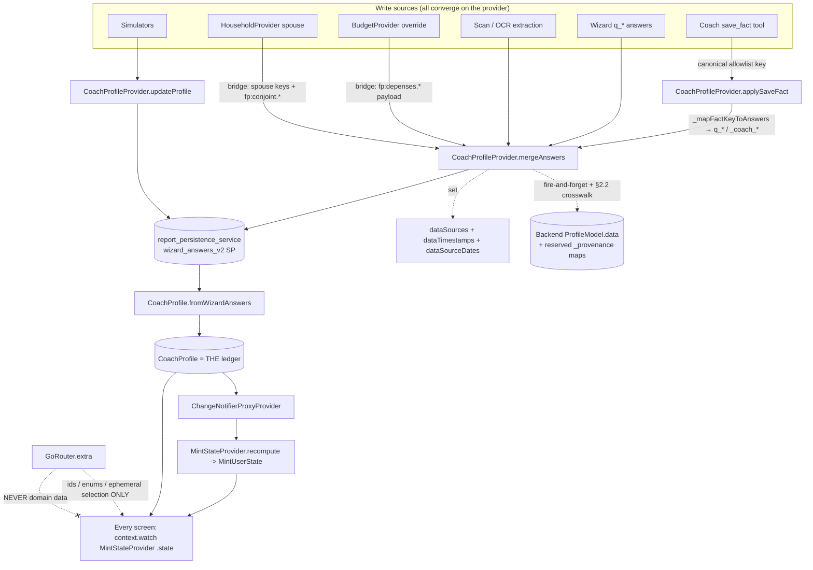

# DATA_LEDGER.md — MINT Canonical Data Ledger

> **Baseline note:** file:line references were originally audited against `apps/mobile/` and `services/backend/` at commit `255373b`, then corrected on this branch. Treat every reference as a HEAD contract and re-verify after code movement.

> **Status:** normative spec for the coding agent (Codex). Mechanical, testable, implementable.
> **Frozen baseline:** commit `255373b` (2026-04-21).
> **Scope:** defines THE single typed registry of every user data field MINT knows. Every screen reads/writes from this ledger and nowhere else.
> **Conflict order:** `rules.md` (tier 1) > `CLAUDE.md` (tier 2) > this file (tier 3 operational). This file does not override compliance.

---

## 0. What "the ledger" is (concretely, in existing code)

The ledger is **not new infrastructure**. It is the formalisation of the spine that already exists. Do not rebuild it.

| Layer | Existing artefact (path) | Role in the ledger |
|---|---|---|
| Canonical model | `apps/mobile/lib/models/coach_profile.dart` → `CoachProfile` (+ sub-models `PrevoyanceProfile`, `PatrimoineProfile`, `DetteProfile`, `DepensesProfile`, `ConjointProfile`, `GoalA/GoalB`) | The typed in-memory record. THE source of truth. |
| Single write path | `apps/mobile/lib/providers/coach_profile_provider.dart` → `mergeAnswers()` / `applySaveFact()` / `updateProfile()` | The ONLY mutators. No screen-local persistence. |
| Persistence | `report_persistence_service.dart` → SharedPreferences key `wizard_answers_v2`; reconstructed via `CoachProfile.fromWizardAnswers()` | Durable local store; survives restart. |
| Computed state | `apps/mobile/lib/providers/mint_state_provider.dart` → `MintUserState` (`models/mint_user_state.dart`) | Derived read-model (lifecyclePhase, archetype, budgetGap, caps, confidence, friScore). Recomputed on every profile change via `ChangeNotifierProxyProvider`. |
| Provenance (mobile) | `CoachProfile.dataSources : Map<String, ProfileDataSource>` + `CoachProfile.dataTimestamps : Map<String, DateTime>` + `CoachProfile.dataSourceDates : Map<String, DateTime?>` (`coach_profile.dart:1415-1426`) | Per-field {source, updatedAt, sourceDate}; serialized with the profile (`coach_profile.dart:2264-2287`, `2361-2365`). |
| Backend store | `ProfileModel.data : JSON dict`, written by `save_fact` against the **40-key** allowlist `_SAVE_FACT_ALLOWED_KEYS` (`services/backend/app/api/v1/endpoints/coach_chat.py:1071`) | Offline-first mirror; sync is fire-and-forget. |
| Decay | `apps/mobile/lib/services/biography/freshness_decay_service.dart` | Two-tier freshness, 0.60 refresh threshold. API is `weight(BiographyFact fact, DateTime now)` — see §5. |
| Confidence | `services/backend/app/services/confidence/enhanced_confidence_service.py` | 4-axis score; consumes source + freshness. |

**`models/profile.dart` + `ProfileProvider` are NOT part of the ledger.** The
product-screen migration is now done: `ProfileProvider` is not registered in
`app.dart`, and production screens/widgets no longer import it or read
`context.read/watch<ProfileProvider>()`. The former `hasDebt` consumers now use
`lookupSafeModeFlag(context)`, which resolves from the `CoachProfileProvider` /
`MintUserState` spine. The legacy module still exists because
`services/api_service.dart`, `services/wizard_service.dart` and tests still use
the old `Profile` DTO. Do not extend it. Final deletion is a separate service
migration, guarded by
`test/architecture/no_legacy_profile_provider_consumers_test.dart` plus a future
non-screen DTO parity test.

---

## 1. Ledger invariants (acceptance criteria — a violation is a release-blocking bug)

These restate §F of the wiring findings. CI must enforce I-1, I-3, I-6, I-7.

- **I-1 — SINGLE SOURCE.** Every screen reads the domain data it renders from the ledger (`context.watch<MintStateProvider>().state` or `CoachProfileProvider.profile`) ONLY. A screen MUST NOT read domain data from `GoRouter.extra`.
- **I-2 — extra carries only ephemera.** `GoRouter.extra` / query params may carry ids, enums, ephemeral UI selection. They MUST NOT carry the financial values a screen needs to render. (Fixes `/scan/review`, `/scan/impact`, `/rapport`, `/portfolio` dead roads — wiring findings §C; per-route contracts in §7A.)
- **I-3 — SINGLE WRITE PATH.** Every write goes through `CoachProfileProvider.mergeAnswers()` or `.applySaveFact()` (which itself calls `mergeAnswers`). No `SharedPreferences`/file/DB write of domain data from a screen or service that bypasses the provider. Simulators that write back MUST call `provider.updateProfile()` (already correct — keep it).
- **I-4 — NO FINANCIAL-DATA ISLANDS.** Every isolated provider that owns authoritative financial/profile state (`BudgetProvider`, `HouseholdProvider`, plan freshness) MUST bridge through `CoachProfileProvider` or an explicit recompute path so `MintUserState` is never stale. Raw documents, conversations and timeline/activity stores are different: they keep ids, metadata and activity; only extracted/confirmed financial facts flow into the ledger via scan or coach write APIs. See §7.
- **I-5 — PROJECTIONS ARE RANGED.** Every consumer that renders a projected number MUST also render a range + `EnhancedConfidence` + "à confirmer". No bare numbers. No promissory terms (CLAUDE.md §5).
- **I-6 — DIFF NOT FORM.** Collection asks only the missing/stale delta. Freshness < 0.60 ⇒ **re-confirm**, never blank re-ask. Implement on top of `data_block_enrichment_screen.dart` (≈70% built).
- **I-7 — ALLOWLIST IS THE CONTRACT.** A field is writable via the coach/backend ONLY if its key is in `_SAVE_FACT_ALLOWED_KEYS` (40 keys). Adding a coach-writable field = adding to that set + the mobile `_mapFactKeyToAnswers` switch + a row in this ledger. The three MUST stay in sync. The parity guard in §8.1 enforces backend allowlist = mobile switch = this ledger.

---

## 2. Type system & column legend

Every ledger row uses these columns.

- **key** — canonical identifier. For coach/backend-writable fields this is the exact `_SAVE_FACT_ALLOWED_KEYS` key. For mobile-only fields it is the Dart field path on `CoachProfile` (e.g. `patrimoine.epargneLiquide`). The wizard-answer key (`q_*` or `_coach_*`) is given when it differs — it is the storage key in `wizard_answers_v2`, produced by `_mapFactKeyToAnswers` and read back by `fromWizardAnswers`. **These wizard keys are transcribed verbatim from the real switch (`coach_profile_provider.dart:869-974`); do not paraphrase them.**
- **type+unit** — Dart type and unit. `CHF` = Swiss francs; `CHF/mo` = monthly; `%` = percent (stored as written, e.g. `1.5` not `0.015`, except `tauxConversion*` which are decimals); `yr` = years; ISO dates are `YYYY-MM-DD` strings on disk, `DateTime` in model.
- **domain** — owning domain: `identity`, `income`, `expenses`, `prevoyance` (AVS/LPP/3a/LP), `patrimoine`, `dettes`, `goals`, `couple`, `meta`.
- **sources** — allowed `ProfileDataSource` values for this field. See the enum definition below. A field may declare a subset; writes claiming a source outside the subset are rejected.
- **fresh** — freshness tier: `annual` / `volatile` / `static`. Maps to the `freshnessCategory` string the decay service reads (§5). Decay + 0.60 refresh threshold per `FreshnessDecayService`.
- **wconf** — default accuracy weight used by the confidence engine when the field's current source is the lowest-weight source it declares. Actual weight at runtime = weight of the field's recorded source (§6).
- **write** — write path. ALWAYS `CoachProfileProvider`. `mergeAnswers` (wizard/inline/scan), `applySaveFact` (coach tool → maps to wizard key), `updateProfile` (simulator write-back). Never screen-local.
- **consumers** — the computations/screens that read this field.

### 2.1 `ProfileDataSource` — the ONLY mobile source enum (verified, `coach_profile.dart:36`)

The mobile enum has **exactly 5 members**. Use ONLY these names in every `sources:` cell. There is **no `scan` member**: OCR extraction writes are recorded as `estimated` at extraction time and promoted to `certificate` only after the user confirms the extracted figure (§7A `/scan/review`).

```
estimated       .25   // MINT default / unconfirmed OCR extraction
userInput       .60   // manual entry
crossValidated  .70   // manual entry + cross-check
certificate     .95   // confirmed from a scanned certificate
openBanking    1.00   // live bLink/SFTI feed
```

These weights are the accuracy-axis weights in `enhanced_confidence_service.py`. No other source token may appear in a `sources:` cell. If a row previously implied "scan(.85)", read it as: extraction → `estimated`, post-confirm → `certificate`.

**Dossier sentinel:** typed dossier payloads may emit `source: "missing"` for an
absent input so the PDF can show an explicit gap. This is a dossier-local
sentinel only. It is NOT a `ProfileDataSource`, must never be persisted into
`CoachProfile.dataSources`, and is valid only when the paired value is absent
and `next_questions` exposes the gap.

### 2.2 Backend `DataSource` — the DIFFERENT backend enum, and the mandatory cross-walk

The backend uses a **separate 8-member enum** `DataSource` with **different names and weights** (`services/backend/app/services/document_parser/document_models.py:39`, weights in `DATA_SOURCE_ACCURACY:57`):

```
user_estimate              0.25
user_entry                 0.50
user_entry_cross_validated 0.70
document_scan              0.85
document_scan_verified     0.95
open_banking               1.00
institutional_api          0.95
system_estimate            0.25
```

Mobile ↔ backend are NOT the same enum and their weights differ (mobile `userInput`=.60 vs backend `user_entry`=.50). Any code that syncs mobile `dataSources` into backend `data_sources` (§6.2) MUST apply this exact cross-walk (a new module `services/backend/app/services/confidence/source_crosswalk.py`):

| mobile `ProfileDataSource` | backend `DataSource` | note |
|---|---|---|
| `estimated` | `system_estimate` | both .25 |
| `userInput` | `user_entry` | weight changes .60 → .50 by design; backend axis governs backend score |
| `crossValidated` | `user_entry_cross_validated` | both .70 |
| `certificate` | `document_scan_verified` | both .95 (a confirmed cert = verified scan) |
| `openBanking` | `open_banking` | both 1.00 |

Backend-only members `document_scan` (.85, unconfirmed OCR), `institutional_api` (.95), and `user_estimate` (.25) have **no mobile pre-image**: `document_scan`/`institutional_api` are produced only by backend document/API pipelines, and `user_estimate` (a second .25 member alongside `system_estimate`) is a backend-internal estimate tag; the mobile→backend sync maps mobile `estimated` to `system_estimate` (per the table above), never to `user_estimate`. None of the three is ever emitted by the mobile→backend sync. This table is the single source of truth for the cross-walk; §6 references it, does not restate it.

Current defensive fallback: `mobile_source_to_backend(None)`, `mobile_source_to_backend("")`, and unknown future mobile source names degrade to backend `user_entry`. This is intentionally conservative for legacy payloads, but it is a drift risk: adding a new `ProfileDataSource` member on mobile must update this table and `test_source_crosswalk.py`, otherwise backend confidence falls back to weight .50.

---

## 3. Ledger — coach/backend-writable fields (the 40-key allowlist)

These **40** keys are the exact contents of `_SAVE_FACT_ALLOWED_KEYS` (`coach_chat.py:1071`). They are the ONLY keys the coach (`save_fact`) and backend may write. `wizard key` = the target produced by `CoachProfileProvider._mapFactKeyToAnswers`, verbatim from the real switch. The §8.1 guard must stay green: backend allowlist, mobile switch and this ledger have the same keyset.

### 3.1 Identity / location

| key | wizard key | type+unit | domain | sources | fresh | wconf | write | consumers |
|---|---|---|---|---|---|---|---|---|
| `birthYear` | `q_birth_year` | int (year) | identity | userInput, certificate | static | .60 | applySaveFact/mergeAnswers | `age`, `archetype`, AVS/LPP projection, CapEngine (`age>=45`), lifecyclePhase |
| `dateOfBirth` | `q_date_of_birth` | String ISO date | identity | userInput, certificate | static | .60 | applySaveFact/mergeAnswers | `ageOrNull` (precise), AVS21 reference age |
| `canton` | `q_canton` | String (2-letter enum) | identity | userInput, certificate | annual | .60 | applySaveFact/mergeAnswers | `TaxCalculator`, `NetIncomeBreakdown`, budget, all fiscal screens |
| `commune` | `q_commune` | String | identity | userInput | annual | .60 | applySaveFact/mergeAnswers | communal tax multiplier, fiscal precision |
| `householdType` | `q_civil_status` | enum {single, couple, concubine, family} | identity/couple | userInput | static* | .60 | applySaveFact/mergeAnswers | `isCouple`, couple AVS plafonnement, succession, lifecyclePhase |
| `employmentStatus` | `q_employment_status` | enum {salarie, independant, retraite, employee, self_employed, retired, mixed, unemployed, student} | identity | userInput | static* | .60 | applySaveFact/mergeAnswers | `archetype` (indep w/wo LPP), LPP eligibility, SafeMode E1/E4 |
| `goal` | `q_main_goal` (normalized) | enum {house, retire, emergency, invest, optimize_taxes, other} | goals | userInput | static* | .60 | applySaveFact/mergeAnswers | `GoalA`, goal-aware prioritization, Pulse hero |
| `targetRetirementAge` | `q_target_retirement_age` | int (58–70) | identity | userInput | static* | .60 | applySaveFact/mergeAnswers | `effectiveRetirementAge`, `anneesAvantRetraite`, all retirement sims |
| `gender` | `q_gender` | enum {M, F} | identity | userInput, certificate | static | .60 | applySaveFact/mergeAnswers | AVS21 transitional reference age (women 1961–63), mortality cohort |
| `nationality` | `q_nationality` | String ISO-2 | identity | userInput, certificate | static | .60 | applySaveFact/mergeAnswers | `archetype`, FATCA-derived `canContribute3a`, frontalier/cross-border context |

\* `static*` = changes are **life events**, not decay. Do not auto-stale; trigger the event flow (marriage, retirement) instead.

### 3.2 Income

| key | wizard key | type+unit | domain | sources | fresh | wconf | write | consumers |
|---|---|---|---|---|---|---|---|---|
| `incomeNetMonthly` | `q_net_income_period_chf` + `q_pay_frequency='monthly'` | double CHF/mo | income | userInput, certificate, openBanking | annual | .60 | applySaveFact/mergeAnswers | budget, `resteAVivreMensuel`, SafeMode |
| `incomeNetYearly` | `q_net_income_period_chf` + `q_pay_frequency='yearly'` | double CHF/yr | income | userInput, certificate | annual | .60 | applySaveFact/mergeAnswers | tax, affordability ~33% |
| `incomeGrossMonthly` | `q_gross_salary_annual` (= value × 12) | double CHF/mo | income | userInput, certificate, openBanking | annual | .60 | applySaveFact/mergeAnswers | `salaireBrutMensuel`, `revenuBrutAnnuel`, LPP coordination, AVS RAMD |
| `incomeGrossYearly` | `q_gross_salary_annual` | double CHF/yr | income | userInput, certificate | annual | .60 | applySaveFact/mergeAnswers | `revenuBrutAnnuel`, tax tiers, LPP insured salary inference |
| `employmentRate` | `q_employment_rate` | double % (0–100) | income | userInput | annual | .60 | applySaveFact/mergeAnswers | part-timer LPP pro-rating, coordination deduction |
| `annualBonus` | `q_annual_bonus` | double CHF/yr | income | userInput, certificate | annual | .60 | applySaveFact/mergeAnswers | `bonusPourcentage`, `revenuBrutAnnuel` |
| `selfEmployedNetIncome` | `q_net_income_period_chf` + `q_pay_frequency='yearly'` + `q_employment_status='independant'` | double CHF/yr | income | userInput, certificate | annual | .60 | applySaveFact/mergeAnswers | independant archetype, 3a max 36'288 (registry `pillar3a.max_without_lpp`), AVS indep |

> Income keys map to a **pay-frequency-consistent pair** so `fromWizardAnswers` computes `salaireBrutMensuel` correctly (the `incomeNetMonthly/Yearly` cases set BOTH `q_net_income_period_chf` and `q_pay_frequency`; accepted yearly tokens are `yearly`, `annual`, and `annuel`; the gross cases normalise to `q_gross_salary_annual`). A write to a `Net*` key MUST NOT silently overwrite a `Gross*`-derived value of a different frequency. `q_pay_frequency` is income-only; housing costs use `q_housing_cost_frequency` so budget collection cannot corrupt income chronology.

### 3.3 LPP (2nd pillar)

| key | wizard key | type+unit | domain | sources | fresh | wconf | write | consumers |
|---|---|---|---|---|---|---|---|---|
| `lppInsuredSalary` | `_coach_salaire_assure` | double CHF/yr | prevoyance | certificate, userInput | annual | .95 (cert) | applySaveFact/mergeAnswers | `salaireAssure`; flips `isLppFromCertificate`; LPP rente precision |
| `avoirLpp` | `_coach_avoir_lpp` | double CHF | prevoyance | certificate, userInput, estimated | annual | .95 / .25 | applySaveFact/mergeAnswers | `avoirLppTotal`; LPP capital@65; rente projection; `archetype` indep |
| `avoirLppObligatoire` | `_coach_avoir_lpp_oblig` | double CHF | prevoyance | certificate | annual | .95 | applySaveFact/mergeAnswers | split conversion rate (6.8% oblig), flips `isLppFromCertificate` |
| `avoirLppSurobligatoire` | `_coach_avoir_lpp_suroblig` | double CHF | prevoyance | certificate | annual | .95 | applySaveFact/mergeAnswers | surobligatoire conversion rate, rente split |
| `lppBuybackMax` | `_coach_rachat_maximum` | double CHF | prevoyance | certificate, userInput | annual | .95 | applySaveFact/mergeAnswers | `rachatMaximum`, `lacuneRachatRestante`, rachat sim, tax deduction |
| `has2ndPillar` | `q_has_pension_fund` | bool | prevoyance | userInput | static* | .60 | applySaveFact/mergeAnswers | LPP eligibility gate, archetype indep w/wo LPP |
| `hasVoluntaryLpp` | `q_has_pension_fund` | bool | prevoyance | userInput | static* | .60 | applySaveFact/mergeAnswers | independant facultative caisse logic |

> **Source inference (existing, keep):** `CoachProfile._resolveDataSources` infers `certificate` for LPP fields when certificate-only signals exist (`_coach_avoir_lpp_oblig`, `_coach_salaire_assure`, `tauxConversionSuroblig`, `_coach_rachat_maximum`), else `estimated`. The ledger's per-field provenance (§6) must record the **actual** source at write time and override this inference.

### 3.4 Pillar 3a

| key | wizard key | type+unit | domain | sources | fresh | wconf | write | consumers |
|---|---|---|---|---|---|---|---|---|
| `pillar3aAnnual` | `q_3a_annual_contribution` | double CHF/yr | prevoyance | userInput, certificate, openBanking | annual | .60 | applySaveFact/mergeAnswers | 3a max gate (7'258 / 36'288; `get_swiss_constants(pillar3a)` registry: `historical_limits.2026=7258`, `max_without_lpp=36288`), tax deduction sim, CapEngine |
| `pillar3aBalance` | `q_3a_total` | double CHF | prevoyance | certificate, openBanking, userInput | annual | .95 / 1.00 | applySaveFact/mergeAnswers | `totalEpargne3a`, retirement capital, `comptes3a` |

> 3a writes MUST respect `canContribute3a` (false for US/FATCA; conditional for frontalier permis G). The main-user FATCA source of truth is `nationality` (`q_nationality` in durable answers); `isFatcaResident` is a derived runtime/profile state, not a second persisted answer key. A `pillar3a*` write for a US person should be accepted as data but flagged non-contributable, not silently zeroed.

### 3.5 Savings / wealth / debt

| key | wizard key | type+unit | domain | sources | fresh | wconf | write | consumers |
|---|---|---|---|---|---|---|---|---|
| `savingsMonthly` | `q_savings_monthly` | double CHF/mo | patrimoine | userInput, openBanking | annual | .60 | applySaveFact/mergeAnswers | budget gap, `capSequencePlan`, FRI score |
| `totalSavings` | `q_cash_total` | double CHF | patrimoine | userInput, certificate, openBanking | annual | .60 | applySaveFact/mergeAnswers | `patrimoine.epargneLiquide`, emergency fund (SafeMode Signal C), liquidity axis |
| `wealthEstimate` | `q_wealth_estimate` | double CHF | patrimoine | userInput, estimated | annual | .60 | applySaveFact/mergeAnswers | `totalPatrimoine`, wealth tax, net worth |
| `targetPropertyValue` | `q_target_property_value` | double CHF | logement/scenario | userInput, estimated | annual | .60 | applySaveFact/mergeAnswers | `patrimoine.targetPropertyValue`, buy-property affordability; MUST NOT inflate owned real estate or FRI property-owner logic |
| `mortgageBalance` | `q_mortgage_balance` | double CHF | dettes/patrimoine | userInput, certificate | volatile | .60 | applySaveFact/mergeAnswers | `patrimoine.mortgageBalance`, transmission mortgage assumption, LTV, renewal shock |
| `mortgageRate` | `q_mortgage_rate` | double % | dettes/patrimoine | userInput, certificate | volatile | .60 | applySaveFact/mergeAnswers | `patrimoine.mortgageRate`, mortgage cost, renewal sim, buy-property reconfirm |
| `hasDebt` | `q_has_consumer_debt` | bool | dettes | userInput | volatile | .60 | applySaveFact/mergeAnswers | SafeMode Signal A, `isInDebtCrisis` |
| `totalDebt` | `q_total_debt_balance_chf` + `q_has_consumer_debt=(value>0)` | double CHF | dettes | userInput, certificate | volatile | .60 | applySaveFact/mergeAnswers | `dettes.nonVentilee` until categorized `_coach_dettes_*` details cover the total; debt-to-income 0.33, net worth |
| `parentAnnualLivingCosts` | `q_parent_annual_living_costs` OR composed from `q_housing_cost_period_chf` + `q_housing_cost_frequency` and monthly fixed-charge keys | double CHF/yr | expenses/scenario | userInput, openBanking | volatile | .60 | applySaveFact/mergeAnswers | `PropertyTransmissionInputs.parentAnnualLivingCosts`, retirement-affordability guard, dossier specialist handoff |

> `wealthEstimate` is intentionally separate from `totalSavings`: `q_cash_total` drives liquidity/emergency-fund logic, while `q_wealth_estimate` is read by `fromWizardAnswers` as a residual investment estimate (`wealthEstimate - cash - propertyMarketValue`, floored at 0) so it affects `totalPatrimoine` without inflating cash.
> `targetPropertyValue` is intentionally separate from `patrimoine.propertyMarketValue`: the former is a planned purchase price, the latter is an owned property value.
> `q_cash_total` is chronologically earlier than `q_target_property_value`: MINT must persist available liquid savings even when no purchase target exists yet, then ask for the target only in buy-property contexts.
> `totalDebt` is an aggregate debt value. It MUST NOT write `_coach_dettes_autres`, because that key is a debt category. If categorized debt keys exist and their sum is lower than `q_total_debt_balance_chf`, `CoachProfile.fromWizardAnswers` keeps the difference as `dettes.nonVentilee`; if only `hasDebt=true` is known, no debt amount is invented.

### 3.6 Spouse (couple)

| key | wizard key | type+unit | domain | sources | fresh | wconf | write | consumers |
|---|---|---|---|---|---|---|---|---|
| `spouseBirthYear` | `q_partner_birth_year` | int (year) | couple | userInput | static | .60 | applySaveFact/mergeAnswers | `conjoint.birthYear`, couple AVS, survivor question |
| `spouseIncomeNetMonthly` | `q_partner_net_income_chf` | double CHF/mo | couple | userInput | annual | .60 | applySaveFact/mergeAnswers | `revenuBrutAnnuelCouple`, couple budget, AVS plafonnement |
| `spouseAvsContributionYears` | `q_spouse_avs_contribution_years` | int (yr) | couple | userInput, certificate | annual | .60 | applySaveFact/mergeAnswers | couple AVS rente, lacunes |

> Spouse keys feed `CoachProfile.conjoint`. `HouseholdProvider` now syncs only
> verified relationship state (`etatCivil` when needed + `conjoint.invitationLevel`
> = `invited`/`linked`) into the ledger. It MUST NOT invent financial spouse data:
> `spouseBirthYear`, `spouseIncomeNetMonthly` and `spouseAvsContributionYears`
> still come from Data Quest / scan / user confirmation.

### 3.7 AVS (1st pillar)

| key | wizard key | type+unit | domain | sources | fresh | wconf | write | consumers |
|---|---|---|---|---|---|---|---|---|
| `hasAvsGaps` | `q_avs_lacunes_status` (`true` → `unknown`, `false` → `no_gaps`) | bool | prevoyance | userInput, certificate | annual | .60 | applySaveFact/mergeAnswers | `lacunesAVS` flag, AVS rente reduction warning |
| `avsContributionYears` | `q_avs_contribution_years` | int (yr) | prevoyance | certificate, userInput | annual | .95 / .60 | applySaveFact/mergeAnswers | `anneesContribuees`, AVS full-rente eligibility (44 yr), RAMD |

**Count check (must match code):** 3.1–3.7 = 10 (identity) + 7 (income) + 7 (LPP) + 2 (3a) + 9 (savings/wealth/debt/scenario) + 3 (spouse) + 2 (AVS) = **40 keys** = `len(_SAVE_FACT_ALLOWED_KEYS)`. CI test §8.1 asserts `len == 40`.

### 3.8 QA guard — allowlist/mobile parity

At `5175eaa`, the mobile `_mapFactKeyToAnswers` switch handled only **24** of the 36 allowlist keys; the other **12** fell through `default: return const {}`. This branch repairs that drift and adds `tools/checks/tests/test_codex_ledger_parity.py`, which fails if backend allowlist, mobile switch and this ledger diverge.

The formerly missing keys now map as follows:

| allowlist key | wizard key to add | `fromWizardAnswers` target field |
|---|---|---|
| `goal` | `q_main_goal` | `goalA` (GoalA.type) |
| `selfEmployedNetIncome` | `q_net_income_period_chf` + `q_pay_frequency='yearly'` + `q_employment_status='independant'` | self-employed income and archetype |
| `has2ndPillar` | `q_has_pension_fund` | LPP eligibility flag |
| `hasVoluntaryLpp` | `q_has_pension_fund` | voluntary/facultative LPP gate |
| `hasDebt` | `q_has_consumer_debt` | `dettes` presence flag |
| `totalDebt` | `q_total_debt_balance_chf` + `q_has_consumer_debt=(value>0)` | `dettes.nonVentilee` until categorized `_coach_dettes_*` details cover the total |
| `spouseBirthYear` | `q_partner_birth_year` | `conjoint.birthYear` |
| `spouseIncomeNetMonthly` | `q_partner_net_income_chf` | `conjoint.salaireBrutMensuel` (net→gross handling per existing conjoint logic) |
| `spouseAvsContributionYears` | `q_spouse_avs_contribution_years` | `conjoint.prevoyance.anneesContribuees` |
| `hasAvsGaps` | `q_avs_lacunes_status` (`unknown`/`no_gaps`) | `prevoyance.lacunesAVS` flag |
| `avsContributionYears` | `q_avs_contribution_years` | `prevoyance.anneesContribuees` |

---

## 4. Ledger — mobile-only typed fields (not coach-writable)

These exist on `CoachProfile` sub-models and are written by wizard / scan extraction / simulator write-back via `mergeAnswers`/`updateProfile`. They are **not** in the allowlist (the coach cannot set them by chat today). Listed because computations consume them and the provenance contract (§6) applies.

### 4.1 AVS / LPP detail (from certificate extraction)

| key (field path) | type+unit | domain | sources | fresh | wconf | write | consumers |
|---|---|---|---|---|---|---|---|
| `prevoyance.renteAVSEstimeeMensuelle` | double CHF/mo | prevoyance | certificate, estimated | annual | .95 | mergeAnswers (scan) | AVS rente display, SafeMode E1 retiree |
| `prevoyance.ramd` | double CHF | prevoyance | certificate | annual | .95 | mergeAnswers (scan) | AVS rente exact computation |
| `prevoyance.lacunesAVS` | int yr | prevoyance | certificate | annual | .95 | mergeAnswers (scan) | AVS reduction, gap-fill prompt |
| `prevoyance.bonificationsEducatives` | int yr | prevoyance | certificate | annual | .95 | mergeAnswers (scan) | AVS bonifications LAVS art.29sexies |
| `prevoyance.salaireAssure` | double CHF/yr | prevoyance | certificate | annual | .95 | mergeAnswers (scan) | LPP rente; `isLppFromCertificate` |
| `prevoyance.tauxConversion` | double decimal (≥0.068) | prevoyance | certificate, estimated | annual | .95 | mergeAnswers (scan) | LPP rente@65 |
| `prevoyance.tauxConversionSuroblig` | double decimal | prevoyance | certificate | annual | .95 | mergeAnswers (scan) | surobligatoire rente |
| `prevoyance.bonificationRate` | double % | prevoyance | certificate | annual | .95 | mergeAnswers (scan) | LPP accumulation; `isLppFromCertificate` |
| `prevoyance.projectedRenteLpp` | double CHF/yr | prevoyance | certificate | annual | .95 | mergeAnswers (scan) | LPP rente display (cert-provided, not computed) |
| `prevoyance.projectedCapital65` | double CHF | prevoyance | certificate | annual | .95 | mergeAnswers (scan) | capital@65 display |
| `prevoyance.disabilityCoverage` | double CHF | prevoyance | certificate | annual | .95 | mergeAnswers (scan) | invalidité coverage card |
| `prevoyance.deathCoverage` | double CHF | prevoyance | certificate | annual | .95 | mergeAnswers (scan) | survivor / death coverage card |
| `prevoyance.rachatEffectue` | double CHF | prevoyance | userInput, certificate | annual | .60 | mergeAnswers | `lacuneRachatRestante` |
| `prevoyance.dateRachats` | List\<DateTime\> | prevoyance | userInput, certificate | static | .60 | mergeAnswers | LPP art.79b 3-yr blocking, capital withdrawal eligibility |
| `prevoyance.comptes3a[]` | List\<Compte3a{provider,solde,rendementEstime}\> | prevoyance | userInput, openBanking, certificate | annual | .60 | mergeAnswers | `rendementMoyen3a`, 3a per-account view |
| `prevoyance.librePassage[]` | List\<LibrePassageCompte{institution,solde,dateOuverture}\> | prevoyance | userInput, certificate | annual | .60 | mergeAnswers | `totalLibrePassage`, retirement capital |

#### 4.1.1 Scenario-composed inputs (not standalone persisted fields)

These inputs are computed from ledger facts when a scenario needs a bounded
aggregate. They MUST NOT become silent standalone facts: every fixture and
runtime result must expose the source keys used to compose them.

| composed input | type+unit | domain | formula | ledger source keys | source/confidence | write | consumers |
|---|---|---|---|---|---|---|---|
| `parentAnnualRetirementIncome` | double CHF/yr | prevoyance/scenario | `(prevoyance.renteAVSEstimeeMensuelle * 12) + prevoyance.projectedRenteLpp` | `prevoyance.renteAVSEstimeeMensuelle`, `prevoyance.projectedRenteLpp` | estimated / medium until source-level reconciliation is implemented | computed in `/succession`, never persisted as a standalone ledger field | `PropertyTransmissionInputs.parentAnnualRetirementIncome`, `/api/v1/scenarios` succession fixtures |

### 4.2 Patrimoine / housing (incl. simulator write-back)

| key (field path) | type+unit | domain | sources | fresh | wconf | write | consumers |
|---|---|---|---|---|---|---|---|
| `patrimoine.epargneLiquide` | double CHF | patrimoine | userInput, openBanking | annual | .60 | mergeAnswers / updateProfile | liquidity axis, emergency fund |
| `patrimoine.investissements` | double CHF | patrimoine | userInput, openBanking | annual | .60 | mergeAnswers / updateProfile | net worth, investment view |
| `patrimoine.deviseInvestissements` | enum {chf,usd,eur} | patrimoine | userInput | static | .60 | mergeAnswers | FX exposure, US person PFIC flag |
| `patrimoine.propertyMarketValue` | double CHF | patrimoine | userInput, estimated | annual | .60 | mergeAnswers / updateProfile | `immobilierNet`, LTV, valeur locative |
| `patrimoine.mortgageBalance` | double CHF | dettes/patrimoine | userInput, certificate | volatile | .60 | mergeAnswers / updateProfile | `loanToValue`, renewal shock, SafeMode |
| `patrimoine.mortgageRate` | double % | dettes/patrimoine | userInput, certificate | volatile | .60 | mergeAnswers / updateProfile | mortgage cost, renewal sim |
| `patrimoine.monthlyRent` | double CHF/mo | expenses/patrimoine | userInput | volatile | .60 | mergeAnswers | rent-vs-buy, budget |
| `patrimoine.mortgageCapacity` (`_coach_mortgage_capacity`) | double CHF | patrimoine | estimated (calc) | volatile | .25 | mergeAnswers (`/hypotheque`) | affordability sim write-back (CAL-03) |
| `patrimoine.estimatedMonthlyPayment` (`_coach_estimated_monthly_payment`) | double CHF/mo | patrimoine | estimated (calc) | volatile | .25 | mergeAnswers (`/hypotheque`) | affordability sim write-back (CAL-03) |

### 4.3 Dettes detail (S45 enrichment)

| key (field path) | type+unit | domain | sources | fresh | wconf | write | consumers |
|---|---|---|---|---|---|---|---|
| `dettes.creditConsommation` | double CHF | dettes | userInput, certificate | volatile | .60 | mergeAnswers | `detteConsommation`, SafeMode Signal A |
| `dettes.leasing` | double CHF | dettes | userInput | volatile | .60 | mergeAnswers | `detteConsommation`, SafeMode |
| `dettes.hypotheque` | double CHF | dettes | userInput, certificate | volatile | .60 | mergeAnswers | `detteStructurelle`, `interetsHypothecairesAnnuels` |
| `dettes.autresDettes` | double CHF | dettes | userInput | volatile | .60 | mergeAnswers | SafeMode Signal A |
| `dettes.nonVentilee` | double CHF | dettes | derived from `totalDebt` | volatile | .60 | computed/read-only unless explicitly reconciled | preserves declared total debt while the user progressively ventilates categories |
| `dettes.taux{Hypotheque,CreditConso,Leasing}` | double % | dettes | userInput, certificate | volatile | .60 | mergeAnswers | `tauxMaxConsommation`, interest cost |
| `dettes.mensualite{Hypotheque,CreditConso,Leasing}` | double CHF/mo | dettes | userInput | volatile | .60 | mergeAnswers | `totalMensualite`, debt-to-income 0.33 |
| `dettes.echeance{Hypotheque,CreditConso,Leasing}` | DateTime | dettes | userInput, certificate | static | .60 | mergeAnswers | renewal shock timing, payoff date |
| `dettes.rangHypotheque` | int {1,2} | dettes | userInput | static | .60 | mergeAnswers | mortgage rank logic |
| `dettes.amortissementIndirect` | bool | dettes | userInput | static | .60 | mergeAnswers | 3a-linked amortisation, tax |

### 4.4 Expenses

| key (field path) | type+unit | domain | sources | fresh | wconf | write | consumers |
|---|---|---|---|---|---|---|---|
| `depenses.loyer` | double CHF/mo | expenses | userInput, openBanking | volatile | .60 | mergeAnswers/updateFromOpenBanking | budget, `resteAVivreMensuel` |
| `depenses.assuranceMaladie` | double CHF/mo | expenses | userInput, certificate, openBanking | annual | .60 | mergeAnswers/updateFromOpenBanking | budget, LAMal |
| `depenses.electricite` | double? CHF/mo | expenses | userInput, openBanking | volatile | .60 | mergeAnswers/updateFromOpenBanking | `totalMensuel`, budget gap |
| `depenses.transport` | double? CHF/mo | expenses | userInput, openBanking | volatile | .60 | mergeAnswers/updateFromOpenBanking | `totalMensuel`, budget gap |
| `depenses.telecom` | double? CHF/mo | expenses | userInput, openBanking | volatile | .60 | mergeAnswers/updateFromOpenBanking | `totalMensuel`, budget gap |
| `depenses.fraisMedicaux` | double? CHF/mo | expenses | userInput, openBanking | volatile | .60 | mergeAnswers/updateFromOpenBanking | `totalMensuel`, budget gap |
| `depenses.autresDepensesFixes` | double? CHF/mo | expenses | userInput | volatile | .60 | mergeAnswers | `totalMensuel`, budget gap |

> `depenses.*` field paths are NOT allowlist keys and have NO `_mapFactKeyToAnswers` case. The BudgetProvider bridge (§7) therefore writes them via the **field-path payload shape** defined in §7B, not via coach `save_fact`. The durable wizard/storage keys are: `depenses.loyer → q_housing_cost_period_chf` with `q_housing_cost_frequency` for its period, `depenses.assuranceMaladie → q_lamal_premium_monthly_chf`, `depenses.electricite → _coach_depenses_electricite`, `depenses.transport → _coach_depenses_transport`, `depenses.telecom → _coach_depenses_telecom`, `depenses.fraisMedicaux → _coach_depenses_frais_medicaux`, `depenses.autresDepensesFixes → _coach_depenses_autres`.

### 4.5 Couple detail (`conjoint.*`) and goals/meta

| key (field path) | type+unit | domain | sources | fresh | wconf | write | consumers |
|---|---|---|---|---|---|---|---|
| `conjoint.{firstName,birthYear,dateOfBirth,gender}` | mixed | couple | userInput | static | .60 | mergeAnswers (+ Household bridge §7) | couple AVS, survivor |
| `conjoint.salaireBrutMensuel` | double CHF/mo | couple | userInput | annual | .60 | mergeAnswers | `revenuBrutAnnuelCouple` |
| `conjoint.prevoyance` | PrevoyanceProfile | couple | userInput, certificate | annual | .60 | mergeAnswers | couple retirement, survivor LPP |
| `conjoint.patrimoine` | PatrimoineProfile | couple | userInput | annual | .60 | mergeAnswers | couple liquidity |
| `conjoint.{nationality,isFatcaResident,canContribute3a,arrivalAge}` | mixed | couple | userInput | static | .60 | mergeAnswers | couple archetype, FATCA 3a block |
| `conjoint.invitationLevel` | enum {declared,invited,linked} | couple | userInput | static | .60 | mergeAnswers | couple data-sharing confidence |
| `goalA` | GoalA{type,targetDate,targetAmount,label} | goals | userInput | static* | .60 | mergeAnswers | goal-aware prioritization, Pulse, timeline |
| `goalsB[]` | List\<GoalB\> | goals | userInput | static* | .60 | mergeAnswers | secondary goals view |
| `plannedContributions[]` | List\<PlannedMonthlyContribution\> | goals | userInput | volatile | .60 | mergeAnswers | `total3aMensuel`, cap plan, check-in |
| `checkIns[]` | List\<MonthlyCheckIn\> | meta | userInput | n/a (event log) | n/a | mergeAnswers | streak, FRI history |
| `arrivalAge` | int yr | identity | userInput, certificate | static | .60 | mergeAnswers | `archetype` (expat vs native), LPP since-25 |
| `residencePermit` | String {B,C,L,G,Swiss} | identity | userInput, certificate | static* | .60 | mergeAnswers | `isCrossBorder`, frontalier, expat |
| `nombreEnfants` | int | identity/couple | userInput | static* | .60 | mergeAnswers | allocations, AVS bonifs, succession |
| `financialLiteracyLevel` | enum {beginner,intermediate,advanced} | meta | userInput | static* | .60 | mergeAnswers | scaffolding adaptivity (dignity principle) |
| `primaryFocus` | String `{cat}_{subcat}` | meta | userInput | static* | .60 | mergeAnswers | Pulse hero, goal contextualization |
| `initialProjectionSnapshot` | Map | meta | computed | n/a | n/a | updateProfile | before/after delta UI (§5 delta engine) |

> **Codex note:** fields in §4 that the coach SHOULD be able to capture by chat (e.g. `dettes.creditConsommation`, `depenses.loyer`, `patrimoine.investissements`) are candidates to promote into `_SAVE_FACT_ALLOWED_KEYS`. Promotion is a 3-file change (§1 I-7) gated by DPO/compliance review — do NOT promote silently.

---

## 5. Diff/delta engine — build on existing scaffolding

Reuse `data_block_enrichment_screen.dart` (`/data-block/:type`), `rank_enrichment_prompts()`, `freshness_decay_service.dart`. Do NOT rebuild.

### 5.1 The freshness bridge (HEAD — BiographyFact API plus field-path adapter)

`FreshnessDecayService.weight()` remains the immutable-fact primitive:
`static double weight(BiographyFact fact, DateTime now)`. HEAD also has the
field-path adapter below for runtime surfaces that hold a hydrated
`CoachProfile` but not a `BiographyFact`. The two freshness inputs must not be
conflated: (a) `BiographyRepository` immutable facts carry `updatedAt` +
`freshnessCategory`; (b) `CoachProfile.dataTimestamps`/`dataSourceDates`
provenance maps feed `weightForField`.

**Task T-3 (implemented at HEAD):** `FreshnessDecayService.weightForField(String fieldPath, CoachProfile profile, DateTime now)` resolves a field path to freshness inputs WITHOUT inventing a new decay model:

1. Runtime surfaces that already pass `BiographyFact` continue to call `weight(fact, now)`.
2. Field-path surfaces use the profile-provenance fallback: synthesise a transient `BiographyFact` with
   - `updatedAt = profile.dataTimestamps[fieldPath]` (if absent ⇒ treat as maximally stale ⇒ weight = floor 0.30),
   - `freshnessCategory =` the ledger `fresh` column for that path, mapped: `annual`→`'annual'`, `volatile`→`'volatile'`, `static`→ return `1.0` (static fields never decay; skip the weight call),
   then return `weight(synthetic, now)`.

The ledger `fresh` column (§3/§4) IS the authoritative `freshnessCategory` source for the fallback. `FreshnessDecayService.kFieldFreshnessCategory` is the generated/maintained map; do not guess categories in screens.

### 5.2 Delta-engine capability table

| Capability | Where it goes | Mechanical rule |
|---|---|---|
| Per-field provenance | §6 | `{source, sourceDate, updatedAt}` per field (mobile maps + backend). |
| Stale → re-confirm | `data_block_enrichment_screen.dart` | If `FreshnessDecayService.weightForField(path, profile, now) < 0.60` ⇒ show "On a noté X (il y a N mois) — toujours juste ?" with [Confirmer]/[Corriger] (all strings via `AppLocalizations`). Confirm ⇒ `mergeAnswers` same value, new `updatedAt` (resets decay). NEVER blank the field. |
| Diff not form | data-block + collection flows | Only render inputs for fields where value is null OR `weightForField < 0.60`. Skip fields already fresh. (I-6) |
| Before/after delta | new widget in data-block | Snapshot `MintUserState` before write into `initialProjectionSnapshot`; after `mergeAnswers` resolves, diff `budgetGap`/`confidenceScore`/projection vs snapshot; render Δ. |
| Goal-aware prioritization | `suggest_actions` (backend, `coach_chat.py:~900`) | Replace the hardcoded if-chains (currently `if data.get(...)` blocks) with `rank_enrichment_prompts()`, then re-weight by `goal`/`primaryFocus` (e.g. goal=house ⇒ boost mortgage/affordability fields). |
| Smart stage-2 sequencing | after `minimal_profile_service` | After the 3-field bootstrap (age/grossSalary/canton), sequence next asks by `rank_enrichment_prompts()` effective impact, not fixed order. |
| Multi-event "case" | new orchestration over ledger | A life event pulls its linked sub-collections (e.g. divorce ⇒ couple + patrimoine + dettes + goals) as one diff session. |

---

## 6. Per-field provenance contract `{source, sourceDate, updatedAt}` (the missing piece)

Current HEAD status: mobile has `dataSources`, `dataTimestamps`, and
`dataSourceDates` on `CoachProfile` (`coach_profile.dart:1415-1426`), restores
them from JSON (`coach_profile.dart:2264-2287`), and serializes them back
(`coach_profile.dart:2361-2365`). `CoachProfileProvider.mergeAnswers()` stamps
all touched field paths (`coach_profile_provider.dart:577-648`). Backend
`save_fact` also writes durable per-field `_provenance` maps for accepted
allowlist keys (`coach_chat.py:1489-1542`). `FreshnessDecayService.weight()`
explicitly uses `updatedAt`, not `sourceDate` — keep that; `sourceDate` is for
display ("certificat LPP 2024") and for AVS/LPP/tax barème-year tagging.

### 6.1 Mobile — extend `CoachProfile`

```
// EXISTING (keep):
final Map<String, ProfileDataSource> dataSources;   // field path -> source
final Map<String, DateTime>          dataTimestamps; // field path -> updatedAt (when MINT set it)

// EXISTING (keep):
final Map<String, DateTime?>         dataSourceDates; // field path -> sourceDate (document issue date), nullable
```

- **Key convention:** the same field path already used by `dataSources` (e.g. `prevoyance.avoirLppTotal`, `patrimoine.epargneLiquide`, top-level keys like `salaireBrutMensuel`).
- **Write rule (I-3):** every `mergeAnswers`/`applySaveFact` that sets a field MUST, in the same call, set `dataSources[path]`, `dataTimestamps[path] = now`, and `dataSourceDates[path]` (= the document date when source ∈ {certificate, openBanking}, else null). This is live in `CoachProfileProvider.mergeAnswers()`; keep the reconstruction/serialization paths green.
- Serialize all three maps into `wizard_answers_v2` so they survive restart; this is live via `CoachProfile.toJson()/fromJson`.

### 6.2 Backend — extend `ProfileModel.data` metadata

Do not add new SQL columns in this product-only correction pass. Store per-field
metadata under a reserved `_provenance` object inside the existing
`ProfileModel.data` JSON dict (single `updated_at` stays for coarse sync):

```
data: dict  # existing field values + reserved metadata:
{
  "<allowlistKey>": value,
  "_provenance": {
    "sources":   { "<allowlistKey>": "<backend DataSource name>" },
    "updated":   { "<allowlistKey>": "<ISO8601 when MINT set it>" },
    "source_dt": { "<allowlistKey>": "<ISO8601 document/source date or null>" }
  }
}
```

- In `save_fact` (`coach_chat.py:1489-1542`): on every accepted write, also set `data['_provenance']['sources'][key]` (translate the incoming mobile `ProfileDataSource` name to a backend `DataSource` name via `source_crosswalk.py`, §2.2), `data['_provenance']['updated'][key]=now`, `data['_provenance']['source_dt'][key]` (from the tool's optional `source_date` arg; null otherwise). Keys are the allowlist keys.
- PII redaction (PRIV-07) unchanged — provenance maps hold no raw values, only key→source/date. When logging, redact the same way as `save_fact` and do not emit raw financial values.
- `save_provenance` (`coach_chat.py:1607-1612`) is a different coach-intelligence tool: it writes a `ProvenanceRecord`/earmark-style record about who recommended a product. It is not a ledger-value write path, does not write `ProfileModel.data`, and must not be counted as an `_SAVE_FACT_ALLOWED_KEYS` bypass.

### 6.3 Confidence engine wiring (already consumes source + freshness)

`enhanced_confidence_service.py` accuracy axis weights by source; freshness axis wants per-field dates. Once 6.1/6.2 land:

- **Accuracy axis:** feed backend `data['_provenance']['sources'][key]` (already backend `DataSource` names via the §2.2 cross-walk) directly into `DATA_SOURCE_ACCURACY`. Do NOT feed raw mobile `ProfileDataSource` names — they are not keys of `DATA_SOURCE_ACCURACY` and `userInput`(.60) ≠ `user_entry`(.50). The cross-walk is the ONLY bridge; there is no second mapping.
- **Freshness axis:** feed `data['_provenance']['updated'][key]` (backend) / `dataTimestamps[path]` (mobile) into the freshness computation per field via the §5.1 adapter, replacing profile-global `updated_at`. No new axis is added.

---

## 7. Provider bridges and reference stores (I-4) — make `MintUserState` never stale

`MintStateProvider.recompute()` already fires on `CoachProfileProvider` change via `ChangeNotifierProxyProvider`. Providers that mutate authoritative financial/profile state must route that change through `CoachProfileProvider` (preferred) OR notify the recompute explicitly. Stores that keep raw references only (document ids, conversation ids, timeline activity) must stay out of the financial ledger; their confirmed facts enter earlier through scan/coach write APIs.

### 7A. Dead-road route contracts (I-2 / wiring findings §C) — remove bare route traps

The doc must give the per-route reads/writes/emptyState/partialState/errorState/routesOut that §F invariant 2 requires. Bind each to `route_metadata.dart` (owner/category/killFlag) + `ReadinessGate`. All state strings via `AppLocalizations`. **No `Scaffold(body: Center(Text('Document non disponible')))` may remain**. HEAD proof: `_scanSessionIdFrom` (`apps/mobile/lib/app.dart:217-219`), `_ScanReviewRoute` / `_ScanImpactRoute` (`app.dart:431-467`), localized `_ScanSessionUnavailable` (`app.dart:469-494`), `/scan/review` (`app.dart:1374-1378`), `/scan/impact` (`app.dart:1380-1384`), `test/routing/no_domain_data_in_extra_test.dart`, `test/providers/scan_session_provider_test.dart`.

| route (app.dart) | extra (ephemeral only) | reads[] (from ledger) | writes[] | entryConditions | emptyState (CTA + i18n key) | partialState | errorState (CTA + i18n key) | routesOut[] |
|---|---|---|---|---|---|---|---|---|
| `/scan/review` (`app.dart:1374`) | `scanSessionId : String` ONLY, via query first or `extra` fallback | `ScanSessionProvider.sessionFor(scanSessionId)` → in-memory `ExtractionResult`; `CoachProfileProvider.profile` for current values | on confirm: `updateFrom{Lpp,Avs,Tax,Salary}Extraction()` on `CoachProfileProvider`, high-confidence `BiographyFact`, backend scan-confirmation best-effort; then `ScanSessionProvider.confirm(id, result, previousConfidence)` keeps the confirmed result behind the same session id | `scanSessionId` resolves to a present `ScanSession` in the current app process | missing/expired id: `_ScanSessionUnavailable` with `documentsEmpty` / `documentsEmptyVoice`, CTA `enrichmentCtaScan` → `/scan`; AppBar back/fallback also returns to `/scan` | some fields extracted, some low-confidence: render extracted, mark rest "à confirmer" | parse/sync failure: inline warning/snackbar where available; route-level missing session recovery stays non-blank | `/scan/impact` with `scanSessionId`, `/scan`, `/documents` |
| `/scan/impact` (`app.dart:1380`) | `scanSessionId : String` ONLY, via query first or `extra` fallback | `ScanSessionProvider.sessionFor(scanSessionId)` incl. in-memory confirmed `ExtractionResult` and optional `previousConfidence` | none (read-only delta view) | a confirmed `/scan/review` write happened for `scanSessionId` in the current app process | missing/expired id: `_ScanSessionUnavailable` with `documentsEmpty` / `documentsEmptyVoice`, CTA `enrichmentCtaScan` → `/scan`; AppBar back/fallback also returns to `/scan` | `previousConfidence` absent → `DocumentImpactScreen` hides the before/after confidence delta and shows explicit i18n label `scanImpactComparisonUnavailable`; no synthetic `42` baseline | compute error: route-level missing session recovery stays non-blank; confidence compute errors must remain recoverable | `/scan`, `/documents`, later `/rapport`/`/confidence` |
| `/rapport` (`app.dart:1464`) | NOTHING domain; route does not consume `wizardAnswers` from `extra` | `ReportRouteScreen` (`report_route_screen.dart:37-85`) reads `ReportPersistenceService.loadAnswers()`; `FinancialReportScreenV2` renders from the loaded answer map, builds the three P0 dossiers via `DossierPayloadService.buildP0Case`, and exposes typed dossier export CTAs wired to `PdfService.generateDossierPayloadPdf`. Main narrative sections still use `FinancialReportService`. | none in normal runtime; debug proof seed `MINT_TEST_REPORT_FIXTURE=first_salary_tax_vd` writes persisted answers before routing | route always renderable; load bounded by `ReportRouteScreen.defaultTimeout` | loaded answer map empty → `FinancialReportScreenV2` empty state with `financialReportEmptyTitle` / `financialReportEmptyCta` | loaded answer map partial → existing report sections render available data; P0 dossier payloads expose `next_questions` and source/confidence metadata for missing/stale variables; export buttons remain available so a partial dossier can be shared with explicit gaps | load throws/times out → `financialReportLoadErrorTitle` + `commonRetry` re-triggers load; no permanent spinner | `/data-block/:type`, `/home`, `/coach/chat`, action CTAs such as `/pilier-3a` |
| `/confidence` (`app.dart:1711`) | NOTHING domain; route does not consume `ConfidenceResult` or answer maps from `extra` | current repair: `ConfidenceRouteScreen` (`confidence_route_screen.dart:43-91`) is wired with `loadResult: _confidenceResultFromContext` (`app.dart:1714`), which reads `CoachProfileProvider.profile` / persisted answers and then builds `ConfidenceResult` through `_confidenceResultFromAnswers`; target F-3 repair: `MintUserState.confidenceScore` + provenance maps | none | route always renderable; load bounded by `ConfidenceRouteScreen.defaultTimeout` | loaded empty answers → low/empty confidence dashboard via current adapter; target ledger adapter should surface top enrichment CTA | loaded partial answers → dashboard bars/prompts from current adapter; prompt CTAs route by method/field (`documentScan` → `/scan?type=...`, `manualEntry` → `/data-block/...`, `openBanking` → `/open-banking`); target reads same ledger confidence as `/home` | load/compute throws or times out → `confidenceDashboardTitle` + `confidenceLoadError` + `confidenceLoadErrorRetry`; no permanent spinner | `/data-block/:type`, `/scan`, `/open-banking`, `/coach/chat`, `/home` |
| `/tools` (`app.dart:1668`) | query params only | none; alias redirect | none | always resolvable | n/a | n/a | n/a | redirects to `/coach/chat` preserving query params; report action CTAs should prefer direct domain routes (`/pilier-3a`) or `/coach/chat?topic=...`, never bare `/tools` |
| `/portfolio` (`app.dart:1675`) | query params only | none; alias redirect | none | always resolvable | n/a | n/a | n/a | redirects to `/home` preserving query params; route-level guard proves `/portfolio?tab=1` → `/home?tab=1` (`goroute_health_test.dart:266-280`) |

**Regression guard now live:** `test/routing/no_domain_data_in_extra_test.dart` rejects domain payloads in `GoRouter.extra`, rejects the historical `Document non disponible` dead-end literal in `app.dart`, requires `_scanSessionIdFrom` to prefer query `scanSessionId` and accept only string extra fallback, and locks `_ScanSessionUnavailable` to a localized `AppBar` + `MintEmptyState` recovery path. `test/providers/scan_session_provider_test.dart` proves review and confirmed scan data stay behind a stable session id. `test/screens/report_route_screen_test.dart` proves `/rapport` renders with no route extra, times out to a retryable error instead of a permanent spinner, and exposes a typed `transmit_property` dossier export CTA. `test/services/dossier/dossier_payload_service_test.dart` proves P0 dossier schema conformance, and `test/services/pdf_service_test.dart` proves both generic report PDF bytes and typed dossier PDF bytes are generated. Runtime flows: `apps/mobile/.maestro/r1_scan_review.yaml` and `apps/mobile/.maestro/r2_scan_impact.yaml`.

### 7B. Provider bridges

`depenses.*`, `conjoint.*` and other §4 field paths are NOT allowlist keys and have NO `_mapFactKeyToAnswers` case. Bridges that need to write them use the **field-path payload shape**: `mergeAnswers` accepts, in addition to `q_*` wizard keys, entries whose key is a **dotted CoachProfile field path** (prefix `fp:` to disambiguate). This is already implemented in `coach_profile_provider.dart:577-650`: `fp:` entries route to answer keys, set `dataSources` / `dataTimestamps` / `dataSourceDates`, and use `_mergingFromBridge` as a re-entrancy guard. Guard: `test/providers/coach_profile_provider_save_fact_mapping_test.dart` ("mergeAnswers accepts fp payloads and persists field provenance").

| Island | Path (authoritative store) | Problem | Fix (mechanical) |
|---|---|---|---|
| `BudgetProvider` | `apps/mobile/lib/providers/budget/budget_provider.dart` (the provider); ancillary `domain/budget/budget_service.dart` (pure calc), `data/budget/budget_local_store.dart` (cache), `budget_living_engine.dart` (derivation) | fixed-charge inputs must flow through `CoachProfile.depenses`; savings intent must not stay only in the local budget cache | Fixed charges come from `CoachProfile.depenses` via `refreshFromProfile`. Budget setup writes `q_housing_cost_period_chf`, `q_housing_cost_frequency='monthly'`, `q_lamal_premium_monthly_chf` and `_coach_depenses_*` through `CoachProfileProvider.mergeAnswers`. The budget "future" override is a monthly savings intent and now writes `fp:savingsMonthly` (`q_savings_monthly`) through the provider, so downstream profile recompute can see it. The "variables" override remains a local UI allocation until a dedicated variable-spending ledger key exists; it must not be written into `depenses.autresDepensesFixes` because that would corrupt fixed charges. `budget_local_store.dart` remains a non-authoritative UI cache and must be re-hydrated from ledger-owned fields where a ledger field exists. |
| `HouseholdProvider` | backend household membership (`household`, `members`, `role`) plus `CoachProfile` relation metadata | previously an island; `/couple` membership did not affect the ledger | Bridge via `ChangeNotifierProxyProvider<CoachProfileProvider, HouseholdProvider>` (`app.dart:2055-2062`). On active partner, set `etatCivil` to `concubinage` only if the profile was not already a couple and set `conjoint.invitationLevel = linked`; on pending invite set `invited`; never synthesize spouse birth year, income, AVS years or LPP. Those remain Data Quest fields. |
| `TimelineProvider` | activity/reference aggregation; conversations from `_chat_conversation_index`, document references from `DocumentService.listDocuments()` | not a financial/profile producer | Keep conversations/doc references as separate stores (not domain financial data), but surface their derived facts (e.g. a scanned LPP cert) into the ledger via `mergeAnswers`/`applySaveFact` at extraction time. Timeline reads ledger-owned facts only after they have been confirmed elsewhere; document nodes are vault references by id and deep-link to `/documents/:id`. Guard: `test/providers/timeline_provider_document_test.dart` proves timeline ignores stale `_uploaded_documents` prefs and uses the backend-backed document vault list. |
| Documents / Conversations | separate SP keys + backend document vault (`DocumentProvider` / `DocumentService`) | not merged into profile | Same as above: the *extracted facts* go through `applySaveFact`; raw documents and document details stay in their own store, reloadable by id through `GET /documents/{id}` and referenced by id only — never via `GoRouter.extra`, I-2. Threads stay separate from the ledger as conversation references. |

---

## 8. CI / test gates (make the invariants enforceable)

Each gate names exact symbols/modules so it is mechanically buildable.

### 8.1 Allowlist parity (I-7) — new test `test_ledger_parity.py`

- **8.1a** `assert len(_SAVE_FACT_ALLOWED_KEYS) == 40` (import from `app.api.v1.endpoints.coach_chat`).
- **8.1b** Parse the mobile switch: extract the set of `case '<key>':` labels in `_mapFactKeyToAnswers` (`coach_profile_provider.dart`, from `Map<String, dynamic> _mapFactKeyToAnswers` to the following helper marker `static num? _asNum`, matching `tools/checks/tests/test_codex_ledger_parity.py`). `assert mapped_keys == _SAVE_FACT_ALLOWED_KEYS`.
- **8.1c** Parse §3 of this file: the set of `key` cells (excluding §4). `assert ledger_keys == _SAVE_FACT_ALLOWED_KEYS`.
- **Do NOT reuse `test_allowlist_count_is_exactly_eight`** — that test targets the DIFFERENT purpose-tagging allowlist `ALLOWED_FACT_KEYS` (`services/backend/app/services/privacy/fact_key_allowlist.py`, **8** entries), not `_SAVE_FACT_ALLOWED_KEYS`. Keep it as-is for its own purpose.

### 8.2 No extra-as-data (I-1/I-2) — lint `no_domain_from_extra`

- **Enumerated screen list:** every file under `apps/mobile/lib/screens/**` plus route builders in `app.dart`.
- **Rule:** flag any expression reading `GoRouter.state.extra`, `state.extra`, or `GoRouterState.of(context).extra` that is then cast to / accessed as a **domain type** — defined as: `CoachProfile`, any `*Profile` sub-model, `MintUserState`, `Map<String,dynamic>` named `*answers*`/`*wizard*`, or any field listed in §3/§4 (field-path or allowlist key). Reading `extra` as `String`/`int`/`enum`/an id-typed value is allowed.
- **Concrete tool:** a `custom_lint` rule (package `custom_lint`) or a repo `analyzer` plugin; ships with a unit fixture list of the current offenders (`/scan/review`, `/scan/impact`, `/rapport`) that must be zero after §7A.

### 8.3 Single write path (I-3) — grep gate `no_bypass_persistence`

- Fail if any file OUTSIDE `report_persistence_service.dart` and `coach_profile_provider.dart` contains `SharedPreferences.getInstance()` writing a domain key (`setString`/`setDouble`/… on a key matching a §3/§4 path or `wizard_answers_v2`). `budget_local_store.dart` allowed ONLY as non-authoritative cache (§7B) — it must not write `wizard_answers_v2`.
- Simulators must use `updateProfile`; grep asserts no simulator screen calls `SharedPreferences` directly.

### 8.4 No blank dead-ends (I-2/§7A) — live regression gate + target structural gate

Not a bare string match. The gate has two parts:
- **8.4a live today:** `test/routing/no_domain_data_in_extra_test.dart` rejects domain payloads in `GoRouter.extra`, rejects the known blank-dead-end literal `Document non disponible`, and proves `/scan/review` + `/scan/impact` missing sessions resolve to localized `_ScanSessionUnavailable` with an AppBar and `/scan` recovery CTA. `test/screens/report_route_screen_test.dart` covers `/rapport` load timeout/retry and dossier export CTAs. `test/screens/confidence_route_screen_test.dart` covers `/confidence` timeout/retry and enrichment CTAs. `test/navigation/goroute_health_test.dart` covers `/data-block/:type` aliasing and invalid-block recovery.
- **8.4b** Regression guard: assert the French literal `Document non disponible` no longer appears anywhere under `app.dart` (grep ⇒ zero hits). This is a narrow regression check on the KNOWN dead-ends, not the whole gate — 8.4a is the real gate. It does NOT flag legitimate centered-text screens because it targets one specific dead-end literal, not the `Center(Text(...))` shape.
- **8.4c target:** a later RouteMeta schema extension may add first-class `emptyState`, `partialState`, `errorState` descriptors/handlers. That is not present in HEAD and must not be claimed as a live gate until `route_metadata.dart` has those fields and `route_metadata_test.dart` asserts the five §7A routes.

### 8.5 Provenance set on write (§6) — unit test

After any `mergeAnswers`/`applySaveFact`/field-path write, the affected field paths MUST exist in `dataSources` AND `dataTimestamps` (and `dataSourceDates` present, possibly null). Test drives one write per §3 key + a sample of §4 paths.

### 8.6 Cross-walk correctness (§2.2) — unit test `test_source_crosswalk.py`

Assert `source_crosswalk.py` maps every mobile `ProfileDataSource` member to the backend `DataSource` per the §2.2 table, and that each backend target is a key of `DATA_SOURCE_ACCURACY`. Assert `certificate → document_scan_verified` and `userInput → user_entry` explicitly.

### 8.7 Freshness adapter (§5.1) — unit tests

- `weightForField` returns 1.0 for `static` fields regardless of age.
- With no BiographyFact and no `dataTimestamps[path]` ⇒ returns floor 0.30.
- `annual`: full@≤12mo → 0.30@≥36mo; `volatile`: full@≤3mo → 0.30@≥12mo; `needsRefresh` true below 0.60 (extend existing `FreshnessDecayService` tests; constants `_floor=0.3`, `_refreshThreshold=0.60`).

### 8.8 Ranged projections (I-5)

Test: every projection widget renders a range + `EnhancedConfidence`; `ComplianceGuard` blocks banned terms.

---

## 9. End-to-end write/read flow (the only legal path)



**Reading rule:** a screen NEVER reaches into `PERS`, `BE`, or `X` for domain data. It reads `CP`/`MS`. That is the ledger.
