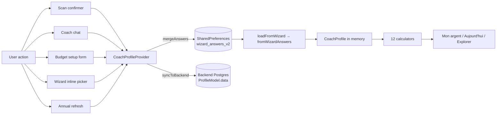

# MINT Data Flow — the authoritative map

**Why this file exists.** MINT data capture lives in three storage layers
(SharedPreferences, Keychain fallback, backend Postgres) mutated by seven
write paths (wizard, scan, coach save_fact, Dart regex fallback, inline
coach pickers, budget form, tax annual refresh). Drifting between them is
the #1 source of « the UI says captured, the profile is empty at
relaunch » bugs — the exact bug class that killed the MVP walkthrough
2026-04-20.

This doc gives every writer + every reader explicit ownership of every
storage key. If your edit changes one, this doc must be updated in the
same PR. CI lint (TODO, Phase 34 extension) will enforce.

---

## The storage model — three layers, deliberate



**Invariants.**

1. `wizard_answers_v2` (SharedPreferences key) is the **local source of
   truth**. Everything derives from it via `CoachProfile.fromWizardAnswers`.
2. Backend `ProfileModel.data` is the **remote mirror**, only for
   authenticated users. Anonymous users **never** have backend state —
   Keychain failure for anon sessions falls back to SharedPreferences (see
   `anonymous_session_service.dart`).
3. The `CoachProfile` instance in memory is **recomputed** from answers on
   every write. Never mutate the profile directly — always go through
   `mergeAnswers` / `updateProfile` / `updateFrom*Extraction`.
4. New data capture paths **must** write into `wizard_answers_v2` via one
   of the existing setters, or add a new key listed below.

---

## The 6 writers — who mutates `wizard_answers_v2`

Every writer persists via `ReportPersistenceService.saveAnswers(answers)`
which encrypts sensitive keys via `SecureWizardStore` (Keychain) and
mirrors to SharedPreferences. **This is the only legal write path.**

| # | Writer | Entry points | Keys written | Lifecycle trigger |
|---|---|---|---|---|
| 1 | **Wizard full** | `wizard_service.dart` | `q_firstname`, `q_birth_year`, `q_canton`, `q_net_income_period_chf`, `q_pay_frequency`, `q_housing_cost_period_chf`, … (all `q_*`) | `WizardProvider.complete()` sets `_completed_key` flag |
| 2 | **Mini-onboarding** | `smart_flow_screen.dart` | Subset of `q_*` (3 questions) | `ReportPersistenceService.setMiniOnboardingCompleted(true)` |
| 3 | **Scan confirmation** | `extraction_review_screen.dart:659` → `updateFrom{Lpp,Avs,Tax,Salary}Extraction` | `_coach_avoir_lpp*`, `_coach_salaire_assure`, `_coach_rachat_maximum`, `_coach_taux_conversion*`, `_coach_avs_*`, `_coach_tax_*` + `_coach_<type>_source = 'document_scan'` | Post-scan flow |
| 4 | **Coach chat inline picker** | `coach_chat_screen.dart` → `coachProvider.mergeAnswers()` | Arbitrary `q_*` single field | User taps inline picker in conversation |
| 5 | **Dart regex fact fallback** | `lib/services/chat/fact_extraction_fallback.dart` → `applySaveFact` → `mergeAnswers` | `q_birth_year`, `q_net_income_period_chf`, `q_gross_salary_annual`, `_coach_avoir_lpp`, `_coach_salaire_assure`, `q_total_3a`, `_coach_rachat_maximum` (restricted to 1st-person matches) | Every coach chat send |
| 6 | **Budget setup form** | `budget_setup_screen.dart` → `coachProvider.mergeAnswers` + `budgetProvider.refreshFromProfile` | `q_housing_cost_period_chf`, `q_lamal_premium_monthly_chf`, `q_pay_frequency='monthly'`, `_coach_depenses_{transport,telecom,electricite,frais_medicaux,autres}` | Tap « Enregistrer » |
| 7 | **Annual refresh** (scheduled) | `updateFromRefresh` (CoachProfileProvider) | Updates `_coach_updated_at` + tax + salary | Annual trigger (currently orphaned, cf façade audit) |

**Legend.** Keys prefixed `q_*` come from wizard-style answers
(`fromWizardAnswers` reads them natively). Keys prefixed `_coach_*` come
from richer sources (scan extractions, annotations) — `fromWizardAnswers`
also reads these via the `<code_context>` block at
[`coach_profile.dart:2400-2500`](../apps/mobile/lib/models/coach_profile.dart).

---

## The `q_*` key reference — canonical wizard keys

Read by `CoachProfile.fromWizardAnswers`. Sorted by domain.

**Identity**
- `q_firstname` (str), `q_birth_year` (int), `q_date_of_birth` (ISO str),
  `q_canton` (2-letter, default `ZH`), `q_civil_status`
  (celibataire/marie/concubinage/divorce/veuf), `q_children` (int),
  `q_gender`, `q_commune`

**Income**
- `q_pay_frequency` (`monthly`|`yearly`|`annuel`),
  `q_net_income_period_chf` (double, amount per period),
  `q_gross_salary_annual` (preferred when known — avoids net↔brut roundtrip),
  `q_employment_status` (salarie/independant/retraite/etc.),
  `q_employment_rate` (%), `q_annual_bonus` (CHF), `q_partner_net_income_chf`,
  `q_partner_birth_year`, `q_partner_employment_status`

**Housing & fixed charges**
- `q_housing_cost_period_chf` (double — rent OR mortgage),
  `q_housing_status` (locataire/proprietaire/…),
  `q_lamal_premium_monthly_chf` (double, health insurance actual value),
  `_coach_depenses_transport`, `_coach_depenses_telecom`,
  `_coach_depenses_electricite`, `_coach_depenses_frais_medicaux`,
  `_coach_depenses_autres`

**AVS (1st pillar)**
- `q_avs_lacunes_status`, `q_avs_years_abroad`, `q_avs_contribution_years`,
  `q_avs_arrival_year`, `_coach_avs_rente_estimee`, `_coach_avs_lacunes`,
  `_coach_avs_ramd`, `_coach_avs_source`

**LPP (2nd pillar)**
- `q_avoir_lpp` (total legacy), `_coach_avoir_lpp` (scanned total),
  `_coach_avoir_lpp_oblig`, `_coach_avoir_lpp_suroblig`,
  `_coach_taux_conversion`, `_coach_taux_conversion_suroblig`,
  `_coach_salaire_assure`, `_coach_rachat_maximum`,
  `_coach_rendement_caisse`, `_coach_rachat_lpp_mensuel`,
  `_coach_lpp_source`

**3a (3rd pillar)**
- `q_3a_total`, `q_3a_accounts_count`, `q_3a_annual_contribution`,
  `q_3a_providers`, `_coach_total_3a`

**Patrimoine & dette**
- `q_cash_total`, `q_epargne_liquide`, `q_investissements`,
  `q_investments_total`, `q_emergency_fund`, `q_debt_payments_period_chf`,
  `_coach_dettes_hypotheque`, `_coach_dettes_credit`, `_coach_dettes_leasing`,
  `_coach_dettes_autres`

**Fiscal**
- `_coach_tax_revenu_imposable`, `_coach_tax_fortune_imposable`,
  `_coach_tax_impot_cantonal`, `_coach_tax_impot_federal`,
  `_coach_tax_taux_marginal`, `_coach_tax_source`

**Goals & lifecycle**
- `q_target_retirement_age`, `_coach_family_change`,
  `_coach_financial_literacy_level`, `_coach_created_at`, `_coach_updated_at`,
  `_coach_data_timestamps` (dict: fieldPath → ISO timestamp)

---

## The `_SAVE_FACT_ALLOWED_KEYS` whitelist — coach-LLM canonical names

Defined in
[`services/backend/app/api/v1/endpoints/coach_chat.py:924`](../services/backend/app/api/v1/endpoints/coach_chat.py).
The LLM (Claude) is only allowed to invoke `save_fact` with these
canonical keys. The Dart-side `_mapFactKeyToAnswers` in
[`coach_profile_provider.dart:557-625`](../apps/mobile/lib/providers/coach_profile_provider.dart)
translates every LLM canonical key to one or more `q_*` / `_coach_*`
wizard keys.

**Identity / location**: `birthYear`, `dateOfBirth`, `canton`, `commune`,
`householdType`, `employmentStatus`, `has2ndPillar`, `goal`,
`targetRetirementAge`, `gender`

**Income**: `incomeNetMonthly`, `incomeGrossMonthly`, `incomeNetYearly`,
`incomeGrossYearly`, `selfEmployedNetIncome`, `employmentRate`, `annualBonus`

**LPP**: `lppInsuredSalary`, `avoirLpp`, `avoirLppObligatoire`,
`avoirLppSurobligatoire`, `lppBuybackMax`, `hasVoluntaryLpp`

**3a**: `pillar3aAnnual`, `pillar3aBalance`

**Savings / wealth / debt**: `savingsMonthly`, `totalSavings`,
`wealthEstimate`, `hasDebt`, `totalDebt`

**Spouse**: `spouseBirthYear`, `spouseIncomeNetMonthly`,
`spouseAvsContributionYears`

**AVS**: `hasAvsGaps`, `avsContributionYears`

**⚠ Trap.** Adding a new canonical key to the backend whitelist without
also adding a Dart mapping in `_mapFactKeyToAnswers` = the fact is silently
dropped on client side. Always update both files in the same PR.

---

## Anonymous-mode caveat — why fresh installs are fragile

Anonymous users (`AuthProvider.isLocalMode = true`, default-on for fresh
installs) have **no `user_id`** and therefore:

1. Backend `save_fact` handler hits the `# Hors-DB path` branch
   ([`coach_chat.py:1408-1413`](../services/backend/app/api/v1/endpoints/coach_chat.py))
   — returns `"Fait noté (hors DB)"` without persisting.
2. Backend `save_fact` is in `INTERNAL_TOOL_NAMES` — the tool_call is
   stripped from `external_calls` before reaching Flutter. Flutter's
   `applySaveFact` dispatcher only fires when **Claude does NOT call
   save_fact** (bug, see § Tool routing).
3. The **Dart regex fallback** (`fact_extraction_fallback.dart`) is the
   only reliable write path for anon users until they register.
4. Keychain writes still work (iOS entitlement fix), but if they fail,
   `AnonymousSessionService` + `flutter_secure_storage` fall back
   gracefully to SharedPreferences.

**Scan-first onboarding.** Before the fix commits in
`triage/flow-utilisateur-2026-04-20`, `updateFrom*Extraction` silently
returned if `_profile == null`, losing all scanned data for fresh users.
The fix seeds `CoachProfile.defaults()` so the extraction lands.
**Don't undo this.**

---

## Reader reference — who reads `wizard_answers_v2`

Authoritative reader: `CoachProfile.fromWizardAnswers(answers)` at
[`coach_profile.dart:2307`](../apps/mobile/lib/models/coach_profile.dart).
Everything else reads the derived `CoachProfile`, not the map directly.

**Exceptions** (grep before adding a new one):
- `AuthProvider` at line 669 reads `answers` for auth bootstrap
- `ReportPersistenceService` is the I/O layer itself

Every calculator / widget that needs profile data **must** read through
`CoachProfileProvider.profile`, never through `loadAnswers()` directly.

---

## Scan pipeline — end-to-end

```
PDF (camera / gallery / OCR paste / test fixture)
  ↓
DocumentService.extractDocumentData (backend)
  ↓ returns ExtractionResult {fields: [...], confidence, sources}
  ↓
ExtractionReviewScreen (user verifies each field)
  ↓ user taps Confirmer
  ↓
coachProvider.updateFrom{Lpp|Avs|Tax|Salary}Extraction(fields)
  ↓ seeds _profile = defaults() if null
  ↓ mutates prevoyance/patrimoine/dettes/fiscal
  ↓ writes _coach_<type>_<field> keys + _coach_updated_at
  ↓ calls ReportPersistenceService.saveAnswers(answers)  ← persistence
  ↓ CoachNarrativeService.invalidateCache(_profile)     ← stale greeting fix
  ↓ notifyListeners()
  ↓ _syncToBackend() (fire-and-forget, skipped for anon)
  ↓
/scan/impact (DocumentImpactScreen) shows delta in confidence score
```

Failure modes:
- Keychain -34018 on iOS sim without entitlements → SharedPrefs fallback
  handles it via `AnonymousSessionService` pattern.
- Scan confirm UI shows « +29 points » but save drops → fixed by seeding
  defaults + adding `hasScanData` hydration branch in `loadFromWizard`.

---

## Budget flow — end-to-end

```
Mon argent → Ton budget ce mois card → tap Commencer
  ↓
/budget (BudgetContainerScreen)
  ↓ if inputs == null → empty state CTA « Poser mes charges »
  ↓ tap routes to /budget/setup
  ↓
BudgetSetupScreen (new, P0-MVP-3)
  ↓ pre-fill fields from coachProfile.depenses
  ↓ user types 2 required + 0..5 optional
  ↓ tap Enregistrer
  ↓
coachProvider.mergeAnswers({
  q_housing_cost_period_chf: …,
  q_pay_frequency: 'monthly',
  q_lamal_premium_monthly_chf: …,
  _coach_depenses_transport: …,          (optional)
  _coach_depenses_telecom: …,             (optional)
  _coach_depenses_electricite: …,         (optional)
  _coach_depenses_frais_medicaux: …,      (optional)
  _coach_depenses_autres: …,              (optional)
})
  ↓ answers written via ReportPersistenceService
  ↓
budgetProvider.refreshFromProfile(updatedProfile)
  ↓ BudgetInputs.fromCoachProfile(profile) re-derives
  ↓ BudgetService.computePlan(inputs, overrides)
  ↓ _store.saveInputs(inputs)
  ↓
Pop back to Mon argent → BudgetSummaryCard now has data → « Il te reste Y CHF »
```

Chat fallback (« J'en parle plutôt au coach ») remains available on the
setup screen, respecting `feedback_chat_is_everything` (chat *can* do it,
but doesn't *have* to).

---

## Route registry (Phase 32 Cartographier)

147 routes with `RouteMeta{owner, category, requiresAuth, killFlag}` in
[`apps/mobile/lib/routes/route_metadata.dart`](../apps/mobile/lib/routes/route_metadata.dart).

**CLI**: `./tools/mint-routes list | grep coach` — live health query
against Sentry + FeatureFlags.

**Admin UI**: `/admin/routes` — schema viewer (does NOT show Sentry health
on mobile, iOS sandbox prevents cross-filesystem read).

**Adding a new route** — three places to update in one PR:
1. The `GoRoute` in [`app.dart`](../apps/mobile/lib/app.dart)
2. The `RouteMeta` entry in `route_metadata.dart`
3. Navigation intent tag (if user-facing) in
   [`services/navigation/screen_registry.dart`](../apps/mobile/lib/services/navigation/screen_registry.dart)

The `route_registry_parity` CI lint will fail the PR otherwise.

---

*Last updated: 2026-04-21 after MVP-PLAN-2026-04-21 P0-MVP-3 ship.
Maintenance rule: every new writer or reader of `wizard_answers_v2`
updates this doc in the same PR. Code drift without doc drift = the
trap we built this to avoid.*
