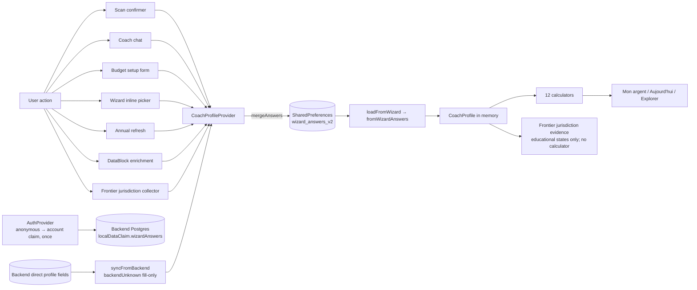

# MINT Data Flow — the authoritative map

**Why this file exists.** MINT data capture spans three storage layers
(SharedPreferences, Keychain fallback, backend Postgres). Eleven local write
paths mutate the local ledger (wizard, scan, coach save_fact dispatch, Dart
regex fallback, inline coach pickers, budget form, DataBlock enrichment, tax
annual refresh, reviewed bank import, the frontier-jurisdiction collector, and
succession reference confirmation);
backend facts and the one-shot account claim have separate contracts.
Drifting between them is the #1 source of « the UI says captured, the
profile is empty at relaunch » bugs — the exact bug class that killed the
MVP walkthrough
2026-04-20.

This doc gives every writer + every reader explicit ownership of every
storage key. If your edit changes one, this doc must be updated in the
same PR. CI lint (TODO, Phase 34 extension) will enforce.

> **Focused G1 BND reality baseline:** the default-off partner-accountability
> path is accepted as technical GREEN for both tickets at exact SHA
> `1d022c508` (2026-07-16), with identical-command, Patrol
> writer→terminate→cold-reader, 17-step Maestro and four bounded Claude-wrapper
> proofs. The production external descriptor is still absent and all checked-in
> activation defaults are false. BND-02/BND-02A are technical GREEN.
> BND-03 is also ticket- and exact-SHA runtime-GREEN at `7ed54e282`; the live
> registry therefore remains 17 GREEN, 13 `ticket_only` and 1 `red_proven`, or
> 14 open rows. BND-05 has a RED commit `cec4f0245` and a code-GREEN commit
> `11e29c0cd`, but stays `ticket_only` until its runtime and both Claude-wrapper
> audit lenses are accepted. The eight external activation facts and those 14
> open G1 rows mean activation and G1 remain NO-GO. The
> accepted PROV-02 persistence/runtime checkpoint remains
> `30728b8a0671`; its narrower scope is unchanged by this later promotion.
> G1-FRONT-01 is separately code-GREEN at pushed SHA `733571002` with a real
> provider-backed collector and calculation-free evidence states. Its exact-SHA
> runtime and wrapper audits remain pending, so FRONT-01 is not promoted and
> G1/G2/G3 GO claims remain forbidden.
> G1-RET-REF-01 now has one bounded tax-reference code-GREEN vertical at exact
> pushed SHA `cdc786782` (2026-07-17): the reference is metadata derived from the
> single strict tax root after exact provenance validation, and the existing
> fiscal prompt fails closed on every non-exact state. This records code reality
> only; it does not promote the ticket, close G1 or authorize G2/G3.

---

## The storage model — three layers, deliberate


```mermaid
flowchart LR
    U[User action] --> W1[Scan confirmer]
    U --> W2[Coach chat]
    U --> W3[Budget setup form]
    U --> W4[Wizard inline picker]
    U --> W5[Annual refresh]
    U --> W6[DataBlock enrichment]
    U --> W7[Frontier jurisdiction collector]

    W1 --> PROV[CoachProfileProvider]
    W2 --> PROV
    W3 --> PROV
    W4 --> PROV
    W5 --> PROV
    W6 --> PROV
    W7 --> PROV

    PROV -- mergeAnswers --> SP[(SharedPreferences<br/>wizard_answers_v2)]
    SP --> LOAD[loadFromWizard → fromWizardAnswers]
    LOAD --> PROFILE[CoachProfile in memory]
    PROFILE --> CALCS[12 calculators]
    CALCS --> UI[Mon argent / Aujourd'hui / Explorer]
    PROFILE --> FRONTUI[Frontier jurisdiction evidence<br/>educational states only; no calculator]

    AUTH[AuthProvider<br/>anonymous → account claim, once] --> CLAIM[(Backend Postgres<br/>localDataClaim.wizardAnswers)]
    BE[(Backend direct profile fields)] --> INBOUND[syncFromBackend<br/>backendUnknown fill-only]
    INBOUND --> PROV
```

**Invariants.**

1. `wizard_answers_v2` is the **logical local source of truth**. Everything
   derives from it via `CoachProfile.fromWizardAnswers`. Sensitive values may
   be represented physically by `__secure__`; the G1-PROV-02A+B LPP root also
   uses a private SharedPreferences active-slot pointer and an immutable
   Keychain slot, described below. Neither physical indirection is a second
   domain ledger.
2. Backend `ProfileModel.data` is an independent remote profile source for
   authenticated users, not a continuous mirror of the local ledger.
   `CoachProfileProvider` never pushes ordinary ledger mutations outbound.
   Its guarded `syncFromBackend` path may ingest validated direct profile
   fields as fill-only `backendUnknown` facts. `AuthProvider` separately owns
   the exact-once anonymous-to-account claim: `/sync/claim-local-data` stores
   its wizard payload under `localDataClaim.wizardAnswers`, which mobile direct
   profile hydration does not read. That claim therefore establishes account
   custody but is not cross-device profile sync. Anonymous users **never** have
   backend state — Keychain failure for anon sessions falls back to
   SharedPreferences (see `anonymous_session_service.dart`).
3. In the G1-PROV-01 migrated set — `mergeAnswers`, person-owned LPP, self AVS,
   salary, inline, and Open Banking — a writer may construct a typed
   `nextProfile`, but must persist values and provenance through the matching
   `ReportPersistenceService` boundary **before** assigning `_profile` or
   calling `notifyListeners()`. Typed self/manual-partner LPP uses the dedicated
   `saveLppEvidenceAnswers()` boundary; ordinary answer maps use
   `saveAnswers()`.
4. New data capture paths **must** write into `wizard_answers_v2` via one
   of the existing setters, or add a new key listed below.

### Field-centric provenance (G1-PROV-01)

`wizard_answers_v2.__provenance` is the canonical local provenance envelope
for ordinary answer fields. It is keyed by canonical `CoachProfile` field
path; every entry has exactly this shape and does not duplicate the financial
value:

```text
fieldPath -> {source, updatedAt, sourceDate}
```

- `source` is a `ProfileDataSource.name`; `updatedAt` is the ISO-8601 instant
  when MINT accepted the value.
- `sourceDate` is an ISO-8601 date carried by the source, or explicit `null`
  when the source date is unknown. It is never inferred from `updatedAt`.
  Real document-date extraction and consumption remain pending G1-FRESH-01
  and the relevant source-date tickets.
- In migrated writers, the answer value and this three-key entry are saved in
  the same snapshot; only the persisted `nextProfile` may then be published.
- `_coach_data_timestamps` remains dual-written as a legacy migration input.
  New writes use `__provenance` as their source of truth.
- The strict `_coach_lpp_evidence_v1` root is the exception: each typed LPP
  fact owns its exact value, unit, owner/actor/authorization and provenance.
  Cold reconstruction derives the presentation value and field metadata from
  those facts and ignores a parallel `__provenance` entry for the same LPP
  path. The parallel map is persisted for existing profile consumers, but it
  is not an independent authority and cannot repair a malformed strict fact.
- Reconstruction migrates legacy metadata field by field. A legacy path not
  yet mentioned in a partial canonical envelope may still migrate, but a
  malformed canonical entry blocks fallback for that same path (fail closed).
- `__provenance` is currently local-only and is removed from mobile backend
  sync payloads. Backend per-field provenance remains pending its dedicated
  contract; do not silently mirror this local envelope into `ProfileModel.data`.
- G1-PROV-02 implements one typed path for **self and independently declared
  manual-partner** evidence from acquisition through cold reload. Its accepted
  persistence/runtime predicate remains GREEN at pushed SHA
  `30728b8a0671a0b54bcf47807a0c69bac905e6e3`; live Anthropic eval is NOT RUN.
  `FeatureFlags.typedLppEvidence=false` and
  `documentLppEvidenceEnabled=false` remain the local composite ingestion gate.
  The later partner branch additionally requires
  `FeatureFlags.partnerLppAccountabilityEnabled=false` on mobile and
  `partner_lpp_accountability_enabled=false` on the backend. These are four
  independent fail-closed boundaries, not a remote activation chain.
- The self branch remains the PROV-02 path: it fixes the self owner, obtains
  `visionExtraction + transferUsAnthropic`, binds the exact transmitted-byte
  SHA to volatile authorization and never creates a partner receipt or binding.
  The manual-partner branch is offered only for exact
  `CoachProfile.conjoint != null`. It requires a current typed external notice,
  authenticated actor, one-shot proxy declaration and strict-secure pending
  binding before permission or picker. The production `/scan` builder supplies
  no `PartnerAccountabilityExternalGate`, so the branch remains blocked even if
  a developer flips the local switches.
- When the manual-partner dependencies are injected by a bounded test, the real
  caller uses a local picker handle with `withData=false`, creates the minimized
  `partner_accountability_receipts` row before reading document bytes, consumes
  that receipt exactly once at `/documents/extract-vision`, then binds the byte
  SHA to process-local authorization. The pending binding becomes active only
  after the exact-owner root save succeeds. Receipt/binding records stay outside
  the financial ledger and never prove direct partner consent.
- Cold reconciliation matches the active receipt and exact partner owner before
  exposing receipt-bound certificate facts. A current fact reaches the real
  `MintStateEngine -> ForecasterService` caller and the visible
  `RetirementDashboardScreen`; invalid or unverifiable authority removes those
  certificate facts while preserving separately entered user facts. This
  closes the former facade gap. Exact-SHA runtime, registry and wrapper evidence
  is accepted at `1d022c508`, so BND-02/BND-02A are technical GREEN. That
  promotion changes neither checked-in flags nor production external truth:
  activation and G1 remain NO-GO, and no G2/G3 work is authorized. The typed tax
  path is likewise behind its composite default-off gate pending its own proof
  and activation decision.

---

## The 11 writers — who mutates `wizard_answers_v2`

Every writer persists through `ReportPersistenceService`, which encrypts
sensitive keys via `SecureWizardStore` (Keychain) and writes the matching
SharedPreferences representation. Ordinary maps use the canonical answer
mutation/save boundary; specialized typed roots may expose a narrower provider
persistence interface but still terminate in `ReportPersistenceService`. No
screen owns a second local I/O boundary.

| # | Writer | Entry points | Keys written | Lifecycle trigger |
|---|---|---|---|---|
| 1 | **Wizard full** | `wizard_service.dart` | `q_firstname`, `q_birth_year`, `q_canton`, `q_net_income_period_chf`, `q_pay_frequency`, `q_housing_cost_period_chf`, … (all `q_*`) | `WizardProvider.complete()` sets `_completed_key` flag |
| 2 | **Mini-onboarding** | `smart_flow_screen.dart` | Subset of `q_*` (3 questions) | `ReportPersistenceService.setMiniOnboardingCompleted(true)` |
| 3 | **Scan confirmation** | LPP self: `DocumentScanScreen owner/permission → transmitted-byte authorization → kind gate → raw-free candidate/review → acceptLppReview`. LPP manual partner adds `external gate/auth/declaration → pending binding → permission → local handle (withData=false) → receipt create → byte boundary/one-shot extraction → review → exact-owner save → active binding`. After that ledger commit, the accepted `LppReviewReceipt` may create only one opaque confirmed-document reference. Typed tax uses `TaxExtractionCandidate → TaxReviewConfirmation → acceptTaxReview → TaxProfilePersistence`. AVS/salary retain their reviewed type-specific writers. | LPP writes strict-secure `_coach_lpp_evidence_v1`; `manualPartner.facts` is receipt-bound while `manualPartner.independentFacts` is user-input recovery. The separate secure binding, minimized backend receipt and five-field `ConfirmedDocumentReference` contain no financial value. Volatile authorization/SHA and raw document data enter none of them. Tax uses `_coach_tax_snapshots_v1`; salary certificate writes annual gross/month count/bonus, never net-period income. | Self publishes after one awaited secure save. Manual partner additionally activates the matching pending binding only after that save; terminal drift restores `shadowed`/prior active state and suppresses later callbacks. The reference store is a serialized metadata-only follow-up: failure keeps the reviewed ledger facts and exposes an explicit retry instead of repeating the financial write. PROV-02 remains GREEN at `30728b8a0671`; BND-02/BND-02A are technical GREEN at `1d022c508`, while activation and G1 remain NO-GO. |
| 4 | **Coach chat inline picker** | `coach_chat_screen.dart` → `coachProvider.mergeAnswers()` | Arbitrary `q_*` single field | User taps inline picker in conversation |
| 5 | **Dart regex fact fallback** | `lib/services/chat/fact_extraction_fallback.dart` → `applySaveFact` → `mergeAnswers` | `q_birth_year`, `q_net_income_period_chf`, `q_gross_salary_annual`, `_coach_avoir_lpp`, `_coach_salaire_assure`, `q_3a_total`, `_coach_rachat_maximum` (restricted to 1st-person matches) | Every coach chat send |
| 6 | **Budget setup form** | `budget_setup_screen.dart` → `coachProvider.mergeAnswers` | `q_housing_cost_period_chf`, `q_housing_pay_frequency='monthly'`, `q_lamal_premium_monthly_chf`, `q_other_fixed_costs_monthly_chf`, `_coach_depenses_{transport,telecom,electricite,frais_medicaux}` | Tap « Enregistrer »; the published profile then feeds the eager Budget and MintState proxies |
| 7 | **Annual refresh** (scheduled) | `updateFromRefresh` (CoachProfileProvider) | Updates `_coach_updated_at` + tax + salary | Annual trigger (currently orphaned, cf façade audit) |
| 8 | **DataBlock enrichment** | `data_block_enrichment_screen.dart` → `coachProvider.mergeAnswers` | `q_canton`, `q_gross_salary_annual`, `q_self_employed_income`, `q_company_profit_annual_chf`, `q_birth_year`, `q_has_pension_fund`, `q_cash_total`, `q_wealth_estimate`, `q_property_market_value`, `_coach_dettes_hypotheque`, `q_debt_payments_period_chf`, `q_has_consumer_debt`, `q_children`, `q_civil_status`, `q_housing_status` | Missing-fact collector from scenario/Data Quest flows |
| 9 | **Reviewed bank import** | `bank_import_screen.dart` → `profileProvider.mergeAnswersWithProvenance` | `q_net_income_period_chf`, `q_pay_frequency='monthly'`; categorized charges remain preview-only | Explicit user confirmation after local CSV/PDF preview |
| 10 | **Frontier jurisdiction collector** | `frontalier_screen.dart` → `coachProvider.mergeAnswers` | `q_residence_country`, `q_work_country`, and conditional `q_work_canton`; selecting a non-CH work country clears `q_work_canton` in the same snapshot | Inline collection on `/segments/frontalier`; stale canton reconfirmation rewrites the same value in one gesture |
| 11 | **Succession reference confirmation** (default-off live consumer) | `SuccessionPatrimoineScreen` → `SuccessionEvidenceQuest` → `CoachProfileProvider.confirmMatrimonialRegime`, `confirmRegisteredPartnershipPropertyRegime`, `confirmEstateInstrumentPresent`, `confirmEstateInstrumentAbsent` | strict-secure `_coach_estate_evidence_v1` only: scoped marriage/LPart confirmation plus the exact four instrument slots | `/succession`, only when local compile flag `MINT_TEST_SUCCESSION_EVIDENCE_COLLECTION=true`; the flag defaults false and is absent from `FeatureFlags.applyFromMap`. Each answer awaits the typed whole-root save before the UI advances. |

### Succession reference authority (G1-SUCCESSION-01 live consumer; runtime acceptance open)

`wizard_answers_v2['_coach_estate_evidence_v1']` is the sole succession-
reference authority. It is a schema-v1 JSON string registered both as a strict
authority key in `ReportPersistenceService` and as sensitive in
`SecureWizardStore`; SharedPreferences may contain only the `__secure__`
placeholder, and `backendSafeAnswers` removes the root. There is no backend
mirror, loose regime key, independent reference list, or document payload.

The root contains exactly one optional marriage confirmation, one optional
registered-partnership (LPart) property-arrangement confirmation, and exactly
four keyed slots: `will`, `inheritancePact`, `incapacityMandate`, and
`advanceCareDirective`. An absent instrument is never inferred: every slot is
`unknown`, explicitly `confirmedPresent` from certificate metadata, or
explicitly `confirmedAbsent` from user input. Each confirmation carries its own
UUIDv4, UTC confirmation instant, and `civilStatusAtConfirmation`; present
instrument evidence additionally carries an explicit civil `sourceDate` and
`legalYear`. A civil-status change preserves the authority but projects affected
facts as stale/needs-reconfirmation rather than silently re-scoping them.

The four provider writers use compare-and-swap IDs against the reloaded
canonical root, an estate-specific persistence seam, and one awaited whole-root
save before profile publication/listener notification. Marriage and LPart are
distinct typed writers: a matrimonial regime is accepted only for `marie`, and
a registered-partnership arrangement only for `registeredPartnership`.
`CoachProfile` exposes `currentEstateArrangementApplicability`,
`estateReferenceStateAt(asOf)`, `estateReferenceSurveyCompleteAt(asOf)`, and
`estateReferenceHandoffCompletenessAt(asOf)` as projections. `surveyComplete`
means only that current-arrangement applicability is resolved and all four
instrument slots are explicitly present/absent; it does **not** establish a
complete estate, legal distribution, specialist-ready dossier, or advice.

At pushed commit `9152a0368`, `/succession` has a real, default-off production
consumer. `SuccessionEvidenceQuest` first routes an unresolved civil status to
`/data-block/composition_menage?inputKey=q_civil_status&returnUri=/succession`.
It then asks an explicit nullable marriage or LPart arrangement when applicable
and exactly one instrument delta at a time, sorting `stale` before `unknown`.
Stale evidence shows the prior state and metadata before a one-gesture CAS
reconfirmation; present evidence requires a civil `sourceDate` and explicit
`legalYear`; absence is an explicit `userInput` confirmation. It never opens,
stores or transmits a raw document, path, filename, OCR output or document
bytes.

The consumer disables writes while a save is in flight. Persistence failure
keeps the same question and an explicit retry; a CAS conflict reloads the
provider and reports that the data changed; an invalid root offers reload/
support only and never resets authority from the screen. The terminal review
shows all four declared states and modification controls, but explicitly says
that the survey is neither a verified legal dossier nor specialist-ready.
`TestamentInvisibleWidget` is no longer rendered by the production route.
The local flag `FeatureFlags.successionEvidenceCollectionEnabled` defaults
false, is enabled only by `MINT_TEST_SUCCESSION_EVIDENCE_COLLECTION`, and is
not backend-overridable. This closes the former “no production caller” gap;
G1-SUCCESSION-01 still remains open until exact-SHA CI plus accepted
Maestro/Patrol restart evidence and direct visual proof are recorded.

`/bank-import` is a manual CSV/PDF review path, not a live Open Banking feed.
After explicit confirmation it may write only `q_net_income_period_chf` and
`q_pay_frequency`, with `userInput` provenance. Categorized charges remain a
preview/review aid and are never aggregated into housing, LAMal, declared tax,
debt, or `q_other_fixed_costs_monthly_chf`.

**Legend.** Keys prefixed `q_*` come from wizard-style answers
(`fromWizardAnswers` reads them natively). Keys prefixed `_coach_*` come
from richer sources (scan extractions, annotations) — `fromWizardAnswers`
also reads these via the `<code_context>` block at
[`coach_profile.dart:2400-2500`](../apps/mobile/lib/models/coach_profile.dart).

---

## The `q_*` key reference — canonical wizard keys

Read by `CoachProfile.fromWizardAnswers`. Sorted by domain.

**Identity**
- `q_firstname` (str), `q_birth_year` (int), `q_date_of_birth` (ISO str),
  `q_canton` (2-letter, default `ZH`), `q_civil_status`
  (celibataire/marie/concubinage/divorce/veuf), `q_children` (int),
  `q_gender`, `q_commune`,
  `q_residence_country` (`CH|FR|DE|IT|AT|LI`),
  `q_work_country` (`CH|FR|DE|IT|AT|LI`),
  `q_work_canton` (one of the 26 Swiss canton codes; required only when
  `q_work_country == 'CH'`)

**Frontier-jurisdiction boundary (G1-FRONT-01).** The three answer keys above
reconstruct as the distinct nullable typed fields `residenceCountry`,
`workCountry`, and `workCanton`. They carry field-centric provenance under
those exact paths. Only `userInput` and `certificate` may make a fact known;
each fact also needs a non-future `updatedAt`, an explicit `sourceDate` slot
(which may be null), and its `userProvidedFields` marker. Residence and work
country are event/static facts. `workCanton` uses annual freshness: the frozen
boundary is known at 782 days and stale at 783 days. The source date never
drives that predicate.

`workCanton` is not required until a known `workCountry == CH`; when the work
country changes outside Switzerland, the screen deletes the canton plus its
provenance in the same persisted snapshot. `q_canton`, nationality, permit G,
and `q_employment_status=frontalier` may open the collection flow but never
populate or infer any of the three facts. Complete current facts select only a
deterministic educational branch: CH/CH is domestic, FR/CH/GE selects the CDI
1966 art. 17 candidate, the eight named cantons select an accord-1983
candidate, and other complete pairs are `specialistOnly`. No branch produces a
tax rate, amount, social-insurance conclusion, 3a eligibility, or ranked
recommendation.

**Income**
- `q_pay_frequency` (`monthly`|`yearly`|`annuel`),
  `q_net_income_period_chf` (double, amount per period),
  `q_gross_salary_annual` (preferred when known — avoids net↔brut roundtrip;
  salary certificate writes monthly gross × `q_nombre_mois`),
  `q_company_profit_annual_chf` (double, SA/Sarl annual distributable envelope;
  not a substitute for sole-proprietor income),
  `q_unemployment_contribution_months` (int 0-24, LACI contribution months over
  the last 24 months),
  `q_nombre_mois` (salary months, defaults to 12), `q_bonus_percentage`
  (salary-certificate percentage, when extracted),
  `q_employment_status` (salarie/independant/retraite/etc.),
  `q_employment_rate` (%), `q_annual_bonus` (CHF), `q_partner_net_income_chf`,
  `q_partner_birth_year`, `q_partner_employment_status`

The salary-certificate writer never fabricates `q_net_income_period_chf` and
publishes its next profile only after the answer snapshot is saved.

**Housing & fixed charges**
- `q_housing_cost_period_chf` (double — rent OR mortgage),
  `q_housing_pay_frequency` (`monthly`|`yearly`|`annuel`, optional; defaults
  to monthly and must not reuse income `q_pay_frequency`),
  `q_housing_status` (locataire/proprietaire/…),
  `q_lamal_premium_monthly_chf` (double, health insurance actual value),
  `q_tax_provision_monthly_chf` (double CHF/mo, declared tax provision),
  `q_other_fixed_costs_monthly_chf` (double CHF/mo, excludes tax and debt),
  `_coach_depenses_transport`, `_coach_depenses_telecom`,
  `_coach_depenses_electricite`, `_coach_depenses_frais_medicaux`

`_coach_depenses_autres` is a legacy read/migrate-only alias. At the provider
boundary and on cold load, `q_other_fixed_costs_monthly_chf` wins whenever the
key is present (including explicit `null`); otherwise the legacy value is moved
to the canonical key and the alias is deleted in the same persisted snapshot.
Cold migration preserves the existing
`__provenance['depenses.autresDepensesFixes']` entry without restamping it.

**AVS (1st pillar)**
- `q_avs_lacunes_status`, `q_avs_years_abroad`, `q_avs_contribution_years`,
  `q_avs_arrival_year`, `_coach_avs_rente_estimee`, `_coach_avs_lacunes`,
  `_coach_avs_ramd`, `_coach_avs_bonifications_educatives`,
  `_coach_avs_source`

**LPP (2nd pillar)**
- `q_has_pension_fund` (`yes`|`no` string), `q_avoir_lpp` (total legacy),
  `_coach_avoir_lpp` (scanned total),
  `_coach_avoir_lpp_oblig`, `_coach_avoir_lpp_suroblig`,
  `_coach_taux_conversion`, `_coach_taux_conversion_suroblig`,
  `_coach_salaire_assure`, `_coach_rachat_maximum`,
  `_coach_rendement_caisse`, `_coach_rachat_lpp_mensuel`,
  `_coach_lpp_source`
- G1-PROV-02 implements one exact JSON-string answer root,
  `_coach_lpp_evidence_v1`, behind two consumed local switches that both
  default false: `typedLppEvidence` and `documentLppEvidenceEnabled`; the
  product getter is their AND and neither value is backend hydrated.
  Its schema-v1 root has exactly four keys:

  ```text
  {
    schemaVersion: 1,
    self: LppEvidenceSnapshot?,
    manualPartner: LppEvidenceSnapshot?,
    legacyPartnerQuarantine: null | {
      legacySchemaVersion: 0,
      reasonCodes: [String...],
      presentKeys: [String...],
      quarantinedAt: ISO-8601 instant
    }
  }

  LppEvidenceSnapshot {
    snapshotId: lowercase canonical UUIDv4,
    facts: {canonical fact key: LppEvidenceFact...},
    independentFacts: {canonical fact key: LppEvidenceFact...}? // manualPartner only
  }
  ```

  `manualPartner.facts` contains reviewed certificate facts whose authority is
  receipt-bound. `manualPartner.independentFacts` is an optional recovery map
  restricted to `source=userInput` with the same partner-owner/self-actor
  lineage; `self.independentFacts` is invalid. A current receipt gives the
  certificate value precedence for duplicate keys. Invalid, revoked, expired,
  erased or unverifiable authority exposes only the independent value without
  relabelling it as certificate evidence.

  Each person slot accepts exactly the same **13** canonical financial facts:
  `vestedBenefitsCapitalChf`, `mandatoryVestedBenefitsCapitalChf`,
  `extraMandatoryVestedBenefitsCapitalChf`, `insuredSalaryAnnualChf`,
  `maximumBuybackCapitalChf`, `mandatoryConversionRateRatio`,
  `extraMandatoryConversionRateRatio`, `fundReturnRateRatio`,
  `retirementPensionAnnualChf`, `retirementCapitalLumpSumChf`,
  `disabilityPensionAnnualChf`, `disabilityCapitalLumpSumChf`, and
  `deathCapitalLumpSumChf`. A product-audit reference to 12 keys was a counting
  error. Spouse pension, child pension, employee contribution and employer
  contribution are separate unowned P2 follow-ups, not aliases. They are
  excluded before review/persistence; absence stays absent and never becomes a
  false zero or scenario/dossier fact.

  When the composite evidence gate is true, `DocumentScanScreen` resolves
  `hasLocalPartnerProfile` as exact `CoachProfile.conjoint != null` and fixes
  the owner before acquisition. The **self** branch requests
  `visionExtraction + transferUsAnthropic` without `persistence365d`, then binds
  a lowercase SHA-256 of the exact bytes before network. It never touches the
  partner-accountability service or binding store.

  The **manual-partner** branch additionally requires the two default-false
  accountability switches, an authenticated actor and a current exact
  `PartnerAccountabilityExternalGate`. The route in `app.dart` constructs plain
  `DocumentScanScreen(initialType: initialType)` and injects no production gate,
  so missing external facts stop before any side effect. With bounded test
  dependencies, the order is exact:

  1. render the typed notice/contact/rights and accept the acting user's
     one-shot proxy declaration; this is not direct partner consent;
  2. preallocate stable receipt/partner-owner UUIDs and persist a strict-secure
     `pending` binding that shadows the previous active binding;
  3. request only the generic `visionExtraction` technical permission; the
     typed notice owns the Anthropic transfer disclosure;
  4. open the local picker with `withData=false`, retaining only a path/handle;
  5. create the idempotent minimized receipt and mark the pending binding with
     its server expiry before reading or hashing document bytes;
  6. revalidate gate, versions, contact/rights, receipt and pending owner at the
     byte boundary, then read bytes, bind exact SHA and call the candidate-only
     extraction with `subjectKind=manualPartner` plus `receiptId`;
  7. the backend atomically consumes the active receipt before classification,
     audit or extraction; a second call fails closed as already consumed.

  Images and PDFs call candidate-only Vision extraction directly; the PDF path
  never uses vault upload, and LPP BYOK/fused/SSE paths are unreachable. The
  backend admits only an exact typed high-confidence personal certificate
  before audit/extraction. Local OCR independently requires a supported
  personal-certificate title plus an individualization label. Plan/unknown/
  lower-confidence/error outcomes create no session or financial write.

  `LppExtractionAdapter` maps only the exact vocabulary for its named source,
  converts percentage scale once, requires finite confidence, retains explicit
  numeric zero only, rejects ambiguity/duplicates/incoherent balances and
  emits a raw-free candidate. `ScanSessionProvider` keeps at most five volatile
  process-local payloads and requires the LPP candidate plus its complete
  `LppAcquisitionAuthorization` together. The authorization contains
  `acquisitionId`, fixed subject, coherent partner attestation, policy version,
  UTC declaration time and transmitted-byte SHA. It has no JSON shape and is
  dropped from the impact payload. The route carries only `scanSessionId`, so a
  cold restart intentionally renders recovery rather than reconstructing raw
  OCR or authorization.

  `LppReviewConfirmation` carries the retained authorization and derives its
  subject; review cannot change it after transfer. The manual path revalidates
  the same external gate and `pending` binding at the public review handoff.
  First authority drift is terminal: exactly one remote DELETE is attempted,
  the pending binding rolls back to `shadowed`/previous active, and late
  picker/fallback/review callbacks are suppressed. Before persistence load,
  `acceptLppReview` rejects an invalid authorization, a manual-partner subject
  without the still-present local `CoachProfile.conjoint`, a non-current
  receipt context/pending binding, and invalid facts or coherence. It then
  completely replaces exactly that person's certificate `facts`, preserving
  that partner's `independentFacts` and the other person slot. Each fact carries
  exact value/unit, pseudonymous owner/actor, authorization and
  `{source, sourceDate, updatedAt}` provenance. Self owner and actor are equal.
  The manual-partner owner is the preallocated binding owner, distinct from the
  stable self actor, even when the partner is reviewed first; authorization is
  exactly `manualPartnerDeclaration` with `grantId:null`. Linked/grant shapes
  remain rejected. A certificate fact without a source date is
  `availableNeedsConfirmation`; corrected facts are `userInput` with a null
  source date.
- With owner already fixed, review rejects a mandatory/extra component above
  the total or a three-part difference greater than CHF 1. The provider repeats the
  same `LppBalanceCoherence` check after value/unit validation and before its
  persistence load, so a direct contradictory call performs no load, save or
  publication. Untouched documentary facts require a non-future effective
  date; invalid date, contradiction and save failure stay on the review with no
  impact navigation. Owner or attestation cancellation occurs before picker and
  creates no session or network call.
- On disk, `wizard_answers_v2` contains only
  `'_coach_lpp_evidence_v1': '__secure__'`. The private
  `lpp_evidence_active_slot_v1` pointer is a separate SharedPreferences key;
  it never enters the wizard map, strict root or backend payload. It names an
  immutable secure-storage slot
  `_coach_lpp_evidence_slot_v1_<32 lowercase hex chars>` generated from 128
  random bits. `saveLppEvidenceAnswers()` stages and verifies the wizard
  placeholder, writes a new slot, then commits the pointer. A failed or late
  timed-out write cannot activate; pointer/wizard rollback preserves the prior
  root. Generic saves, fixed-root migration, dedicated LPP saves and diagnostic
  clear share one persistence serializer. At provider level, `loadFromWizard`
  and `acceptLppReview` share a second FIFO around the complete
  load/migrate/read-modify-write/publication operation, so concurrent reviews or
  startup migration cannot lose a slot or fork owner/actor identity. Successful
  activation removes the previous slot
  and performs a bounded best-effort sweep of inactive slots. Diagnostic clear
  removes the wizard bytes and pointer, then deletes fixed and versioned secure
  roots.
- Partner accountability uses a second strict-secure store, outside
  `wizard_answers_v2`, with one schema-v1 envelope containing
  `pending` / `active` / `shadowed`. A binding contains receipt id,
  preallocated manual-partner owner, exact notice/policy versions, expiry,
  verification/failure state, privacy contact and rights channel; it contains
  no financial value, raw identity, acquisition id or document hash. Pending is
  durable before technical permission/picker. Active is committed only after
  the whole financial root save succeeds. Failed activation restores both the
  previous root and previous binding; an unrepairable secure-store error enters
  quarantine rather than exposing stale authority.
- Cold load treats the active pointer as authoritative and reads only its
  immutable slot. A pre-slot fixed secure root is migrated once only while the
  wizard still has the strict placeholder; after a pointer exists, a stale
  fixed root is ignored. `CoachProfile.fromWizardAnswers` selects strict self
  facts or a bounded manual-partner slot whose owner exactly matches. Manual
  selection validates self-actor lineage when a self slot exists, ignores an
  unrelated malformed quarantine, and never consults household membership.
  Cold reconstruction derives each person's field provenance directly and
  never fills a missing typed fact from the other person, loose keys or parallel
  `__provenance`.
- Loose self LPP behavior is conditional. While the strict root is absent
  (the current default-off production state), legacy loose self fields and
  their backend behavior are preserved. A safe typed migration admits and
  removes only unambiguous certificate facts with exact canonical provenance;
  other loose values stay outside typed selection for review. An accepted typed
  self review removes every loose self LPP key. Loose partner LPP values are never
  promoted: their values are removed and, when the root is readable, only
  allowlisted key names and reason codes enter `legacyPartnerQuarantine`. Beside
  an opaque or unreadable `__secure__` root, aliases are purged without changing
  the root bytes or active pointer. Once the strict root is present, loose LPP
  fields cannot hydrate typed presentation paths.
- `backendSafeAnswers()` always removes `_coach_lpp_evidence_v1`, the private
  pointer if injected, `__provenance`, and every loose partner LPP alias whether
  or not a strict root exists. With a strict root present it also removes stale
  loose self LPP keys. Neither the strict root, a quarantine value, an
  owner/actor token, a secure slot id nor a typed financial fact is mirrored to
  `ProfileModel.data`. The volatile acquisition authorization, `acquisitionId`
  and document SHA are never written to the root or `__provenance` in the first
  place. The named represented-authorization decision is now recorded in
  `decisions/ADR-20260715-g1-bnd02a-partner-accountability.md`, and the isolated
  mechanism is technically implemented. Its backend
  `partner_accountability_receipts` row stores HMAC-pseudonymized actor/owner,
  exact purpose/kind/versions and lifecycle timestamps only. `consumedAt`
  enforces one extraction; revoke changes status; DELETE and account deletion
  tombstone the row. PostgreSQL serializes receipt creation and account deletion
  on the acting User row under READ COMMITTED. If that actor disappears while
  the lock is acquired, stable typed 409 responses fail closed rather than
  reporting a false successful receipt or deletion. No per-attempt acquisition
  id, document hash, raw PII or financial value enters the receipt.
- Cold provider reconstruction reconciles the exact active binding/owner with
  backend status. Active and current authority merges receipt-bound certificate
  `facts` over `manualPartner.independentFacts`; offline becomes a visible
  partial/retry state. Missing, stale, expired, revoked, erased or mismatched
  authority excludes certificate facts, retains independent `userInput`, and
  recomputes exactly once. It never converts a missing value to CHF 0.
- The named production caller is now real:
  `MintStateEngine -> ForecasterService` consumes the cold-reconstructed
  partner capital/annual pension, and `RetirementDashboardScreen` renders the
  changed active result plus partial, retry, manual-recovery, privacy-contact
  and rights states. Certificate `fundReturnRateRatio` remains in ledger
  quarantine and never hydrates calculator-facing partner
  `rendementCaisse`; an exact known self `0.02` is no longer interpreted as a
  missing sentinel. At exact SHA `1d022c508`, the identical BND command is
  66/66 backend plus 20/20 mobile, the focused BND-02 command is 7/7, Patrol
  passes writer 1/1 → successful termination → cold reader 1/1 with the normal
  build restored, Maestro completes 17/17 steps, and four bounded final
  Claude-wrapper confirmations report P0=0/P1=0. This evidence accepts the two
  technical tickets only.
- BND-05 keeps the document reference separate from financial truth. After
  `acceptLppReview` has persisted the strict root, the returned
  `LppReviewReceipt{ownerKind,snapshotId,factKeys}` is the only input accepted
  by `DocumentProvider.recordConfirmedLppReview`. The provider re-reads the
  strict persisted slot and requires the exact owner slot, snapshot id and fact
  key set; it never accepts a candidate, raw extraction map or upload result as
  proof that ledger facts exist.
- `DocumentReferenceStore` owns a separate
  `_confirmed_document_references_v1` SharedPreferences root. Every entry has
  exactly five fields:
  `{referenceId, kind, snapshotId, ownerKind, confirmedAt}`. Both identifiers
  are canonical UUIDv4 values, `kind` is currently exact `lpp`, and
  `confirmedAt` is canonical UTC. The store rejects an unknown root/item key,
  malformed item, duplicate reference id or duplicate owner/snapshot binding
  as a whole. It never reads or migrates legacy `_uploaded_documents`, and it
  stores no filename, source text, OCR field, financial value, document hash,
  acquisition id, receipt id or owner identity.
- The reference write is serialized and metadata-only. If it fails after the
  ledger commit, `ExtractionReviewScreen` freezes the already reviewed fields
  and source date and offers an explicit retry using the accepted receipt. That
  retry validates the persisted strict root but deliberately does not require
  still-current partner authority: authority may expire while local metadata
  I/O is retried. It never calls `acceptLppReview` again and therefore cannot
  duplicate, revoke or replace the financial snapshot. Read authority remains
  stricter than write recovery.
- `DocumentProvider.byId/currentReferences` expose a stored reference only
  when reference hydration is ready and the currently selectable strict LPP
  snapshot has the same owner slot and snapshot id. Manual-partner selection
  additionally requires the current binding/receipt authority. Missing,
  malformed or failed reference hydration, snapshot replacement, owner drift,
  expiry, revocation, erasure or unverifiable authority therefore returns no
  reference and no financial value. A post-expiry metadata retry may persist
  the five fields, but those reads still remain hidden.
- Production eagerly binds `CoachProfileProvider → DocumentProvider` and
  `CoachProfileProvider + DocumentProvider → TimelineProvider` in `app.dart`.
  The timeline listens to reference/ledger changes and rematerializes its
  document nodes in a microtask without an explicit refresh. Its deep link is
  only `/documents/<opaque-reference-id>`. `DocumentDetailScreen` resolves that
  id through `DocumentProvider` and renders only the current strict
  `LppEvidenceSnapshot.facts`; it never reconstructs values from a broad
  profile, upload preview or route payload. The same mounted Timeline/Detail
  projections disappear when the provider's authority timer reaches the
  earlier of receipt expiry and `lastVerifiedAt + 6h`. Deleting the reference
  deletes metadata only; the canonical ledger facts remain.
- `cec4f0245` is the semantic BND-05 RED and `11e29c0cd` is the current
  code-GREEN implementation. This documents implemented wiring only:
  `G1-BND-05` remains `ticket_only` until exact-SHA runtime evidence and both
  bounded Claude-wrapper audit lenses are accepted. It does not reduce the 14
  open registry rows, close G1 or authorize G2/G3.
- Private real-certificate coverage runs only through the ignored local
  sanitized oracle; network classifier cases are generated synthetic images.
  The live Anthropic eval is NOT RUN. The accepted synthetic runtime bundle and
  bounded external audits promote PROV-02 ticket/runtime truth at
  `30728b8a0671`, not later partner flags, BND-02/BND-02A, activation or G1 GO.
  The companion legal notice remains explicitly non-publishable. Exactly eight
  external activation facts remain unproved: controller identity; privacy
  contact; Anthropic role/DPA; processing regions; transfer mechanism/TIA;
  retention/ZDR; AIPD decision; and the account-free rights channel. Therefore
  activation and G1 remain NO-GO despite BND-02/BND-02A technical GREEN.

**3a (3rd pillar)**
- `q_has_3a`, `q_3a_total`, `q_3a_accounts_count`, `q_3a_annual_contribution`,
  `q_3a_providers`, `_coach_total_3a`

**Patrimoine & dette**
- `q_cash_total`, `q_wealth_estimate`, `q_investissements`,
  `q_investments_total`, `q_emergency_fund`, `q_debt_payments_period_chf`,
  `q_has_consumer_debt` (`yes`/`no` string),
  `q_property_market_value` (double, valeur vénale estimée du bien immobilier),
  `_coach_dettes_hypotheque`, `_coach_dettes_credit`, `_coach_dettes_leasing`,
  `_coach_dettes_autres`
- `q_cash_total` is the explicit liquid-cash fact, including `0 CHF`. The
  derived `liquidSavingsAmount` marker is required before high-stakes
  liquidity, invalidity, succession, or milestone screens may treat cash as
  known. `q_emergency_fund` may still produce a heuristic display value, but it
  must not be persisted back as `q_cash_total` or unlock cash-sensitive results.
  SafeMode protective warning signals may read the heuristic value only to
  raise/suppress caution; they must not feed countdowns, net-mass, dossier cash,
  scenario unlocks, or milestone completion.
  Smart/minimal onboarding must not write estimated savings into `q_cash_total`;
  it stays missing until user input, certificate/open-banking, or another
  explicit provenance provides a valid non-null non-negative amount.
  `ReportPersistenceService.loadAnswers()` quarantines legacy positive
  `q_cash_total` values without explicit `_coach_cash_total_source` only when
  the amount numerically matches a reconstructed old `q_emergency_fund`
  `yes_3months`/`yes_6months` reserve or the old smart-flow savings estimate.
  Non-matching legacy cash remains the user's existing ledger fact. Quarantined
  estimates stay in `q_cash_total_unconfirmed_legacy` as encrypted migration
  residue; current UI does not consume that key, and scenario consumers treat
  `q_cash_total` as missing until the user enters a new explicit amount. New
  user cash writes through `mergeAnswers`, inline edit, or open banking stamp
  `_coach_cash_total_source` in the same write so relaunches preserve the fact.
- `q_wealth_estimate` is a broad aggregate estimate. Runtime consumers must
  use `PatrimoineProfile.wealthReconciliation` to distinguish estimate-only,
  detail-only, aligned, stale estimate, and missing-detail states instead of
  reading the raw estimate as a second source of truth.
- `q_investments_total > 0` marks `investments` as a user-provided amount;
  high-stakes life-event screens may use it in net estate reconciliation, while
  `q_has_investments` and legacy persistence key `q_investissements` remain
  insufficient.

**Fiscal**
- Implemented G1-PROV-03 contract, still composite default-off: secure
  JSON-string root `_coach_tax_snapshots_v1`
  (`schemaVersion=1`, typed `snapshots[]`, optional `legacyQuarantine`),
  reconstructed as `CoachProfile.fiscal`. Legacy `_coach_tax_*` keys are
  quarantine-only migration input: they never hydrate a canonical snapshot.
  `legacyQuarantine` nested in this root is the sole migration quarantine; no
  standalone tax-quarantine key is allowed. A malformed canonical root is
  recovered fail-closed in that same key with zero snapshots, exact opaque raw
  value and loose facts nested in quarantine, loose keys and orphan
  `fiscal.*` provenance removed, and a single idempotent save. The
  strict-secure `__secure__` placeholder is never overwritten.

**Goals & lifecycle**
- `q_target_retirement_age`, `_coach_family_change`,
  `_coach_financial_literacy_level`, `_coach_created_at`, `_coach_updated_at`,
  `_coach_data_timestamps` (legacy dual-write: fieldPath → ISO timestamp),
  `__provenance` (canonical local map: fieldPath → exact
  `{source, updatedAt, sourceDate}`)

---

## The `_SAVE_FACT_ALLOWED_KEYS` whitelist — coach-LLM canonical names

Defined in
[`services/backend/app/api/v1/endpoints/coach_chat.py:924`](../services/backend/app/api/v1/endpoints/coach_chat.py).
The LLM (Claude) is only allowed to invoke `save_fact` with these
canonical keys. The Dart-side `_mapFactKeyToAnswers` in
[`coach_profile_provider.dart:557-625`](../apps/mobile/lib/providers/coach_profile_provider.dart)
translates every LLM canonical key to one or more `q_*` / `_coach_*`
wizard keys.

**Identity / location**: `birthYear`, `dateOfBirth`, `canton`, `commune`,
`householdType`, `employmentStatus`, `has2ndPillar`, `goal`,
`targetRetirementAge`, `gender`

**Income**: `incomeNetMonthly`, `incomeGrossMonthly`, `incomeNetYearly`,
`incomeGrossYearly`, `selfEmployedNetIncome`, `companyProfitAnnual`,
`employmentRate`, `annualBonus`

**LPP**: `lppInsuredSalary`, `avoirLpp`, `avoirLppObligatoire`,
`avoirLppSurobligatoire`, `lppBuybackMax`, `hasVoluntaryLpp`

**3a**: `pillar3aAnnual`, `pillar3aBalance`

**Savings / wealth / debt**: `savingsMonthly`, `totalSavings`,
`wealthEstimate`, `hasDebt`, `totalDebt`

**Spouse**: `spouseBirthYear`, `spouseIncomeNetMonthly`,
`spouseAvsContributionYears`

**AVS**: `hasAvsGaps`, `avsContributionYears`

**⚠ Trap.** Adding a new canonical key to the backend whitelist without
also adding a Dart mapping in `_mapFactKeyToAnswers` = the fact is silently
dropped on client side. Always update both files in the same PR.

---

## Anonymous-mode caveat — why fresh installs are fragile

Anonymous users (`AuthProvider.isLocalMode = true`, default-on for fresh
installs) have **no `user_id`** and therefore:

1. Backend `save_fact` handler hits the `# Hors-DB path` branch
   ([`coach_chat.py:1408-1413`](../services/backend/app/api/v1/endpoints/coach_chat.py))
   — returns `"Fait noté (hors DB)"` without persisting.
2. Backend `save_fact` is in `INTERNAL_TOOL_NAMES` — the tool_call is
   stripped from `external_calls` before reaching Flutter. Flutter's
   `applySaveFact` dispatcher only fires when **Claude does NOT call
   save_fact** (bug, see § Tool routing).
3. The **Dart regex fallback** (`fact_extraction_fallback.dart`) is the
   only reliable write path for anon users until they register.
4. Keychain writes still work (iOS entitlement fix), but if they fail,
   `AnonymousSessionService` + `flutter_secure_storage` fall back
   gracefully to SharedPreferences.

**Scan-first onboarding.** Before the fix commits in
`triage/flow-utilisateur-2026-04-20`, `updateFrom*Extraction` silently
returned if `_profile == null`, losing all scanned data for fresh users.
The fix seeds `CoachProfile.defaults()` so the extraction lands.
**Don't undo this.**

---

## Reader reference — who reads `wizard_answers_v2`

Authoritative reader: `CoachProfile.fromWizardAnswers(answers)` at
[`coach_profile.dart:2307`](../apps/mobile/lib/models/coach_profile.dart).
Everything else reads the derived `CoachProfile`, not the map directly.

**Exceptions** (grep before adding a new one):
- `AuthProvider` at line 669 reads `answers` for auth bootstrap
- `ReportPersistenceService` is the I/O layer itself

Every calculator / widget that needs profile data **must** read through
`CoachProfileProvider.profile`, never through `loadAnswers()` directly.

---

## Scan pipeline — end-to-end

```
Document type selection
  ├─ LPP G1-PROV-02 (ticket/runtime GREEN at 30728b8a0671; activation NO)
  │   ↓ typedLppEvidence && documentLppEvidenceEnabled before owner/consent/picker
  │   ↓ owner fixed pre-acquisition; partner only if CoachProfile.conjoint != null
  │   ├─ self: Vision + US-transfer permission; NO partner receipt/binding
  │   └─ manualPartner: partnerLppAccountabilityEnabled + backend gate
  │       ↓ exact external descriptor + authenticated actor + one-shot declaration
  │       ↓ preallocated receipt/owner IDs → secure pending binding shadows active
  │       ↓ generic Vision permission → picker handle withData=false
  │       ↓ minimized receipt created before byte read; versions/expiry rechecked
  │   ↓ exact authority recheck → SHA-256 transmitted bytes → volatile authorization
  │   ↓ manual receipt atomically consumed once before backend side effects
  │   ↓ image/PDF direct candidate extraction; PDF never enters vault upload
  │   ↓ backend exact high personal-certificate kind gate
  │      OR local title + individualization kind gate
  │   ↓ source-aware LppExtractionAdapter → raw-free canonical candidate
  │   ↓ candidate + authorization paired in volatile max-5 ScanSessionProvider
  │      route carries scanSessionId only; cold restart = recommencer
  │   ↓ manual public-handoff recheck; first drift = terminal DELETE + rollback
  │   ↓ ExtractionReviewScreen: immutable owner badge + date/values/coherence
  │   ↓ confirmation derives subject from volatile authorization
  │   ↓ provider revalidates authorization/partner/pending receipt/coherence
  │   ↓ provider FIFO + complete certificate-facts replacement + one stamp
  │      preserves the other person and manualPartner.independentFacts
  │   ↓ awaited whole `_coach_lpp_evidence_v1` secure save
  │      ledger keeps only manualPartnerDeclaration + grantId null
  │   ↓ manual pending binding activates only after secure root success
  │   ↓ publish profile/listeners only after root + binding commit succeeds
  │   ↓ accepted receipt → exact persisted root/snapshot/fact-key match
  │   ↓ serialized `_confirmed_document_references_v1` metadata write
  │      exactly {referenceId, kind, snapshotId, ownerKind, confirmedAt}; NO raw/value
  │   ↓ failed metadata write = locked review + retry of accepted receipt only
  │      even after authority expiry; ledger write is never repeated
  │   ↓ impact payload has no raw text and calls no generic insight/event path
  │   ↓ cold reload → exact active receipt/owner status gate
  │   ↓ invalid receipt excludes certificate facts; independent userInput survives
  │   ↓ eager DocumentProvider filters by live owner/snapshot/time authority
  │   ↓ Timeline rematerializes `/documents/<opaque-id>` without refresh
  │      and Detail renders only the current strict snapshot facts
  │   ↓ mounted projections disappear at min(receipt expiry, lastVerifiedAt + 6h)
  │   ↓ real MintStateEngine → ForecasterService recompute → RetirementDashboardScreen
  │   ↓ BND-02/BND-02A technical GREEN @ 1d022c508
  │      activation/G1 NO-GO: eight external production facts remain unproved
  │
  ├─ Rente-vs-capital LPP return (bounded G1-RETURN-01 atom GREEN)
  │   ↓ `/rente-vs-capital` opens
  │      `/data-block/lpp?returnUri=%2Frente-vs-capital`
  │   ↓ DataBlock validates that already-decoded internal origin exactly once
  │      and retains `{kind: rvcLpp, target: renteVsCapital, lifecycle: created}`
  │      in a volatile FIFO-5 registry under UUIDv4 `scanReturnId`
  │   ↓ `/scan` carries `scanReturnId` only; raw `returnUri` never travels farther
  │   ↓ scanner resolves the typed intent and CAS-advances created → processing
  │   ↓ retained extraction links `ScanSession.dataBlockScanReturnIntentId`
  │      and CAS-advances processing → reviewRetained
  │   ↓ `/scan/review` admits exactly `{scanSessionId, scanReturnId}` only when
  │      the pair is linked and the intent is exactly reviewRetained
  │   ↓ confirmation retains a source-text-free impact and CAS-advances
  │      reviewRetained → impactRetained; Review keeps the same exact pair
  │   ↓ `/scan/impact` admits only that linked impactRetained pair
  │   ↓ the route-owned terminal guard captures the typed target, then consumes
  │      and deletes the pair exactly once: main/AppBar/system-back return RVC,
  │      Coach success goes `/coach/chat`, and a null consume fails to `/home`
  │   ↓ cancel, invalid pair, FIFO eviction and logout purge only the linked pair;
  │      unrelated retained sessions and intents survive
  │   ↓ canonical process-loss/replay recovers to RVC; malformed or altered
  │      replay without live typed authority fails closed to Home
  │   ↓ bounded widget/provider suites are GREEN at `6ce073dff`; this is not a
  │      Maestro/Patrol runtime claim and does not close global G1-RETURN-01
  │
  ├─ 3a beneficiary reference (G1-RET-REF-01 implementation GREEN; runtime open)
  │   ↓ typedLppEvidence && documentLppEvidenceEnabled
  │      && pillar3aBeneficiaryClauseReferenceEnabled before provider read/CTA
  │   ↓ Dashboard creates insertion or exact-reference replacement intent
  │      in a volatile FIFO-5 registry; contract ids never enter the route
  │   ↓ `/scan` carries only `{scanContextId, returnUri=/retraite}`
  │   ↓ image/PDF allowlist; no text, paste, debug example or manual-OCR fallback
  │      image bytes are decode/re-encoded before Vision; PDF remains transient
  │   ↓ strict authority candidate requires document kind, source civil date,
  │      legal year, institution authority id and exact dates or attested regime
  │   ↓ preallocated reference id joins candidate to the same volatile intent
  │   ↓ ScanSessionProvider retains raw-free candidate plus opaque context;
  │      `/scan/review` carries only `{scanSessionId, returnUri=/retraite}`
  │   ↓ review displays institutional metadata, freshness caveat and one required
  │      user-declared relation: current active, uncertain, or paid/closed
  │   ↓ CoachProfileProvider.acceptPillar3aBeneficiaryReview serializes an exact
  │      CAS replacement into `_coach_pillar3a_beneficiary_evidence_v1`
  │   ↓ awaited secure whole-root save before accepted receipt/publication
  │   ↓ DocumentProvider.recordPillar3aBeneficiaryEvidence writes the exact
  │      raw-free BND tuple; failed BND keeps the same receipt retryable
  │   ↓ cold Dashboard resolution requires strict root + exact live BND and maps
  │      only declared relation to known / needs-confirmation / inactive
  │   ↓ malformed presence provenance offers a targeted durable repair that
  │      removes only `q_has_3a=false` plus `__provenance.hasPillar3a`;
  │      malformed root uses the separate destructive BND-first reset
  │   ↓ no beneficiary identity, rank/share, raw text, internal id, calculation,
  │      recommendation or inferred legal order is rendered or persisted
  │
  ├─ AVS / salaire: camera, gallery, PDF or OCR paste
  │   ↓ DocumentService.extractDocumentData (backend)
  │   ↓ ExtractionResult → ExtractionReviewScreen → Confirmer
  │   ↓ coachProvider.updateFrom{Avs|Salary}Extraction(fields)
  │   ↓ ReportPersistenceService.saveAnswers before publication
  │   ↓ invalidates narrative, publishes profile, then optional backend sync
  └─ taxation (composite default-off gate; local-only)
      ↓ camera, gallery and PDF are hidden; handlers reject before HTTP/files
      ↓ synthetic/local text seam for tests and manual review only
      ↓ TaxDeclarationParser on device → TaxReviewConfirmation
      ↓ user taps Confirmer → coachProvider.acceptTaxReview(candidate)
      ↓ validates status/time/subject and upserts one typed snapshot
      ↓ writes `_coach_tax_snapshots_v1` + exact `fiscal.*` provenance
      ↓ TaxProfilePersistence.saveAnswers(answers) before profile publication
      ↓ live nextFiscal and cold CoachProfile.fromWizardAnswers validate exact
        snapshot provenance before deriving any reference
      ↓ private full-snapshot selector admits one assessmentNotice that is
        inForce + explicitly attested; same-rank semantic divergence = conflict
      ↓ derives metadata-only latestTaxDecisionReference with
        referenceId == snapshotId and legalYear == taxYear
        (no second root, backend mirror, document payload or calculation)
      ↓ ConfidenceScorer keeps latestCompleteness status-only, then runs a
        precise year + subject + canton query and checks exact identity/dates
      ↓ exact coherent match removes tax.document.review; otherwise fail closed
        → /data-block/fiscalite → fiscal block CTA /fiscal
  ↓
/scan/impact (DocumentImpactScreen) shows delta in confidence score
```

G1-PROV-03 replaces, rather than wraps, the legacy tax branch with the single
`TaxExtractionCandidate → TaxReviewConfirmation →
CoachProfileProvider.acceptTaxReview → TaxProfilePersistence → cold reload →
FiscalSnapshotSelector.selectAssessedBaseline` production seam.

The accepted G1-RET-REF-01 slice at `cdc786782` extends that seam without a new
writer or authority: `acceptTaxReview` derives the live reference from the
just-built `FiscalProfile`, while cold reconstruction derives it only after
`_validatedFiscalSnapshotIds`. The reference selector that can see a whole
snapshot remains library-private. The public consumer is
`ConfidenceScorer._hasPrecisionReadyTaxDecision`, which uses the existing
precise selector and requires exact UUID, tax year, canton, subject, source date
and confirmation instant coherence. A calendar-year change alone never stales
the reference; replacement, conflict, provenance failure or a relevant legal
event represented by a reviewed replacement does. Missing or incoherent
evidence keeps the existing
`tax.document.review` DataBlock prompt rather than inventing a second DataQuest
service, persistence key or backend copy.

Failure modes:
- Keychain -34018 on iOS sim without entitlements may keep a non-fiscal value
  in the local dev answer map. The strict fiscal root is the exception: a
  secure write failure throws before SharedPreferences/profile publication,
  and an unreadable `__secure__` placeholder is consumed as empty without
  being overwritten.
- The strict LPP root also fails closed. A missing/unreadable active slot leaves
  the placeholder unresolved and cannot fall back to a stale fixed root or
  loose value; loose partner aliases are still purged in place without replacing
  the placeholder, pointer or secure root. A failed replacement restores the
  prior wizard bytes and active pointer; a late timed-out unique slot is never
  activated and is deleted when its write completes. On first activation,
  process death after placeholder
  staging but before pointer commit may require the user to review the legacy
  loose facts again; it does not publish a value-only or metadata-only typed
  fact.
- The strict 3a-beneficiary root is secure-only and fail-closed. A missing,
  malformed or unresolved placeholder never falls back to beneficiary identity,
  legacy clause wording or a generic 3a balance. BND record failure retries the
  exact accepted receipt without repeating the Ledger mutation. Logout, route
  cancellation, flag drift and FIFO eviction purge both the volatile intent and
  any paired review session.
- The RVC scan return has one destination authority: its typed volatile intent.
  Downstream Review/Impact routes never reinterpret a raw `returnUri`. Lifecycle
  transitions are monotone CAS operations, invalid/mismatched pairs are purged
  without touching survivors, and terminal consumption captures the target
  before deleting the linked pair. A canonical lost/replayed pair may show the
  RVC recovery CTA; malformed or altered replay without live authority goes
  Home. This bounded path does not promote the six-loop G1-RETURN-01 ticket.
- Manual-partner authority drift at the byte boundary or public review handoff
  terminalizes the attempt. It performs at most one receipt DELETE, restores
  the `shadowed`/previous active binding, cleans owned temporary files and
  suppresses later callbacks. After a committed root, cold status failure does
  not delete `manualPartner.independentFacts`; it removes only receipt-bound
  certificate presentation and recomputes the dashboard in partial mode.
- Backend receipt creation and account deletion serialize on the acting User
  row. Under the tested PostgreSQL READ COMMITTED invariant, create-first is
  visible to account tombstoning and delete-first makes later creation fail with
  typed `partner_accountability_actor_unavailable`; a missing deletion lock
  returns typed `account_deletion_actor_unavailable` with no success audit.
- Scan confirm UI shows « +29 points » but save drops → fixed by seeding
  defaults + adding `hasScanData` hydration branch in `loadFromWizard`.

---

## Budget flow — end-to-end

```
Mon argent → Ton budget ce mois card → tap Commencer
  ↓
/budget (BudgetContainerScreen)
  ↓ if inputs == null → empty state CTA « Poser mes charges »
  ↓ tap routes to /budget/setup
  ↓
BudgetSetupScreen (new, P0-MVP-3)
  ↓ pre-fill fields from coachProfile.depenses
  ↓ user types 2 required + 0..5 optional
  ↓ tap Enregistrer
  ↓
coachProvider.mergeAnswers({
  q_housing_cost_period_chf: …,
  q_housing_pay_frequency: 'monthly',
  q_lamal_premium_monthly_chf: …,
  _coach_depenses_transport: …,          (optional)
  _coach_depenses_telecom: …,             (optional)
  _coach_depenses_electricite: …,         (optional)
  _coach_depenses_frais_medicaux: …,      (optional)
  q_other_fixed_costs_monthly_chf: …,     (optional; excludes tax and debt)
})
  ↓ answers written via ReportPersistenceService
  ↓ persisted CoachProfile is published once
  ├─ eager CoachProfileProvider → BudgetProvider proxy
  │    ↓ rehydrateFromProfile(profile) derives BudgetInputs
  │    ↓ BudgetService.computePlan(inputs, one local override: future XOR variables)
  │    ↓ BudgetLocalStore persists only that exclusive override;
  │      legacy budget_inputs_v1 is discarded, never restored as facts
  └─ eager CoachProfileProvider → MintStateProvider proxy
       ↓ recompute(profile) refreshes MintUserState.budgetSnapshot.present
  ↓
Pop back to Mon argent → BudgetSummaryCard now has data → « Il te reste Y CHF »
```

`q_pay_frequency` remains the income cadence. Budget setup never rewrites it.
Without official AVS facts, retirement `budgetGap` remains intentionally null;
the present-budget recompute oracle is
`budgetSnapshot.present.monthlyCharges/monthlyFree`.

Budget `future` and `variables` overrides are mutually exclusive. The last UI
field edited wins: remove the opposite key first, then persist the new value,
with mutations serialized in invocation order. A cold load that finds the old
contradictory pair preserves the historical `future` precedence once and
purges `variables`; subsequent snapshots contain at most one override.

Chat fallback (« J'en parle plutôt au coach ») remains available on the
setup screen, respecting `feedback_chat_is_everything` (chat *can* do it,
but doesn't *have* to).

---

## Route registry (Phase 32 Cartographier)

147 routes with `RouteMeta{owner, category, requiresAuth, killFlag}` in
[`apps/mobile/lib/routes/route_metadata.dart`](../apps/mobile/lib/routes/route_metadata.dart).

**CLI**: `./tools/mint-routes list | grep coach` — live health query
against Sentry + FeatureFlags.

**Admin UI**: `/admin/routes` — schema viewer (does NOT show Sentry health
on mobile, iOS sandbox prevents cross-filesystem read).

**Adding a new route** — three places to update in one PR:
1. The `GoRoute` in [`app.dart`](../apps/mobile/lib/app.dart)
2. The `RouteMeta` entry in `route_metadata.dart`
3. Navigation intent tag (if user-facing) in
   [`services/navigation/screen_registry.dart`](../apps/mobile/lib/services/navigation/screen_registry.dart)

The `route_registry_parity` CI lint will fail the PR otherwise.

---

*Last updated: 2026-07-19 for the accepted G1-PROV-02 person-owned LPP
checkpoint, G1-PROV-03 typed tax provenance, the BND-02/BND-02A technical
promotion at exact SHA `1d022c508`, the BND-03 promotion at `7ed54e282`, and
the unpromoted BND-05 code-GREEN wiring at `11e29c0cd`, plus the unpromoted
FRONT-01 code-GREEN wiring at `733571002` and the bounded, unpromoted
RET-REF-01 tax-reference vertical at `cdc786782`, plus the exact
3a-beneficiary authority/BND/Dashboard implementation whose audits and runtime
promotion remain pending. BND-05, FRONT-01 and RET-REF-01 remain pending their
named promotion evidence. All checked-in
LPP/accountability defaults remain false, the production external descriptor
and its eight facts remain unproved, 14 registry rows remain open, and
activation and G1 remain NO-GO. There is no G1 closure or G2/G3 GO.
Maintenance rule: every new writer or reader of `wizard_answers_v2`
updates this doc in the same PR. Code drift without doc drift = the
trap we built this to avoid.*
