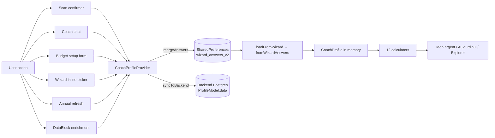

# MINT Data Flow — the authoritative map

**Why this file exists.** MINT data capture lives in three storage layers
(SharedPreferences, Keychain fallback, backend Postgres) mutated by eight
write paths (wizard, scan, coach save_fact, Dart regex fallback, inline
coach pickers, budget form, DataBlock enrichment, tax annual refresh).
Drifting between them is the #1 source of « the UI says captured, the
profile is empty at relaunch » bugs — the exact bug class that killed the
MVP walkthrough
2026-04-20.

This doc gives every writer + every reader explicit ownership of every
storage key. If your edit changes one, this doc must be updated in the
same PR. CI lint (TODO, Phase 34 extension) will enforce.

---

## The storage model — three layers, deliberate


```mermaid
flowchart LR
    U[User action] --> W1[Scan confirmer]
    U --> W2[Coach chat]
    U --> W3[Budget setup form]
    U --> W4[Wizard inline picker]
    U --> W5[Annual refresh]
    U --> W6[DataBlock enrichment]

    W1 --> PROV[CoachProfileProvider]
    W2 --> PROV
    W3 --> PROV
    W4 --> PROV
    W5 --> PROV
    W6 --> PROV

    PROV -- mergeAnswers --> SP[(SharedPreferences<br/>wizard_answers_v2)]
    PROV -- syncToBackend --> BE[(Backend Postgres<br/>ProfileModel.data)]
    SP --> LOAD[loadFromWizard → fromWizardAnswers]
    LOAD --> PROFILE[CoachProfile in memory]
    PROFILE --> CALCS[12 calculators]
    CALCS --> UI[Mon argent / Aujourd'hui / Explorer]
```

**Invariants.**

1. `wizard_answers_v2` is the **logical local source of truth**. Everything
   derives from it via `CoachProfile.fromWizardAnswers`. Sensitive values may
   be represented physically by `__secure__`; the G1-PROV-02A+B LPP root also
   uses a private SharedPreferences active-slot pointer and an immutable
   Keychain slot, described below. Neither physical indirection is a second
   domain ledger.
2. Backend `ProfileModel.data` is the **remote mirror**, only for
   authenticated users. Anonymous users **never** have backend state —
   Keychain failure for anon sessions falls back to SharedPreferences (see
   `anonymous_session_service.dart`).
3. In the G1-PROV-01 migrated set — `mergeAnswers`, person-owned LPP, self AVS,
   salary, inline, and Open Banking — a writer may construct a typed
   `nextProfile`, but must persist values and provenance through the matching
   `ReportPersistenceService` boundary **before** assigning `_profile` or
   calling `notifyListeners()`. Typed self/manual-partner LPP uses the dedicated
   `saveLppEvidenceAnswers()` boundary; ordinary answer maps use
   `saveAnswers()`.
4. New data capture paths **must** write into `wizard_answers_v2` via one
   of the existing setters, or add a new key listed below.

### Field-centric provenance (G1-PROV-01)

`wizard_answers_v2.__provenance` is the canonical local provenance envelope
for ordinary answer fields. It is keyed by canonical `CoachProfile` field
path; every entry has exactly this shape and does not duplicate the financial
value:

```text
fieldPath -> {source, updatedAt, sourceDate}
```

- `source` is a `ProfileDataSource.name`; `updatedAt` is the ISO-8601 instant
  when MINT accepted the value.
- `sourceDate` is an ISO-8601 date carried by the source, or explicit `null`
  when the source date is unknown. It is never inferred from `updatedAt`.
  Real document-date extraction and consumption remain pending G1-FRESH-01
  and the relevant source-date tickets.
- In migrated writers, the answer value and this three-key entry are saved in
  the same snapshot; only the persisted `nextProfile` may then be published.
- `_coach_data_timestamps` remains dual-written as a legacy migration input.
  New writes use `__provenance` as their source of truth.
- The strict `_coach_lpp_evidence_v1` root is the exception: each typed LPP
  fact owns its exact value, unit, owner/actor/authorization and provenance.
  Cold reconstruction derives the presentation value and field metadata from
  those facts and ignores a parallel `__provenance` entry for the same LPP
  path. The parallel map is persisted for existing profile consumers, but it
  is not an independent authority and cannot repair a malformed strict fact.
- Reconstruction migrates legacy metadata field by field. A legacy path not
  yet mentioned in a partial canonical envelope may still migrate, but a
  malformed canonical entry blocks fallback for that same path (fail closed).
- `__provenance` is currently local-only and is removed from mobile backend
  sync payloads. Backend per-field provenance remains pending its dedicated
  contract; do not silently mirror this local envelope into `ProfileModel.data`.
- G1-PROV-02 implements one default-off typed path for **self and independently
  declared manual-partner** evidence from acquisition through cold reload.
  `FeatureFlags.typedLppEvidence=false` and
  `documentLppEvidenceEnabled=false` are combined by the consumed
  `lppEvidenceIngestionEnabled` AND gate; either false hides LPP before
  consent/OCR/upload and neutralizes a stale review. After the composite gate,
  consented image/PDF extraction, strict document-kind admission and the
  source-aware raw-free adapter produce the only review candidate.
  `ExtractionReviewScreen` validates canonical values, effective date, owner
  choice and balance coherence, then calls only `acceptLppReview`; the removed
  legacy self/partner document writers are not fallbacks. Manual-partner facts
  have a distinct stable owner, reuse the stable self actor, use
  `manualPartnerDeclaration` with a null grant, and are selected by exact owner
  without consulting household membership. The implemented code remains
  default-off: the ticket is still `ticket_only`, live Anthropic eval is NOT
  RUN, and no runtime, activation or G1-GO is claimed. The typed tax path is
  likewise behind its composite default-off gate pending frozen-SHA runtime
  proof and the G1 activation decision.

---

## The 8 writers — who mutates `wizard_answers_v2`

Every writer persists through `ReportPersistenceService`, which encrypts
sensitive keys via `SecureWizardStore` (Keychain) and writes the matching
SharedPreferences representation. Ordinary maps use `saveAnswers(answers)`;
the strict typed LPP root uses `saveLppEvidenceAnswers(answers)`. These are the
only legal local I/O boundaries.

| # | Writer | Entry points | Keys written | Lifecycle trigger |
|---|---|---|---|---|
| 1 | **Wizard full** | `wizard_service.dart` | `q_firstname`, `q_birth_year`, `q_canton`, `q_net_income_period_chf`, `q_pay_frequency`, `q_housing_cost_period_chf`, … (all `q_*`) | `WizardProvider.complete()` sets `_completed_key` flag |
| 2 | **Mini-onboarding** | `smart_flow_screen.dart` | Subset of `q_*` (3 questions) | `ReportPersistenceService.setMiniOnboardingCompleted(true)` |
| 3 | **Scan confirmation** | LPP: `DocumentScanScreen → kind gate → LppExtractionAdapter → ScanSessionProvider → ExtractionReviewScreen → LppReviewConfirmation.self|manualPartner → acceptLppReview → LppProfilePersistence`. Typed tax uses `TaxExtractionCandidate → TaxReviewConfirmation → acceptTaxReview → TaxProfilePersistence`. AVS/salary retain their reviewed type-specific writers. | LPP writes only strict-secure `_coach_lpp_evidence_v1` plus derived presentation provenance; accepted self review removes loose self aliases and no legacy LPP document writer exists. Tax uses `_coach_tax_snapshots_v1`; salary certificate writes annual gross/month count/bonus, never net-period income. | After valid date/owner/value/unit/coherence review and one awaited save. LPP remains double-default-off and ticket/runtime/activation NO-GO. |
| 4 | **Coach chat inline picker** | `coach_chat_screen.dart` → `coachProvider.mergeAnswers()` | Arbitrary `q_*` single field | User taps inline picker in conversation |
| 5 | **Dart regex fact fallback** | `lib/services/chat/fact_extraction_fallback.dart` → `applySaveFact` → `mergeAnswers` | `q_birth_year`, `q_net_income_period_chf`, `q_gross_salary_annual`, `_coach_avoir_lpp`, `_coach_salaire_assure`, `q_3a_total`, `_coach_rachat_maximum` (restricted to 1st-person matches) | Every coach chat send |
| 6 | **Budget setup form** | `budget_setup_screen.dart` → `coachProvider.mergeAnswers` + `budgetProvider.refreshFromProfile` | `q_housing_cost_period_chf`, `q_lamal_premium_monthly_chf`, `q_pay_frequency='monthly'`, `_coach_depenses_{transport,telecom,electricite,frais_medicaux,autres}` | Tap « Enregistrer » |
| 7 | **Annual refresh** (scheduled) | `updateFromRefresh` (CoachProfileProvider) | Updates `_coach_updated_at` + tax + salary | Annual trigger (currently orphaned, cf façade audit) |
| 8 | **DataBlock enrichment** | `data_block_enrichment_screen.dart` → `coachProvider.mergeAnswers` | `q_canton`, `q_gross_salary_annual`, `q_self_employed_income`, `q_company_profit_annual_chf`, `q_birth_year`, `q_has_pension_fund`, `q_cash_total`, `q_wealth_estimate`, `q_property_market_value`, `_coach_dettes_hypotheque`, `q_debt_payments_period_chf`, `q_has_consumer_debt`, `q_children`, `q_civil_status`, `q_housing_status` | Missing-fact collector from scenario/Data Quest flows |

**Legend.** Keys prefixed `q_*` come from wizard-style answers
(`fromWizardAnswers` reads them natively). Keys prefixed `_coach_*` come
from richer sources (scan extractions, annotations) — `fromWizardAnswers`
also reads these via the `<code_context>` block at
[`coach_profile.dart:2400-2500`](../apps/mobile/lib/models/coach_profile.dart).

---

## The `q_*` key reference — canonical wizard keys

Read by `CoachProfile.fromWizardAnswers`. Sorted by domain.

**Identity**
- `q_firstname` (str), `q_birth_year` (int), `q_date_of_birth` (ISO str),
  `q_canton` (2-letter, default `ZH`), `q_civil_status`
  (celibataire/marie/concubinage/divorce/veuf), `q_children` (int),
  `q_gender`, `q_commune`

**Income**
- `q_pay_frequency` (`monthly`|`yearly`|`annuel`),
  `q_net_income_period_chf` (double, amount per period),
  `q_gross_salary_annual` (preferred when known — avoids net↔brut roundtrip;
  salary certificate writes monthly gross × `q_nombre_mois`),
  `q_company_profit_annual_chf` (double, SA/Sarl annual distributable envelope;
  not a substitute for sole-proprietor income),
  `q_unemployment_contribution_months` (int 0-24, LACI contribution months over
  the last 24 months),
  `q_nombre_mois` (salary months, defaults to 12), `q_bonus_percentage`
  (salary-certificate percentage, when extracted),
  `q_employment_status` (salarie/independant/retraite/etc.),
  `q_employment_rate` (%), `q_annual_bonus` (CHF), `q_partner_net_income_chf`,
  `q_partner_birth_year`, `q_partner_employment_status`

The salary-certificate writer never fabricates `q_net_income_period_chf` and
publishes its next profile only after the answer snapshot is saved.

**Housing & fixed charges**
- `q_housing_cost_period_chf` (double — rent OR mortgage),
  `q_housing_pay_frequency` (`monthly`|`yearly`|`annuel`, optional; defaults
  to monthly and must not reuse income `q_pay_frequency`),
  `q_housing_status` (locataire/proprietaire/…),
  `q_lamal_premium_monthly_chf` (double, health insurance actual value),
  `_coach_depenses_transport`, `_coach_depenses_telecom`,
  `_coach_depenses_electricite`, `_coach_depenses_frais_medicaux`,
  `_coach_depenses_autres`

**AVS (1st pillar)**
- `q_avs_lacunes_status`, `q_avs_years_abroad`, `q_avs_contribution_years`,
  `q_avs_arrival_year`, `_coach_avs_rente_estimee`, `_coach_avs_lacunes`,
  `_coach_avs_ramd`, `_coach_avs_bonifications_educatives`,
  `_coach_avs_source`

**LPP (2nd pillar)**
- `q_has_pension_fund` (`yes`|`no` string), `q_avoir_lpp` (total legacy),
  `_coach_avoir_lpp` (scanned total),
  `_coach_avoir_lpp_oblig`, `_coach_avoir_lpp_suroblig`,
  `_coach_taux_conversion`, `_coach_taux_conversion_suroblig`,
  `_coach_salaire_assure`, `_coach_rachat_maximum`,
  `_coach_rendement_caisse`, `_coach_rachat_lpp_mensuel`,
  `_coach_lpp_source`
- G1-PROV-02 implements one exact JSON-string answer root,
  `_coach_lpp_evidence_v1`, behind two consumed local switches that both
  default false: `typedLppEvidence` and `documentLppEvidenceEnabled`; the
  product getter is their AND and neither value is backend hydrated.
  Its schema-v1 root has exactly four keys:

  ```text
  {
    schemaVersion: 1,
    self: LppEvidenceSnapshot?,
    manualPartner: LppEvidenceSnapshot?,
    legacyPartnerQuarantine: null | {
      legacySchemaVersion: 0,
      reasonCodes: [String...],
      presentKeys: [String...],
      quarantinedAt: ISO-8601 instant
    }
  }
  ```

  When the composite gate is true, LPP camera/gallery consent requests
  `visionExtraction + transferUsAnthropic` without `persistence365d`.
  Images and PDFs call candidate-only Vision extraction directly; the PDF path
  never uses vault upload, and LPP BYOK/fused/SSE paths are unreachable. The
  backend admits only an exact typed high-confidence personal certificate
  before audit/extraction. Local OCR independently requires a supported
  personal-certificate title plus an individualization label. Plan/unknown/
  lower-confidence/error outcomes create no session or write.

  `LppExtractionAdapter` maps only the exact vocabulary for its named source,
  converts percentage scale once, requires finite confidence, retains explicit
  numeric zero only, rejects ambiguity/duplicates/incoherent balances and
  emits a raw-free candidate. `ScanSessionProvider` keeps at most five volatile
  process-local payloads; the route carries only `scanSessionId`, so a cold
  restart intentionally renders recovery rather than reconstructing raw OCR.

  `acceptLppReview` accepts only `LppReviewConfirmation.self` or
  `.manualPartner` and completely replaces exactly that person's slot. Each
  fact carries exact value/unit, pseudonymous owner/actor, authorization and
  `{source, sourceDate, updatedAt}` provenance. Self owner and actor are equal.
  The manual-partner owner is distinct, its actor is the stable self token even
  when the partner is reviewed first, and its authorization is exactly
  `manualPartnerDeclaration` with `grantId:null`. Replacements reuse both
  identities, preserve the other slot and remove omitted values plus their
  parallel presentation provenance. Linked/grant shapes remain rejected. A
  certificate fact without a source date is `availableNeedsConfirmation`;
  corrected facts are `userInput` with a null source date.
- Before owner selection, review rejects a mandatory/extra component above the
  total or a three-part difference greater than CHF 1. The provider repeats the
  same `LppBalanceCoherence` check after value/unit validation and before its
  persistence load, so a direct contradictory call performs no load, save or
  publication. Untouched documentary facts require a non-future effective
  date; owner cancel, invalid date, contradiction and save failure stay on the
  review with no impact navigation.
- On disk, `wizard_answers_v2` contains only
  `'_coach_lpp_evidence_v1': '__secure__'`. The private
  `lpp_evidence_active_slot_v1` pointer is a separate SharedPreferences key;
  it never enters the wizard map, strict root or backend payload. It names an
  immutable secure-storage slot
  `_coach_lpp_evidence_slot_v1_<32 lowercase hex chars>` generated from 128
  random bits. `saveLppEvidenceAnswers()` stages and verifies the wizard
  placeholder, writes a new slot, then commits the pointer. A failed or late
  timed-out write cannot activate; pointer/wizard rollback preserves the prior
  root. Generic saves, fixed-root migration, dedicated LPP saves and diagnostic
  clear share one persistence serializer. At provider level, `loadFromWizard`
  and `acceptLppReview` share a second FIFO around the complete
  load/migrate/read-modify-write/publication operation, so concurrent reviews or
  startup migration cannot lose a slot or fork owner/actor identity. Successful
  activation removes the previous slot
  and performs a bounded best-effort sweep of inactive slots. Diagnostic clear
  removes the wizard bytes and pointer, then deletes fixed and versioned secure
  roots.
- Cold load treats the active pointer as authoritative and reads only its
  immutable slot. A pre-slot fixed secure root is migrated once only while the
  wizard still has the strict placeholder; after a pointer exists, a stale
  fixed root is ignored. `CoachProfile.fromWizardAnswers` selects strict self
  facts or a bounded manual-partner slot whose owner exactly matches. Manual
  selection validates self-actor lineage when a self slot exists, ignores an
  unrelated malformed quarantine, and never consults household membership.
  Cold reconstruction derives each person's field provenance directly and
  never fills a missing typed fact from the other person, loose keys or parallel
  `__provenance`.
- Loose self LPP behavior is conditional. While the strict root is absent
  (the current default-off production state), legacy loose self fields and
  their backend behavior are preserved. A safe typed migration admits and
  removes only unambiguous certificate facts with exact canonical provenance;
  other loose values stay outside typed selection for review. An accepted typed
  self review removes every loose self LPP key. Loose partner LPP values are never
  promoted: their values are removed and, when the root is readable, only
  allowlisted key names and reason codes enter `legacyPartnerQuarantine`. Beside
  an opaque or unreadable `__secure__` root, aliases are purged without changing
  the root bytes or active pointer. Once the strict root is present, loose LPP
  fields cannot hydrate typed presentation paths.
- `backendSafeAnswers()` always removes `_coach_lpp_evidence_v1`, the private
  pointer if injected, `__provenance`, and every loose partner LPP alias whether
  or not a strict root exists. With a strict root present it also removes stale
  loose self LPP keys. Neither the strict root, a quarantine value, an
  owner/actor token, a secure slot id nor a typed financial fact is mirrored to
  `ProfileModel.data`.
- Private real-certificate coverage runs only through the ignored local
  sanitized oracle; network classifier cases are generated synthetic images.
  The live Anthropic eval is NOT RUN. These local gates do not promote the
  `ticket_only` PROV-02 evidence or establish runtime/activation/G1 GO.

**3a (3rd pillar)**
- `q_has_3a`, `q_3a_total`, `q_3a_accounts_count`, `q_3a_annual_contribution`,
  `q_3a_providers`, `_coach_total_3a`

**Patrimoine & dette**
- `q_cash_total`, `q_wealth_estimate`, `q_investissements`,
  `q_investments_total`, `q_emergency_fund`, `q_debt_payments_period_chf`,
  `q_has_consumer_debt` (`yes`/`no` string),
  `q_property_market_value` (double, valeur vénale estimée du bien immobilier),
  `_coach_dettes_hypotheque`, `_coach_dettes_credit`, `_coach_dettes_leasing`,
  `_coach_dettes_autres`
- `q_cash_total` is the explicit liquid-cash fact, including `0 CHF`. The
  derived `liquidSavingsAmount` marker is required before high-stakes
  liquidity, invalidity, succession, or milestone screens may treat cash as
  known. `q_emergency_fund` may still produce a heuristic display value, but it
  must not be persisted back as `q_cash_total` or unlock cash-sensitive results.
  SafeMode protective warning signals may read the heuristic value only to
  raise/suppress caution; they must not feed countdowns, net-mass, dossier cash,
  scenario unlocks, or milestone completion.
  Smart/minimal onboarding must not write estimated savings into `q_cash_total`;
  it stays missing until user input, certificate/open-banking, or another
  explicit provenance provides a valid non-null non-negative amount.
  `ReportPersistenceService.loadAnswers()` quarantines legacy positive
  `q_cash_total` values without explicit `_coach_cash_total_source` only when
  the amount numerically matches a reconstructed old `q_emergency_fund`
  `yes_3months`/`yes_6months` reserve or the old smart-flow savings estimate.
  Non-matching legacy cash remains the user's existing ledger fact. Quarantined
  estimates stay in `q_cash_total_unconfirmed_legacy` as encrypted migration
  residue; current UI does not consume that key, and scenario consumers treat
  `q_cash_total` as missing until the user enters a new explicit amount. New
  user cash writes through `mergeAnswers`, inline edit, or open banking stamp
  `_coach_cash_total_source` in the same write so relaunches preserve the fact.
- `q_wealth_estimate` is a broad aggregate estimate. Runtime consumers must
  use `PatrimoineProfile.wealthReconciliation` to distinguish estimate-only,
  detail-only, aligned, stale estimate, and missing-detail states instead of
  reading the raw estimate as a second source of truth.
- `q_investments_total > 0` marks `investments` as a user-provided amount;
  high-stakes life-event screens may use it in net estate reconciliation, while
  `q_has_investments` and legacy persistence key `q_investissements` remain
  insufficient.

**Fiscal**
- Implemented G1-PROV-03 contract, still composite default-off: secure
  JSON-string root `_coach_tax_snapshots_v1`
  (`schemaVersion=1`, typed `snapshots[]`, optional `legacyQuarantine`),
  reconstructed as `CoachProfile.fiscal`. Legacy `_coach_tax_*` keys are
  quarantine-only migration input: they never hydrate a canonical snapshot.
  `legacyQuarantine` nested in this root is the sole migration quarantine; no
  standalone tax-quarantine key is allowed. A malformed canonical root is
  recovered fail-closed in that same key with zero snapshots, exact opaque raw
  value and loose facts nested in quarantine, loose keys and orphan
  `fiscal.*` provenance removed, and a single idempotent save. The
  strict-secure `__secure__` placeholder is never overwritten.

**Goals & lifecycle**
- `q_target_retirement_age`, `_coach_family_change`,
  `_coach_financial_literacy_level`, `_coach_created_at`, `_coach_updated_at`,
  `_coach_data_timestamps` (legacy dual-write: fieldPath → ISO timestamp),
  `__provenance` (canonical local map: fieldPath → exact
  `{source, updatedAt, sourceDate}`)

---

## The `_SAVE_FACT_ALLOWED_KEYS` whitelist — coach-LLM canonical names

Defined in
[`services/backend/app/api/v1/endpoints/coach_chat.py:924`](../services/backend/app/api/v1/endpoints/coach_chat.py).
The LLM (Claude) is only allowed to invoke `save_fact` with these
canonical keys. The Dart-side `_mapFactKeyToAnswers` in
[`coach_profile_provider.dart:557-625`](../apps/mobile/lib/providers/coach_profile_provider.dart)
translates every LLM canonical key to one or more `q_*` / `_coach_*`
wizard keys.

**Identity / location**: `birthYear`, `dateOfBirth`, `canton`, `commune`,
`householdType`, `employmentStatus`, `has2ndPillar`, `goal`,
`targetRetirementAge`, `gender`

**Income**: `incomeNetMonthly`, `incomeGrossMonthly`, `incomeNetYearly`,
`incomeGrossYearly`, `selfEmployedNetIncome`, `companyProfitAnnual`,
`employmentRate`, `annualBonus`

**LPP**: `lppInsuredSalary`, `avoirLpp`, `avoirLppObligatoire`,
`avoirLppSurobligatoire`, `lppBuybackMax`, `hasVoluntaryLpp`

**3a**: `pillar3aAnnual`, `pillar3aBalance`

**Savings / wealth / debt**: `savingsMonthly`, `totalSavings`,
`wealthEstimate`, `hasDebt`, `totalDebt`

**Spouse**: `spouseBirthYear`, `spouseIncomeNetMonthly`,
`spouseAvsContributionYears`

**AVS**: `hasAvsGaps`, `avsContributionYears`

**⚠ Trap.** Adding a new canonical key to the backend whitelist without
also adding a Dart mapping in `_mapFactKeyToAnswers` = the fact is silently
dropped on client side. Always update both files in the same PR.

---

## Anonymous-mode caveat — why fresh installs are fragile

Anonymous users (`AuthProvider.isLocalMode = true`, default-on for fresh
installs) have **no `user_id`** and therefore:

1. Backend `save_fact` handler hits the `# Hors-DB path` branch
   ([`coach_chat.py:1408-1413`](../services/backend/app/api/v1/endpoints/coach_chat.py))
   — returns `"Fait noté (hors DB)"` without persisting.
2. Backend `save_fact` is in `INTERNAL_TOOL_NAMES` — the tool_call is
   stripped from `external_calls` before reaching Flutter. Flutter's
   `applySaveFact` dispatcher only fires when **Claude does NOT call
   save_fact** (bug, see § Tool routing).
3. The **Dart regex fallback** (`fact_extraction_fallback.dart`) is the
   only reliable write path for anon users until they register.
4. Keychain writes still work (iOS entitlement fix), but if they fail,
   `AnonymousSessionService` + `flutter_secure_storage` fall back
   gracefully to SharedPreferences.

**Scan-first onboarding.** Before the fix commits in
`triage/flow-utilisateur-2026-04-20`, `updateFrom*Extraction` silently
returned if `_profile == null`, losing all scanned data for fresh users.
The fix seeds `CoachProfile.defaults()` so the extraction lands.
**Don't undo this.**

---

## Reader reference — who reads `wizard_answers_v2`

Authoritative reader: `CoachProfile.fromWizardAnswers(answers)` at
[`coach_profile.dart:2307`](../apps/mobile/lib/models/coach_profile.dart).
Everything else reads the derived `CoachProfile`, not the map directly.

**Exceptions** (grep before adding a new one):
- `AuthProvider` at line 669 reads `answers` for auth bootstrap
- `ReportPersistenceService` is the I/O layer itself

Every calculator / widget that needs profile data **must** read through
`CoachProfileProvider.profile`, never through `loadAnswers()` directly.

---

## Scan pipeline — end-to-end

```
Document type selection
  ├─ LPP G1-PROV-02 (wired, double-default-off; no runtime activation claim)
  │   ↓ typedLppEvidence && documentLppEvidenceEnabled before consent/OCR/upload
  │   ↓ camera/gallery consent: Vision + US transfer, NO 365-day persistence
  │   ↓ image/PDF direct candidate extraction; PDF never enters vault upload
  │   ↓ backend exact high personal-certificate kind gate
  │      OR local title + individualization kind gate
  │   ↓ source-aware LppExtractionAdapter → raw-free canonical candidate
  │   ↓ volatile max-5 ScanSessionProvider; route carries scanSessionId only
  │   ↓ ExtractionReviewScreen: values/units + effective date + coherence
  │   ↓ owner = self OR independently declared manual partner
  │   ↓ CoachProfileProvider.acceptLppReview repeats coherence before load
  │   ↓ provider FIFO + one complete person-slot replacement + one stamp
  │   ↓ awaited whole `_coach_lpp_evidence_v1` secure save
  │   ↓ publish profile/listeners only after pointer commit succeeds
  │   ↓ impact payload has no raw text and calls no generic insight/event path
  │   ↓ cold reload → bounded self/manual expected-owner selector → strict facts
  │
  ├─ AVS / salaire: camera, gallery, PDF or OCR paste
  │   ↓ DocumentService.extractDocumentData (backend)
  │   ↓ ExtractionResult → ExtractionReviewScreen → Confirmer
  │   ↓ coachProvider.updateFrom{Avs|Salary}Extraction(fields)
  │   ↓ ReportPersistenceService.saveAnswers before publication
  │   ↓ invalidates narrative, publishes profile, then optional backend sync
  └─ taxation (composite default-off gate; local-only)
      ↓ camera, gallery and PDF are hidden; handlers reject before HTTP/files
      ↓ synthetic/local text seam for tests and manual review only
      ↓ TaxDeclarationParser on device → TaxReviewConfirmation
      ↓ user taps Confirmer → coachProvider.acceptTaxReview(candidate)
      ↓ validates status/time/subject and upserts one typed snapshot
      ↓ writes `_coach_tax_snapshots_v1` + exact `fiscal.*` provenance
      ↓ TaxProfilePersistence.saveAnswers(answers) before profile publication
  ↓
/scan/impact (DocumentImpactScreen) shows delta in confidence score
```

G1-PROV-03 replaces, rather than wraps, the legacy tax branch with the single
`TaxExtractionCandidate → TaxReviewConfirmation →
CoachProfileProvider.acceptTaxReview → TaxProfilePersistence → cold reload →
FiscalSnapshotSelector.selectAssessedBaseline` production seam.

Failure modes:
- Keychain -34018 on iOS sim without entitlements may keep a non-fiscal value
  in the local dev answer map. The strict fiscal root is the exception: a
  secure write failure throws before SharedPreferences/profile publication,
  and an unreadable `__secure__` placeholder is consumed as empty without
  being overwritten.
- The strict LPP root also fails closed. A missing/unreadable active slot leaves
  the placeholder unresolved and cannot fall back to a stale fixed root or
  loose value; loose partner aliases are still purged in place without replacing
  the placeholder, pointer or secure root. A failed replacement restores the
  prior wizard bytes and active pointer; a late timed-out unique slot is never
  activated and is deleted when its write completes. On first activation,
  process death after placeholder
  staging but before pointer commit may require the user to review the legacy
  loose facts again; it does not publish a value-only or metadata-only typed
  fact.
- Scan confirm UI shows « +29 points » but save drops → fixed by seeding
  defaults + adding `hasScanData` hydration branch in `loadFromWizard`.

---

## Budget flow — end-to-end

```
Mon argent → Ton budget ce mois card → tap Commencer
  ↓
/budget (BudgetContainerScreen)
  ↓ if inputs == null → empty state CTA « Poser mes charges »
  ↓ tap routes to /budget/setup
  ↓
BudgetSetupScreen (new, P0-MVP-3)
  ↓ pre-fill fields from coachProfile.depenses
  ↓ user types 2 required + 0..5 optional
  ↓ tap Enregistrer
  ↓
coachProvider.mergeAnswers({
  q_housing_cost_period_chf: …,
  q_pay_frequency: 'monthly',
  q_lamal_premium_monthly_chf: …,
  _coach_depenses_transport: …,          (optional)
  _coach_depenses_telecom: …,             (optional)
  _coach_depenses_electricite: …,         (optional)
  _coach_depenses_frais_medicaux: …,      (optional)
  _coach_depenses_autres: …,              (optional)
})
  ↓ answers written via ReportPersistenceService
  ↓
budgetProvider.refreshFromProfile(updatedProfile)
  ↓ BudgetInputs.fromCoachProfile(profile) re-derives
  ↓ BudgetService.computePlan(inputs, overrides)
  ↓ _store.saveInputs(inputs)
  ↓
Pop back to Mon argent → BudgetSummaryCard now has data → « Il te reste Y CHF »
```

Chat fallback (« J'en parle plutôt au coach ») remains available on the
setup screen, respecting `feedback_chat_is_everything` (chat *can* do it,
but doesn't *have* to).

---

## Route registry (Phase 32 Cartographier)

147 routes with `RouteMeta{owner, category, requiresAuth, killFlag}` in
[`apps/mobile/lib/routes/route_metadata.dart`](../apps/mobile/lib/routes/route_metadata.dart).

**CLI**: `./tools/mint-routes list | grep coach` — live health query
against Sentry + FeatureFlags.

**Admin UI**: `/admin/routes` — schema viewer (does NOT show Sentry health
on mobile, iOS sandbox prevents cross-filesystem read).

**Adding a new route** — three places to update in one PR:
1. The `GoRoute` in [`app.dart`](../apps/mobile/lib/app.dart)
2. The `RouteMeta` entry in `route_metadata.dart`
3. Navigation intent tag (if user-facing) in
   [`services/navigation/screen_registry.dart`](../apps/mobile/lib/services/navigation/screen_registry.dart)

The `route_registry_parity` CI lint will fail the PR otherwise.

---

*Last updated: 2026-07-14 for the default-off G1-PROV-02A+B person-owned LPP
model/persistence checkpoint and G1-PROV-03 typed tax provenance. PROV-02 is not
GREEN: its composite document flag/caller, production UI wiring, activation and
runtime proof remain C blockers.
Maintenance rule: every new writer or reader of `wizard_answers_v2`
updates this doc in the same PR. Code drift without doc drift = the
trap we built this to avoid.*
