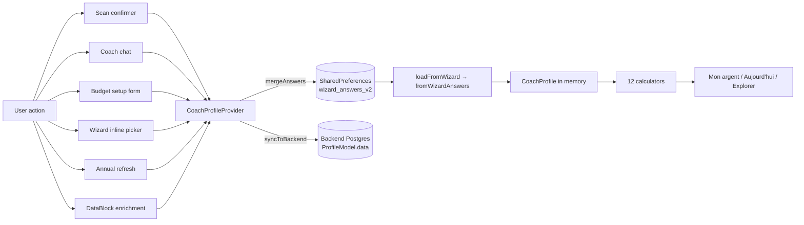

# MINT Data Flow — the authoritative map

**Why this file exists.** MINT data capture lives in three storage layers
(SharedPreferences, Keychain fallback, backend Postgres) mutated by eight
write paths (wizard, scan, coach save_fact, Dart regex fallback, inline
coach pickers, budget form, DataBlock enrichment, tax annual refresh).
Drifting between them is the #1 source of « the UI says captured, the
profile is empty at relaunch » bugs — the exact bug class that killed the
MVP walkthrough
2026-04-20.

This doc gives every writer + every reader explicit ownership of every
storage key. If your edit changes one, this doc must be updated in the
same PR. CI lint (TODO, Phase 34 extension) will enforce.

---

## The storage model — three layers, deliberate


```mermaid
flowchart LR
    U[User action] --> W1[Scan confirmer]
    U --> W2[Coach chat]
    U --> W3[Budget setup form]
    U --> W4[Wizard inline picker]
    U --> W5[Annual refresh]
    U --> W6[DataBlock enrichment]

    W1 --> PROV[CoachProfileProvider]
    W2 --> PROV
    W3 --> PROV
    W4 --> PROV
    W5 --> PROV
    W6 --> PROV

    PROV -- mergeAnswers --> SP[(SharedPreferences<br/>wizard_answers_v2)]
    PROV -- syncToBackend --> BE[(Backend Postgres<br/>ProfileModel.data)]
    SP --> LOAD[loadFromWizard → fromWizardAnswers]
    LOAD --> PROFILE[CoachProfile in memory]
    PROFILE --> CALCS[12 calculators]
    CALCS --> UI[Mon argent / Aujourd'hui / Explorer]
```

**Invariants.**

1. `wizard_answers_v2` (SharedPreferences key) is the **local source of
   truth**. Everything derives from it via `CoachProfile.fromWizardAnswers`.
2. Backend `ProfileModel.data` is the **remote mirror**, only for
   authenticated users. Anonymous users **never** have backend state —
   Keychain failure for anon sessions falls back to SharedPreferences (see
   `anonymous_session_service.dart`).
3. In the G1-PROV-01 migrated set — `mergeAnswers`, self LPP, self AVS,
   salary, inline, and Open Banking — a writer may construct a typed
   `nextProfile`, but must persist values and provenance in one
   `ReportPersistenceService.saveAnswers()` snapshot **before** assigning
   `_profile` or calling `notifyListeners()`.
4. New data capture paths **must** write into `wizard_answers_v2` via one
   of the existing setters, or add a new key listed below.

### Field-centric provenance (G1-PROV-01)

`wizard_answers_v2.__provenance` is the canonical local provenance envelope.
It is keyed by canonical `CoachProfile` field path; every entry has exactly
this shape and does not duplicate the financial value:

```text
fieldPath -> {source, updatedAt, sourceDate}
```

- `source` is a `ProfileDataSource.name`; `updatedAt` is the ISO-8601 instant
  when MINT accepted the value.
- `sourceDate` is an ISO-8601 date carried by the source, or explicit `null`
  when the source date is unknown. It is never inferred from `updatedAt`.
  Real document-date extraction and consumption remain pending G1-FRESH-01
  and the relevant source-date tickets.
- In migrated writers, the answer value and this three-key entry are saved in
  the same snapshot; only the persisted `nextProfile` may then be published.
- `_coach_data_timestamps` remains dual-written as a legacy migration input.
  New writes use `__provenance` as their source of truth.
- Reconstruction migrates legacy metadata field by field. A legacy path not
  yet mentioned in a partial canonical envelope may still migrate, but a
  malformed canonical entry blocks fallback for that same path (fail closed).
- `__provenance` is currently local-only and is removed from mobile backend
  sync payloads. Backend per-field provenance remains pending its dedicated
  contract; do not silently mirror this local envelope into `ProfileModel.data`.
- Live legacy exceptions remain full G1 blockers: the legacy tax scan writer
  (to be removed by G1-PROV-03) and `updateFromPartnerLppExtraction`
  (G1-PROV-02 + G1-BND-02A) still publish before save and write no canonical
  provenance.

---

## The 8 writers — who mutates `wizard_answers_v2`

Every writer persists via `ReportPersistenceService.saveAnswers(answers)`
which encrypts sensitive keys via `SecureWizardStore` (Keychain) and
mirrors to SharedPreferences. **This is the only legal write path.**

| # | Writer | Entry points | Keys written | Lifecycle trigger |
|---|---|---|---|---|
| 1 | **Wizard full** | `wizard_service.dart` | `q_firstname`, `q_birth_year`, `q_canton`, `q_net_income_period_chf`, `q_pay_frequency`, `q_housing_cost_period_chf`, … (all `q_*`) | `WizardProvider.complete()` sets `_completed_key` flag |
| 2 | **Mini-onboarding** | `smart_flow_screen.dart` | Subset of `q_*` (3 questions) | `ReportPersistenceService.setMiniOnboardingCompleted(true)` |
| 3 | **Scan confirmation** | `extraction_review_screen.dart:659` → current `updateFrom{Lpp,Avs,Salary}Extraction` / `updateFromPartnerLppExtraction`; tax target is the single `TaxExtractionCandidate → TaxReviewConfirmation → acceptTaxReview → TaxProfilePersistence` seam | LPP/AVS `_coach_*`; tax is legacy `_coach_tax_*` until G1-PROV-03, then secure `_coach_tax_snapshots_v1`; salary certificate: `q_gross_salary_annual = monthly gross × q_nombre_mois`, `q_nombre_mois`, and `q_bonus_percentage` when extracted; never `q_net_income_period_chf` | Post-scan; save-before-publish only for migrated self LPP/self AVS/salary paths |
| 4 | **Coach chat inline picker** | `coach_chat_screen.dart` → `coachProvider.mergeAnswers()` | Arbitrary `q_*` single field | User taps inline picker in conversation |
| 5 | **Dart regex fact fallback** | `lib/services/chat/fact_extraction_fallback.dart` → `applySaveFact` → `mergeAnswers` | `q_birth_year`, `q_net_income_period_chf`, `q_gross_salary_annual`, `_coach_avoir_lpp`, `_coach_salaire_assure`, `q_3a_total`, `_coach_rachat_maximum` (restricted to 1st-person matches) | Every coach chat send |
| 6 | **Budget setup form** | `budget_setup_screen.dart` → `coachProvider.mergeAnswers` + `budgetProvider.refreshFromProfile` | `q_housing_cost_period_chf`, `q_lamal_premium_monthly_chf`, `q_pay_frequency='monthly'`, `_coach_depenses_{transport,telecom,electricite,frais_medicaux,autres}` | Tap « Enregistrer » |
| 7 | **Annual refresh** (scheduled) | `updateFromRefresh` (CoachProfileProvider) | Updates `_coach_updated_at` + tax + salary | Annual trigger (currently orphaned, cf façade audit) |
| 8 | **DataBlock enrichment** | `data_block_enrichment_screen.dart` → `coachProvider.mergeAnswers` | `q_canton`, `q_gross_salary_annual`, `q_self_employed_income`, `q_company_profit_annual_chf`, `q_birth_year`, `q_has_pension_fund`, `q_cash_total`, `q_wealth_estimate`, `q_property_market_value`, `_coach_dettes_hypotheque`, `q_debt_payments_period_chf`, `q_has_consumer_debt`, `q_children`, `q_civil_status`, `q_housing_status` | Missing-fact collector from scenario/Data Quest flows |

**Legend.** Keys prefixed `q_*` come from wizard-style answers
(`fromWizardAnswers` reads them natively). Keys prefixed `_coach_*` come
from richer sources (scan extractions, annotations) — `fromWizardAnswers`
also reads these via the `<code_context>` block at
[`coach_profile.dart:2400-2500`](../apps/mobile/lib/models/coach_profile.dart).

---

## The `q_*` key reference — canonical wizard keys

Read by `CoachProfile.fromWizardAnswers`. Sorted by domain.

**Identity**
- `q_firstname` (str), `q_birth_year` (int), `q_date_of_birth` (ISO str),
  `q_canton` (2-letter, default `ZH`), `q_civil_status`
  (celibataire/marie/concubinage/divorce/veuf), `q_children` (int),
  `q_gender`, `q_commune`

**Income**
- `q_pay_frequency` (`monthly`|`yearly`|`annuel`),
  `q_net_income_period_chf` (double, amount per period),
  `q_gross_salary_annual` (preferred when known — avoids net↔brut roundtrip;
  salary certificate writes monthly gross × `q_nombre_mois`),
  `q_company_profit_annual_chf` (double, SA/Sarl annual distributable envelope;
  not a substitute for sole-proprietor income),
  `q_unemployment_contribution_months` (int 0-24, LACI contribution months over
  the last 24 months),
  `q_nombre_mois` (salary months, defaults to 12), `q_bonus_percentage`
  (salary-certificate percentage, when extracted),
  `q_employment_status` (salarie/independant/retraite/etc.),
  `q_employment_rate` (%), `q_annual_bonus` (CHF), `q_partner_net_income_chf`,
  `q_partner_birth_year`, `q_partner_employment_status`

The salary-certificate writer never fabricates `q_net_income_period_chf` and
publishes its next profile only after the answer snapshot is saved.

**Housing & fixed charges**
- `q_housing_cost_period_chf` (double — rent OR mortgage),
  `q_housing_pay_frequency` (`monthly`|`yearly`|`annuel`, optional; defaults
  to monthly and must not reuse income `q_pay_frequency`),
  `q_housing_status` (locataire/proprietaire/…),
  `q_lamal_premium_monthly_chf` (double, health insurance actual value),
  `_coach_depenses_transport`, `_coach_depenses_telecom`,
  `_coach_depenses_electricite`, `_coach_depenses_frais_medicaux`,
  `_coach_depenses_autres`

**AVS (1st pillar)**
- `q_avs_lacunes_status`, `q_avs_years_abroad`, `q_avs_contribution_years`,
  `q_avs_arrival_year`, `_coach_avs_rente_estimee`, `_coach_avs_lacunes`,
  `_coach_avs_ramd`, `_coach_avs_bonifications_educatives`,
  `_coach_avs_source`

**LPP (2nd pillar)**
- `q_has_pension_fund` (`yes`|`no` string), `q_avoir_lpp` (total legacy),
  `_coach_avoir_lpp` (scanned total),
  `_coach_avoir_lpp_oblig`, `_coach_avoir_lpp_suroblig`,
  `_coach_taux_conversion`, `_coach_taux_conversion_suroblig`,
  `_coach_salaire_assure`, `_coach_rachat_maximum`,
  `_coach_rendement_caisse`, `_coach_rachat_lpp_mensuel`,
  `_coach_lpp_source`

**3a (3rd pillar)**
- `q_has_3a`, `q_3a_total`, `q_3a_accounts_count`, `q_3a_annual_contribution`,
  `q_3a_providers`, `_coach_total_3a`

**Patrimoine & dette**
- `q_cash_total`, `q_wealth_estimate`, `q_investissements`,
  `q_investments_total`, `q_emergency_fund`, `q_debt_payments_period_chf`,
  `q_has_consumer_debt` (`yes`/`no` string),
  `q_property_market_value` (double, valeur vénale estimée du bien immobilier),
  `_coach_dettes_hypotheque`, `_coach_dettes_credit`, `_coach_dettes_leasing`,
  `_coach_dettes_autres`
- `q_cash_total` is the explicit liquid-cash fact, including `0 CHF`. The
  derived `liquidSavingsAmount` marker is required before high-stakes
  liquidity, invalidity, succession, or milestone screens may treat cash as
  known. `q_emergency_fund` may still produce a heuristic display value, but it
  must not be persisted back as `q_cash_total` or unlock cash-sensitive results.
  SafeMode protective warning signals may read the heuristic value only to
  raise/suppress caution; they must not feed countdowns, net-mass, dossier cash,
  scenario unlocks, or milestone completion.
  Smart/minimal onboarding must not write estimated savings into `q_cash_total`;
  it stays missing until user input, certificate/open-banking, or another
  explicit provenance provides a valid non-null non-negative amount.
  `ReportPersistenceService.loadAnswers()` quarantines legacy positive
  `q_cash_total` values without explicit `_coach_cash_total_source` only when
  the amount numerically matches a reconstructed old `q_emergency_fund`
  `yes_3months`/`yes_6months` reserve or the old smart-flow savings estimate.
  Non-matching legacy cash remains the user's existing ledger fact. Quarantined
  estimates stay in `q_cash_total_unconfirmed_legacy` as encrypted migration
  residue; current UI does not consume that key, and scenario consumers treat
  `q_cash_total` as missing until the user enters a new explicit amount. New
  user cash writes through `mergeAnswers`, inline edit, or open banking stamp
  `_coach_cash_total_source` in the same write so relaunches preserve the fact.
- `q_wealth_estimate` is a broad aggregate estimate. Runtime consumers must
  use `PatrimoineProfile.wealthReconciliation` to distinguish estimate-only,
  detail-only, aligned, stale estimate, and missing-detail states instead of
  reading the raw estimate as a second source of truth.
- `q_investments_total > 0` marks `investments` as a user-provided amount;
  high-stakes life-event screens may use it in net estate reconciliation, while
  `q_has_investments` and legacy persistence key `q_investissements` remain
  insufficient.

**Fiscal**
- Target G1-PROV-03: secure JSON-string root `_coach_tax_snapshots_v1`
  (`schemaVersion=1`, typed `snapshots[]`, optional `legacyQuarantine`),
  reconstructed as `CoachProfile.fiscal`. Legacy `_coach_tax_*` keys are
  quarantine-only migration input: they never hydrate a canonical snapshot.
  `legacyQuarantine` nested in this root is the sole migration quarantine; no
  standalone tax-quarantine key is allowed.

**Goals & lifecycle**
- `q_target_retirement_age`, `_coach_family_change`,
  `_coach_financial_literacy_level`, `_coach_created_at`, `_coach_updated_at`,
  `_coach_data_timestamps` (legacy dual-write: fieldPath → ISO timestamp),
  `__provenance` (canonical local map: fieldPath → exact
  `{source, updatedAt, sourceDate}`)

---

## The `_SAVE_FACT_ALLOWED_KEYS` whitelist — coach-LLM canonical names

Defined in
[`services/backend/app/api/v1/endpoints/coach_chat.py:924`](../services/backend/app/api/v1/endpoints/coach_chat.py).
The LLM (Claude) is only allowed to invoke `save_fact` with these
canonical keys. The Dart-side `_mapFactKeyToAnswers` in
[`coach_profile_provider.dart:557-625`](../apps/mobile/lib/providers/coach_profile_provider.dart)
translates every LLM canonical key to one or more `q_*` / `_coach_*`
wizard keys.

**Identity / location**: `birthYear`, `dateOfBirth`, `canton`, `commune`,
`householdType`, `employmentStatus`, `has2ndPillar`, `goal`,
`targetRetirementAge`, `gender`

**Income**: `incomeNetMonthly`, `incomeGrossMonthly`, `incomeNetYearly`,
`incomeGrossYearly`, `selfEmployedNetIncome`, `companyProfitAnnual`,
`employmentRate`, `annualBonus`

**LPP**: `lppInsuredSalary`, `avoirLpp`, `avoirLppObligatoire`,
`avoirLppSurobligatoire`, `lppBuybackMax`, `hasVoluntaryLpp`

**3a**: `pillar3aAnnual`, `pillar3aBalance`

**Savings / wealth / debt**: `savingsMonthly`, `totalSavings`,
`wealthEstimate`, `hasDebt`, `totalDebt`

**Spouse**: `spouseBirthYear`, `spouseIncomeNetMonthly`,
`spouseAvsContributionYears`

**AVS**: `hasAvsGaps`, `avsContributionYears`

**⚠ Trap.** Adding a new canonical key to the backend whitelist without
also adding a Dart mapping in `_mapFactKeyToAnswers` = the fact is silently
dropped on client side. Always update both files in the same PR.

---

## Anonymous-mode caveat — why fresh installs are fragile

Anonymous users (`AuthProvider.isLocalMode = true`, default-on for fresh
installs) have **no `user_id`** and therefore:

1. Backend `save_fact` handler hits the `# Hors-DB path` branch
   ([`coach_chat.py:1408-1413`](../services/backend/app/api/v1/endpoints/coach_chat.py))
   — returns `"Fait noté (hors DB)"` without persisting.
2. Backend `save_fact` is in `INTERNAL_TOOL_NAMES` — the tool_call is
   stripped from `external_calls` before reaching Flutter. Flutter's
   `applySaveFact` dispatcher only fires when **Claude does NOT call
   save_fact** (bug, see § Tool routing).
3. The **Dart regex fallback** (`fact_extraction_fallback.dart`) is the
   only reliable write path for anon users until they register.
4. Keychain writes still work (iOS entitlement fix), but if they fail,
   `AnonymousSessionService` + `flutter_secure_storage` fall back
   gracefully to SharedPreferences.

**Scan-first onboarding.** Before the fix commits in
`triage/flow-utilisateur-2026-04-20`, `updateFrom*Extraction` silently
returned if `_profile == null`, losing all scanned data for fresh users.
The fix seeds `CoachProfile.defaults()` so the extraction lands.
**Don't undo this.**

---

## Reader reference — who reads `wizard_answers_v2`

Authoritative reader: `CoachProfile.fromWizardAnswers(answers)` at
[`coach_profile.dart:2307`](../apps/mobile/lib/models/coach_profile.dart).
Everything else reads the derived `CoachProfile`, not the map directly.

**Exceptions** (grep before adding a new one):
- `AuthProvider` at line 669 reads `answers` for auth bootstrap
- `ReportPersistenceService` is the I/O layer itself

Every calculator / widget that needs profile data **must** read through
`CoachProfileProvider.profile`, never through `loadAnswers()` directly.

---

## Scan pipeline — end-to-end

```
PDF (camera / gallery / OCR paste / test fixture)
  ↓
DocumentService.extractDocumentData (backend)
  ↓ returns ExtractionResult {fields: [...], confidence, sources}
  ↓
ExtractionReviewScreen (user verifies each field)
  ↓ user taps Confirmer
  ↓
coachProvider.updateFrom{Lpp|Avs|Salary}Extraction(fields)
  ↓ seeds _profile = defaults() if null
  ↓ mutates prevoyance/patrimoine/dettes/fiscal
  ↓ writes _coach_<type>_<field> keys + _coach_updated_at
  ↓ calls ReportPersistenceService.saveAnswers(answers)  ← persistence
  ↓ CoachNarrativeService.invalidateCache(_profile)     ← stale greeting fix
  ↓ notifyListeners()
  ↓ _syncToBackend() (fire-and-forget, skipped for anon)
  ↓
/scan/impact (DocumentImpactScreen) shows delta in confidence score
```

G1-PROV-03 replaces, rather than wraps, the legacy tax branch with the single
`TaxExtractionCandidate → TaxReviewConfirmation →
CoachProfileProvider.acceptTaxReview → TaxProfilePersistence → cold reload →
FiscalSnapshotSelector.selectAssessedBaseline` production seam.

Failure modes:
- Keychain -34018 on iOS sim without entitlements → SharedPrefs fallback
  handles it via `AnonymousSessionService` pattern.
- Scan confirm UI shows « +29 points » but save drops → fixed by seeding
  defaults + adding `hasScanData` hydration branch in `loadFromWizard`.

---

## Budget flow — end-to-end

```
Mon argent → Ton budget ce mois card → tap Commencer
  ↓
/budget (BudgetContainerScreen)
  ↓ if inputs == null → empty state CTA « Poser mes charges »
  ↓ tap routes to /budget/setup
  ↓
BudgetSetupScreen (new, P0-MVP-3)
  ↓ pre-fill fields from coachProfile.depenses
  ↓ user types 2 required + 0..5 optional
  ↓ tap Enregistrer
  ↓
coachProvider.mergeAnswers({
  q_housing_cost_period_chf: …,
  q_pay_frequency: 'monthly',
  q_lamal_premium_monthly_chf: …,
  _coach_depenses_transport: …,          (optional)
  _coach_depenses_telecom: …,             (optional)
  _coach_depenses_electricite: …,         (optional)
  _coach_depenses_frais_medicaux: …,      (optional)
  _coach_depenses_autres: …,              (optional)
})
  ↓ answers written via ReportPersistenceService
  ↓
budgetProvider.refreshFromProfile(updatedProfile)
  ↓ BudgetInputs.fromCoachProfile(profile) re-derives
  ↓ BudgetService.computePlan(inputs, overrides)
  ↓ _store.saveInputs(inputs)
  ↓
Pop back to Mon argent → BudgetSummaryCard now has data → « Il te reste Y CHF »
```

Chat fallback (« J'en parle plutôt au coach ») remains available on the
setup screen, respecting `feedback_chat_is_everything` (chat *can* do it,
but doesn't *have* to).

---

## Route registry (Phase 32 Cartographier)

147 routes with `RouteMeta{owner, category, requiresAuth, killFlag}` in
[`apps/mobile/lib/routes/route_metadata.dart`](../apps/mobile/lib/routes/route_metadata.dart).

**CLI**: `./tools/mint-routes list | grep coach` — live health query
against Sentry + FeatureFlags.

**Admin UI**: `/admin/routes` — schema viewer (does NOT show Sentry health
on mobile, iOS sandbox prevents cross-filesystem read).

**Adding a new route** — three places to update in one PR:
1. The `GoRoute` in [`app.dart`](../apps/mobile/lib/app.dart)
2. The `RouteMeta` entry in `route_metadata.dart`
3. Navigation intent tag (if user-facing) in
   [`services/navigation/screen_registry.dart`](../apps/mobile/lib/services/navigation/screen_registry.dart)

The `route_registry_parity` CI lint will fail the PR otherwise.

---

*Last updated: 2026-07-14 for G1-PROV-01 field-centric provenance.
Maintenance rule: every new writer or reader of `wizard_answers_v2`
updates this doc in the same PR. Code drift without doc drift = the
trap we built this to avoid.*
