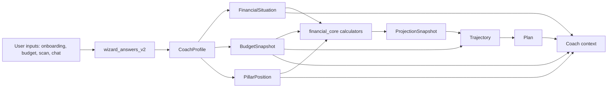

# Mint Data Spine + Plan Vivant v1 Design

> Status: design spec approved for planning
> Date: 2026-05-23
> Scope: mobile-first data architecture and proof flow
> Depends on: `CLAUDE.md`, `AGENTS.md`, `docs/data-flow.md`, `docs/calculator-graph.md`, `docs/BUDGET_VIVANT_ARCHITECTURE.md`, `docs/BUDGET_LIVING_ENGINE_IMPLEMENTATION_SPEC.md`, `docs/MINT_UX_GRAAL_MASTERPLAN.md`

## Goal

Mint needs a single, testable data spine that makes the user's financial situation, monthly budget, Swiss pillar position, projected trajectory, and living plan available to calculators, UI, and the coach without relying on the LLM as the source of truth.

The first implementation must prove one vertical slice end to end:

```text
capture data -> persist -> relaunch -> derive snapshot -> calculate -> show -> chat can explain
```

## Product Thesis

Mint should not be a collection of calculators or a chat-only app. Mint should be a calm Swiss financial cockpit where structured data creates lucidity:

- the user sees where they are now,
- Mint shows where the current trajectory leads,
- Mint identifies the gap between now and the target,
- Mint proposes a small plan,
- the coach explains the plan using the same structured facts and calculations.

The LLM may extract, explain, summarize, and challenge. It must not own the financial truth.

## Existing Foundation

The repo already has useful pieces:

- `wizard_answers_v2` as local source of truth.
- `CoachProfile.fromWizardAnswers` as the authoritative hydration path.
- `BudgetInputs`, `BudgetService`, `BudgetProvider`, and budget widgets.
- `BudgetSnapshot` and `BudgetLivingEngine` specs.
- `RetirementProjectionService`, financial core calculators, and projection widgets.
- `FinancialPlan`, `FinancialPlanService`, `PlanTrackingService`, and trajectory widgets.
- Coach tool routing docs and known anonymous `save_fact` caveats.
- Maestro simulator infrastructure for proof flows.

The missing piece is not another screen. It is a canonical contract between these pieces.

## Core Domain Objects

### FinancialSituation

Stable representation of the user's current reality.

Minimum v1 domains:

- identity: birth year or birth date, canton, commune, household status, children.
- income: net monthly income, gross annual income when known, employment status, employment rate.
- housing: rent or mortgage cost, housing status.
- protection: LAMal premium, insurance-related fixed costs when known.
- wealth: cash, liquid savings, investments, emergency fund.
- debt: credit, leasing, mortgage, other monthly debt payments.
- fiscal: taxable income, taxable wealth, marginal tax rate when known.
- goals: active goal, target date, target amount, retirement age if relevant.

Every field must carry metadata:

- source: wizard, budget form, scan, chat fallback, backend mirror, manual edit, estimate.
- confidence: known, inferred, estimated, stale, missing.
- updatedAt: ISO timestamp.
- sensitive: whether logs and prompts must redact it.

### BudgetSnapshot

Monthly cashflow view. This is not the same object as the long-term situation.

Minimum v1 fields:

- monthlyIncome.
- fixedCharges: housing, LAMal, debt payments, transport, telecom, energy, medical, other.
- flexibleCharges: optional in v1; if unknown, mark missing rather than fake precision.
- plannedSavings: 3a, savings, emergency fund, custom goal contribution.
- monthlyFree.
- tensionLevel: comfortable, watch, tight, deficit.
- confidenceScore.
- computedAt.

Budget should be visualized as cashflow:

```text
Income -> fixed charges -> debt -> savings/3a -> free money
```

The budget must not be organized by Swiss pillars. Pillars are long-term pension/wealth architecture; budget is monthly breathing room.

### PillarPosition

Swiss long-term position, organized by the three-pillar system.

Minimum v1 fields:

- AVS: contribution years, gaps, estimated pension, source confidence.
- LPP: total balance, mandatory/supplementary split, insured salary, conversion rates, buyback max, source confidence.
- 3a: balance, annual contribution, remaining contribution room, provider count if known, source confidence.
- linked fiscal facts: marginal tax rate, canton, capital withdrawal assumptions.

PillarPosition answers:

- what do we know,
- what is missing,
- what is estimated,
- which lever can change the future.

### ProjectionSnapshot

Versioned calculated output. It is derived, not user-entered.

Minimum v1 fields:

- scenario: conservative, base, optimistic.
- projected retirement income monthly.
- projected retirement charges monthly when available.
- projected monthlyFree at target date.
- uncertainty band.
- assumptions list.
- calculatorVersion.
- inputHash or comparable stale-detection marker.
- computedAt.

Every projection UI must show confidence or uncertainty. No naked single-number future.

### Plan

The plan is the bridge between lucidity and action.

Minimum v1 fields:

- goalType: emergencyFund, budgetStability, reduceDebt, retirementGap, pillar3a, lppBuyback, housing, custom.
- targetAmount or targetState.
- targetDate.
- monthlyAction.
- milestones.
- status: draft, active, atRisk, paused, complete.
- nextAction.
- lastCheckedAt.

The plan must be recalculable when source data changes.

### Trajectory

The A to B layer.

Minimum v1 fields:

- pointA: current snapshot.
- pointB: target plan state.
- currentPath: where the user lands if nothing changes.
- plannedPath: where the user lands if the plan is followed.
- gap: numeric and narrative.
- nextLever: one action with expected effect.
- onTrackStatus: onTrack, drifting, blocked, insufficientData.

This is the Cleo-inspired layer adapted to Mint: less entertainment, more trajectory and control.

## System Architecture



## Storage and Source of Truth

v1 must preserve the existing storage invariant:

- `wizard_answers_v2` remains the local source of truth.
- `CoachProfile` remains derived from answers.
- Backend state remains a mirror for authenticated users.
- Anonymous users must still work locally.

The new spine should be a typed derivation layer, not a second persistence system.

Accepted pattern:

```text
answers map -> CoachProfile -> DataSpineSnapshot -> UI/calculators/coach context
```

Rejected pattern:

```text
answers map + direct SharedPreferences reads + ad hoc widget state + LLM memory
```

## LLM Contract

The coach receives structured context, not arbitrary prompt prose.

Minimum context packet:

- financialSituationSummary.
- budgetSnapshotSummary.
- pillarPositionSummary.
- activePlanSummary.
- trajectorySummary.
- missingFields.
- confidenceWarnings.

Rules:

- The LLM may ask for missing facts.
- The LLM may explain a gap or plan.
- The LLM may propose one next action.
- The LLM must cite which structured facts support the answer.
- The LLM must not invent missing fields.
- The LLM must not present educational estimates as guaranteed financial advice.

## UI Direction

### Aujourd'hui

Primary job: show the user's current financial pulse and next useful action.

v1 surface:

- monthly free amount.
- budget tension.
- active plan status.
- one next action.
- confidence/missing-data marker.

### Mon Argent / Dossier

Primary job: expose the user's financial truth.

v1 surface:

- Situation summary.
- Budget summary.
- PillarPosition summary.
- missing data by domain.
- data freshness.

### Budget

Primary job: cashflow clarity.

v1 visualization:

- compact waterfall: income -> fixed charges -> debt -> planned savings -> free.
- no complex transaction categorization in v1.
- no bank integration dependency in v1.

### Three Pillars

Primary job: Swiss long-term lucidity.

v1 visualization:

- three vertical pillars or cards: AVS, LPP, 3a.
- each card shows known, missing, estimated, and next useful data action.
- projections are separate from raw facts.

### Trajectory A to B

Primary job: show whether the user is on track.

v1 visualization:

- one simple path from today to target.
- current path vs planned path.
- status label: on track, drifting, blocked, insufficient data.
- one next lever.

## First Proof Flow

The first implementation must prove the spine with one Maestro-backed vertical slice.

Recommended v1 flow:

```text
fresh install
-> user enters income, rent, LAMal, transport, 3a balance or "unknown"
-> app saves
-> app relaunches
-> Mon Argent shows monthly free and missing fields
-> Budget shows cashflow waterfall
-> Coach explains the budget using the same numbers
```

Assertions:

- values survive relaunch.
- no duplicate `/api/v1` URL behavior for backend calls.
- `BudgetSnapshot.monthlyFree` is deterministic.
- coach context contains the same monthly values as UI.
- missing LPP/AVS data is shown as missing, not estimated as fact.
- Maestro captures screenshots for before-save, after-relaunch, budget-view, coach-answer.

## Non-Goals for v1

- No bank aggregation.
- No full transaction categorization.
- No Chat Vivant scene/canvas implementation.
- No broad navigation redesign.
- No new backend profile persistence model unless a failing proof requires it.
- No autonomous financial advice or action execution.
- No direct calculator calls from widgets.

## Risks

- Façade without wiring: mitigated by vertical proof flow.
- Duplicate sources of truth: mitigated by deriving from `CoachProfile`.
- LLM hallucinated facts: mitigated by structured context and citation rules.
- Budget overprecision: mitigated by confidence and missing-field markers.
- Scope creep into Chat Vivant: mitigated by explicitly deferring scene/canvas work.
- Swiss compliance drift: mitigated by educational copy, uncertainty bands, and no prescriptive investment action.

## Acceptance Criteria

Design is ready for implementation planning when:

- canonical objects and boundaries are accepted;
- v1 proof flow is accepted;
- non-goals remain intact;
- implementation plan can be split into small TDD tasks;
- every task can be verified by tests or Maestro evidence.

Implementation is complete when:

- the typed spine exists and is derived from existing data;
- budget and pillar summaries read from the spine;
- coach context reads from the spine;
- first proof flow passes on simulator;
- local targeted tests pass;
- CI is green before merge.

## Recommended Implementation Order

1. Add typed `DataSpineSnapshot` derivation from `CoachProfile`.
2. Add `FinancialSituation`, `PillarPosition`, and mapping tests.
3. Stabilize `BudgetSnapshot` derivation and monthly cashflow rules.
4. Add structured coach context packet from the spine.
5. Wire one budget/situation UI surface to the spine.
6. Add first Maestro proof flow.
7. Only then plan richer trajectory and visual polish.
